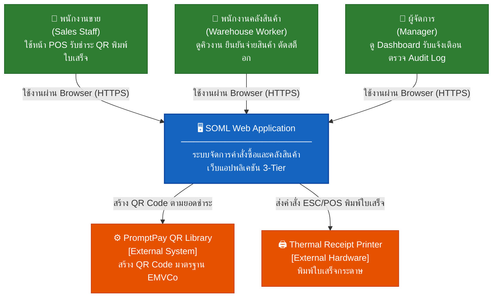
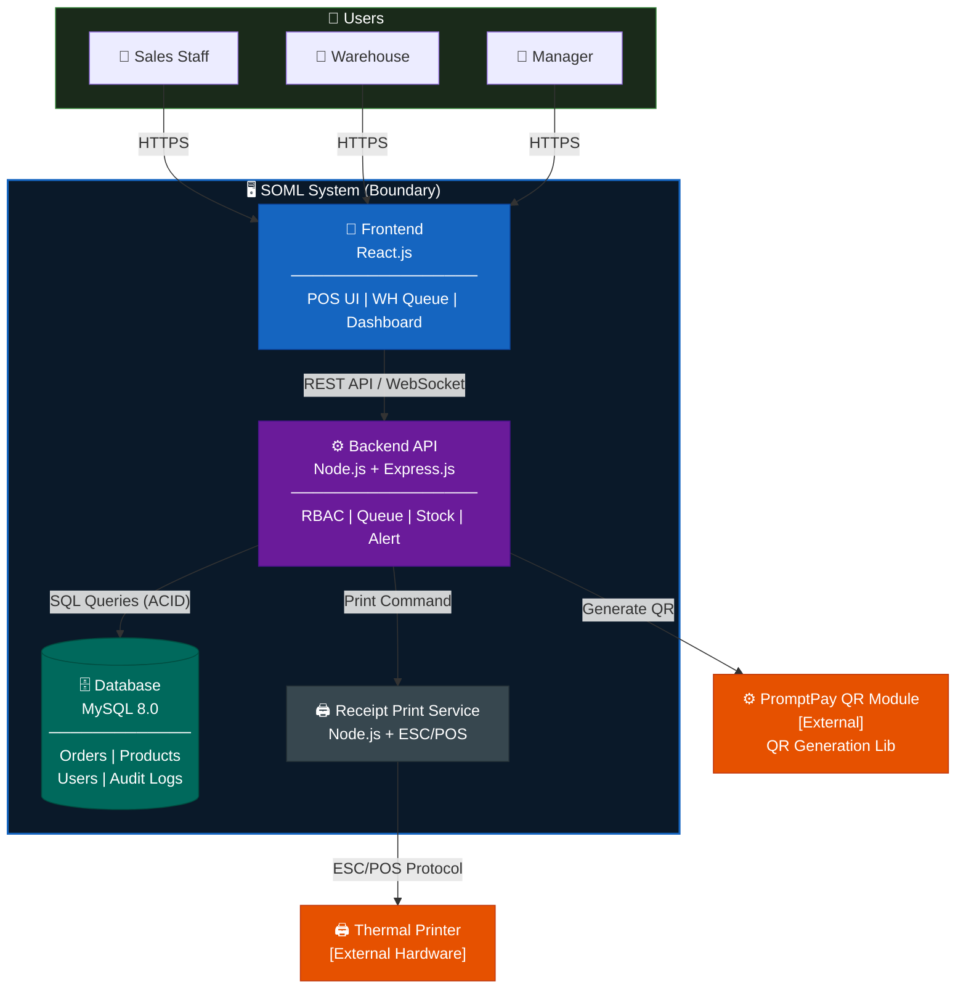
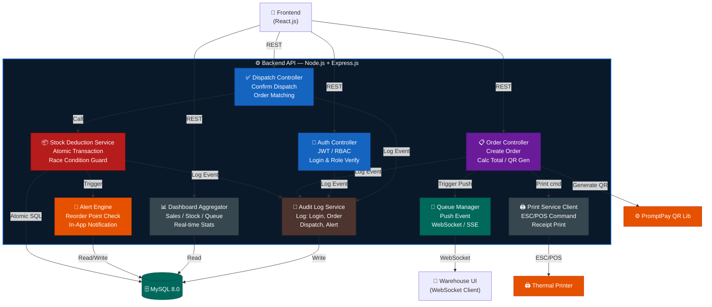
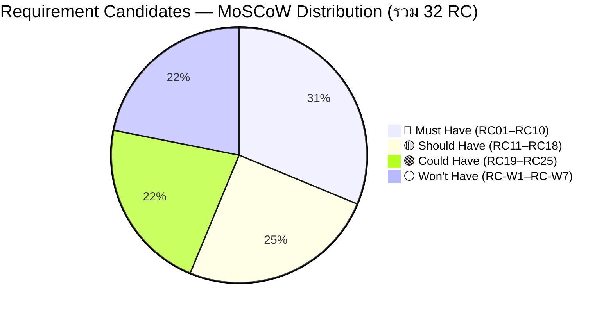

# เอกสารข้อกำหนดความต้องการซอฟต์แวร์ (Software Requirements Specification — SRS)

## ระบบจัดการคำสั่งซื้อและตรวจสอบคลังสินค้า (SOML)
### Order Management and Inventory Control System
> *กรณีศึกษา: ร้านวัสดุก่อสร้างอำพรคอนกรีต*

**จัดทำตามมาตรฐาน ISO/IEC/IEEE 29148**

---

| รายการ | รายละเอียด |
|---|---|
| รหัสโครงงาน | SE02 |
| เวอร์ชันเอกสาร | 2.0 |
| วันที่จัดทำ | 20 มีนาคม พ.ศ. 2569 |
| หัวหน้าโครงงาน | นายตรัยรัตน์ วงษ์สิทธิ์ (67543210028-6) |
| ผู้ร่วมโครงงาน | นายพนาวุฒน์ อภิปสันติ (67543210040-1) |
| อาจารย์ที่ปรึกษา | อาจารย์ธนิต เกตุแก้ว |
| หลักสูตร | วิศวกรรมซอฟต์แวร์ (4 ปี/เทียบโอน) ปี 3 |
| คณะ | วิศวกรรมศาสตร์ |
| สถาบัน | มหาวิทยาลัยเทคโนโลยีราชมงคลล้านนา เชียงใหม่ |
| ปีการศึกษา | 2/2568 |

---

## ประวัติการแก้ไขเอกสาร (Revision History)

| เวอร์ชัน | วันที่ | ผู้แก้ไข | รายละเอียดการเปลี่ยนแปลง |
|:---:|---|---|---|
| 1.0 | 20/03/2569 | นายตรัยรัตน์ วงษ์สิทธิ์ | ฉบับร่างแรก |
| 2.0 | 20/03/2569 | นายตรัยรัตน์ วงษ์สิทธิ์ | ปรับโครงสร้างเอกสารให้เป็นไปตามเทมเพลต ISO/IEC/IEEE 29148 ของหลักสูตร เพิ่มหัวข้อเอกสารอ้างอิง ความต้องการส่วนต่อประสานภายนอก การทวนสอบความต้องการ และภาคผนวก |

---

## สารบัญ

1. [บทนำ](#1-บทนำ-introduction)
2. [รายละเอียดโดยรวม](#2-รายละเอียดโดยรวม-overall-description)
3. [ความต้องการเฉพาะ](#3-ความต้องการเฉพาะ-specific-requirements)
4. [การทวนสอบความต้องการ](#4-การทวนสอบความต้องการ-verification)
5. [ภาคผนวกของเอกสาร](#5-ภาคผนวกของเอกสาร-appendices)

---

## 1. บทนำ (Introduction)

### 1.1 วัตถุประสงค์ของเอกสาร (Purpose)

เอกสาร Software Requirements Specification (SRS) ฉบับนี้จัดทำขึ้นเพื่อกำหนดขอบเขต ข้อกำหนด และพฤติกรรมที่คาดหวังของ **ระบบจัดการคำสั่งซื้อและตรวจสอบคลังสินค้า (SOML)** สำหรับร้านวัสดุก่อสร้างอำพรคอนกรีต

เอกสารนี้ใช้เป็นข้อตกลงร่วมระหว่างผู้เกี่ยวข้อง 4 กลุ่ม ได้แก่ **คณะผู้จัดทำโครงงาน** ใช้เป็นฐานในการออกแบบและพัฒนาระบบ **อาจารย์ที่ปรึกษาและกรรมการสอบ** ใช้ตรวจสอบความครบถ้วนและความสอดคล้องของขอบเขตงาน **เจ้าของร้านและพนักงานผู้ใช้งานจริง** ใช้ยืนยันว่าระบบที่จะพัฒนาตรงกับความต้องการหน้างาน และ **ผู้ทดสอบระบบ** ใช้เป็นต้นทางในการออกแบบกรณีทดสอบและเกณฑ์การยอมรับ

### 1.2 ขอบเขตของผลิตภัณฑ์ (Product Scope)

#### 1.2.1 บริบทและปัญหาที่นำมาสู่ระบบ

ร้านวัสดุก่อสร้างอำพรคอนกรีตดำเนินกระบวนการขายและจัดการสต็อกด้วยเอกสารกระดาษ ส่งผลให้เกิดปัญหาหลัก 4 ประการ ซึ่งสอดคล้องกับที่มาและความสำคัญของโครงงานในบทที่ 1 ของปริญญานิพนธ์:

- **ข้อมูลคลาดเคลื่อน:** สต็อกที่บันทึกกระดาษไม่ตรงกับจำนวนสินค้าจริงในคลัง
- **การสื่อสารล่าช้า:** หน้าร้านและโกดังไม่มีช่องทางเรียลไทม์ ลูกค้าต้องถือบิลเดินไปเองที่โกดัง
- **ความเสี่ยงของการฉ้อโกง:** บิลกระดาษถูกนำมาใช้รับสินค้าซ้ำได้โดยไม่มีระบบป้องกัน
- **ขาดทัศนวิสัยเชิงบริหาร:** ผู้จัดการต้องรอนับสต็อกปลายวัน ไม่สามารถตัดสินใจเชิงข้อมูลได้ทันท่วงที

#### 1.2.2 สิ่งที่ระบบทำได้

ระบบ SOML เป็นเว็บแอปพลิเคชันแบบ 3 ชั้น (3-Tier Architecture) ครอบคลุมกระบวนการ:

- การบันทึกคำสั่งซื้อและรับชำระเงินผ่าน QR พร้อมเพย์ (PromptPay) หน้าร้าน
- การพิมพ์ใบเสร็จกระดาษผ่านเครื่องพิมพ์ใบเสร็จ (Thermal Receipt Printer)
- การส่งคำสั่งซื้อเข้าคิวคลังสินค้าแบบเรียลไทม์ (Real-time Push)
- การยืนยันจ่ายสินค้าและตัดสต็อกแบบ Atomic Transaction
- แดชบอร์ดปฏิบัติการและระบบแจ้งเตือน In-App สำหรับผู้จัดการ
- ระบบควบคุมสิทธิ์ตามบทบาท (RBAC) และบันทึกประวัติ (Audit Logs)

#### 1.2.3 สิ่งที่ระบบทำไม่ได้ (Out of Scope)

- ระบบบัญชีเต็มรูปแบบ การออกใบกำกับภาษี หรือการจัดการการเงินเชิงลึก
- Payment Gateway หรือการเชื่อมต่อ API ธนาคารเพื่อตรวจสอบสถานะการชำระเงินอัตโนมัติ
- แอปพลิเคชัน Mobile Native (iOS/Android)
- การเชื่อมต่อกับระบบ ERP ขนาดใหญ่หรือระบบซัพพลายเออร์ภายนอก
- การแจ้งเตือนผ่านบริการภายนอก เช่น LINE Notify หรือ Email
- การใช้กล้อง/สแกนเนอร์บาร์โค้ดหรือ QR Code เพื่อยืนยันสิทธิ์รับสินค้าที่คลัง
- โมดูล AI-Assisted (Future Work เวอร์ชันถัดไป)

#### 1.2.4 ประโยชน์ที่คาดว่าจะได้รับ

ลดข้อผิดพลาดจากกระบวนการกระดาษให้เป็นศูนย์ในส่วนของการตัดสต็อก ลดระยะเวลารอคอยของลูกค้าที่จุดรับสินค้า ป้องกันการรับสินค้าซ้ำด้วยการควบคุมสถานะคำสั่งซื้อ และเพิ่มทัศนวิสัยเชิงบริหารด้วยข้อมูลเรียลไทม์แทนการรอสรุปปลายวัน

### 1.3 นิยาม คำย่อ และคำศัพท์ (Definitions, Acronyms, and Abbreviations)

| คำศัพท์/คำย่อ | ความหมาย |
|---|---|
| SOML | Smart Order Management and Logistics — ชื่อระบบ |
| SRS | Software Requirements Specification — เอกสารข้อกำหนดความต้องการซอฟต์แวร์ |
| RBAC | Role-Based Access Control — ควบคุมสิทธิ์ตามบทบาท |
| BR | Business Requirement — ความต้องการทางธุรกิจ |
| FR | Functional Requirement — ความต้องการเชิงหน้าที่ |
| NFR | Non-Functional Requirement — ความต้องการนอกเหนือหน้าที่ |
| RC | Requirement Candidate — ความต้องการที่รวบรวมได้ก่อนจัดลำดับความสำคัญ |
| UC | Use Case — กรณีการใช้งาน |
| TC | Test Case — กรณีทดสอบ |
| RTM | Requirements Traceability Matrix — ตารางสอบกลับความต้องการ |
| POS | Point of Sale — จุดขายหน้าร้าน |
| QR | Quick Response Code — รหัสสองมิติสำหรับชำระเงิน |
| ACID | Atomicity, Consistency, Isolation, Durability |
| ESC/POS | ชุดคำสั่งมาตรฐานสำหรับสั่งงานเครื่องพิมพ์ใบเสร็จความร้อน |
| EMVCo | องค์กรกำหนดมาตรฐาน QR Code สำหรับการชำระเงิน |
| C4 | Context-Container-Component-Code Model (Simon Brown) |
| MoSCoW | Must / Should / Could / Won't have — วิธีจัดลำดับความสำคัญของความต้องการ |
| UAT | User Acceptance Testing — การทดสอบโดยผู้ใช้จริง |
| API | Application Programming Interface |

### 1.4 เอกสารอ้างอิง (References)

| ลำดับ | เอกสารอ้างอิง |
|:---:|---|
| [1] | ISO/IEC/IEEE 29148:2018. Systems and software engineering — Life cycle processes — Requirements engineering. Geneva: International Organization for Standardization; 2018. |
| [2] | ISO/IEC 25010:2011. Systems and software engineering — Systems and software Quality Requirements and Evaluation (SQuaRE) — System and software quality models. Geneva: International Organization for Standardization; 2011. |
| [3] | คณะวิศวกรรมศาสตร์ มหาวิทยาลัยเทคโนโลยีราชมงคลล้านนา. คู่มือปริญญานิพนธ์ 2568. เชียงใหม่; 2568. |
| [4] | Brown S. The C4 model for visualising software architecture. [online] 2020. สืบค้นจาก URL: https://c4model.com (สืบค้นเมื่อ ______). |
| [5] | Oracle Corporation. MySQL 8.0 reference manual. [online] 2024. สืบค้นจาก URL: https://dev.mysql.com/doc/refman/8.0/en/ (สืบค้นเมื่อ ______). |
| [6] | OpenJS Foundation. Node.js documentation. [online] 2024. สืบค้นจาก URL: https://nodejs.org/docs/ (สืบค้นเมื่อ ______). |
| [7] | OWASP Foundation. OWASP application security verification standard (ASVS). [online] 2024. สืบค้นจาก URL: https://owasp.org/www-project-application-security-verification-standard/ (สืบค้นเมื่อ ______). |
| [8] | EMVCo. EMV QR code specification for payment systems: merchant-presented mode. [online] 2020. สืบค้นจาก URL: https://www.emvco.com/specifications/ (สืบค้นเมื่อ ______). |
| [9] | ธนาคารแห่งประเทศไทย. แนวนโยบาย Standardized Thai QR code for payment transactions. [online] 2562. สืบค้นจาก URL: ______ (สืบค้นเมื่อ ______). |
| [10] | Meta Open Source. React documentation: the library for web and native user interfaces. [online] 2024. สืบค้นจาก URL: https://react.dev (สืบค้นเมื่อ ______). |
| [11] | Express.js. Express — Node.js web application framework. [online] 2024. สืบค้นจาก URL: https://expressjs.com (สืบค้นเมื่อ ______). |

> หมายเหตุ: รายการอ้างอิงข้างต้นสอดคล้องกับเอกสารอ้างอิงในบทที่ 2 ของปริญญานิพนธ์ ช่องว่าง `______` คือวันที่สืบค้นและ URL ที่ยังรอกรอกให้ตรงกันทั้งสองเอกสาร

### 1.5 ภาพรวมของเอกสาร (Overview)

เอกสารฉบับนี้แบ่งออกเป็น 5 บทตามโครงสร้างมาตรฐาน ISO/IEC/IEEE 29148:

- **บทที่ 1 บทนำ** — วัตถุประสงค์ของเอกสาร ขอบเขตผลิตภัณฑ์ นิยามคำศัพท์ และเอกสารอ้างอิง
- **บทที่ 2 รายละเอียดโดยรวม** — มุมมองผลิตภัณฑ์ หน้าที่หลัก คุณลักษณะผู้ใช้ ข้อจำกัด และข้อสมมติ
- **บทที่ 3 ความต้องการเฉพาะ** — ส่วนต่อประสานภายนอก ความต้องการเชิงหน้าที่ (FR) ความต้องการนอกเหนือหน้าที่ (NFR) และข้อจำกัดการออกแบบ
- **บทที่ 4 การทวนสอบความต้องการ** — วิธีทวนสอบและเกณฑ์ผ่านของทุก REQ-ID
- **บทที่ 5 ภาคผนวกของเอกสาร** — แบบจำลองสถาปัตยกรรม C4 ข้อมูลสนับสนุน และดัชนีความต้องการ

เอกสารนี้กำหนดความต้องการรวม **5 BR, 9 FR, 9 NFR และ 11 Use Cases** และใช้เป็นฐานสำหรับการออกแบบฐานข้อมูล (ERD) เอกสารการออกแบบระบบ (SDD) และแผนการทดสอบในขั้นตอนถัดไปของโครงงาน SE02

---

## 2. รายละเอียดโดยรวม (Overall Description)

### 2.1 มุมมองผลิตภัณฑ์ (Product Perspective)

ระบบ SOML เป็น **ระบบใหม่ที่พัฒนาขึ้นเพื่อทดแทนกระบวนการทำงานด้วยเอกสารกระดาษเดิมทั้งหมด** ไม่ใช่ส่วนขยายของระบบสารสนเทศใดที่ร้านมีอยู่ก่อน เนื่องจากร้านวัสดุก่อสร้างอำพรคอนกรีตยังไม่เคยมีระบบบันทึกการขายหรือระบบจัดการสต็อกแบบดิจิทัลมาก่อน

ระบบทำงานเป็นเว็บแอปพลิเคชันแบบ 3 ชั้น (3-Tier Architecture) โดยแยกชั้นการแสดงผล ชั้นตรรกะทางธุรกิจ และชั้นข้อมูลออกจากกัน และเชื่อมต่อกับสภาพแวดล้อมภายนอก 2 รายการ คือไลบรารีสร้าง QR พร้อมเพย์ และเครื่องพิมพ์ใบเสร็จความร้อน ความสัมพันธ์ระหว่างระบบกับผู้ใช้และระบบภายนอกแสดงในแผนภาพบริบทของระบบ (C1: System Context Diagram) ในภาคผนวก §5.1.1

| องค์ประกอบ | ประเภท | คำอธิบาย |
|---|---|---|
| พนักงานขาย (Sales Staff) | Person | ใช้หน้า POS บันทึกออเดอร์ รับชำระ QR พิมพ์ใบเสร็จ |
| พนักงานคลังสินค้า (Warehouse) | Person | ดูคิวงานเรียลไทม์ ยืนยันจ่ายสินค้า ตัดสต็อก |
| ผู้จัดการ (Manager) | Person | ดู Dashboard ตรวจสอบ Audit Log รับแจ้งเตือน |
| SOML Web Application | Software System (ระบบหลัก) | เว็บแอปพลิเคชัน 3-Tier จัดการคำสั่งซื้อ คลัง และ Dashboard |
| PromptPay QR Library | External System | สร้าง QR Code มาตรฐาน EMVCo ตามยอดชำระ |
| Thermal Receipt Printer | External Hardware | รับคำสั่งพิมพ์จากระบบ พิมพ์ใบเสร็จกระดาษ |

### 2.2 หน้าที่หลักของผลิตภัณฑ์ (Product Functions)

สรุปหน้าที่หลักของระบบในระดับสูง โดยรายละเอียดที่วัดและทดสอบได้อยู่ในหัวข้อ §3.2:

- **จัดการผู้ใช้และสิทธิ์** — ลงชื่อเข้าใช้งาน และแยกเมนู/ข้อมูลที่เข้าถึงได้ตาม 4 บทบาท
- **จัดการข้อมูลสินค้า** — เพิ่ม แก้ไข ลบสินค้า ราคา หน่วยนับ และตั้งค่าจุดสั่งซื้อเพิ่ม
- **ขายหน้าร้านและรับชำระเงิน** — บันทึกรายการสินค้า คำนวณยอดรวม แสดง QR พร้อมเพย์ และยืนยันรับชำระ
- **ออกใบเสร็จ** — สั่งพิมพ์ใบเสร็จกระดาษผ่านเครื่องพิมพ์ความร้อนทันทีที่ยืนยันรับชำระ
- **ส่งงานเข้าคลังสินค้าแบบเรียลไทม์** — ผลักคำสั่งซื้อเข้าคิวรอจ่ายโดยไม่ต้องรีเฟรชหน้าจอ
- **ยืนยันจ่ายสินค้าและตัดสต็อก** — ยืนยันการจ่ายจากคิว ตัดยอดสต็อกแบบอะตอมมิก และล็อกสถานะกันจ่ายซ้ำ
- **แดชบอร์ดและการแจ้งเตือน** — แสดงสถิติยอดขาย ระดับสต็อก สถานะคิว และแจ้งเตือนภายในแอปพลิเคชัน
- **บันทึกและสืบค้นประวัติ** — เก็บ Audit Log ทุกเหตุการณ์สำคัญและค้นหาย้อนหลังได้

### 2.3 คุณลักษณะของผู้ใช้ (User Characteristics)

| กลุ่มผู้ใช้ | ลักษณะ/ความรู้ที่ต้องมี | สิทธิ์การใช้งาน |
|---|---|---|
| ผู้ดูแลระบบ (Admin) | มีพื้นฐานการจัดการบัญชีผู้ใช้และการดูแลฐานข้อมูลเบื้องต้น เข้าใจแนวคิดการกำหนดสิทธิ์ตามบทบาท | เต็ม — จัดการผู้ใช้ ตั้งค่าระบบ และเข้าถึงทุกโมดูล |
| ผู้จัดการ/เจ้าของร้าน (Manager) | ใช้คอมพิวเตอร์และเว็บเบราว์เซอร์ได้คล่อง เข้าใจกระบวนการขายและการบริหารสต็อกของร้าน ไม่จำเป็นต้องมีความรู้ด้านไอที | อ่าน-เขียนโมดูลสินค้าและการตั้งค่าจุดสั่งซื้อเพิ่ม อ่านแดชบอร์ด ประวัติการทำรายการ และรับแจ้งเตือน |
| พนักงานขายหน้าร้าน (Sales Staff) | ใช้คอมพิวเตอร์พื้นฐานได้ ใช้แอปพลิเคชันธนาคารบนโทรศัพท์เพื่อตรวจสอบการรับโอนได้ ไม่จำเป็นต้องมีความรู้ด้านไอที | อ่าน-เขียนเฉพาะโมดูลขายหน้าร้าน — สร้างคำสั่งซื้อ รับชำระ และสั่งพิมพ์ใบเสร็จ |
| พนักงานคลังสินค้า (Warehouse) | ใช้แท็บเล็ตหรือสมาร์ตโฟนได้ อ่านรายการสินค้าและจำนวนจากหน้าจอได้ ไม่จำเป็นต้องมีความรู้ด้านไอที | อ่าน-เขียนเฉพาะโมดูลคลังสินค้า — ดูคิวงาน ปรับสถานะการจัดของ และยืนยันจ่ายสินค้า |

> นอกจากผู้ใช้ทั้ง 4 กลุ่มข้างต้น ระบบยังมี **ผู้กระทำอัตโนมัติ (System Actor)** ที่ทำงานโดยไม่มีผู้ใช้สั่ง เช่น การสร้างเลขที่คำสั่งซื้อไม่ซ้ำ (UC-04) และการตรวจสอบเงื่อนไขแจ้งเตือน (UC-11) รายละเอียดอยู่ในตารางกรณีการใช้งาน §3.2.3

### 2.4 ข้อจำกัด (Constraints)

- **ด้านอุปกรณ์:** การพิมพ์ใบเสร็จต้องเชื่อมต่อเครื่องพิมพ์ความร้อนผ่าน USB หรือเครือข่ายด้วยโพรโทคอล ESC/POS หากเครื่องพิมพ์ไม่พร้อมใช้งาน กระบวนการขายจะไม่สมบูรณ์
- **ด้านเครือข่าย:** คิวคลังสินค้าแบบเรียลไทม์อาศัย WebSocket หรือ Server-Sent Events จึงต้องการเครือข่ายภายในร้านที่เสถียร
- **ด้านการชำระเงิน:** การยืนยันรับชำระเงิน QR ต้องทำโดยพนักงานขายจากแอปพลิเคชันธนาคาร ระบบไม่เชื่อมต่อ Payment Gateway จึงไม่สามารถตรวจสอบสถานะการชำระเงินอัตโนมัติได้
- **ด้านการเข้าใช้งาน:** ระบบพัฒนาเป็นเว็บแอปพลิเคชัน ผู้ใช้ต้องเข้าถึงผ่านเว็บเบราว์เซอร์สมัยใหม่เท่านั้น ไม่มีแอปพลิเคชันติดตั้งบนเครื่อง
- **ด้านกฎหมายและข้อมูลส่วนบุคคล:** การจัดเก็บข้อมูลผู้ใช้งานและประวัติการทำรายการต้องสอดคล้องกับพระราชบัญญัติคุ้มครองข้อมูลส่วนบุคคล (PDPA) โดยเก็บเฉพาะข้อมูลที่จำเป็นต่อการปฏิบัติงาน
- **ด้านเวลาและทรัพยากร:** โครงงานมีระยะเวลาดำเนินการ 6 ระยะภายในหนึ่งปีการศึกษา และพัฒนาโดยนักศึกษา 2 คน จึงจำกัดขอบเขตไว้ที่ความต้องการระดับ Must Have และ Should Have เป็นหลัก
- **ด้านงบประมาณ:** ใช้เทคโนโลยีที่ไม่มีค่าลิขสิทธิ์ (Open Source) ทั้งหมด และใช้อุปกรณ์ที่ร้านมีอยู่เดิมโดยไม่ลงทุนเครื่องสแกนเพิ่ม

### 2.5 ข้อสมมติและการพึ่งพา (Assumptions and Dependencies)

#### 2.5.1 ข้อสมมติ (Assumptions)

- เครื่องพิมพ์ใบเสร็จ (Thermal Printer) ถูกต่อเชื่อมและพร้อมใช้งานตลอดเวลาทำการ
- พนักงานมีอุปกรณ์เชื่อมอินเทอร์เน็ตเพื่อเข้าใช้งานเว็บแอปพลิเคชัน
- การยืนยันการรับชำระเงิน QR พร้อมเพย์ทำโดยพนักงานขายจากแอปธนาคาร (ไม่ใช่ระบบอัตโนมัติ)
- เครือข่ายภายในร้านมีความเสถียรเพียงพอสำหรับการส่งข้อมูลเรียลไทม์
- จำนวนผู้ใช้งานพร้อมกันในช่วงเวลาเร่งด่วนไม่เกิน 10 เซสชัน ตามขนาดของร้านกรณีศึกษา
- ข้อมูลสินค้าตั้งต้นถูกนำเข้าระบบครบถ้วนก่อนเริ่มใช้งานจริง

#### 2.5.2 การพึ่งพา (Dependencies)

- **ไลบรารีสร้าง QR พร้อมเพย์** — ระบบพึ่งพาไลบรารีภายนอกที่สร้างรหัส QR ตามมาตรฐาน EMVCo หากมาตรฐานหรือไลบรารีเปลี่ยนแปลง ต้องปรับส่วนสร้าง QR ตาม
- **ฐานข้อมูล MySQL 8.0 กลไก InnoDB** — คุณสมบัติ ACID และการล็อกระดับแถวที่ NFR-04 กำหนดไว้ขึ้นกับกลไกจัดเก็บนี้โดยตรง
- **บริการพิมพ์ใบเสร็จ (Receipt Print Service)** — ทำงานเป็นบริการแยกจาก Backend API หากบริการนี้หยุดทำงาน การพิมพ์ใบเสร็จจะล้มเหลวแม้ระบบหลักยังทำงานได้
- **เว็บเบราว์เซอร์ของผู้ใช้** — ต้องรองรับ WebSocket จึงจะได้รับข้อมูลคิวแบบเรียลไทม์
- **การให้ข้อมูลจากสถานประกอบการ** — การกำหนดจุดสั่งซื้อเพิ่มและการทดสอบยอมรับระบบ (UAT) ต้องอาศัยความร่วมมือจากเจ้าของร้านและพนักงาน

---

## 3. ความต้องการเฉพาะ (Specific Requirements)

### 3.1 ความต้องการส่วนต่อประสานภายนอก (External Interface Requirements)

#### 3.1.1 ส่วนต่อประสานผู้ใช้ (User Interfaces)

ระบบแสดงผลผ่านเว็บเบราว์เซอร์ในรูปแบบ Responsive Design เพื่อให้ใช้งานได้ทั้งบนเครื่องคอมพิวเตอร์ตั้งโต๊ะที่จุดขายหน้าร้าน และบนแท็บเล็ตหรือสมาร์ตโฟนที่พนักงานคลังสินค้าถือติดตัวขณะเดินระหว่างชั้นวางสินค้า

ข้อกำหนดของส่วนต่อประสานผู้ใช้:

- เมนูและข้อมูลที่แสดงต้องถูกกรองตามบทบาทของผู้ใช้ที่ลงชื่อเข้าใช้งาน ผู้ใช้ต้องไม่เห็นเมนูที่ตนไม่มีสิทธิ์
- ทุกหน้าจอต้องแสดงข้อความยืนยันผลการทำรายการ (สำเร็จ/ล้มเหลว) อย่างชัดเจนภายในหน้าจอเดียวกัน
- หน้าจอคิวคลังสินค้าต้องอัปเดตรายการใหม่โดยผู้ใช้ไม่ต้องกดรีเฟรช
- ปุ่มยืนยันที่มีผลถาวร เช่น การยืนยันจ่ายสินค้า ต้องมีขั้นตอนยืนยันซ้ำเพื่อป้องกันการกดพลาด
- ใช้ภาษาไทยเป็นภาษาหลักของส่วนต่อประสาน และแสดงจำนวนเงินในรูปแบบสกุลเงินบาท

ต้นแบบหน้าจอที่ออกแบบไว้มี 6 หน้าจอ ภาพเต็มอยู่ในภาคผนวก §5.1.4:

| รหัสรูป | หน้าจอ | ผู้ใช้หลัก |
|:---:|---|---|
| fig3-14 | หน้าจอขายหน้าร้าน | พนักงานขาย |
| fig3-15 | รับชำระเงินด้วย QR พร้อมเพย์ | พนักงานขาย |
| fig3-16 | คิวรอจ่ายสินค้า | พนักงานคลังสินค้า |
| fig3-17 | ยืนยันจ่ายสินค้า | พนักงานคลังสินค้า |
| fig3-18 | แดชบอร์ดปฏิบัติการ | ผู้จัดการ |
| fig3-19 | คิวรอจ่ายสินค้า (อุปกรณ์เคลื่อนที่) | พนักงานคลังสินค้า |

#### 3.1.2 ส่วนต่อประสานฮาร์ดแวร์ (Hardware Interfaces)

ระบบเชื่อมต่อกับฮาร์ดแวร์ภายนอกหนึ่งรายการ คือ **เครื่องพิมพ์ใบเสร็จความร้อน (Thermal Receipt Printer)**

| หัวข้อ | ข้อกำหนด |
|---|---|
| ช่องทางเชื่อมต่อ | USB หรือเครือข่าย (Network/LAN) |
| โพรโทคอลสั่งงาน | ESC/POS |
| ผู้ส่งคำสั่ง | Receipt Print Service (แยกจาก Backend API) |
| จังหวะการทำงาน | สั่งพิมพ์ทันทีที่พนักงานขายยืนยันรับชำระเงิน |
| ข้อมูลที่พิมพ์ | เลขที่คำสั่งซื้อ รายการสินค้า จำนวน ราคาต่อหน่วย ยอดรวม วันที่และเวลา |
| เกณฑ์เวลา | พิมพ์สำเร็จภายใน 5 วินาทีหลังยืนยันรับชำระ (NFR-05) |
| การจัดการข้อผิดพลาด | หากเครื่องพิมพ์ไม่พร้อมหรือกระดาษหมด ระบบต้องแจ้งพนักงานขายบนหน้าจอ และต้องไม่ทำให้การบันทึกคำสั่งซื้อหรือการส่งคิวคลังล้มเหลวตามไปด้วย |

ระบบ **ไม่ใช้** เครื่องอ่านบาร์โค้ด เครื่องสแกน QR หรือกล้อง ในการยืนยันสิทธิ์รับสินค้าที่คลัง ตามที่ระบุไว้ใน §1.2.3

#### 3.1.3 ส่วนต่อประสานซอฟต์แวร์ (Software Interfaces)

| ระบบ/บริการภายนอก | บทบาท | รูปแบบการเชื่อมต่อ | ข้อมูลที่แลกเปลี่ยน |
|---|---|---|---|
| PromptPay QR Module | สร้างรหัส QR ตามมาตรฐาน EMVCo ให้ตรงกับยอดที่ต้องชำระ | เรียกใช้เป็นไลบรารีภายในกระบวนการของ Backend API | ส่งเข้า: ยอดเงินและข้อมูลบัญชีผู้รับ / รับกลับ: สตริง QR Payload |
| Receipt Print Service | รับคำสั่งพิมพ์และแปลงเป็นชุดคำสั่ง ESC/POS ส่งต่อเครื่องพิมพ์ | เรียกผ่าน API ภายในเครือข่ายร้าน | ส่งเข้า: ข้อมูลใบเสร็จของคำสั่งซื้อ / รับกลับ: สถานะการพิมพ์ |
| MySQL 8.0 (InnoDB) | จัดเก็บข้อมูลคำสั่งซื้อ สินค้า ผู้ใช้ และประวัติการทำรายการ | การเชื่อมต่อฐานข้อมูลจาก Backend API ด้วยคำสั่ง SQL แบบมีธุรกรรม | อ่าน/เขียนตารางทั้ง 7 ตารางตามที่ออกแบบไว้ในแผนภาพ ERD |

ระบบ **ไม่เชื่อมต่อ** Payment Gateway, API ธนาคาร, ระบบ ERP, ระบบซัพพลายเออร์ภายนอก หรือบริการแจ้งเตือนภายนอกเช่น LINE Notify และ Email ตามขอบเขตใน §1.2.3

#### 3.1.4 ส่วนต่อประสานการสื่อสาร (Communication Interfaces)

| โพรโทคอล | ใช้ระหว่าง | วัตถุประสงค์ | ข้อกำหนด |
|---|---|---|---|
| HTTPS | เว็บเบราว์เซอร์ของผู้ใช้ ↔ ระบบ SOML | ช่องทางเข้าใช้งานทุกหน้าจอ | ต้องเข้ารหัสการรับส่งข้อมูลทั้งหมด รวมถึงข้อมูลการเข้าสู่ระบบ |
| REST API | Frontend ↔ Backend API | คำขอที่ผู้ใช้เป็นฝ่ายเริ่ม เช่น สร้างคำสั่งซื้อ ยืนยันจ่ายสินค้า ดึงข้อมูลแดชบอร์ด | ทุกคำขอต้องแนบโทเคนยืนยันตัวตนและถูกตรวจสอบสิทธิ์ตามบทบาทก่อนประมวลผล |
| WebSocket | Backend API → หน้าจอคิวคลังสินค้า | ผลักข้อมูลคำสั่งซื้อใหม่เข้าคิวโดยที่ผู้ใช้ไม่ต้องรีเฟรช | คำสั่งซื้อใหม่ต้องปรากฏบนหน้าจอคิวภายใน 3 วินาที (NFR-02) |
| Server-Sent Events (SSE) | Backend API → หน้าจอคิวคลังสินค้า | ช่องทางสำรองเมื่อเครือข่ายหรือเบราว์เซอร์ไม่รองรับ WebSocket | ต้องคงเกณฑ์เวลาเดียวกันกับ WebSocket |

การสื่อสารสองช่องทางนี้ทำงานคู่กัน โดย REST API รับผิดชอบคำขอที่ผู้ใช้เริ่ม ส่วน WebSocket รับผิดชอบให้ระบบหลังบ้านเป็นฝ่ายผลักข้อมูล ทำให้พนักงานคลังสินค้าไม่จำเป็นต้องกดรีเฟรชหน้าจอ

### 3.2 ความต้องการเชิงหน้าที่ (Functional Requirements)

#### 3.2.1 ความต้องการทางธุรกิจ (Business Requirements — BR)

| BR-ID | ความต้องการทางธุรกิจ | คุณค่าทางธุรกิจ |
|---|---|---|
| BR-01 | ใบเสร็จกระดาษ + ส่งคำสั่งซื้อเข้าคิวคลังเรียลไทม์ | คุ้นเคยสำหรับลูกค้า ป้องกันรับสินค้าซ้ำด้วยสถานะออเดอร์ |
| BR-02 | ควบคุมคลังสินค้าแบบเรียลไทม์ | ตัวเลขระบบตรงสินค้าจริง 100% |
| BR-03 | ลดระยะเวลารอคอย (Lead Time Reduction) | โกดังรู้คำสั่งซื้อก่อนลูกค้าเดินมาถึง |
| BR-04 | เพิ่มทัศนวิสัยเชิงปฏิบัติการ | ผู้บริหารติดตามยอดขาย/คิวตลอดเวลา |
| BR-05 | แจ้งเตือนเชิงรุกใน Dashboard | ลดความเสี่ยงสินค้าขาดมือ |

#### 3.2.2 ตารางความต้องการเชิงหน้าที่ (Functional Requirements — FR)

| REQ-ID | ชื่อความต้องการ | คำอธิบาย | ที่มา (UC) | ความสำคัญ |
|---|---|---|:---:|:---:|
| FR-01 | เข้าสู่ระบบและควบคุมสิทธิ์ตามบทบาท | ระบบต้องมี Authentication และ RBAC ควบคุมสิทธิ์ตามบทบาท (Admin/Manager/Sales/Warehouse) | UC-01 | High |
| FR-02 | จัดการข้อมูลสินค้าและจุดสั่งซื้อเพิ่ม | ระบบต้องรองรับการจัดการข้อมูลสินค้า (Product Master) รวมถึงการตั้งค่า Reorder Point | UC-02 | High |
| FR-03 | สร้างคำสั่งซื้อ รับชำระ และออกใบเสร็จ | ระบบต้องสร้างคำสั่งซื้อ คำนวณยอด แสดง QR พร้อมเพย์ ยืนยันรับเงิน สั่งพิมพ์ใบเสร็จ และส่งคิวเรียลไทม์ทันที | UC-03, UC-04 | High |
| FR-04 | คิวรอจ่ายสินค้าแบบเรียลไทม์ | ระบบต้องแสดงหน้าจอคิวรอจ่ายสินค้า (Warehouse Queue) อัปเดตเรียลไทม์ | UC-05, UC-06 | High |
| FR-05 | ยืนยันจ่ายสินค้า | พนักงานคลังสินค้าต้องเลือกคำสั่งซื้อจากคิวและยืนยันจ่ายสินค้าได้โดยไม่ต้องใช้อุปกรณ์สแกน | UC-07 | High |
| FR-06 | ตัดสต็อกแบบอะตอมมิก | ระบบต้องตัดยอดสต็อกใน DB แบบ Atomic Transaction ทันทีที่ยืนยันจ่าย | UC-07 | High |
| FR-07 | แดชบอร์ดปฏิบัติการ | ระบบต้องแสดง Operational Dashboard รวมสถิติยอดขาย สต็อก และคิวแบบเรียลไทม์ | UC-08, UC-09 | High |
| FR-08 | แจ้งเตือนภายในแอปพลิเคชัน | ระบบต้องแจ้งเตือน In-App เมื่อสต็อกต่ำกว่า Reorder Point หรือคิวค้างผิดปกติ | UC-11 | High |
| FR-09 | บันทึกและสืบค้นประวัติการทำรายการ | ระบบต้องเก็บ Audit Logs ทุกรายการและเรียกดูย้อนหลังได้ | UC-10 | Medium |

#### 3.2.3 กรณีการใช้งาน (Use Case Summary)

| UC-ID | ชื่อ Use Case | Actor หลัก | คำอธิบาย | FR ที่เกี่ยวข้อง |
|---|---|---|---|:---:|
| UC-01 | เข้าสู่ระบบและควบคุมสิทธิ์ตามบทบาท | ทุกบทบาท | ตรวจสอบสิทธิ์และกำหนดเมนูตามบทบาท | FR-01 |
| UC-02 | จัดการข้อมูลสินค้าและจุดสั่งซื้อเพิ่ม | Manager | จัดการสินค้า ราคา สต็อก Reorder Point | FR-02 |
| UC-03 | สร้างคำสั่งซื้อและออกใบเสร็จ | Sales Staff | บันทึกออเดอร์ แสดง QR รับชำระ พิมพ์ใบเสร็จ | FR-03 |
| UC-04 | สร้างเลขที่คำสั่งซื้อไม่ซ้ำอัตโนมัติ | System | สร้างเลขคำสั่งซื้อไม่ซ้ำอัตโนมัติ | FR-03 |
| UC-05 | ดูคิวรอจ่ายสินค้าแบบเรียลไทม์ | Warehouse | ดูคิวงานเรียลไทม์ | FR-04 |
| UC-06 | ปรับสถานะการจัดของในคิวงาน | Warehouse | เปลี่ยนสถานะการจัดของในคิว | FR-04 |
| UC-07 | ยืนยันจ่ายสินค้าและตัดสต็อก | Warehouse | เลือกออเดอร์จากคิว ยืนยันจ่าย ตัดสต็อก | FR-05, FR-06 |
| UC-08 | แสดงแดชบอร์ดปฏิบัติการ | Manager, Warehouse | แสดงสถิติยอดขาย สต็อก คิว | FR-07 |
| UC-09 | แสดงแดชบอร์ดระดับบริหาร | Manager | ภาพรวมระดับบริหาร + แจ้งเตือน | FR-07 |
| UC-10 | ค้นหาและดูประวัติการทำรายการ | Manager | ดูประวัติทุกรายการย้อนหลัง | FR-09 |
| UC-11 | รับการแจ้งเตือนภายในแอปพลิเคชัน | Manager, System | รับแจ้งเตือนเมื่อสต็อกต่ำ/คิวค้าง | FR-08 |

#### 3.2.4 รายละเอียดกรณีการใช้งานที่สำคัญ (Use Case Specifications)

**UC-01: เข้าสู่ระบบและควบคุมสิทธิ์ตามบทบาท**

| หัวข้อ | รายละเอียด |
|---|---|
| รหัส/ชื่อ Use Case | UC-01 / เข้าสู่ระบบและควบคุมสิทธิ์ตามบทบาท |
| ผู้กระทำ (Actor) | ผู้ใช้ทุกบทบาท (Admin, Manager, Sales Staff, Warehouse) |
| เงื่อนไขก่อน (Precondition) | ผู้ดูแลระบบสร้างบัญชีผู้ใช้และกำหนดบทบาทให้เรียบร้อยแล้ว |
| ลำดับเหตุการณ์หลัก (Main Flow) | 1. ผู้ใช้เปิดหน้าเข้าสู่ระบบ 2. กรอกชื่อผู้ใช้และรหัสผ่าน 3. ระบบตรวจสอบข้อมูลกับฐานข้อมูลผู้ใช้ 4. ระบบออกโทเคนยืนยันตัวตนและอ่านบทบาทของผู้ใช้ 5. ระบบแสดงเฉพาะเมนูและข้อมูลที่บทบาทนั้นมีสิทธิ์เข้าถึง 6. ระบบบันทึกเหตุการณ์การเข้าสู่ระบบลงประวัติการทำรายการ |
| เหตุการณ์ทางเลือก/ข้อยกเว้น | 3a. ข้อมูลไม่ถูกต้อง: ระบบปฏิเสธการเข้าใช้งาน แสดงข้อความแจ้งเตือน และบันทึกความพยายามที่ล้มเหลว 5a. ผู้ใช้พยายามเข้าถึงหน้าที่ไม่มีสิทธิ์โดยตรงผ่าน URL: ระบบปฏิเสธและส่งกลับหน้าที่มีสิทธิ์ |
| เงื่อนไขหลัง (Postcondition) | ผู้ใช้เข้าสู่ระบบสำเร็จ เห็นเฉพาะเมนูตามบทบาท และมีบันทึกเหตุการณ์ในประวัติการทำรายการ |

**UC-03: สร้างคำสั่งซื้อและออกใบเสร็จ**

| หัวข้อ | รายละเอียด |
|---|---|
| รหัส/ชื่อ Use Case | UC-03 / สร้างคำสั่งซื้อและออกใบเสร็จ |
| ผู้กระทำ (Actor) | พนักงานขาย (Sales Staff) |
| เงื่อนไขก่อน (Precondition) | พนักงานขายเข้าสู่ระบบสำเร็จ อยู่ในหน้า POS/Order Creation |
| ลำดับเหตุการณ์หลัก (Main Flow) | 1. เลือกสินค้าและระบุจำนวน 2. ระบบคำนวณและแสดง QR พร้อมเพย์ตามยอด 3. ลูกค้าสแกน QR โอนเงินผ่านแอปธนาคาร 4. พนักงานยืนยันรับชำระ → ระบบพิมพ์ใบเสร็จ + ส่ง Push Event ไปยังคิวคลัง 5. โกดังรับคำสั่งซื้อก่อนลูกค้าเดินมาถึง |
| เหตุการณ์ทางเลือก/ข้อยกเว้น | 3a. ลูกค้าไม่ชำระภายในเวลาที่กำหนด: พนักงานยกเลิกออเดอร์ได้ 4a. เครื่องพิมพ์ไม่พร้อม: ระบบแจ้งพนักงานบนหน้าจอ แต่ยังบันทึกคำสั่งซื้อและส่งคิวคลังตามปกติ |
| เงื่อนไขหลัง (Postcondition) | ออเดอร์ถูกบันทึก สถานะ "รอจ่ายสินค้า" ใบเสร็จพิมพ์เสร็จ คิวโกดังอัปเดต |

**UC-05: ดูคิวรอจ่ายสินค้าแบบเรียลไทม์**

| หัวข้อ | รายละเอียด |
|---|---|
| รหัส/ชื่อ Use Case | UC-05 / ดูคิวรอจ่ายสินค้าแบบเรียลไทม์ |
| ผู้กระทำ (Actor) | พนักงานคลังสินค้า (Warehouse Worker) |
| เงื่อนไขก่อน (Precondition) | พนักงานคลังสินค้าเข้าสู่ระบบสำเร็จ และเปิดหน้าจอคิวรอจ่ายสินค้าค้างไว้ |
| ลำดับเหตุการณ์หลัก (Main Flow) | 1. ระบบเปิดช่องทางสื่อสารแบบผลักข้อมูล (WebSocket) กับหน้าจอคิว 2. ระบบแสดงรายการคำสั่งซื้อที่มีสถานะ "รอจ่ายสินค้า" เรียงตามลำดับเวลา 3. เมื่อมีคำสั่งซื้อใหม่ที่ยืนยันรับชำระแล้ว ระบบหลังบ้านผลักข้อมูลมายังหน้าจอทันที 4. รายการใหม่ปรากฏบนคิวโดยพนักงานไม่ต้องกดรีเฟรช |
| เหตุการณ์ทางเลือก/ข้อยกเว้น | 1a. เบราว์เซอร์หรือเครือข่ายไม่รองรับ WebSocket: ระบบเปลี่ยนไปใช้ Server-Sent Events โดยคงเกณฑ์เวลาเดิม 3a. การเชื่อมต่อหลุด: ระบบเชื่อมต่อใหม่อัตโนมัติและดึงรายการคิวล่าสุดมาแสดงให้ครบ |
| เงื่อนไขหลัง (Postcondition) | หน้าจอคิวแสดงคำสั่งซื้อที่รอจ่ายครบถ้วนและเป็นปัจจุบัน โดยคำสั่งซื้อใหม่ปรากฏภายใน 3 วินาทีตาม NFR-02 |

**UC-07: ยืนยันจ่ายสินค้าและตัดยอด**

| หัวข้อ | รายละเอียด |
|---|---|
| รหัส/ชื่อ Use Case | UC-07 / ยืนยันจ่ายสินค้าและตัดยอด |
| ผู้กระทำ (Actor) | พนักงานคลังสินค้า (Warehouse Worker) |
| เงื่อนไขก่อน (Precondition) | คำสั่งซื้อสถานะ "รอจ่ายสินค้า" ปรากฏในคิว และลูกค้าถือใบเสร็จมาถึงจุดรับของ |
| ลำดับเหตุการณ์หลัก (Main Flow) | 1. พนักงานดูคิวงานบนหน้าจอ 2. จับคู่ออเดอร์จากหมายเลขใบเสร็จหรือลำดับคิว 3. ระบบแสดงรายการสินค้าของออเดอร์นั้น 4. พนักงานตรวจสอบ → กด "ยืนยันการจ่ายสินค้า" 5. ระบบตัดสต็อก Atomic + เปลี่ยนสถานะ "ส่งมอบสำเร็จ" + บันทึก Audit Log |
| เหตุการณ์ทางเลือก/ข้อยกเว้น | 4a. ออเดอร์ถูกยืนยันจ่ายไปแล้ว: ระบบล็อกไม่ให้เลือกจ่ายซ้ำ 5a. จำนวนที่ต้องจ่ายมากกว่าสต็อกคงเหลือ: ระบบยกเลิกธุรกรรมทั้งหมด สต็อกและสถานะไม่เปลี่ยนแปลง |
| เงื่อนไขหลัง (Postcondition) | สถานะออเดอร์ = ส่งมอบสำเร็จ สต็อกถูกหักลบแม่นยำ ออเดอร์หายไปจากคิว |

### 3.3 ความต้องการนอกเหนือหน้าที่ (Non-functional Requirements) — อิง ISO/IEC 25010

| REQ-ID | ด้านคุณภาพ (ISO 25010) | ความต้องการ/เกณฑ์ที่วัดได้ | วิธีทวนสอบ |
|---|---|---|---|
| NFR-01 | ความมั่นคงปลอดภัย (Security) | ข้อมูลและเมนูต้องจำกัดการเข้าถึงตาม RBAC อย่างเข้มงวด | Security test |
| NFR-02 | ประสิทธิภาพ (Performance Efficiency) | ข้อมูลคำสั่งซื้อใหม่ต้องแสดงบนหน้าจอคิวภายใน ≤ 3 วินาที | Test (จับเวลา TC-05) |
| NFR-03 | ความใช้ง่าย (Usability) | หน้าจอคิวและยืนยันจ่ายรองรับ Tablet/Smartphone ได้สะดวก (Responsive) | UAT + แบบสอบถามความพึงพอใจ |
| NFR-04 | ความเชื่อถือได้ (Reliability) | ฐานข้อมูลต้องทนทาน Concurrent Transaction ไม่เกิด Race Condition (ACID) | Test (TC-06, TC-08) |
| NFR-05 | ประสิทธิภาพ (Performance Efficiency) | เครื่องพิมพ์ใบเสร็จต้องพิมพ์สำเร็จภายใน ≤ 5 วินาทีหลังยืนยันรับชำระ | Test (จับเวลา) |
| NFR-06 | ประสิทธิภาพ (Performance Efficiency) | รองรับผู้ใช้งานพร้อมกันได้ ≥ 10 sessions ในช่วง Peak Hour | Load test |
| NFR-07 | ความเข้ากันได้ (Compatibility) | ระบบต้องแสดงผลและทำงานถูกต้องบนเว็บเบราว์เซอร์ Chrome, Edge และ Firefox เวอร์ชันล่าสุด | Cross-browser test |
| NFR-08 | การบำรุงรักษา (Maintainability) | โครงสร้างซอฟต์แวร์ต้องแยกชั้นตามสถาปัตยกรรม 3-Tier และแยกส่วนประกอบตามหน้าที่ตามที่ออกแบบไว้ใน C3 | Code review |
| NFR-09 | การพกพา/ย้ายระบบ (Portability) | ระบบต้องติดตั้งซ้ำบนเครื่องใหม่ได้สำเร็จโดยใช้เอกสารขั้นตอนการติดตั้งเพียงอย่างเดียว | Deploy test |

> หมายเหตุ: NFR-05 และ NFR-06 เดิมจัดอยู่ในหมวด Reliability และ Scalability ตามลำดับ ในฉบับนี้ปรับการจัดหมวดให้ตรงกับด้านคุณภาพของ ISO/IEC 25010 (Time Behaviour และ Capacity ซึ่งอยู่ใต้ Performance Efficiency) โดย**เกณฑ์ที่วัดได้และหมายเลข REQ-ID ยังคงเดิมทุกประการ**

### 3.4 ข้อจำกัดการออกแบบ (Design Constraints)

เทคโนโลยีและสถาปัตยกรรมที่บังคับใช้ในการพัฒนาระบบ:

| ด้าน | ข้อจำกัดที่บังคับใช้ | เหตุผล |
|---|---|---|
| สถาปัตยกรรม | ต้องออกแบบเป็น 3-Tier Architecture แยกชั้นแสดงผล ชั้นตรรกะธุรกิจ และชั้นข้อมูล | รองรับการพัฒนา ทดสอบ และบำรุงรักษาแยกส่วน ตามที่ NFR-08 กำหนด |
| ชั้นแสดงผล | React.js แบบ Responsive Design | ต้องแสดงผลได้ทั้งเดสก์ท็อป แท็บเล็ต และสมาร์ตโฟน ตาม NFR-03 |
| ชั้นตรรกะธุรกิจ | Node.js + Express.js | ใช้ภาษาเดียวกับชั้นแสดงผลเพื่อลดภาระการเรียนรู้ภายในทีม 2 คน |
| ชั้นข้อมูล | MySQL 8.0 และต้องตั้งค่ากลไกจัดเก็บเป็น InnoDB | InnoDB เท่านั้นที่รองรับธุรกรรมแบบ ACID และการล็อกระดับแถวที่ NFR-04 กำหนด |
| การสื่อสารเรียลไทม์ | WebSocket โดยมี Server-Sent Events เป็นช่องทางสำรอง | ต้องผลักข้อมูลจากฝั่งเซิร์ฟเวอร์ได้ภายในเกณฑ์เวลาของ NFR-02 |
| การพิมพ์ใบเสร็จ | โพรโทคอล ESC/POS ผ่าน USB หรือเครือข่าย | เป็นมาตรฐานที่เครื่องพิมพ์ใบเสร็จความร้อนทั่วไปรองรับ |
| การชำระเงิน | สร้าง QR ตามมาตรฐาน EMVCo และยืนยันรับชำระโดยพนักงาน | ไม่มี Payment Gateway ในขอบเขตโครงงาน ตาม §1.2.3 |
| การเข้าถึง | ต้องผ่าน HTTPS เท่านั้น และตรวจสอบสิทธิ์ทุกคำขอ | ตามข้อกำหนดความมั่นคงปลอดภัย NFR-01 |

---

## 4. การทวนสอบความต้องการ (Verification)

หัวข้อนี้ระบุวิธีตรวจสอบว่าความต้องการแต่ละข้อถูกทำสำเร็จ และเป็นสะพานเชื่อมไปยังกรณีทดสอบ (TC) ในบทที่ 3 ของปริญญานิพนธ์ และตารางสอบกลับความต้องการ (RTM) ในภาคผนวก ค

### 4.1 การทวนสอบความต้องการเชิงหน้าที่

| REQ-ID | วิธีทวนสอบ (Test/Inspection/Demo/Analysis) | เกณฑ์ผ่าน (Acceptance Criteria) |
|---|---|---|
| FR-01 | Test (TC-01) | เข้าสู่ระบบด้วยบัญชีพนักงานขายแล้วพยายามเข้าถึงหน้าจัดการข้อมูลสินค้า ระบบต้องปฏิเสธการเข้าถึงและไม่แสดงเมนูดังกล่าว |
| FR-02 | Test (TC-02) | ผู้จัดการแก้ไขจุดสั่งซื้อเพิ่มของสินค้าหนึ่งรายการ ค่าที่บันทึกในฐานข้อมูลตรงกับที่กรอก และมีบันทึกในประวัติการทำรายการ |
| FR-03 | Test (TC-03, TC-04) | สร้างคำสั่งซื้อ 3 รายการ ยอดรวมถูกต้องตามการคำนวณด้วยมือและรหัส QR ระบุยอดตรงกัน และเมื่อสร้าง 100 รายการต่อเนื่อง เลขที่คำสั่งซื้อต้องไม่ซ้ำกันทั้งหมด |
| FR-04 | Test (TC-05) | ยืนยันรับชำระเงินแล้วจับเวลาจนคำสั่งซื้อปรากฏบนหน้าจอคิว ต้องปรากฏภายใน 3 วินาที |
| FR-05 | Test (TC-06) | เปิดหน้าจอคลังสินค้าสองเครื่องแล้วกดยืนยันจ่ายคำสั่งซื้อเดียวกันพร้อมกัน เครื่องแรกสำเร็จ เครื่องที่สองได้รับข้อความว่าคำสั่งซื้อถูกจ่ายไปแล้ว และสต็อกถูกหักเพียงครั้งเดียว |
| FR-06 | Test (TC-07, TC-08) | ยืนยันจ่าย 20 คำสั่งซื้อแล้วนับสินค้าจริงเทียบกับยอดในระบบ ต้องตรงกันทุกรายการ และเมื่อยืนยันจ่ายคำสั่งซื้อที่เกินสต็อกคงเหลือ ระบบต้องยกเลิกธุรกรรมทั้งหมดโดยสต็อกและสถานะไม่เปลี่ยนแปลง |
| FR-07 | Test (TC-09) | เปรียบเทียบยอดขายบนแดชบอร์ดกับผลรวมจากฐานข้อมูล ตัวเลขต้องตรงกันทุกตัวชี้วัด |
| FR-08 | Test (TC-10, TC-11) | ยืนยันจ่ายจนยอดคงเหลือต่ำกว่าจุดสั่งซื้อเพิ่ม ระบบต้องสร้างการแจ้งเตือนสต็อกต่ำและแสดงบนหน้าจอผู้จัดการทันที และเมื่อปล่อยคำสั่งซื้อค้างในคิวเกินเกณฑ์เวลา ระบบต้องสร้างการแจ้งเตือนคิวค้างนานผิดปกติ |
| FR-09 | Test (TC-12) | ค้นหาประวัติการทำรายการโดยกรองตามช่วงวันที่และบทบาทผู้กระทำ ผลลัพธ์ต้องตรงตามเงื่อนไขและมีบันทึกครบทุกเหตุการณ์ที่ทดสอบมาก่อนหน้า |

### 4.2 การทวนสอบความต้องการนอกเหนือหน้าที่

| REQ-ID | วิธีทวนสอบ (Test/Inspection/Demo/Analysis) | เกณฑ์ผ่าน (Acceptance Criteria) |
|---|---|---|
| NFR-01 | Test — ทดสอบความมั่นคงปลอดภัย | ผู้ใช้ทุกบทบาทเข้าถึงได้เฉพาะเมนูและข้อมูลของตน ความพยายามเข้าถึงข้ามสิทธิ์ถูกปฏิเสธและถูกบันทึกครบทุกครั้ง |
| NFR-02 | Test — จับเวลาการแสดงผลบนคิว | คำสั่งซื้อใหม่ปรากฏบนหน้าจอคิวภายใน 3 วินาทีในทุกครั้งที่ทดสอบ |
| NFR-03 | Demo + UAT — ทดลองใช้จริงพร้อมแบบสอบถาม | พนักงานคลังสินค้าใช้งานหน้าจอคิวและยืนยันจ่ายบนแท็บเล็ต/สมาร์ตโฟนได้ครบทุกขั้นตอน และคะแนนความพึงพอใจเฉลี่ย ≥ 4.0 จาก 5 |
| NFR-04 | Test — ทดสอบธุรกรรมพร้อมกัน | ไม่พบภาวะ Race Condition สต็อกถูกหักเพียงครั้งเดียวต่อคำสั่งซื้อ และธุรกรรมที่ล้มเหลวถูกย้อนกลับทั้งหมด |
| NFR-05 | Test (TC-13) — จับเวลาการพิมพ์ | จับเวลาตั้งแต่กดยืนยันรับชำระจนใบเสร็จพิมพ์เสร็จ ต้องไม่เกิน 5 วินาที |
| NFR-06 | Test (TC-14) — ทดสอบภาระงาน (Load test) | เปิดใช้งานพร้อมกัน 10 เซสชันในช่วงเวลาเดียวกัน ระบบทำงานได้ตามปกติและไม่มีคำขอที่ล้มเหลว |
| NFR-07 | Test — ทดสอบข้ามเบราว์เซอร์ | ทุกหน้าจอแสดงผลและทำงานถูกต้องบน Chrome, Edge และ Firefox เวอร์ชันล่าสุด |
| NFR-08 | Inspection — ตรวจทานโครงสร้างโค้ด | โครงสร้างโค้ดแยกชั้นตาม 3-Tier และแยกส่วนประกอบตรงกับแผนภาพ C3 ในภาคผนวก §5.1.3 |
| NFR-09 | Test — ทดสอบการติดตั้งใหม่ | ติดตั้งระบบบนเครื่องใหม่สำเร็จโดยใช้เอกสารขั้นตอนการติดตั้งเพียงอย่างเดียว และระบบทำงานได้ครบทุกฟังก์ชัน |

### 4.3 เมตริกการประเมินผลรวม (Evaluation Metrics & KPIs)

| ประเภทการทดสอบ | เกณฑ์การประเมิน | KPI | เป้าหมาย |
|---|---|---|---|
| Functional Testing | ทดสอบตาม FR และ Use Case | Test Case Success Rate | >= 90% |
| Data Integrity Testing | สต็อกตรงสินค้าจริง | Stock Mismatch Rate | 0% (Error Free) |
| Performance Testing | ความเร็วส่งข้อมูลคิว | Response Time | <= 3 วินาที |
| Usability Testing (UAT) | ความพึงพอใจพนักงาน | Likert Scale (1-5) | >= 4.0 |
| In-App Alert Testing | ความถูกต้องแจ้งเตือน | Alert Trigger Accuracy | 100% |

---

## 5. ภาคผนวกของเอกสาร (Appendices)

### 5.1 แบบจำลอง (Models)

เอกสารนี้ใช้ **C4 Model** ของ Simon Brown [4] ในการอธิบายสถาปัตยกรรมระบบแบบลำดับชั้น ตั้งแต่ระดับบริบทของระบบ (C1) จนถึงองค์ประกอบภายใน (C2 Container และ C3 Component)

#### 5.1.1 C1: System Context Diagram

แสดงภาพรวมระบบ SOML กับ Actor ภายนอกและระบบภายนอกที่เชื่อมต่อ รายละเอียดองค์ประกอบอยู่ในตาราง §2.1

#### 5.1.2 C2: Container Diagram

แสดง Container ภายในระบบ SOML และการสื่อสารระหว่างกัน

| Container | เทคโนโลยี | หน้าที่ |
|---|---|---|
| Web Application (Frontend) | React.js | Responsive UI สำหรับ POS, Warehouse Queue, Dashboard (3 บทบาท) |
| Backend API | Node.js + Express.js | Business Logic, RBAC, Real-time Push (WebSocket/SSE), Printer Integration |
| Database | MySQL 8.0 | จัดเก็บ Orders, Products, Users, Audit Logs — ACID Transactions |
| PromptPay QR Module | QR Generation Lib | สร้าง QR Code EMVCo ตามยอดชำระ |
| Receipt Print Service | Node.js + ESC/POS | รับ command พิมพ์ ส่งไปยัง Thermal Printer |

#### 5.1.3 C3: Component Diagram (Backend API)

แสดง Component ภายใน Backend API Container และการเชื่อมต่อ

| Component | หน้าที่ |
|---|---|
| Auth Controller | จัดการ Login, JWT Token, Session และ Role verification |
| Product Controller | เพิ่ม แก้ไข ลบ และค้นหาข้อมูลสินค้า รวมถึงการตั้งค่าจุดสั่งซื้อเพิ่ม |
| Order Controller | รับออเดอร์ใหม่ สร้าง Order No. คำนวณยอด ส่ง QR Module |
| Queue Manager | ส่ง Push Event (WebSocket/SSE) ไปยัง Warehouse หน้าจอ เมื่อออเดอร์ใหม่เข้า |
| Dispatch Controller | รับ Confirm Dispatch จาก Warehouse UI เรียก Stock Deduction Service |
| Stock Deduction Service | ทำ Atomic Transaction ตัดสต็อกใน MySQL ป้องกัน Race Condition |
| Alert Engine | ตรวจสอบ Reorder Point เมื่อสต็อกเปลี่ยน ส่ง In-App Notification |
| Dashboard Aggregator | ดึงสถิติยอดขาย สต็อก คิว รวมเพื่อแสดงบน Dashboard |
| Audit Log Service | บันทึกทุก Event (Login, Order, Dispatch, Alert) ลง Audit Logs Table |
| Print Service Client | ส่งคำสั่ง ESC/POS ไปยัง Thermal Printer เมื่อยืนยันรับชำระ |

#### 5.1.4 ต้นแบบส่วนติดต่อผู้ใช้ (UI Mockups)

ต้นแบบหน้าจอทั้ง 6 หน้าจอที่อ้างถึงใน §3.1.1 จัดเก็บอยู่ในโฟลเดอร์ `assets/mockups/` ของโครงงาน และแสดงเป็นรูปประกอบในบทที่ 3 ของปริญญานิพนธ์ (รูปที่ 3.14 ถึง 3.19)

### 5.2 ข้อมูลสนับสนุน (Supporting Information)

#### 5.2.1 Requirement Candidates — การจัดลำดับความสำคัญด้วย MoSCoW

ส่วนนี้รวบรวม **Requirement Candidates (RC)** จากการวิเคราะห์ขอบเขตระบบ (§1.2) บริบทปัญหา (§1.2.1) และผู้มีส่วนได้ส่วนเสีย (§2.3) แล้วจัดลำดับด้วย **MoSCoW Method** โดยแต่ละ RC ระบุ Priority / Related Stakeholder / Related Scope / FR-NFR ที่ผูกกลับ ตามโครงสร้าง ENGSE601 Phase 1

##### ตารางนิยาม Scope Reference

> ขอบเขตระบบ §1.2.2 ถูกกำหนดเป็นรหัส **sc** เพื่อใช้อ้างอิงใน RC แต่ละรายการ

| Scope ID | ขอบเขต | คำอธิบาย |
|:---:|---|---|
| sc01 | ข้อ 1 | การบันทึกคำสั่งซื้อและรับชำระเงินผ่าน QR พร้อมเพย์ (PromptPay) หน้าร้าน |
| sc02 | ข้อ 2 | การพิมพ์ใบเสร็จกระดาษผ่านเครื่องพิมพ์ใบเสร็จ (Thermal Receipt Printer) |
| sc03 | ข้อ 3 | การส่งคำสั่งซื้อเข้าคิวคลังสินค้าแบบเรียลไทม์ (Real-time Push) |
| sc04 | ข้อ 4 | การยืนยันจ่ายสินค้าและตัดสต็อกแบบ Atomic Transaction |
| sc05 | ข้อ 5 | แดชบอร์ดปฏิบัติการและระบบแจ้งเตือน In-App สำหรับผู้จัดการ |
| sc06 | ข้อ 6 | ระบบควบคุมสิทธิ์ตามบทบาท (RBAC) และบันทึกประวัติ (Audit Logs) |
| sc07 | §1.2.1 | บริบทปัญหา — ความเสี่ยงฉ้อโกงบิลซ้ำ / ข้อมูลคลาดเคลื่อน |
| sc08 | §2.3 | Stakeholder Needs — ความต้องการที่ได้จากการวิเคราะห์บทบาท |
| sc-out | §1.2.3 | ขอบเขตที่ไม่ครอบคลุม (Out of Scope) — Won't Have รอบนี้ |

##### Must Have 🔴

> ระบบล้มเหลวถ้าไม่มีฟีเจอร์เหล่านี้ — ต้องพัฒนาครบใน MVP (Version 1.0)

| RC-ID | Requirement Candidate | Priority | Related Stakeholder | Related Scope | FR / NFR |
|:---:|---|:---:|---|:---:|:---:|
| RC01 | ระบบต้องให้ Sales Staff บันทึกรายการสินค้าและจำนวน คำนวณยอดรวมอัตโนมัติ | 🔴 Must | Sales Staff | sc01 | FR-03 |
| RC02 | ระบบต้องสร้างและแสดง QR Code พร้อมเพย์ (EMVCo) ตามยอดที่ต้องชำระ | 🔴 Must | Sales Staff, ลูกค้า | sc01 | FR-03 |
| RC03 | ระบบต้องสั่งพิมพ์ใบเสร็จผ่าน Thermal Printer ทันทีเมื่อ Sales Staff ยืนยันรับชำระ | 🔴 Must | Sales Staff | sc02 | FR-03 |
| RC04 | ระบบต้องส่ง Push Event ข้อมูลคำสั่งซื้อไปยังคิวคลังแบบเรียลไทม์ทันทีที่ยืนยันชำระ | 🔴 Must | Warehouse, Sales Staff | sc03 | FR-04 |
| RC05 | ระบบต้องแสดงคิวงานเรียลไทม์ให้ Warehouse เห็น และอัปเดตอัตโนมัติเมื่อมีออเดอร์ใหม่ | 🔴 Must | Warehouse | sc03 | FR-04 |
| RC06 | Warehouse ต้องเลือกออเดอร์จากคิวและยืนยันจ่ายสินค้าได้โดยไม่ต้องใช้อุปกรณ์สแกน | 🔴 Must | Warehouse | sc04 | FR-05 |
| RC07 | ระบบต้องตัดยอดสต็อกแบบ Atomic Transaction ทันทีเมื่อ Warehouse ยืนยันจ่าย | 🔴 Must | Warehouse, System | sc04 | FR-06 |
| RC08 | ระบบต้องล็อกสถานะออเดอร์ ป้องกันการยืนยันจ่ายซ้ำบนออเดอร์เดียวกัน | 🔴 Must | Warehouse, System | sc07 | FR-05 |
| RC09 | ระบบต้องมี Login + RBAC แยกสิทธิ์เมนู/ข้อมูลตาม 4 บทบาท (Admin/Manager/Sales/Warehouse) | 🔴 Must | Admin, ทุกบทบาท | sc06 | FR-01 |
| RC10 | ระบบต้องจัดการ Product Master (ชื่อ ราคา จำนวนสต็อก หน่วย) โดย Manager/Admin | 🔴 Must | Manager, Admin | sc04 | FR-02 |

##### Should Have 🟡

> สำคัญมากและควรมีใน Version 1.0 แต่ระบบยังทำงานได้ในระดับพื้นฐานหากขาดไปชั่วคราว

| RC-ID | Requirement Candidate | Priority | Related Stakeholder | Related Scope | FR / NFR |
|:---:|---|:---:|---|:---:|:---:|
| RC11 | ระบบต้องแสดง Operational Dashboard ยอดขายวันนี้ จำนวนคิวคงค้าง และระดับสต็อกแบบเรียลไทม์ | 🟡 Should | Manager, Warehouse | sc05 | FR-07 |
| RC12 | ระบบต้องแจ้งเตือน In-App เมื่อสต็อกสินค้าต่ำกว่า Reorder Point ที่ตั้งไว้ | 🟡 Should | Manager | sc05 | FR-08 |
| RC13 | ระบบต้องแจ้งเตือน In-App เมื่อมีออเดอร์ค้างในคิวนานผิดปกติ (เกินเวลาที่กำหนด) | 🟡 Should | Manager | sc05 | FR-08 |
| RC14 | Manager ต้องตั้งค่า Reorder Point ของแต่ละสินค้าได้อิสระ | 🟡 Should | Manager | sc05, sc04 | FR-02 |
| RC15 | ระบบต้องบันทึก Audit Log ทุก Event สำคัญ (Login, Create Order, Dispatch, Alert) | 🟡 Should | Admin, Manager | sc06 | FR-09 |
| RC16 | Manager ต้องค้นหาและกรอง Audit Log ย้อนหลังตามช่วงวันที่และบทบาทผู้กระทำได้ | 🟡 Should | Manager | sc06 | FR-09 |
| RC17 | ระบบต้องสร้างเลขคำสั่งซื้อไม่ซ้ำกันอัตโนมัติ (Unique Order Number) | 🟡 Should | System, Sales Staff | sc07 | FR-03 |
| RC18 | หน้าจอคิวงานและยืนยันจ่ายต้องแสดงผลถูกต้องบน Tablet และ Smartphone (Responsive UI) | 🟡 Should | Warehouse | sc08 | NFR-03 |

##### Could Have 🟢

> เพิ่มคุณค่าหากเวลาและทรัพยากรเพียงพอ — วิเคราะห์จาก Stakeholder Needs เชิงลึกที่ไม่ได้อยู่ใน Scope หลัก

| RC-ID | Requirement Candidate | Priority | Related Stakeholder | Related Scope | FR / NFR |
|:---:|---|:---:|---|:---:|:---:|
| RC19 | Manager สามารถ Export รายงานยอดขายรายวัน/สัปดาห์/เดือน เป็นไฟล์ CSV ได้ | 🟢 Could | Manager | sc05, sc08 | FR-07 |
| RC20 | Sales Staff สามารถค้นหาและดูประวัติคำสั่งซื้อย้อนหลังได้ | 🟢 Could | Sales Staff | sc08 | FR-03 |
| RC21 | Dashboard แสดงกราฟแนวโน้มยอดขายรายสินค้าย้อนหลัง 30 วัน | 🟢 Could | Manager | sc05, sc08 | FR-07 |
| RC22 | ระบบแจ้งเตือน In-App เมื่อสต็อกสินค้าถึง 0 (Zero Stock Alert) เพื่อบล็อกการรับออเดอร์ | 🟢 Could | Manager, Sales Staff | sc04, sc05 | FR-08 |
| RC23 | Warehouse สามารถ Update สถานะ "กำลังจัดของ" ก่อนยืนยันจ่ายสินค้าได้ | 🟢 Could | Warehouse, Manager | sc03, sc08 | FR-04 |
| RC24 | Admin สามารถบันทึกการปรับสต็อกแบบ Manual พร้อมเหตุผล (Stock Adjustment Log) | 🟢 Could | Admin | sc06, sc08 | FR-09 |
| RC25 | Dashboard แยก View ตามบทบาท (Manager View / Warehouse View) อัตโนมัติหลัง Login | 🟢 Could | Manager, Warehouse | sc05, sc06 | FR-07 |

##### Won't Have — Version 1.0 ⚪

> ตกลงร่วมกันว่าอยู่นอกขอบเขต Version นี้ — มาจาก Out of Scope §1.2.3 ทั้งหมด

| RC-ID | Requirement Candidate | Priority | Related Stakeholder | Related Scope | เหตุผล |
|:---:|---|:---:|---|:---:|---|
| RC-W1 | ระบบบัญชีเต็มรูปแบบ / ออกใบกำกับภาษี (Tax Invoice) | ⚪ Won't | Manager | sc-out ข้อ 1 | ซับซ้อนเกินขอบเขตโครงงาน ต้องระบบบัญชีเฉพาะทาง |
| RC-W2 | Payment Gateway / ตรวจสอบสถานะชำระเงินอัตโนมัติจาก API ธนาคาร | ⚪ Won't | Sales Staff | sc-out ข้อ 2 | ต้องสัญญากับธนาคาร ต้นทุนและความซับซ้อนสูง |
| RC-W3 | แอปพลิเคชัน Mobile Native (iOS / Android) | ⚪ Won't | Sales Staff, Warehouse | sc-out ข้อ 3 | Responsive Web เพียงพอ ลดต้นทุนพัฒนา |
| RC-W4 | เชื่อมต่อระบบ ERP หรือระบบซัพพลายเออร์ภายนอก | ⚪ Won't | Manager, Admin | sc-out ข้อ 4 | ร้านขนาดเล็ก ยังไม่มี ERP |
| RC-W5 | แจ้งเตือนผ่าน LINE Notify / Email / SMS | ⚪ Won't | Manager | sc-out ข้อ 5 | ใช้ In-App Alert แทน ลดการพึ่งพาบริการภายนอก |
| RC-W6 | สแกนบาร์โค้ด / QR Code เพื่อยืนยันสิทธิ์รับสินค้าที่คลัง | ⚪ Won't | Warehouse | sc-out ข้อ 6 | ใช้ Order Number Matching แทน ลดต้นทุนอุปกรณ์ |
| RC-W7 | โมดูล AI-Assisted (พยากรณ์ยอดขาย / แนะนำสั่งซื้ออัตโนมัติ) | ⚪ Won't | Manager | sc-out ข้อ 7 | กำหนดเป็น Future Work Version ถัดไป |

##### ภาพรวม MoSCoW

##### Scope → RC Mapping Diagram

```mermaid
graph TD
    subgraph SCOPE["📋 ขอบเขตระบบ §1.2 (Scope Reference)"]
        sc01["sc01 — QR Payment + บันทึกออเดอร์"]
        sc02["sc02 — พิมพ์ใบเสร็จ Thermal"]
        sc03["sc03 — Real-time Queue Push"]
        sc04["sc04 — Atomic Stock Deduction"]
        sc05["sc05 — Dashboard + In-App Alert"]
        sc06["sc06 — RBAC + Audit Logs"]
        sc07["sc07 — Problem Context §1.2.1"]
        sc08["sc08 — Stakeholder Needs §2.3"]
        scout["sc-out — Out of Scope §1.2.3"]
    end

    subgraph MUST["🔴 Must Have"]
        RC01["RC01 บันทึกออเดอร์"]
        RC02["RC02 QR Code"]
        RC03["RC03 พิมพ์ใบเสร็จ"]
        RC04["RC04 Push Queue"]
        RC05["RC05 คิวเรียลไทม์"]
        RC06["RC06 ยืนยันจ่าย"]
        RC07["RC07 Atomic Stock"]
        RC08["RC08 Order Lock"]
        RC09["RC09 RBAC/Login"]
        RC10["RC10 Product Master"]
    end

    subgraph SHOULD["🟡 Should Have"]
        RC11["RC11 Dashboard"]
        RC12["RC12 Low Stock Alert"]
        RC13["RC13 Queue Delay Alert"]
        RC14["RC14 Reorder Point"]
        RC15["RC15 Audit Log"]
        RC16["RC16 Log Search"]
        RC17["RC17 Order Number"]
        RC18["RC18 Responsive UI"]
    end

    subgraph COULD["🟢 Could Have"]
        RC19["RC19 Export CSV"]
        RC20["RC20 ค้นหาออเดอร์"]
        RC21["RC21 กราฟยอดขาย"]
        RC22["RC22 Zero Stock Alert"]
        RC23["RC23 สถานะจัดของ"]
        RC24["RC24 Stock Adjust Log"]
        RC25["RC25 Dashboard by Role"]
    end

    subgraph WONT["⚪ Won't Have"]
        W1["RC-W1 ระบบบัญชี/ภาษี"]
        W2["RC-W2 Payment Gateway"]
        W3["RC-W3 Mobile Native"]
        W4["RC-W4 ERP Integration"]
        W5["RC-W5 LINE/Email Alert"]
        W6["RC-W6 Barcode Scanner"]
        W7["RC-W7 AI Module"]
    end

    sc01 --> RC01 & RC02
    sc02 --> RC03
    sc03 --> RC04 & RC05
    sc04 --> RC06 & RC07 & RC10
    sc07 --> RC08
    sc06 --> RC09
    sc05 --> RC11 & RC12 & RC13 & RC14
    sc06 --> RC15 & RC16
    sc07 --> RC17
    sc08 --> RC18

    sc05 & sc08 --> RC19 & RC21 & RC22 & RC25
    sc08 --> RC20 & RC23 & RC24

    scout --> W1 & W2 & W3 & W4 & W5 & W6 & W7

    style MUST fill:#3b0000,color:#fff,stroke:#B71C1C,stroke-width:2px
    style SHOULD fill:#3b2800,color:#fff,stroke:#F57F17,stroke-width:2px
    style COULD fill:#003b00,color:#fff,stroke:#2E7D32,stroke-width:2px
    style WONT fill:#1a1a1a,color:#ccc,stroke:#555,stroke-width:2px
    style SCOPE fill:#001a3b,color:#fff,stroke:#1565C0,stroke-width:2px
```

#### 5.2.2 เปรียบเทียบกระบวนการ AS-IS vs TO-BE

| หัวข้อ | ระบบเดิม (AS-IS) | ระบบใหม่ (TO-BE) | คุณค่าที่เพิ่มขึ้น |
|---|---|---|---|
| ระบบขายและสต็อก | จดบันทึกกระดาษ Manual | POS + Product Master ดิจิทัล | โปร่งใส ตรวจสอบได้ 100% |
| ส่งผ่านข้อมูล | ลูกค้าถือบิลไปโกดังเอง | Real-time Push ทันทีที่ชำระ | ลดคอขวด โกดังจัดของล่วงหน้า |
| ยืนยันสิทธิ์ | ตรวจบิลกระดาษด้วยสายตา เสี่ยงซ้ำ | ระบบล็อกสถานะออเดอร์อัตโนมัติ | ป้องกันรับซ้ำโดยไม่ต้องสแกน |
| หักสต็อก | นับและสรุปปลายวัน Manual | Atomic Transaction ทันทีที่จ่าย | ทราบสต็อกจริง Real-time |
| ติดตามงาน | เดินตรวจ / รอรายงานปลายวัน | Dashboard + In-App Alert | บริหารได้ทุกที่ทุกเวลา |
| ตัดสินใจสั่งซื้อ | ใช้สัญชาตญาณ | Dashboard + Reorder Point | Data-Driven ลดสต็อกจม |

### 5.3 ดัชนีความต้องการและการสอบกลับ (Requirements Index)

รายการ REQ-ID ทั้งหมดในเอกสารนี้ต้องปรากฏในตารางสอบกลับความต้องการ (RTM) ภาคผนวก ค ของปริญญานิพนธ์ เพื่อยืนยันการสอบกลับแบบสองทิศทาง

#### 5.3.1 ดัชนี REQ-ID ทั้งหมด

| ประเภท | REQ-ID | จำนวน | ปรากฏในหัวข้อ |
|---|---|:---:|---|
| Business Requirement | BR-01 ถึง BR-05 | 5 | §3.2.1 |
| Functional Requirement | FR-01 ถึง FR-09 | 9 | §3.2.2, §4.1 |
| Non-functional Requirement | NFR-01 ถึง NFR-09 | 9 | §3.3, §4.2 |
| Use Case | UC-01 ถึง UC-11 | 11 | §3.2.3, §3.2.4 |
| Requirement Candidate | RC01–RC25, RC-W1–RC-W7 | 32 | §5.2.1 |

#### 5.3.2 ตารางสอบกลับ (Traceability Matrix: BR → FR → NFR → Module)

| BR-ID | FR ที่เกี่ยวข้อง | NFR ที่เกี่ยวข้อง | โมดูล (Module) |
|---|---|---|---|
| BR-01 | FR-03 | NFR-01, NFR-05 | Order & Receipt Module |
| BR-02 | FR-05, FR-06 | NFR-03, NFR-04 | Confirm Dispatch & Deduct Module |
| BR-03 | FR-04 | NFR-02 | Real-time Queue Module |
| BR-04 | FR-07, FR-09 | NFR-01 | Operational Dashboard Module |
| BR-05 | FR-08 | NFR-02 | In-App Alert System Module |

#### 5.3.3 ตารางสอบกลับ FR → UC → TC

| FR-ID | Use Case ที่มา | กรณีทดสอบที่ทวนสอบ | หัวข้อเกณฑ์ผ่าน |
|---|---|---|---|
| FR-01 | UC-01 | TC-01 | §4.1 |
| FR-02 | UC-02 | TC-02 | §4.1 |
| FR-03 | UC-03, UC-04 | TC-03, TC-04 | §4.1 |
| FR-04 | UC-05, UC-06 | TC-05 | §4.1 |
| FR-05 | UC-07 | TC-06 | §4.1 |
| FR-06 | UC-07 | TC-07, TC-08 | §4.1 |
| FR-07 | UC-08, UC-09 | TC-09 | §4.1 |
| FR-08 | UC-11 | TC-10, TC-11 | §4.1 |
| FR-09 | UC-10 | TC-12 | §4.1 |

---

*เอกสารจัดทำโดย: นายตรัยรัตน์ วงษ์สิทธิ์ และ นายพนาวุฒน์ อภิปสันติ*  
*อาจารย์ที่ปรึกษา: อาจารย์ธนิต เกตุแก้ว*  
*หลักสูตรวิศวกรรมซอฟต์แวร์ คณะวิศวกรรมศาสตร์ มหาวิทยาลัยเทคโนโลยีราชมงคลล้านนา เชียงใหม่ — ปีการศึกษา 2/2568*
