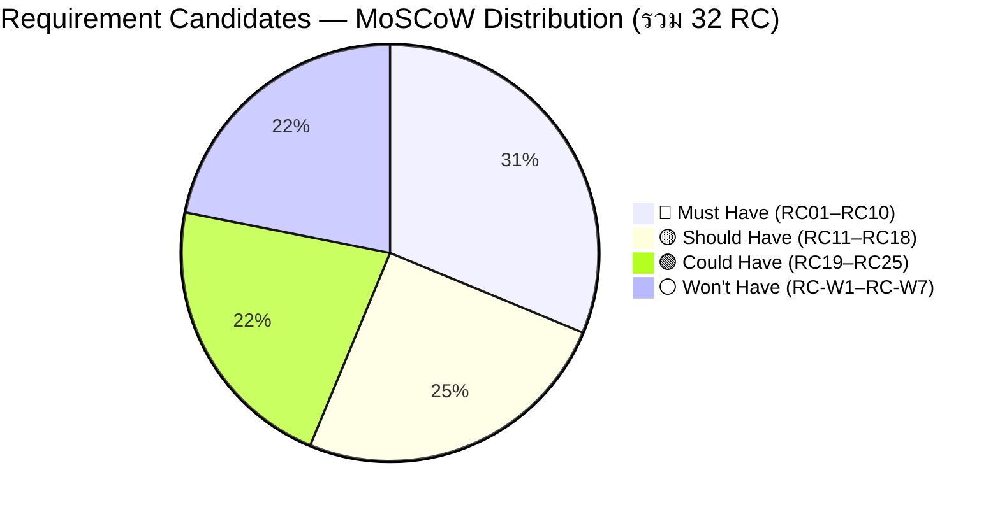
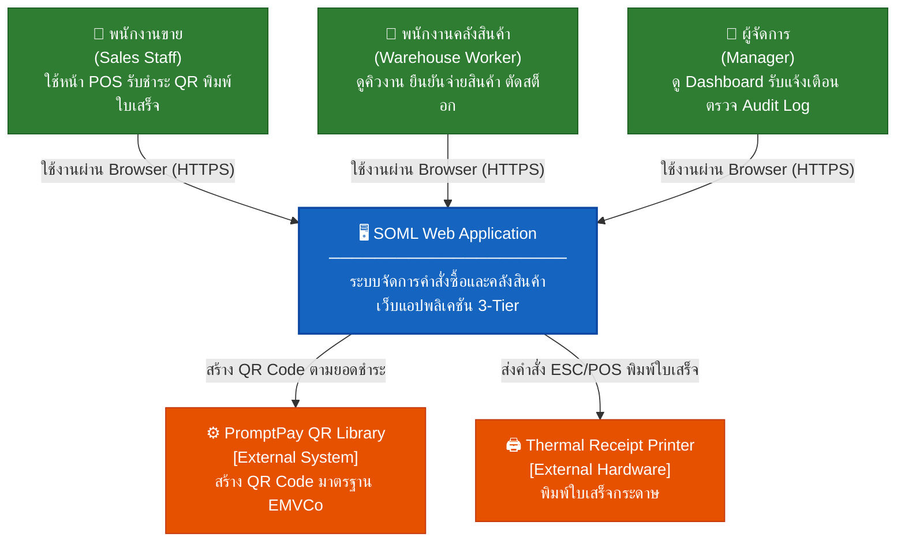
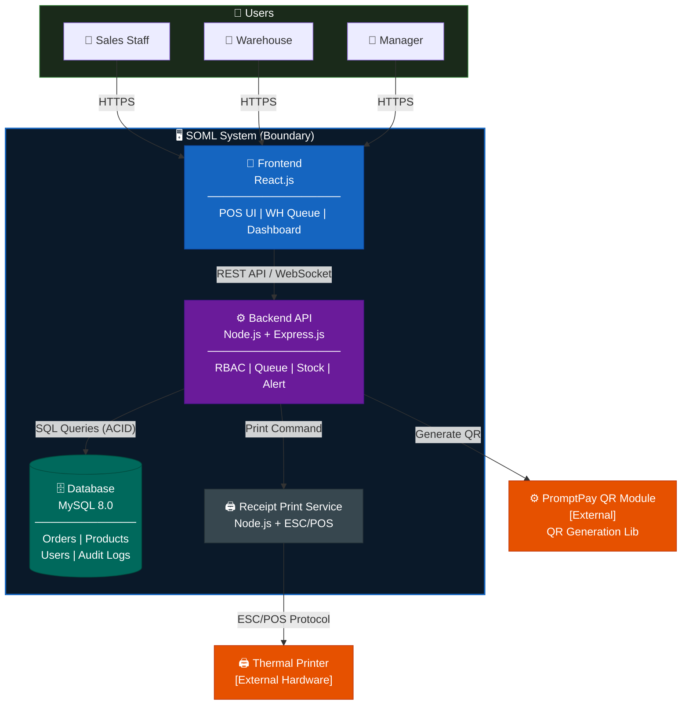
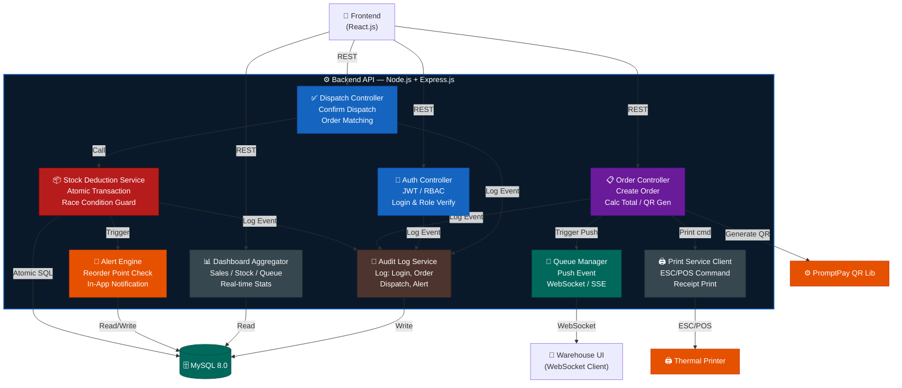

# Software Requirements Specification (SRS)

## ระบบจัดการคำสั่งซื้อและตรวจสอบคลังสินค้า (SOML)
### Order Management and Inventory Control System
> *กรณีศึกษา: ร้านวัสดุก่อสร้างอำพรคอนกรีต*

---

| รายการ | รายละเอียด |
|---|---|
| รหัสโครงงาน | SE02 |
| เวอร์ชันเอกสาร | 1.0 |
| วันที่จัดทำ | 20 มีนาคม พ.ศ. 2569 |
| หัวหน้าโครงงาน | นายตรัยรัตน์ วงษ์สิทธิ์ (67543210028-6) |
| ผู้ร่วมโครงงาน | นายพนาวุฒน์ อภิปสันติ (67543210040-1) |
| อาจารย์ที่ปรึกษา | อาจารย์ธนิต เกตุแก้ว |
| หลักสูตร | วิศวกรรมซอฟต์แวร์ (4 ปี/เทียบโอน) ปี 3 |
| สถาบัน | มหาวิทยาลัยเทคโนโลยีราชมงคลล้านนา เชียงใหม่ |

---

## สารบัญ

1. [บทนำ](#1-บทนำ-introduction)
2. [ภาพรวมระบบ](#2-ภาพรวมระบบ-system-overview)
3. [Requirement Candidates — MoSCoW](#3-requirement-candidates--moscow)
4. [ความต้องการเชิงหน้าที่](#4-ความต้องการเชิงหน้าที่-functional-requirements)
5. [ความต้องการเชิงคุณภาพ](#5-ความต้องการเชิงคุณภาพ-non-functional-requirements)
6. [สถาปัตยกรรมระบบ — C4 Model](#6-สถาปัตยกรรมระบบ--c4-model-static-structure-diagrams)
7. [ตารางตรวจสอบย้อนกลับและข้อจำกัด](#7-ตารางตรวจสอบย้อนกลับและข้อจำกัด)
8. [สรุป](#8-สรุป-summary)

---

## 1. บทนำ (Introduction)

### 1.1 วัตถุประสงค์ของเอกสาร

เอกสาร Software Requirements Specification (SRS) ฉบับนี้จัดทำขึ้นเพื่อกำหนดขอบเขต ข้อกำหนด และพฤติกรรมที่คาดหวังของ **ระบบจัดการคำสั่งซื้อและตรวจสอบคลังสินค้า (SOML)** สำหรับร้านวัสดุก่อสร้างอำพรคอนกรีต เอกสารนี้ใช้เป็นข้อตกลงร่วมระหว่างผู้พัฒนา ผู้ใช้งาน และอาจารย์ที่ปรึกษา

### 1.2 ขอบเขตของระบบ

ระบบ SOML (Smart Order Management and Logistics) เป็นเว็บแอปพลิเคชันแบบ 3 ชั้น (3-Tier Architecture) ครอบคลุมกระบวนการ:

- การบันทึกคำสั่งซื้อและรับชำระเงินผ่าน QR พร้อมเพย์ (PromptPay) หน้าร้าน
- การพิมพ์ใบเสร็จกระดาษผ่านเครื่องพิมพ์ใบเสร็จ (Thermal Receipt Printer)
- การส่งคำสั่งซื้อเข้าคิวคลังสินค้าแบบเรียลไทม์ (Real-time Push)
- การยืนยันจ่ายสินค้าและตัดสต็อกแบบ Atomic Transaction
- แดชบอร์ดปฏิบัติการและระบบแจ้งเตือน In-App สำหรับผู้จัดการ
- ระบบควบคุมสิทธิ์ตามบทบาท (RBAC) และบันทึกประวัติ (Audit Logs)

### 1.3 คำนิยามและคำย่อ

| คำ/ตัวย่อ | ความหมาย |
|---|---|
| SOML | Smart Order Management and Logistics — ชื่อระบบ |
| RBAC | Role-Based Access Control — ควบคุมสิทธิ์ตามบทบาท |
| FR | Functional Requirement — ความต้องการเชิงหน้าที่ |
| NFR | Non-Functional Requirement — ความต้องการเชิงคุณภาพ |
| UC | Use Case — กรณีการใช้งาน |
| POS | Point of Sale — จุดขายหน้าร้าน |
| QR | Quick Response Code — รหัสสองมิติสำหรับชำระเงิน |
| ACID | Atomicity, Consistency, Isolation, Durability |
| C4 | Context-Container-Component-Code Model (Simon Brown) |
| UAT | User Acceptance Testing — การทดสอบโดยผู้ใช้จริง |
| API | Application Programming Interface |

### 1.4 ภาพรวมเอกสาร

เอกสารนี้แบ่งออกเป็น 7 ส่วนหลัก: (1) บทนำ, (2) ภาพรวมระบบ, (3) ความต้องการเชิงหน้าที่, (4) ความต้องการเชิงคุณภาพ, (5) สถาปัตยกรรมระบบ C4, (6) ตารางตรวจสอบย้อนกลับและข้อจำกัด, (7) สรุป

---

## 2. ภาพรวมระบบ (System Overview)

### 2.1 บริบทและปัญหา (Problem Statement)

ร้านวัสดุก่อสร้างอำพรคอนกรีตดำเนินกระบวนการขายและจัดการสต็อกด้วยเอกสารกระดาษ ส่งผลให้เกิดปัญหาหลัก 4 ประการ:

- **ข้อมูลคลาดเคลื่อน:** สต็อกที่บันทึกกระดาษไม่ตรงกับจำนวนสินค้าจริงในคลัง
- **การสื่อสารล่าช้า:** หน้าร้านและโกดังไม่มีช่องทางเรียลไทม์ ลูกค้าต้องถือบิลเดินไปเองที่โกดัง
- **ความเสี่ยงของการฉ้อโกง:** บิลกระดาษถูกนำมาใช้รับสินค้าซ้ำได้โดยไม่มีระบบป้องกัน
- **ขาดทัศนวิสัยเชิงบริหาร:** ผู้จัดการต้องรอนับสต็อกปลายวัน ไม่สามารถตัดสินใจเชิงข้อมูลได้ทันท่วงที

### 2.2 ผู้ใช้งานและบทบาท (Stakeholders & Roles)

| บทบาท | ผู้ใช้งาน | หน้าที่ในระบบ |
|---|---|---|
| Admin | ผู้ดูแลระบบ | จัดการผู้ใช้ ตั้งค่าระบบ |
| Manager | ผู้จัดการ/เจ้าของร้าน | ดู Dashboard จัดการสินค้า ตรวจสอบ Audit Logs รับแจ้งเตือน |
| Sales Staff | พนักงานขายหน้าร้าน | สร้างคำสั่งซื้อ รับชำระ QR พิมพ์ใบเสร็จ |
| Warehouse | พนักงานคลังสินค้า | ดูคิวงานเรียลไทม์ ยืนยันจ่ายสินค้า ตัดสต็อก |
| System | ระบบอัตโนมัติ | สร้างเลขคำสั่งซื้อ ส่ง Push Event แจ้งเตือน Reorder Point |

### 2.3 ข้อสมมติฐาน (Assumptions)

- เครื่องพิมพ์ใบเสร็จ (Thermal Printer) ถูกต่อเชื่อมและพร้อมใช้งานตลอดเวลา
- พนักงานมีอุปกรณ์เชื่อมอินเทอร์เน็ตเพื่อเข้าใช้งานเว็บแอปพลิเคชัน
- การยืนยันการรับชำระเงิน QR พร้อมเพย์ทำโดยพนักงานขายจากแอปธนาคาร (ไม่ใช่ระบบอัตโนมัติ)
- เครือข่ายภายในร้านมีความเสถียรเพียงพอสำหรับการส่งข้อมูลเรียลไทม์

### 2.4 ขอบเขตที่ไม่ครอบคลุม (Out of Scope)

- ระบบบัญชีเต็มรูปแบบ การออกใบกำกับภาษี หรือการจัดการการเงินเชิงลึก
- Payment Gateway หรือการเชื่อมต่อ API ธนาคารเพื่อตรวจสอบสถานะการชำระเงินอัตโนมัติ
- แอปพลิเคชัน Mobile Native (iOS/Android)
- การเชื่อมต่อกับระบบ ERP ขนาดใหญ่หรือระบบซัพพลายเออร์ภายนอก
- การแจ้งเตือนผ่านบริการภายนอก เช่น LINE Notify หรือ Email
- การใช้กล้อง/สแกนเนอร์บาร์โค้ดหรือ QR Code เพื่อยืนยันสิทธิ์รับสินค้าที่คลัง
- โมดูล AI-Assisted (Future Work เวอร์ชันถัดไป)

---

## 3. Requirement Candidates — MoSCoW

ส่วนนี้รวบรวม **Requirement Candidates (RC)** จากการวิเคราะห์ขอบเขตระบบ (§1.2) บริบทปัญหา (§2.1) และผู้มีส่วนได้ส่วนเสีย (§2.2) แล้วจัดลำดับด้วย **MoSCoW Method** โดยแต่ละ RC ระบุ Priority / Related Stakeholder / Related Scope / FR-NFR ที่ผูกกลับ ตามโครงสร้าง ENGSE601 Phase 1

### ตารางนิยาม Scope Reference

> ขอบเขตระบบ §1.2 ถูกกำหนดเป็นรหัส **sc** เพื่อใช้อ้างอิงใน RC แต่ละรายการ

| Scope ID | ขอบเขต (§1.2) | คำอธิบาย |
|:---:|---|---|
| sc01 | ข้อ 1 | การบันทึกคำสั่งซื้อและรับชำระเงินผ่าน QR พร้อมเพย์ (PromptPay) หน้าร้าน |
| sc02 | ข้อ 2 | การพิมพ์ใบเสร็จกระดาษผ่านเครื่องพิมพ์ใบเสร็จ (Thermal Receipt Printer) |
| sc03 | ข้อ 3 | การส่งคำสั่งซื้อเข้าคิวคลังสินค้าแบบเรียลไทม์ (Real-time Push) |
| sc04 | ข้อ 4 | การยืนยันจ่ายสินค้าและตัดสต็อกแบบ Atomic Transaction |
| sc05 | ข้อ 5 | แดชบอร์ดปฏิบัติการและระบบแจ้งเตือน In-App สำหรับผู้จัดการ |
| sc06 | ข้อ 6 | ระบบควบคุมสิทธิ์ตามบทบาท (RBAC) และบันทึกประวัติ (Audit Logs) |
| sc07 | §2.1 | บริบทปัญหา — ความเสี่ยงฉ้อโกงบิลซ้ำ / ข้อมูลคลาดเคลื่อน |
| sc08 | §2.2 | Stakeholder Needs — ความต้องการที่ได้จากการวิเคราะห์บทบาท |
| sc-out | §2.4 | ขอบเขตที่ไม่ครอบคลุม (Out of Scope) — Won't Have รอบนี้ |

---

### 3.1 Must Have 🔴

> ระบบล้มเหลวถ้าไม่มีฟีเจอร์เหล่านี้ — ต้องพัฒนาครบใน MVP (Version 1.0)

| RC-ID | Requirement Candidate | Priority | Related Stakeholder | Related Scope | FR / NFR |
|:---:|---|:---:|---|:---:|:---:|
| RC01 | ระบบต้องให้ Sales Staff บันทึกรายการสินค้าและจำนวน คำนวณยอดรวมอัตโนมัติ | 🔴 Must | Sales Staff | sc01 | FR-03 |
| RC02 | ระบบต้องสร้างและแสดง QR Code พร้อมเพย์ (EMVCo) ตามยอดที่ต้องชำระ | 🔴 Must | Sales Staff, ลูกค้า | sc01 | FR-03 |
| RC03 | ระบบต้องสั่งพิมพ์ใบเสร็จผ่าน Thermal Printer ทันทีเมื่อ Sales Staff ยืนยันรับชำระ | 🔴 Must | Sales Staff | sc02 | FR-03 |
| RC04 | ระบบต้องส่ง Push Event ข้อมูลคำสั่งซื้อไปยังคิวคลังแบบเรียลไทม์ทันทีที่ยืนยันชำระ | 🔴 Must | Warehouse, Sales Staff | sc03 | FR-04 |
| RC05 | ระบบต้องแสดงคิวงานเรียลไทม์ให้ Warehouse เห็น และอัปเดตอัตโนมัติเมื่อมีออเดอร์ใหม่ | 🔴 Must | Warehouse | sc03 | FR-04 |
| RC06 | Warehouse ต้องเลือกออเดอร์จากคิวและยืนยันจ่ายสินค้าได้โดยไม่ต้องใช้อุปกรณ์สแกน | 🔴 Must | Warehouse | sc04 | FR-05 |
| RC07 | ระบบต้องตัดยอดสต็อกแบบ Atomic Transaction ทันทีเมื่อ Warehouse ยืนยันจ่าย | 🔴 Must | Warehouse, System | sc04 | FR-06 |
| RC08 | ระบบต้องล็อกสถานะออเดอร์ ป้องกันการยืนยันจ่ายซ้ำบนออเดอร์เดียวกัน | 🔴 Must | Warehouse, System | sc07 | FR-05 |
| RC09 | ระบบต้องมี Login + RBAC แยกสิทธิ์เมนู/ข้อมูลตาม 4 บทบาท (Admin/Manager/Sales/Warehouse) | 🔴 Must | Admin, ทุกบทบาท | sc06 | FR-01 |
| RC10 | ระบบต้องจัดการ Product Master (ชื่อ ราคา จำนวนสต็อก หน่วย) โดย Manager/Admin | 🔴 Must | Manager, Admin | sc04 | FR-02 |

---

### 3.2 Should Have 🟡

> สำคัญมากและควรมีใน Version 1.0 แต่ระบบยังทำงานได้ในระดับพื้นฐานหากขาดไปชั่วคราว

| RC-ID | Requirement Candidate | Priority | Related Stakeholder | Related Scope | FR / NFR |
|:---:|---|:---:|---|:---:|:---:|
| RC11 | ระบบต้องแสดง Operational Dashboard ยอดขายวันนี้ จำนวนคิวคงค้าง และระดับสต็อกแบบเรียลไทม์ | 🟡 Should | Manager, Warehouse | sc05 | FR-07 |
| RC12 | ระบบต้องแจ้งเตือน In-App เมื่อสต็อกสินค้าต่ำกว่า Reorder Point ที่ตั้งไว้ | 🟡 Should | Manager | sc05 | FR-08 |
| RC13 | ระบบต้องแจ้งเตือน In-App เมื่อมีออเดอร์ค้างในคิวนานผิดปกติ (เกินเวลาที่กำหนด) | 🟡 Should | Manager | sc05 | FR-08 |
| RC14 | Manager ต้องตั้งค่า Reorder Point ของแต่ละสินค้าได้อิสระ | 🟡 Should | Manager | sc05, sc04 | FR-02 |
| RC15 | ระบบต้องบันทึก Audit Log ทุก Event สำคัญ (Login, Create Order, Dispatch, Alert) | 🟡 Should | Admin, Manager | sc06 | FR-09 |
| RC16 | Manager ต้องค้นหาและกรอง Audit Log ย้อนหลังตามช่วงวันที่และบทบาทผู้กระทำได้ | 🟡 Should | Manager | sc06 | FR-09 |
| RC17 | ระบบต้องสร้างเลขคำสั่งซื้อไม่ซ้ำกันอัตโนมัติ (Unique Order Number) | 🟡 Should | System, Sales Staff | sc07 | FR-03 |
| RC18 | หน้าจอคิวงานและยืนยันจ่ายต้องแสดงผลถูกต้องบน Tablet และ Smartphone (Responsive UI) | 🟡 Should | Warehouse | sc08 | NFR-03 |

---

### 3.3 Could Have 🟢

> เพิ่มคุณค่าหากเวลาและทรัพยากรเพียงพอ — วิเคราะห์จาก Stakeholder Needs เชิงลึกที่ไม่ได้อยู่ใน Scope หลัก

| RC-ID | Requirement Candidate | Priority | Related Stakeholder | Related Scope | FR / NFR |
|:---:|---|:---:|---|:---:|:---:|
| RC19 | Manager สามารถ Export รายงานยอดขายรายวัน/สัปดาห์/เดือน เป็นไฟล์ CSV ได้ | 🟢 Could | Manager | sc05, sc08 | FR-07 |
| RC20 | Sales Staff สามารถค้นหาและดูประวัติคำสั่งซื้อย้อนหลังได้ | 🟢 Could | Sales Staff | sc08 | FR-03 |
| RC21 | Dashboard แสดงกราฟแนวโน้มยอดขายรายสินค้าย้อนหลัง 30 วัน | 🟢 Could | Manager | sc05, sc08 | FR-07 |
| RC22 | ระบบแจ้งเตือน In-App เมื่อสต็อกสินค้าถึง 0 (Zero Stock Alert) เพื่อบล็อกการรับออเดอร์ | 🟢 Could | Manager, Sales Staff | sc04, sc05 | FR-08 |
| RC23 | Warehouse สามารถ Update สถานะ "กำลังจัดของ" ก่อนยืนยันจ่ายสินค้าได้ | 🟢 Could | Warehouse, Manager | sc03, sc08 | FR-04 |
| RC24 | Admin สามารถบันทึกการปรับสต็อกแบบ Manual พร้อมเหตุผล (Stock Adjustment Log) | 🟢 Could | Admin | sc06, sc08 | FR-09 |
| RC25 | Dashboard แยก View ตามบทบาท (Manager View / Warehouse View) อัตโนมัติหลัง Login | 🟢 Could | Manager, Warehouse | sc05, sc06 | FR-07 |

---

### 3.4 Won't Have — Version 1.0 ⚪

> ตกลงร่วมกันว่าอยู่นอกขอบเขต Version นี้ — มาจาก Out of Scope §2.4 ทั้งหมด

| RC-ID | Requirement Candidate | Priority | Related Stakeholder | Related Scope | เหตุผล |
|:---:|---|:---:|---|:---:|---|
| RC-W1 | ระบบบัญชีเต็มรูปแบบ / ออกใบกำกับภาษี (Tax Invoice) | ⚪ Won't | Manager | sc-out §2.4/1 | ซับซ้อนเกินขอบเขตโครงงาน ต้องระบบบัญชีเฉพาะทาง |
| RC-W2 | Payment Gateway / ตรวจสอบสถานะชำระเงินอัตโนมัติจาก API ธนาคาร | ⚪ Won't | Sales Staff | sc-out §2.4/2 | ต้องสัญญากับธนาคาร ต้นทุนและความซับซ้อนสูง |
| RC-W3 | แอปพลิเคชัน Mobile Native (iOS / Android) | ⚪ Won't | Sales Staff, Warehouse | sc-out §2.4/3 | Responsive Web เพียงพอ ลดต้นทุนพัฒนา |
| RC-W4 | เชื่อมต่อระบบ ERP หรือระบบซัพพลายเออร์ภายนอก | ⚪ Won't | Manager, Admin | sc-out §2.4/4 | ร้านขนาดเล็ก ยังไม่มี ERP |
| RC-W5 | แจ้งเตือนผ่าน LINE Notify / Email / SMS | ⚪ Won't | Manager | sc-out §2.4/5 | ใช้ In-App Alert แทน ลดการพึ่งพาบริการภายนอก |
| RC-W6 | สแกนบาร์โค้ด / QR Code เพื่อยืนยันสิทธิ์รับสินค้าที่คลัง | ⚪ Won't | Warehouse | sc-out §2.4/6 | ใช้ Order Number Matching แทน ลดต้นทุนอุปกรณ์ |
| RC-W7 | โมดูล AI-Assisted (พยากรณ์ยอดขาย / แนะนำสั่งซื้ออัตโนมัติ) | ⚪ Won't | Manager | sc-out §2.4/7 | กำหนดเป็น Future Work Version ถัดไป |

---

### 3.5 ภาพรวม MoSCoW

---

### 3.6 Scope → RC Mapping Diagram

```mermaid
graph TD
    subgraph SCOPE["📋 ขอบเขตระบบ §1.2 (Scope Reference)"]
        sc01["sc01 — QR Payment + บันทึกออเดอร์"]
        sc02["sc02 — พิมพ์ใบเสร็จ Thermal"]
        sc03["sc03 — Real-time Queue Push"]
        sc04["sc04 — Atomic Stock Deduction"]
        sc05["sc05 — Dashboard + In-App Alert"]
        sc06["sc06 — RBAC + Audit Logs"]
        sc07["sc07 — Problem Context §2.1"]
        sc08["sc08 — Stakeholder Needs §2.2"]
        scout["sc-out — Out of Scope §2.4"]
    end

    subgraph MUST["🔴 Must Have"]
        RC01["RC01 บันทึกออเดอร์"]
        RC02["RC02 QR Code"]
        RC03["RC03 พิมพ์ใบเสร็จ"]
        RC04["RC04 Push Queue"]
        RC05["RC05 คิวเรียลไทม์"]
        RC06["RC06 ยืนยันจ่าย"]
        RC07["RC07 Atomic Stock"]
        RC08["RC08 Order Lock"]
        RC09["RC09 RBAC/Login"]
        RC10["RC10 Product Master"]
    end

    subgraph SHOULD["🟡 Should Have"]
        RC11["RC11 Dashboard"]
        RC12["RC12 Low Stock Alert"]
        RC13["RC13 Queue Delay Alert"]
        RC14["RC14 Reorder Point"]
        RC15["RC15 Audit Log"]
        RC16["RC16 Log Search"]
        RC17["RC17 Order Number"]
        RC18["RC18 Responsive UI"]
    end

    subgraph COULD["🟢 Could Have"]
        RC19["RC19 Export CSV"]
        RC20["RC20 ค้นหาออเดอร์"]
        RC21["RC21 กราฟยอดขาย"]
        RC22["RC22 Zero Stock Alert"]
        RC23["RC23 สถานะจัดของ"]
        RC24["RC24 Stock Adjust Log"]
        RC25["RC25 Dashboard by Role"]
    end

    subgraph WONT["⚪ Won't Have"]
        W1["RC-W1 ระบบบัญชี/ภาษี"]
        W2["RC-W2 Payment Gateway"]
        W3["RC-W3 Mobile Native"]
        W4["RC-W4 ERP Integration"]
        W5["RC-W5 LINE/Email Alert"]
        W6["RC-W6 Barcode Scanner"]
        W7["RC-W7 AI Module"]
    end

    sc01 --> RC01 & RC02
    sc02 --> RC03
    sc03 --> RC04 & RC05
    sc04 --> RC06 & RC07 & RC10
    sc07 --> RC08
    sc06 --> RC09
    sc05 --> RC11 & RC12 & RC13 & RC14
    sc06 --> RC15 & RC16
    sc07 --> RC17
    sc08 --> RC18

    sc05 & sc08 --> RC19 & RC21 & RC22 & RC25
    sc08 --> RC20 & RC23 & RC24

    scout --> W1 & W2 & W3 & W4 & W5 & W6 & W7

    style MUST fill:#3b0000,color:#fff,stroke:#B71C1C,stroke-width:2px
    style SHOULD fill:#3b2800,color:#fff,stroke:#F57F17,stroke-width:2px
    style COULD fill:#003b00,color:#fff,stroke:#2E7D32,stroke-width:2px
    style WONT fill:#1a1a1a,color:#ccc,stroke:#555,stroke-width:2px
    style SCOPE fill:#001a3b,color:#fff,stroke:#1565C0,stroke-width:2px
```

---

## 4. ความต้องการเชิงหน้าที่ (Functional Requirements)

### 3.1 ความต้องการทางธุรกิจ (Business Requirements — BR)

| BR-ID | ความต้องการทางธุรกิจ | คุณค่าทางธุรกิจ |
|---|---|---|
| BR-01 | ใบเสร็จกระดาษ + ส่งคำสั่งซื้อเข้าคิวคลังเรียลไทม์ | คุ้นเคยสำหรับลูกค้า ป้องกันรับสินค้าซ้ำด้วยสถานะออเดอร์ |
| BR-02 | ควบคุมคลังสินค้าแบบเรียลไทม์ | ตัวเลขระบบตรงสินค้าจริง 100% |
| BR-03 | ลดระยะเวลารอคอย (Lead Time Reduction) | โกดังรู้คำสั่งซื้อก่อนลูกค้าเดินมาถึง |
| BR-04 | เพิ่มทัศนวิสัยเชิงปฏิบัติการ | ผู้บริหารติดตามยอดขาย/คิวตลอดเวลา |
| BR-05 | แจ้งเตือนเชิงรุกใน Dashboard | ลดความเสี่ยงสินค้าขาดมือ |

### 3.2 ความต้องการเชิงหน้าที่ (Functional Requirements — FR)

| FR-ID | รายละเอียด | ลำดับความสำคัญ |
|---|---|---|
| FR-01 | ระบบต้องมี Authentication และ RBAC ควบคุมสิทธิ์ตามบทบาท (Admin/Manager/Sales/Warehouse) | High |
| FR-02 | ระบบต้องรองรับการจัดการข้อมูลสินค้า (Product Master) รวมถึงการตั้งค่า Reorder Point | High |
| FR-03 | ระบบต้องสร้างคำสั่งซื้อ คำนวณยอด แสดง QR พร้อมเพย์ ยืนยันรับเงิน สั่งพิมพ์ใบเสร็จ และส่งคิวเรียลไทม์ทันที | High |
| FR-04 | ระบบต้องแสดงหน้าจอคิวรอจ่ายสินค้า (Warehouse Queue) อัปเดตเรียลไทม์ | High |
| FR-05 | พนักงานคลังสินค้าต้องเลือกคำสั่งซื้อจากคิวและยืนยันจ่ายสินค้าได้โดยไม่ต้องใช้อุปกรณ์สแกน | High |
| FR-06 | ระบบต้องตัดยอดสต็อกใน DB แบบ Atomic Transaction ทันทีที่ยืนยันจ่าย | High |
| FR-07 | ระบบต้องแสดง Operational Dashboard รวมสถิติยอดขาย สต็อก และคิวแบบเรียลไทม์ | High |
| FR-08 | ระบบต้องแจ้งเตือน In-App เมื่อสต็อกต่ำกว่า Reorder Point หรือคิวค้างผิดปกติ | High |
| FR-09 | ระบบต้องเก็บ Audit Logs ทุกรายการและเรียกดูย้อนหลังได้ | Medium |

### 3.3 กรณีการใช้งาน (Use Case Summary)

| UC-ID | ชื่อ Use Case | Actor หลัก | คำอธิบาย |
|---|---|---|---|
| UC-01 | Login & RBAC | ทุกบทบาท | ตรวจสอบสิทธิ์และกำหนดเมนูตามบทบาท |
| UC-02 | Manage Products | Manager | จัดการสินค้า ราคา สต็อก Reorder Point |
| UC-03 | Create Paid Order | Sales Staff | บันทึกออเดอร์ แสดง QR รับชำระ พิมพ์ใบเสร็จ |
| UC-04 | Generate Order No. | System | สร้างเลขคำสั่งซื้อไม่ซ้ำอัตโนมัติ |
| UC-05 | View WH Queue | Warehouse | ดูคิวงานเรียลไทม์ |
| UC-06 | Update Picking | Warehouse | เปลี่ยนสถานะการจัดของในคิว |
| UC-07 | Confirm Dispatch | Warehouse | เลือกออเดอร์จากคิว ยืนยันจ่าย ตัดสต็อก |
| UC-08 | Operational Dashboard | Manager, Warehouse | แสดงสถิติยอดขาย สต็อก คิว |
| UC-09 | Manager Dashboard | Manager | ภาพรวมระดับบริหาร + แจ้งเตือน |
| UC-10 | Audit Logs | Manager | ดูประวัติทุกรายการย้อนหลัง |
| UC-11 | Receive In-App Alerts | Manager | รับแจ้งเตือนเมื่อสต็อกต่ำ/คิวค้าง |

### 3.4 Use Case Specification ที่สำคัญ

#### UC-03: สร้างคำสั่งซื้อและออกใบเสร็จ (Create Paid Order & Print Receipt)

| หัวข้อ | รายละเอียด |
|---|---|
| Actor หลัก | พนักงานขาย (Sales Staff) |
| เงื่อนไขก่อนหน้า | พนักงานขายเข้าสู่ระบบสำเร็จ อยู่ในหน้า POS/Order Creation |
| กระบวนการหลัก | 1. เลือกสินค้าและระบุจำนวน 2. ระบบคำนวณและแสดง QR พร้อมเพย์ตามยอด 3. ลูกค้าสแกน QR โอนเงินผ่านแอปธนาคาร 4. พนักงานยืนยันรับชำระ → ระบบพิมพ์ใบเสร็จ + ส่ง Push Event ไปยังคิวคลัง 5. โกดังรับคำสั่งซื้อก่อนลูกค้าเดินมาถึง |
| เงื่อนไขผลลัพธ์ | ออเดอร์ถูกบันทึก สถานะ "รอจ่ายสินค้า" ใบเสร็จพิมพ์เสร็จ คิวโกดังอัปเดต |
| Alternative Flow | ลูกค้าไม่ชำระภายในเวลาที่กำหนด: พนักงานยกเลิกออเดอร์ได้ |

#### UC-07: ยืนยันจ่ายสินค้าและตัดยอด (Confirm Dispatch with Atomic Deduction)

| หัวข้อ | รายละเอียด |
|---|---|
| Actor หลัก | พนักงานคลังสินค้า (Warehouse Worker) |
| เงื่อนไขก่อนหน้า | คำสั่งซื้อสถานะ "รอจ่ายสินค้า" ปรากฏในคิว และลูกค้าถือใบเสร็จมาถึงจุดรับของ |
| กระบวนการหลัก | 1. พนักงานดูคิวงานบนหน้าจอ 2. จับคู่ออเดอร์จากหมายเลขใบเสร็จหรือลำดับคิว 3. ระบบแสดงรายการสินค้าของออเดอร์นั้น 4. พนักงานตรวจสอบ → กด "ยืนยันการจ่ายสินค้า" 5. ระบบตัดสต็อก Atomic + เปลี่ยนสถานะ "ส่งมอบสำเร็จ" + บันทึก Audit Log |
| เงื่อนไขผลลัพธ์ | สถานะออเดอร์ = ส่งมอบสำเร็จ สต็อกถูกหักลบแม่นยำ ออเดอร์หายไปจากคิว |
| Alternative Flow | ออเดอร์ถูกยืนยันจ่ายไปแล้ว: ระบบล็อกไม่ให้เลือกจ่ายซ้ำ |

### 3.5 เปรียบเทียบกระบวนการ AS-IS vs TO-BE

| หัวข้อ | ระบบเดิม (AS-IS) | ระบบใหม่ (TO-BE) | คุณค่าที่เพิ่มขึ้น |
|---|---|---|---|
| ระบบขายและสต็อก | จดบันทึกกระดาษ Manual | POS + Product Master ดิจิทัล | โปร่งใส ตรวจสอบได้ 100% |
| ส่งผ่านข้อมูล | ลูกค้าถือบิลไปโกดังเอง | Real-time Push ทันทีที่ชำระ | ลดคอขวด โกดังจัดของล่วงหน้า |
| ยืนยันสิทธิ์ | ตรวจบิลกระดาษด้วยสายตา เสี่ยงซ้ำ | ระบบล็อกสถานะออเดอร์อัตโนมัติ | ป้องกันรับซ้ำโดยไม่ต้องสแกน |
| หักสต็อก | นับและสรุปปลายวัน Manual | Atomic Transaction ทันทีที่จ่าย | ทราบสต็อกจริง Real-time |
| ติดตามงาน | เดินตรวจ / รอรายงานปลายวัน | Dashboard + In-App Alert | บริหารได้ทุกที่ทุกเวลา |
| ตัดสินใจสั่งซื้อ | ใช้สัญชาตญาณ | Dashboard + Reorder Point | Data-Driven ลดสต็อกจม |

---

## 5. ความต้องการเชิงคุณภาพ (Non-Functional Requirements)

| NFR-ID | หมวดหมู่ | รายละเอียด |
|---|---|---|
| NFR-01 | Security | ข้อมูลและเมนูต้องจำกัดการเข้าถึงตาม RBAC อย่างเข้มงวด |
| NFR-02 | Performance | ข้อมูลคำสั่งซื้อใหม่ต้องแสดงบนหน้าจอคิวภายใน ≤ 3 วินาที |
| NFR-03 | Usability | หน้าจอคิวและยืนยันจ่ายรองรับ Tablet/Smartphone ได้สะดวก (Responsive) |
| NFR-04 | Reliability | ฐานข้อมูลต้องทนทาน Concurrent Transaction ไม่เกิด Race Condition (ACID) |
| NFR-05 | Reliability | เครื่องพิมพ์ใบเสร็จต้องพิมพ์สำเร็จภายใน ≤ 5 วินาทีหลังยืนยันรับชำระ |
| NFR-06 | Scalability | รองรับผู้ใช้งานพร้อมกันได้ ≥ 10 sessions ในช่วง Peak Hour |

---

## 6. สถาปัตยกรรมระบบ — C4 Model (Static Structure Diagrams)

เอกสารนี้ใช้ **C4 Model** ของ Simon Brown ในการอธิบายสถาปัตยกรรมระบบแบบลำดับชั้น ตั้งแต่ระดับบริบทของระบบ (C1) จนถึงองค์ประกอบภายใน (C2 Container และ C3 Component)

### 5.1 C1: System Context Diagram

แสดงภาพรวมระบบ SOML กับ Actor ภายนอกและระบบภายนอกที่เชื่อมต่อ

| องค์ประกอบ | ประเภท | คำอธิบาย |
|---|---|---|
| พนักงานขาย (Sales Staff) | Person | ใช้หน้า POS บันทึกออเดอร์ รับชำระ QR พิมพ์ใบเสร็จ |
| พนักงานคลังสินค้า (Warehouse) | Person | ดูคิวงานเรียลไทม์ ยืนยันจ่ายสินค้า ตัดสต็อก |
| ผู้จัดการ (Manager) | Person | ดู Dashboard ตรวจสอบ Audit Log รับแจ้งเตือน |
| SOML Web Application | Software System (ระบบหลัก) | เว็บแอปพลิเคชัน 3-Tier จัดการคำสั่งซื้อ คลัง และ Dashboard |
| PromptPay QR Library | External System | สร้าง QR Code มาตรฐาน EMVCo ตามยอดชำระ |
| Thermal Receipt Printer | External Hardware | รับคำสั่งพิมพ์จากระบบ พิมพ์ใบเสร็จกระดาษ |

### 5.2 C2: Container Diagram

แสดง Container ภายในระบบ SOML และการสื่อสารระหว่างกัน

| Container | เทคโนโลยี | หน้าที่ |
|---|---|---|
| Web Application (Frontend) | React.js | Responsive UI สำหรับ POS, Warehouse Queue, Dashboard (3 บทบาท) |
| Backend API | Node.js + Express.js | Business Logic, RBAC, Real-time Push (WebSocket/SSE), Printer Integration |
| Database | MySQL 8.0 | จัดเก็บ Orders, Products, Users, Audit Logs — ACID Transactions |
| PromptPay QR Module | QR Generation Lib | สร้าง QR Code EMVCo ตามยอดชำระ |
| Receipt Print Service | Node.js + ESC/POS | รับ command พิมพ์ ส่งไปยัง Thermal Printer |

### 5.3 C3: Component Diagram (Backend API)

แสดง Component ภายใน Backend API Container และการเชื่อมต่อ

| Component | หน้าที่ |
|---|---|
| Auth Controller | จัดการ Login, JWT Token, Session และ Role verification |
| Order Controller | รับออเดอร์ใหม่ สร้าง Order No. คำนวณยอด ส่ง QR Module |
| Queue Manager | ส่ง Push Event (WebSocket/SSE) ไปยัง Warehouse หน้าจอ เมื่อออเดอร์ใหม่เข้า |
| Dispatch Controller | รับ Confirm Dispatch จาก Warehouse UI เรียก Stock Deduction Service |
| Stock Deduction Service | ทำ Atomic Transaction ตัดสต็อกใน MySQL ป้องกัน Race Condition |
| Alert Engine | ตรวจสอบ Reorder Point เมื่อสต็อกเปลี่ยน ส่ง In-App Notification |
| Dashboard Aggregator | ดึงสถิติยอดขาย สต็อก คิว รวมเพื่อแสดงบน Dashboard |
| Audit Log Service | บันทึกทุก Event (Login, Order, Dispatch, Alert) ลง Audit Logs Table |
| Print Service Client | ส่งคำสั่ง ESC/POS ไปยัง Thermal Printer เมื่อยืนยันรับชำระ |

---

## 7. ตารางตรวจสอบย้อนกลับและข้อจำกัด

### 6.1 Traceability Matrix (BR → FR → NFR → Module)

| BR-ID | FR ที่เกี่ยวข้อง | NFR ที่เกี่ยวข้อง | โมดูล (Module) |
|---|---|---|---|
| BR-01 | FR-03 | NFR-01, NFR-05 | Order & Receipt Module |
| BR-02 | FR-05, FR-06 | NFR-03, NFR-04 | Confirm Dispatch & Deduct Module |
| BR-03 | FR-04 | NFR-02 | Real-time Queue Module |
| BR-04 | FR-07, FR-09 | NFR-01 | Operational Dashboard Module |
| BR-05 | FR-08 | NFR-02 | In-App Alert System Module |

### 6.2 เมตริกการประเมินผล (Evaluation Metrics & KPIs)

| ประเภทการทดสอบ | เกณฑ์การประเมิน | KPI | เป้าหมาย |
|---|---|---|---|
| Functional Testing | ทดสอบตาม FR และ Use Case | Test Case Success Rate | >= 90% |
| Data Integrity Testing | สต็อกตรงสินค้าจริง | Stock Mismatch Rate | 0% (Error Free) |
| Performance Testing | ความเร็วส่งข้อมูลคิว | Response Time | <= 3 วินาที |
| Usability Testing (UAT) | ความพึงพอใจพนักงาน | Likert Scale (1-5) | >= 4.0 |
| In-App Alert Testing | ความถูกต้องแจ้งเตือน | Alert Trigger Accuracy | 100% |

### 6.3 ข้อจำกัดเทคนิค (Technical Constraints)

- ระบบพัฒนาเป็นเว็บแอปพลิเคชัน ต้องใช้ Browser สมัยใหม่ (Chrome/Edge/Firefox)
- การพิมพ์ใบเสร็จต้องเชื่อมต่อ Thermal Printer ผ่าน USB/Network ESC/POS Protocol
- ฐานข้อมูล MySQL ต้องตั้งค่า InnoDB Engine เพื่อรองรับ ACID Transaction
- Real-time Queue อาศัย WebSocket หรือ Server-Sent Events (SSE) ต้องการเครือข่ายเสถียร
- ยืนยันรับชำระ QR ต้องทำโดยพนักงาน ระบบไม่ตรวจสอบอัตโนมัติ (ไม่มี Payment Gateway)

---

## 8. สรุป (Summary)

เอกสาร SRS ฉบับนี้กำหนดข้อกำหนดความต้องการของระบบ SOML ครอบคลุม **5 Business Requirements, 9 Functional Requirements, 6 Non-Functional Requirements** และ **11 Use Cases** พร้อมสถาปัตยกรรมระบบในรูปแบบ C4 Model ทั้ง 3 ระดับ (Context, Container, Component) ระบบถูกออกแบบให้ตอบโจทย์ปัญหา Bottleneck ของร้านวัสดุก่อสร้างอำพรคอนกรีตได้อย่างครบถ้วน โดยเน้น:

- ลดระยะเวลารอคอยด้วย Real-time Queue และ Push Event
- ขจัดความผิดพลาดด้วย Atomic Stock Deduction และ Order Status Control
- เพิ่มทัศนวิสัยด้วย Operational Dashboard และ In-App Alert
- รักษาความปลอดภัยด้วย RBAC, JWT และ Audit Logs

เอกสารนี้จะใช้เป็นฐานสำหรับการออกแบบฐานข้อมูล (ERD) เอกสารการออกแบบระบบ (SDD) และแผนการทดสอบ (Test Plan) ในขั้นตอนถัดไปของโครงงาน SE02 ปีการศึกษา 2/2568

---

*เอกสารจัดทำโดย: นายตรัยรัตน์ วงษ์สิทธิ์ และ นายพนาวุฒน์ อภิปสันติ*  
*อาจารย์ที่ปรึกษา: อาจารย์ธนิต เกตุแก้ว*  
*มหาวิทยาลัยเทคโนโลยีราชมงคลล้านนา เชียงใหม่ — ปีการศึกษา 2/2568*
