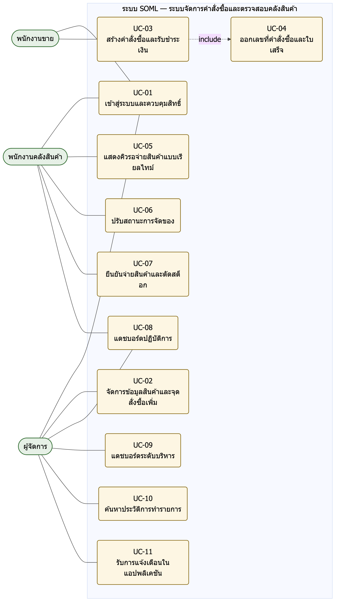

{width=1.25in height=1.25in} {width=1.0919542869641294in height=1.25in}

# Software Requirements Specification

## SOML — ระบบจัดการคำสั่งซื้อและตรวจสอบคลังสินค้า (Use Case SRS)

### เอกสารข้อกำหนดความต้องการซอฟต์แวร์ตามโครงสร้าง IEEE SRS Template

| รายการ | รายละเอียด |
|---|---|
| Artifact | Use Case SRS v1.0 (รวบรวมฐานจากบทที่ 1–2 ของปริญญานิพนธ์) |
| Version | 1.0 |
| สถานะ | Implemented and Verified — รอผลทวนสอบภาคสนาม 3 รายการ |
| กรณีศึกษา | ร้านวัสดุก่อสร้างอำพรคอนกรีต |
| ระบบ | SOML — ระบบจัดการคำสั่งซื้อและตรวจสอบคลังสินค้า |
| โครงงาน | SE02 · ปริญญานิพนธ์ คณะวิศวกรรมศาสตร์ |
| วันที่ | 2026-09-08 |

> **ขอบเขตของเอกสารฉบับนี้**
> เอกสารนี้อธิบายความต้องการของระบบ SOML ที่พัฒนาและทดสอบแล้ว ไม่รวมข้อมูลภายในของสถานประกอบการ เช่น หมายเลขพร้อมเพย์จริง รหัสผ่านผู้ใช้งานจริง และยอดขายจริงของร้าน ตัวเลขผลการทดสอบทั้งหมดมาจากการรันชุดทดสอบจริงและมีไฟล์หลักฐานรองรับ

---

## สารบัญ (Table of Contents)

โครงสร้างเอกสารคงลำดับหัวข้อตามแบบฟอร์ม IEEE ที่ได้รับมา โดยเพิ่ม Appendix D–F เพื่อเก็บ Acceptance Criteria, Traceability และ QA อย่างเป็นระบบ

| ส่วน | เนื้อหา |
|---|---|
| 1 | Introduction: จุดประสงค์ ขอบเขต ผู้อ่าน และเอกสารอ้างอิง |
| 2 | Overall Description: บริบท ฟังก์ชัน ผู้ใช้ สภาพแวดล้อม ข้อจำกัด และสมมติฐาน |
| 3 | External Interface Requirements: UI, Hardware, Software และ Communications |
| 4 | System Features: UC-01..11, Main/Alternate/Exception Flow และ FR-01..09 |
| 5 | Other Nonfunctional Requirements: Performance, Safety, Security, Quality, Business Rules |
| 6 | Other Requirements: Data, audit, language, release boundary |
| Appendix A | Glossary |
| Appendix B | Analysis Models M-01..08 |
| Appendix C | TBD / Controlled Open Issues |
| Appendix D | Acceptance Criteria AC-01..15 |
| Appendix E | End-to-End Traceability |
| Appendix F | Completeness and QA Record |

---

## Revision History

| Version | Date | Reason for Changes | Status |
|---|---|---|---|
| 0.1 | ระยะเก็บความต้องการ | รวบรวมปัญหาหน้างาน EV-01..09, Stakeholders และ Constraints | Input |
| 0.2 | ระยะออกแบบ | เพิ่ม FR/NFR, Use Case UC-01..11, ERD, C4 Model และแผนการทดสอบ | Design Complete |
| 0.3 | ระหว่างพัฒนา | ปรับรูปที่ 3.10 ให้บันทึกคำสั่งซื้อครั้งเดียวตอนรับชำระ และเพิ่มการล็อกช่วงเลขที่ใน UC-04 | Design Corrected |
| 1.0 | 2026-09-08 | จัดวางข้อมูลลง IEEE SRS Template พร้อมผลการทดสอบจริงและ Traceability | Implemented and Verified |

---

# 1. Introduction

## 1.1 Purpose

เอกสาร Use Case SRS ฉบับนี้กำหนดความต้องการซอฟต์แวร์สำหรับระบบ SOML ซึ่งเป็นระบบจัดการคำสั่งซื้อและตรวจสอบคลังสินค้าของร้านวัสดุก่อสร้างอำพรคอนกรีต โดยนำผลจากการสำรวจปัญหาหน้างาน การออกแบบระบบ และการทดสอบจริง มาจัดวางในโครงสร้าง SRS เพื่อให้ผู้พัฒนา ผู้ทดสอบ อาจารย์ที่ปรึกษา และเจ้าของสถานประกอบการตรวจสอบขอบเขต พฤติกรรม กฎ แบบจำลอง และ Traceability ร่วมกันได้

เวอร์ชัน 1.0 นี้อธิบายระบบที่พัฒนาและทดสอบแล้ว มิใช่ข้อเสนอที่ยังไม่ได้ลงมือทำ ความต้องการเชิงหน้าที่ทั้งเก้าข้อและความต้องการนอกเหนือหน้าที่ทั้งเก้าข้อได้รับการทวนสอบด้วยชุดทดสอบอัตโนมัติ 92 กรณีและการทดสอบระดับระบบแล้ว ยังคงเหลือการทวนสอบสามรายการที่ต้องดำเนินการในสถานประกอบการจริง ซึ่งระบุไว้ใน Appendix C

## 1.2 Document Conventions

| Convention | ความหมาย |
|---|---|
| FR-xx | Functional Requirement ของระบบ SOML |
| NFR-xx | Nonfunctional Requirement |
| BR-xx | Business Requirement / Business Rule |
| CON-xx | Constraint ที่บังคับใช้ในการออกแบบ |
| US-xx / UC-xx | User Story / Use Case |
| AC-xx | Acceptance Criterion แบบ Given–When–Then |
| M-xx | Model Element ของแบบจำลองการวิเคราะห์ |
| EV-xx | Evidence จากการสำรวจปัญหาหน้างาน |
| TC-xx | Test Case ตามแผนการทดสอบของโครงงาน |
| ต้อง / shall | ข้อกำหนดที่จำเป็นและตรวจสอบได้ |
| ควร / should | ข้อกำหนดลำดับรองหรือขึ้นกับนโยบายของร้าน |
| Out of MVP | เก็บ Traceability แต่ไม่อยู่ในขอบเขตโครงงาน |
| Provisional / TBD | ยังห้ามถือเป็นข้อสรุปที่ทวนสอบแล้ว |

รหัสความต้องการ FR, NFR, BR และ UC ในเอกสารนี้กำหนดขึ้นในเอกสารฉบับนี้และใช้ร่วมกันตลอดทั้งโครงงาน ส่วนรหัส EV, US, AC, M, CON และ TBD เพิ่มขึ้นตามโครงสร้างของแบบฟอร์ม

## 1.3 Intended Audience and Reading Suggestions

| ผู้อ่าน | อ่านส่วนที่แนะนำ | จุดประสงค์ |
|---|---|---|
| เจ้าของสถานประกอบการ | 1, 2, 5.5, Appendix C | ยืนยันขอบเขต กฎทางธุรกิจ และประเด็นที่ยังค้าง |
| อาจารย์ที่ปรึกษา / กรรมการสอบ | Revision History, 4, Appendix D–F | ตรวจความครบถ้วนของความต้องการและหลักฐานการทวนสอบ |
| ผู้พัฒนา | 2–6 และ Appendix B | เข้าใจความสามารถ ส่วนต่อประสาน สถานะ และข้อจำกัด |
| ผู้ทดสอบ | 4, 5, Appendix D–F | ออกแบบสถานการณ์ทดสอบและตรวจความครอบคลุม |
| ผู้ดูแลระบบของร้าน | 3, 6, Appendix A | ติดตั้ง ดูแล และเข้าใจคำศัพท์ที่ใช้ |

## 1.4 Product Scope

ร้านวัสดุก่อสร้างมีจุดชำระเงินหน้าร้านและจุดรับของที่คลังสินค้าอยู่คนละพื้นที่ แต่ไม่มีช่องทางสื่อสารกันแบบเรียลไทม์ ลูกค้าจึงต้องถือใบเสร็จกระดาษเดินไปที่คลังเอง พนักงานคลังจึงเริ่มจัดของหลังจากนั้น เกิดคอขวดในชั่วโมงเร่งด่วน และการอ่านใบเสร็จด้วยสายตายังเปิดช่องให้หยิบสินค้าผิดและนำบิลเก่ามารับของซ้ำ ระบบ SOML จึงต้องเชื่อมสองจุดนี้เข้าด้วยกัน โดยที่การจ่ายสินค้าหนึ่งครั้งต้องตัดสต็อกเพียงครั้งเดียวเสมอ

| In Scope | Out of Scope / Deferred |
|---|---|
| เว็บแอปพลิเคชันแบบ Responsive รองรับผู้ใช้สามบทบาท | ระบบบัญชีเต็มรูปแบบ |
| เข้าสู่ระบบ ควบคุมสิทธิ์ตามบทบาท และจัดการข้อมูลสินค้า | Payment Gateway และเครื่องรูดบัตร EDC |
| รับชำระด้วย QR พร้อมเพย์ และพิมพ์ใบเสร็จผ่าน ESC/POS | แอปพลิเคชันแบบ Mobile Native |
| คิวรอจ่ายสินค้าแบบเรียลไทม์ และตัดสต็อกแบบอะตอมมิก | การเชื่อมต่อ ERP หรือซัพพลายเออร์ภายนอกอัตโนมัติ |
| แดชบอร์ดปฏิบัติการ ประวัติการทำรายการ และการแจ้งเตือนในแอป | การแจ้งเตือนผ่านบริการภายนอก เช่น LINE Notify หรืออีเมล |
| บันทึกผู้กระทำ เวลา และรายละเอียดทุกเหตุการณ์สำคัญ | โมดูล AI-Assisted ซึ่งเป็นงานในอนาคต |

> **Core semantic**
> การยืนยันจ่ายสินค้าและการตัดสต็อกต้องเป็นการกระทำเดียวกันที่แยกออกจากกันไม่ได้ สถานะของคำสั่งซื้อคือกลไกควบคุมว่าการจ่ายสินค้าเกิดขึ้นได้เพียงครั้งเดียว มิใช่การตรวจสอบในโปรแกรมก่อนแล้วค่อยเขียน เพราะระหว่างสองขั้นตอนนั้นคำขออื่นแทรกเข้ามาได้

## 1.5 References

| Ref | เอกสาร/แหล่งอ้างอิง | การใช้ใน SRS |
|---|---|---|
| REF-01 | ปริญญานิพนธ์ SE02 บทที่ 1 | ที่มาของปัญหา EV-01..09 วัตถุประสงค์ และขอบเขตของโครงงาน |
| REF-02 | ปริญญานิพนธ์ SE02 บทที่ 2 | ทฤษฎีและงานที่เกี่ยวข้องซึ่งใช้อ้างอิงการออกแบบ |

---

# 2. Overall Description

## 2.1 Product Perspective

SOML เป็นระบบใหม่ที่พัฒนาขึ้นทดแทนกระบวนการกระดาษเดิมทั้งหมด ไม่ได้ต่อยอดจากระบบเดิมของร้าน ระบบอยู่ระหว่างพนักงานขายที่จุดชำระเงิน พนักงานคลังสินค้าที่จุดรับของ และผู้จัดการซึ่งติดตามภาพรวม โดยเชื่อมต่อกับองค์ประกอบภายนอกเพียงสองส่วน คือไลบรารีสร้างรหัส QR พร้อมเพย์ซึ่งทำงานภายในกระบวนการของระบบเอง และเครื่องพิมพ์ใบเสร็จความร้อนซึ่งเป็นอุปกรณ์ต่อพ่วง

ระบบไม่เชื่อมต่อกับ Payment Gateway หรือ API ของธนาคาร การยืนยันว่าได้รับเงินแล้วจึงเป็นการกระทำของพนักงานขายหลังตรวจการแจ้งเตือนจากแอปพลิเคชันธนาคารด้วยตนเอง ข้อเท็จจริงนี้เป็นเงื่อนไขสำคัญที่กำหนดพฤติกรรมของระบบทั้งหมด

*ภาพที่ 1 — System Context และขอบเขตความรับผิดชอบของระบบ SOML*

## 2.2 Product Functions

| Capability Group | ความสามารถ | ความต้องการที่รองรับ |
|---|---|---|
| Identity & Authority | เข้าสู่ระบบ ควบคุมสิทธิ์ตามบทบาทสามบทบาท และซ่อนเมนูที่ไม่มีสิทธิ์ | FR-01 |
| Product Master | จัดการข้อมูลสินค้า ราคา จุดสั่งซื้อเพิ่ม และปรับสต็อกด้วยมือพร้อมบันทึกเหตุผล | FR-02 |
| Sales & Payment | คำนวณยอดรวมจากราคาในฐานข้อมูล สร้าง QR พร้อมเพย์ตามยอด ออกเลขที่คำสั่งซื้อไม่ซ้ำ และพิมพ์ใบเสร็จ | FR-03 |
| Realtime Queue | ผลักคำสั่งซื้อที่รับชำระแล้วไปยังหน้าจอคลังทันที และให้ปรับสถานะการจัดของได้ | FR-04 |
| Atomic Dispatch | ยืนยันจ่ายสินค้าและตัดสต็อกในธุรกรรมเดียว โดยจ่ายได้เพียงครั้งเดียวต่อคำสั่งซื้อ | FR-05, FR-06 |
| Operational Visibility | แดชบอร์ดปฏิบัติการและระดับบริหารที่คำนวณสดจากฐานข้อมูล | FR-07 |
| Proactive Alerting | แจ้งเตือนเมื่อสต็อกต่ำกว่าจุดสั่งซื้อเพิ่ม และเมื่อคิวงานค้างนานผิดปกติ | FR-08 |
| Traceability | บันทึกผู้กระทำ เวลา ไอพี และรายละเอียดของทุกเหตุการณ์สำคัญ พร้อมค้นหาย้อนหลัง | FR-09 |

### User Story Summary

| ID | User Story | Coverage |
|---|---|---|
| US-01 | ในฐานะพนักงานขาย ฉันต้องการบันทึกการขายและออกใบเสร็จได้ในหน้าจอเดียว เพื่อไม่ต้องคิดเลขเองและไม่ต้องเขียนบิลด้วยมือ | FR-03; BR-01; AC-03..05 |
| US-02 | ในฐานะพนักงานคลังสินค้า ฉันต้องการรู้ว่ามีคำสั่งซื้อรออยู่โดยไม่ต้องรอลูกค้าเดินมาบอก เพื่อเริ่มจัดของได้ก่อน | FR-04; BR-03; NFR-02; AC-06 |
| US-03 | ในฐานะพนักงานคลังสินค้า ฉันต้องการให้ระบบตัดสต็อกให้เองเมื่อจ่ายของ และกันไม่ให้จ่ายซ้ำ เพื่อให้ยอดตรงกับของจริง | FR-05, FR-06; BR-02; NFR-04; AC-07, AC-08 |
| US-04 | ในฐานะผู้จัดการ ฉันต้องการเห็นยอดขาย คิวงาน และระดับสต็อกได้ทันทีที่เปิดดู เพื่อตัดสินใจจากข้อมูลจริง | FR-07; BR-04; AC-09 |
| US-05 | ในฐานะผู้จัดการ ฉันต้องการให้ระบบเตือนเองเมื่อสินค้าใกล้หมด เพื่อสั่งซื้อได้ทันก่อนของขาด | FR-02, FR-08; BR-05; AC-02, AC-10 |
| US-06 | ในฐานะผู้จัดการ ฉันต้องการตรวจสอบย้อนหลังได้ว่าใครทำอะไรเมื่อใด เพื่อหาสาเหตุเมื่อข้อมูลไม่ตรง | FR-09; AC-11 |

## 2.3 User Classes and Characteristics

| User Class | ลักษณะ | ความคาดหวังต่อระบบ |
|---|---|---|
| พนักงานขาย (sales) | ประจำจุดชำระเงินหน้าร้าน ทำงานเร็วภายใต้แรงกดดันเวลา คุ้นกับใบเสร็จกระดาษ | บันทึกการขายได้ในหน้าจอเดียว ไม่ต้องคิดเลขเอง และออกใบเสร็จได้ทันที |
| พนักงานคลังสินค้า (warehouse) | เดินระหว่างชั้นวางสินค้า ใช้แท็บเล็ตหรือสมาร์ตโฟนมากกว่าคอมพิวเตอร์ตั้งโต๊ะ | รู้ว่ามีงานรออยู่โดยไม่ต้องรอลูกค้าเดินมา และมั่นใจว่าจ่ายของแล้วสต็อกตัดถูกต้อง |
| ผู้จัดการ (manager) | เจ้าของร้าน ดูภาพรวมเป็นระยะระหว่างวัน ไม่ได้อยู่หน้าจอตลอดเวลา | เห็นยอดขาย คิวงาน และระดับสต็อกได้ทันทีที่เปิดดู และได้รับแจ้งเตือนเมื่อของใกล้หมด |

สิทธิ์ระดับผู้ดูแลระบบรวมอยู่ในบทบาทผู้จัดการ ไม่มีบทบาทที่สี่แยกต่างหาก เนื่องจากขนาดของร้านไม่จำเป็นต้องแยก

## 2.4 Operating Environment

- ฝั่งผู้ใช้ใช้เว็บเบราว์เซอร์รุ่นล่าสุด Chrome, Edge หรือ Firefox บนคอมพิวเตอร์ แท็บเล็ต หรือสมาร์ตโฟน
- ฝั่งเซิร์ฟเวอร์ใช้ Node.js 20 LTS ขึ้นไปร่วมกับ Express.js และฐานข้อมูล MySQL 8.0 กลไกจัดเก็บ InnoDB
- อุปกรณ์ต่อพ่วงคือเครื่องพิมพ์ใบเสร็จความร้อนที่รองรับ ESC/POS ต่อผ่าน USB หรือเครือข่าย
- ใช้งานบนเครือข่ายภายในร้านที่ครอบคลุมทั้งจุดชำระเงินและคลังสินค้า และเข้าถึงระบบผ่าน HTTPS เท่านั้น

## 2.5 Design and Implementation Constraints

| ID | ข้อจำกัด | เหตุผล |
|---|---|---|
| CON-01 | ต้องออกแบบเป็นสถาปัตยกรรมสามชั้น แยกชั้นแสดงผล ชั้นตรรกะธุรกิจ และชั้นข้อมูล | รองรับการพัฒนา ทดสอบ และบำรุงรักษาแยกส่วน ตาม NFR-08 |
| CON-02 | ชั้นแสดงผลต้องเป็น React.js แบบ Responsive Design | ต้องแสดงผลได้ทั้งเดสก์ท็อป แท็บเล็ต และสมาร์ตโฟน ตาม NFR-03 |
| CON-03 | ชั้นตรรกะธุรกิจต้องเป็น Node.js ร่วมกับ Express.js | ใช้ภาษาเดียวกับชั้นแสดงผลเพื่อลดภาระการเรียนรู้ภายในทีมสองคน |
| CON-04 | ชั้นข้อมูลต้องเป็น MySQL 8.0 และตั้งกลไกจัดเก็บเป็น InnoDB | InnoDB เท่านั้นที่รองรับธุรกรรมแบบ ACID และการล็อกระดับแถวที่ NFR-04 กำหนด |
| CON-05 | การสื่อสารเรียลไทม์ต้องใช้ WebSocket โดยมี Server-Sent Events เป็นช่องทางสำรอง | ต้องผลักข้อมูลจากฝั่งเซิร์ฟเวอร์ได้ภายในเกณฑ์เวลาของ NFR-02 |
| CON-06 | การพิมพ์ใบเสร็จต้องใช้โพรโทคอล ESC/POS ผ่าน USB หรือเครือข่าย | เป็นมาตรฐานที่เครื่องพิมพ์ใบเสร็จความร้อนทั่วไปรองรับ |
| CON-07 | ต้องสร้างรหัส QR ตามมาตรฐาน EMVCo และให้พนักงานยืนยันรับชำระเอง | ไม่มี Payment Gateway ในขอบเขตโครงงาน |
| CON-08 | ต้องเข้าถึงผ่าน HTTPS เท่านั้น และตรวจสอบสิทธิ์ทุกคำขอ | ตามข้อกำหนดความมั่นคงปลอดภัย NFR-01 |

## 2.6 User Documentation

- คู่มือติดตั้งและใช้งานสำหรับผู้ดูแลระบบของร้าน ครอบคลุมขั้นตอนติดตั้ง การตั้งค่าเครื่องพิมพ์ และการทดสอบ
- ข้อความแนะนำในหน้าจอสำหรับผู้ใช้ทุกบทบาท กำกับปุ่มที่มีผลถาวรและแจ้งผลของทุกการกระทำ

คู่มือติดตั้งทำหน้าที่เป็นหลักฐานทวนสอบ NFR-09 ด้วย เกณฑ์คือติดตั้งบนเครื่องใหม่ได้สำเร็จโดยใช้เอกสารนี้เพียงอย่างเดียว โดยไม่ต้องแก้ซอร์สโค้ด

## 2.7 Assumptions and Dependencies

| ID | ข้อสมมติ / การพึ่งพา | ผลกระทบหากไม่เป็นจริง |
|---|---|---|
| A-01 | พนักงานขายตรวจการแจ้งเตือนเงินเข้าจากแอปพลิเคชันธนาคารก่อนกดยืนยันรับชำระ | หากกดยืนยันโดยไม่ตรวจ ระบบจะบันทึกคำสั่งซื้อที่ยังไม่ได้รับเงินจริง |
| A-02 | เครือข่ายภายในร้านครอบคลุมถึงคลังสินค้าและมีเสถียรภาพเพียงพอ | หน้าจอคิวจะไม่ได้รับข้อมูลทันที และเกณฑ์เวลา NFR-02 อาจไม่ผ่าน |
| A-03 | เครื่องพิมพ์ใบเสร็จของร้านรองรับตารางรหัสอักขระไทย TIS-620 | ภาษาไทยบนใบเสร็จจะพิมพ์ออกมาไม่ถูกต้อง ดู TBD-02 |
| A-04 | ยอดสต็อกตั้งต้นที่นำเข้าระบบตรงกับจำนวนสินค้าจริงในคลัง | ยอดในระบบจะคลาดเคลื่อนตั้งแต่เริ่มใช้งาน แม้ระบบจะทำงานถูกต้อง |
| A-05 | พนักงานคลังจ่ายสินค้าผ่านระบบทุกครั้ง ไม่จ่ายออกโดยไม่บันทึก | ความสอดคล้องของสต็อกตามวัตถุประสงค์ข้อ 1.2.3 จะไม่เกิดขึ้นจริง |

---

# 3. External Interface Requirements

## 3.1 User Interfaces

ระบบแสดงผลผ่านเว็บเบราว์เซอร์ในรูปแบบ Responsive Design เพื่อให้ใช้งานได้ทั้งบนคอมพิวเตอร์ตั้งโต๊ะที่จุดขายหน้าร้าน และบนแท็บเล็ตหรือสมาร์ตโฟนที่พนักงานคลังสินค้าถือติดตัวขณะเดินระหว่างชั้นวางสินค้า

| ข้อกำหนดของส่วนต่อประสานผู้ใช้ | เหตุผล |
|---|---|
| เมนูและข้อมูลที่แสดงต้องถูกกรองตามบทบาทของผู้ใช้ ผู้ใช้ต้องไม่เห็นเมนูที่ตนไม่มีสิทธิ์ | ป้องกันการเข้าถึงโดยไม่ตั้งใจ และลดความสับสนของผู้ใช้ |
| ทุกหน้าจอต้องแสดงข้อความยืนยันผลการทำรายการอย่างชัดเจนภายในหน้าจอเดียวกัน | ผู้ใช้ต้องรู้ทันทีว่ารายการสำเร็จหรือไม่ ไม่ต้องเดา |
| หน้าจอคิวคลังสินค้าต้องอัปเดตรายการใหม่โดยผู้ใช้ไม่ต้องกดรีเฟรช | เป็นเงื่อนไขของการลดเวลารอคอยตามวัตถุประสงค์ข้อ 1.2.2 |
| ปุ่มยืนยันที่มีผลถาวรต้องมีขั้นตอนยืนยันซ้ำ | การยืนยันจ่ายสินค้าย้อนกลับไม่ได้ จึงต้องกันการกดพลาด |
| หน้าจอยืนยันจ่ายต้องบังคับให้ทำเครื่องหมายตรวจนับครบทุกรายการก่อนกดยืนยัน | บังคับให้พนักงานตรวจของทีละรายการแทนการกดผ่าน |
| ใช้ภาษาไทยเป็นภาษาหลัก และแสดงจำนวนเงินในรูปแบบสกุลเงินบาท | ผู้ใช้งานจริงทุกคนใช้ภาษาไทย |

## 3.2 Hardware Interfaces

ระบบเชื่อมต่อกับฮาร์ดแวร์ภายนอกหนึ่งรายการ คือเครื่องพิมพ์ใบเสร็จความร้อน

| หัวข้อ | ข้อกำหนด |
|---|---|
| ช่องทางเชื่อมต่อ | USB ผ่านคิวพิมพ์ของระบบปฏิบัติการ หรือเครือข่ายผ่าน TCP พอร์ต 9100 |
| โพรโทคอลสั่งงาน | ESC/POS |
| ตารางรหัสอักขระ | TIS-620 สั่งเลือกด้วยคำสั่ง `ESC t n` ค่าเริ่มต้น n = 21 |
| ความกว้างกระดาษ | ปรับได้ 48 ตัวอักษรสำหรับกระดาษ 80 มม. หรือ 32 ตัวอักษรสำหรับกระดาษ 58 มม. |
| ผู้ส่งคำสั่ง | Receipt Print Service ซึ่งแยกกระบวนการจาก Backend API |
| จังหวะการทำงาน | สั่งพิมพ์ทันทีที่พนักงานขายยืนยันรับชำระเงิน |
| ข้อมูลที่พิมพ์ | เลขที่คำสั่งซื้อ วันที่เวลา พนักงานขาย รายการสินค้า จำนวน ราคาต่อหน่วย และยอดรวม |
| เกณฑ์เวลา | พิมพ์สำเร็จภายใน 5 วินาทีหลังยืนยันรับชำระ ตาม NFR-05 |
| การจัดการข้อผิดพลาด | หากเครื่องพิมพ์ไม่พร้อม ระบบต้องแจ้งพนักงานขายบนหน้าจอ และต้องไม่ทำให้การบันทึกคำสั่งซื้อหรือการส่งคิวคลังล้มเหลวตามไปด้วย |

ระบบไม่ใช้เครื่องอ่านบาร์โค้ด เครื่องสแกน QR หรือกล้อง ในการยืนยันสิทธิ์รับสินค้าที่คลัง

## 3.3 Software Interfaces

| ระบบ/บริการ | บทบาท | รูปแบบการเชื่อมต่อ | ข้อมูลที่แลกเปลี่ยน |
|---|---|---|---|
| PromptPay QR Module | สร้างรหัส QR ตามมาตรฐาน EMVCo Merchant-Presented Mode | ไลบรารีภายในกระบวนการของ Backend API ไม่เรียกบริการภายนอก | ส่งเข้า ยอดเงินและหมายเลขพร้อมเพย์ของร้าน · รับกลับ สตริง QR Payload |
| Receipt Print Service | แปลงข้อมูลใบเสร็จเป็นชุดคำสั่ง ESC/POS | เรียกผ่าน HTTP ภายในเครือข่ายร้าน ที่พอร์ต 4100 | ส่งเข้า ข้อมูลใบเสร็จ · รับกลับ สถานะการพิมพ์และเวลาที่ใช้ |
| MySQL 8.0 (InnoDB) | จัดเก็บข้อมูลทั้งหมดของระบบ | การเชื่อมต่อฐานข้อมูลแบบมีธุรกรรมจาก Backend API | อ่านและเขียนตารางทั้งเจ็ดตารางตามแผนภาพ ERD |

ระบบไม่เชื่อมต่อ Payment Gateway, API ธนาคาร, ระบบ ERP, ระบบซัพพลายเออร์ภายนอก หรือบริการแจ้งเตือนภายนอกใด ๆ

## 3.4 Communications Interfaces

| โพรโทคอล | ใช้ระหว่าง | วัตถุประสงค์ | ข้อกำหนด |
|---|---|---|---|
| HTTPS | เบราว์เซอร์ของผู้ใช้ ↔ ระบบ SOML | ช่องทางเข้าใช้งานทุกหน้าจอและทุกคำขอ | ต้องเข้ารหัสการรับส่งข้อมูลทั้งหมด การเรียกผ่าน http ต้องถูกส่งต่อไปยัง https |
| REST API | ชั้นแสดงผล ↔ Backend API | คำขอที่ผู้ใช้เป็นฝ่ายเริ่ม รวม 18 เส้นทาง | ทุกคำขอต้องแนบโทเคนยืนยันตัวตนและถูกตรวจสิทธิ์ตามบทบาทก่อนประมวลผล |
| WebSocket | Backend API → หน้าจอที่เปิดค้างอยู่ | ผลักเหตุการณ์คำสั่งซื้อใหม่ คำสั่งซื้อถูกจ่าย และการแจ้งเตือนใหม่ | คำสั่งซื้อใหม่ต้องปรากฏบนหน้าจอคิวภายใน 3 วินาที ตาม NFR-02 |
| Server-Sent Events | Backend API → หน้าจอที่เปิดค้างอยู่ | ช่องทางสำรองเมื่อเชื่อม WebSocket ไม่สำเร็จ | ต้องส่งเหตุการณ์ชุดเดียวกันและคงเกณฑ์เวลาเดียวกัน |

เบราว์เซอร์กำหนดหัวข้อคำขอของ WebSocket และ Server-Sent Events เองไม่ได้ ระบบจึงรับโทเคนผ่านสตริงคำค้นสำหรับสองช่องทางนี้ แต่ยังตรวจสอบโทเคนเช่นเดียวกับเส้นทางอื่น การผ่อนปรนนี้จำกัดไว้เฉพาะช่องทางรับเหตุการณ์ซึ่งเป็นการอ่านอย่างเดียว

---

# 4. System Features

ส่วนนี้จัดตามเป้าหมายของผู้ใช้และกรณีการใช้งาน ตามที่แบบฟอร์ม IEEE อนุญาต โดยคงรหัสความต้องการเดิมของโครงงาน

{width=4.4in}

*ภาพที่ 2 — Use Case Diagram ของระบบ SOML (UC-01 ถึง UC-11 และตัวแสดงทั้งสามบทบาท)*

## 4.1 เข้าสู่ระบบและควบคุมสิทธิ์ตามบทบาท — UC-01

| Priority | Source / Coverage |
|---|---|
| High / Must | US-01..06 ทุกเรื่องต้องผ่านหน้านี้ก่อน; FR-01; NFR-01; AC-01, AC-12 |

| Field | รายละเอียด |
|---|---|
| Goal | ยืนยันตัวตนผู้ใช้ และกำหนดเมนูกับสิทธิ์การเข้าถึงข้อมูลตามบทบาทของผู้ใช้รายนั้น |
| Primary Actor | พนักงานขาย, พนักงานคลังสินค้า, ผู้จัดการ |
| Supporting Actors | ไม่มี |
| Trigger | ผู้ใช้เปิดระบบเพื่อเริ่มทำงาน |

### Preconditions
- ผู้ใช้มีบัญชีที่ผู้จัดการสร้างไว้แล้ว และสถานะบัญชีเป็นเปิดใช้งาน
- เข้าถึงระบบผ่าน HTTPS ตาม CON-08

### Success Postconditions
- ผู้ใช้ได้รับโทเคนที่ระบุบทบาท และเห็นเฉพาะเมนูที่ตรงกับบทบาทของตน
- ระบบบันทึกเหตุการณ์เข้าสู่ระบบลงประวัติการทำรายการพร้อมหมายเลขไอพี

### Main Success Scenario
1. ผู้ใช้กรอกชื่อผู้ใช้และรหัสผ่าน
2. ระบบเปรียบเทียบรหัสผ่านกับค่าที่เข้ารหัสไว้ในฐานข้อมูล
3. ระบบตรวจว่าบัญชียังเปิดใช้งานอยู่
4. ระบบออกโทเคนที่ระบุบทบาทของผู้ใช้
5. ระบบแสดงเมนูตามบทบาทที่ตรวจสอบได้

### Alternate Flows

| ID | เงื่อนไข | การดำเนินการ |
|---|---|---|
| A1 | ชื่อผู้ใช้หรือรหัสผ่านไม่ถูกต้อง | แจ้งข้อความเดียวกันทุกกรณีโดยไม่ระบุว่าผิดที่ส่วนใด และบันทึกเหตุการณ์เข้าสู่ระบบไม่สำเร็จ |
| A2 | บัญชีถูกปิดใช้งาน | ปฏิเสธการเข้าใช้และแนะนำให้ติดต่อผู้จัดการ โดยตรวจเงื่อนไขนี้หลังยืนยันรหัสผ่านผ่านแล้วเท่านั้น |

### Exception Flows

| ID | ปัญหา | การตอบสนองของระบบ |
|---|---|---|
| E1 | โทเคนหมดอายุระหว่างใช้งาน | ปฏิเสธคำขอด้วยรหัส 401 และพาผู้ใช้กลับไปหน้าเข้าสู่ระบบ |
| E2 | ผู้ใช้พยายามเข้าถึงเส้นทางที่บทบาทตนไม่มีสิทธิ์ | ปฏิเสธด้วยรหัส 403 โดยไม่เปิดเผยข้อมูลของส่วนนั้น |

| ID | Requirement | Priority | Verification |
|---|---|---|---|
| FR-01 | ระบบต้องมีการยืนยันตัวตนและควบคุมสิทธิ์ตามบทบาทสามบทบาท คือพนักงานขาย พนักงานคลังสินค้า และผู้จัดการ | Must | AC-01, AC-12 |

## 4.2 จัดการข้อมูลสินค้าและจุดสั่งซื้อเพิ่ม — UC-02

| Priority | Source / Coverage |
|---|---|
| High / Must | US-05; FR-02; BR-05; AC-02 |

| Field | รายละเอียด |
|---|---|
| Goal | ให้ผู้จัดการเพิ่ม แก้ไข และตั้งค่าจุดสั่งซื้อเพิ่มของสินค้า รวมถึงปรับยอดคงเหลือด้วยมือเมื่อรับของเข้าหรือแก้ยอดหลังตรวจนับ |
| Primary Actor | ผู้จัดการ |
| Supporting Actors | ระบบแจ้งเตือนซึ่งตรวจเงื่อนไขหลังการแก้ไข |
| Trigger | ผู้จัดการต้องการเพิ่มสินค้าใหม่ ปรับราคา ตั้งจุดสั่งซื้อเพิ่ม หรือรับสินค้าเข้าคลัง |

### Preconditions
- ผู้จัดการเข้าสู่ระบบสำเร็จตาม UC-01

### Success Postconditions
- ค่าที่บันทึกในฐานข้อมูลตรงกับที่กรอกทุกประการ
- มีบันทึกในประวัติการทำรายการที่เก็บทั้งค่าเดิมและค่าใหม่
- การปรับยอดคงเหลือทุกครั้งมีบันทึกการเคลื่อนไหวสต็อกพร้อมสาเหตุ

### Main Success Scenario
1. ผู้จัดการเปิดหน้าจัดการข้อมูลสินค้า
2. ผู้จัดการเลือกสินค้าที่ต้องการแก้ไข หรือกดเพิ่มสินค้าใหม่
3. ผู้จัดการแก้ไขข้อมูลแล้วบันทึก
4. ระบบบันทึกค่าใหม่ พร้อมเก็บค่าเดิมและค่าใหม่ลงประวัติการทำรายการ
5. ระบบตรวจว่าจุดสั่งซื้อเพิ่มที่ตั้งใหม่ทำให้สินค้ากลายเป็นต่ำกว่าเกณฑ์หรือไม่ แล้วสร้างการแจ้งเตือนถ้าจำเป็น

### Alternate Flows

| ID | เงื่อนไข | การดำเนินการ |
|---|---|---|
| A1 | ผู้จัดการปรับยอดคงเหลือด้วยมือ | บันทึกการเคลื่อนไหวสต็อกพร้อมสาเหตุ คือรับสินค้าเข้าคลังหรือปรับปรุงยอดหลังตรวจนับ และหมายเหตุประกอบ |
| A2 | ค่าที่กรอกไม่มีอะไรเปลี่ยนแปลง | แจ้งว่าไม่มีการเปลี่ยนแปลง และไม่สร้างบันทึกในประวัติ |

### Exception Flows

| ID | ปัญหา | การตอบสนองของระบบ |
|---|---|---|
| E1 | รหัสสินค้าซ้ำกับที่มีอยู่แล้ว | ปฏิเสธด้วยรหัส 409 โดยฐานข้อมูลเป็นผู้ตรวจสอบขั้นสุดท้าย |
| E2 | ปรับยอดแล้วจะทำให้คงเหลือติดลบ | ปฏิเสธด้วยรหัส 409 และไม่เปลี่ยนแปลงยอดเดิม |
| E3 | ราคาหรือจำนวนที่กรอกเป็นค่าติดลบหรือไม่ใช่ตัวเลข | ปฏิเสธด้วยรหัส 400 พร้อมระบุฟิลด์ที่ผิด |

| ID | Requirement | Priority | Verification |
|---|---|---|---|
| FR-02 | ระบบต้องรองรับการจัดการข้อมูลสินค้าหลัก รวมถึงการตั้งค่าจุดสั่งซื้อเพิ่มและการปรับยอดคงเหลือด้วยมือ | Must | AC-02 |

## 4.3 สร้างคำสั่งซื้อ รับชำระ และออกใบเสร็จ — UC-03, UC-04

หัวข้อนี้แทนที่การบันทึกการขายด้วยบิลกระดาษที่ไม่มีระบบยืนยัน จึงเป็นจุดที่ตอบวัตถุประสงค์ข้อ 1.2.1 โดยตรง

| Priority | Source / Coverage |
|---|---|
| High / Must | US-01; FR-03; BR-01; NFR-05; AC-03, AC-04, AC-05 |

| Field | รายละเอียด |
|---|---|
| Goal | บันทึกรายการสินค้าที่ลูกค้าต้องการ คำนวณยอดรวมอัตโนมัติ แสดง QR พร้อมเพย์ตามยอด และเมื่อยืนยันรับชำระแล้วให้พิมพ์ใบเสร็จพร้อมผลักคำสั่งซื้อเข้าคิวคลังทันที |
| Primary Actor | พนักงานขาย |
| Supporting Actors | PromptPay QR Module, Receipt Print Service, หน้าจอคิวคลังสินค้า |
| Trigger | ลูกค้าเลือกสินค้าที่หน้าร้านและต้องการชำระเงิน |

### Preconditions
- พนักงานขายเข้าสู่ระบบสำเร็จและอยู่ที่หน้าจอขายหน้าร้าน
- ระบบตั้งค่าหมายเลขพร้อมเพย์ของร้านไว้แล้ว

### Success Postconditions
- คำสั่งซื้อถูกบันทึกด้วยสถานะรอจ่ายสินค้าและเวลารับชำระเงิน
- เลขที่คำสั่งซื้อไม่ซ้ำกับคำสั่งซื้อใดในระบบ
- คิวคลังสินค้าแสดงคำสั่งซื้อใหม่
- มีบันทึกเหตุการณ์สร้างคำสั่งซื้อในประวัติการทำรายการ

### Main Success Scenario
1. พนักงานเลือกสินค้าและระบุจำนวน
2. ระบบดึงราคาปัจจุบันจากฐานข้อมูลมาคำนวณยอดรวมอัตโนมัติ
3. ระบบสร้างและแสดง QR พร้อมเพย์ตามยอดชำระ
4. ลูกค้าสแกนและโอนเงินผ่านแอปพลิเคชันธนาคาร
5. พนักงานตรวจสอบการแจ้งเตือนเงินเข้าแล้วกดยืนยันรับชำระ
6. ระบบเรียก UC-04 เพื่อสร้างเลขที่คำสั่งซื้อ แล้วบันทึกคำสั่งซื้อและรายการสินค้าลงฐานข้อมูลภายในธุรกรรมเดียว
7. ระบบสั่งพิมพ์ใบเสร็จและผลักคำสั่งซื้อเข้าคิวคลังสินค้าแบบเรียลไทม์

### Alternate Flows

| ID | เงื่อนไข | การดำเนินการ |
|---|---|---|
| A1 | ลูกค้าเปลี่ยนใจก่อนชำระเงิน | ไม่มีข้อมูลใดถูกเขียนลงฐานข้อมูล เพราะระบบเขียนแถวเมื่อรับชำระแล้วเท่านั้น |
| A2 | พนักงานส่งรายการสินค้าเดียวกันซ้ำ | ระบบรวมให้เหลือแถวเดียวโดยบวกจำนวนเข้าด้วยกัน |
| A3 | เลขที่คำสั่งซื้อชนกับที่เครื่องอื่นเพิ่งบันทึก | ระบบล็อกช่วงเลขที่ของวันไว้จนกว่าธุรกรรมจะสิ้นสุด คำขอที่เข้ามาพร้อมกันจึงได้เลขเรียงต่อกันทีละราย และมีการลองใหม่อัตโนมัติเป็นชั้นสุดท้าย |

### Exception Flows

| ID | ปัญหา | การตอบสนองของระบบ |
|---|---|---|
| E1 | เครื่องพิมพ์ใบเสร็จขัดข้อง | ยังบันทึกคำสั่งซื้อและผลักเข้าคิวตามปกติ พร้อมแจ้งเตือนบนหน้าจอให้พนักงานทราบ |
| E2 | สินค้าที่เลือกถูกปิดการขายไปแล้ว | ปฏิเสธด้วยรหัส 400 พร้อมระบุชื่อสินค้ารายการนั้น |
| E3 | ยังไม่ได้ตั้งค่าหมายเลขพร้อมเพย์ของร้าน | ปฏิเสธการสร้าง QR ด้วยรหัส 503 พร้อมชี้ว่าต้องตั้งค่าที่ใด |

| ID | Requirement | Priority | Verification |
|---|---|---|---|
| FR-03 | ระบบต้องสร้างคำสั่งซื้อ คำนวณยอด แสดง QR พร้อมเพย์ ยืนยันรับเงิน สั่งพิมพ์ใบเสร็จ และส่งคิวเรียลไทม์ทันที | Must | AC-03, AC-04, AC-05 |

> **หมายเหตุการออกแบบ** ระบบเขียนคำสั่งซื้อลงฐานข้อมูลครั้งเดียวเมื่อรับชำระเงินแล้วเท่านั้น เนื่องจากแผนภาพสถานะกำหนดให้สถานะแรกของคำสั่งซื้อคือรอจ่ายสินค้า และคอลัมน์เวลารับชำระเงินห้ามเป็นค่าว่าง ผลพลอยได้คือฐานข้อมูลไม่มีคำสั่งซื้อค้างจากตะกร้าที่ลูกค้าเปลี่ยนใจ

## 4.4 คิวรอจ่ายสินค้าแบบเรียลไทม์ — UC-05, UC-06

| Priority | Source / Coverage |
|---|---|
| High / Must | US-02; FR-04; NFR-02; AC-06 |

| Field | รายละเอียด |
|---|---|
| Goal | ให้พนักงานคลังสินค้าเห็นคำสั่งซื้อที่รอจ่ายทันทีที่ลูกค้าชำระเงิน โดยไม่ต้องกดรีเฟรช และปรับสถานะการจัดของได้ |
| Primary Actor | พนักงานคลังสินค้า |
| Supporting Actors | ผู้จัดการซึ่งเข้าถึงได้ด้วย |
| Trigger | มีคำสั่งซื้อใหม่ที่รับชำระเงินแล้ว หรือพนักงานเริ่มจัดของ |

### Preconditions
- พนักงานคลังสินค้าเข้าสู่ระบบและเปิดหน้าจอคิวค้างไว้

### Success Postconditions
- คำสั่งซื้อใหม่ปรากฏบนหน้าจอคิวภายในเกณฑ์เวลาที่ NFR-02 กำหนด
- สถานะการจัดของสะท้อนบนหน้าจอของพนักงานทุกคนที่เปิดหน้าเดียวกัน

### Main Success Scenario
1. หน้าจอคิวเชื่อมช่องทางรับเหตุการณ์กับเซิร์ฟเวอร์เมื่อเปิดหน้า
2. ระบบส่งเหตุการณ์คำสั่งซื้อใหม่ออกไปทันทีที่ธุรกรรมบันทึกสำเร็จ
3. หน้าจอดึงรายการคิวใหม่และแสดงผล โดยเรียงตามเวลารับชำระจากเก่าไปใหม่
4. พนักงานกดเริ่มจัดของ ระบบเปลี่ยนสถานะเป็นกำลังจัดของและแจ้งไปยังหน้าจออื่น

### Alternate Flows

| ID | เงื่อนไข | การดำเนินการ |
|---|---|---|
| A1 | เชื่อม WebSocket ไม่สำเร็จ | สลับไปใช้ Server-Sent Events อัตโนมัติ โดยได้รับเหตุการณ์ชุดเดียวกัน |
| A2 | พนักงานยกเลิกการจัดของ | เปลี่ยนสถานะกลับเป็นรอจ่ายสินค้า ตามเส้นทางที่แผนภาพสถานะอนุญาต |
| A3 | ผู้จัดการยกเลิกคำสั่งซื้อ | เปลี่ยนสถานะเป็นยกเลิก และรายการหายจากคิว โดยเป็นสิทธิ์ของผู้จัดการเท่านั้น |

### Exception Flows

| ID | ปัญหา | การตอบสนองของระบบ |
|---|---|---|
| E1 | พยายามเปลี่ยนสถานะเป็นส่งมอบสำเร็จผ่านเส้นทางนี้ | ปฏิเสธด้วยรหัส 409 เพราะต้องผ่านธุรกรรมตัดสต็อกเท่านั้น |
| E2 | สถานะถูกเปลี่ยนโดยผู้ใช้อื่นไปก่อนแล้ว | ปฏิเสธด้วยรหัส 409 พร้อมแจ้งสถานะปัจจุบัน |

| ID | Requirement | Priority | Verification |
|---|---|---|---|
| FR-04 | ระบบต้องแสดงหน้าจอคิวรอจ่ายสินค้าที่อัปเดตแบบเรียลไทม์ และให้ปรับสถานะการจัดของได้ | Must | AC-06 |

## 4.5 ยืนยันจ่ายสินค้าและตัดสต็อก — UC-07

หัวข้อนี้เป็นความสามารถที่สำคัญที่สุดของระบบ และเป็นจุดที่ตอบวัตถุประสงค์ข้อ 1.2.3 โดยตรง

| Priority | Source / Coverage |
|---|---|
| Critical / Must | US-03; FR-05, FR-06; BR-01, BR-02; NFR-04; AC-07, AC-08 |

| Field | รายละเอียด |
|---|---|
| Goal | ให้พนักงานคลังสินค้าตรวจนับสินค้าแล้วยืนยันจ่าย โดยระบบตัดสต็อกในธุรกรรมเดียวกันและรับประกันว่าคำสั่งซื้อหนึ่งรายการถูกจ่ายออกได้เพียงครั้งเดียว |
| Primary Actor | พนักงานคลังสินค้า |
| Supporting Actors | ระบบแจ้งเตือนซึ่งทำงานหลังธุรกรรมสำเร็จ |
| Trigger | พนักงานเลือกคำสั่งซื้อจากคิวและจัดของครบแล้ว |

### Preconditions
- คำสั่งซื้ออยู่ในสถานะรอจ่ายสินค้าหรือกำลังจัดของ
- พนักงานทำเครื่องหมายตรวจนับครบทุกรายการแล้ว

### Success Postconditions
- สถานะคำสั่งซื้อเป็นส่งมอบสำเร็จ พร้อมบันทึกผู้จ่ายและเวลาที่จ่าย
- ยอดคงเหลือของสินค้าทุกรายการลดลงตามจำนวนในคำสั่งซื้อพอดี
- มีบันทึกการเคลื่อนไหวสต็อกหนึ่งแถวต่อสินค้าหนึ่งรายการ
- คำสั่งซื้อหายจากคิวของทุกหน้าจอ
- มีบันทึกเหตุการณ์ยืนยันจ่ายในประวัติการทำรายการ

### Main Success Scenario
1. พนักงานเปิดรายการจากคิว ระบบแสดงสินค้าพร้อมยอดคงเหลือปัจจุบันและยอดที่จะเหลือหลังจ่าย
2. พนักงานทำเครื่องหมายตรวจนับทีละรายการจนครบ ปุ่มยืนยันจึงใช้งานได้
3. พนักงานกดยืนยัน ระบบถามยืนยันซ้ำอีกครั้ง
4. ระบบเริ่มธุรกรรม แล้วเปลี่ยนสถานะคำสั่งซื้อโดยมีเงื่อนไขสถานะเดิมกำกับอยู่ในคำสั่งเดียวกัน
5. ระบบล็อกแถวสินค้าที่เกี่ยวข้อง แล้วหักยอดคงเหลือทีละรายการโดยมีเงื่อนไขว่ายอดต้องเพียงพอ
6. ระบบบันทึกการเคลื่อนไหวสต็อกและประวัติการทำรายการ แล้วยืนยันธุรกรรม
7. หลังธุรกรรมสำเร็จ ระบบลบคำสั่งซื้อออกจากคิวทุกหน้าจอ และตรวจว่าสินค้าใดต่ำกว่าจุดสั่งซื้อเพิ่ม

### Alternate Flows

| ID | เงื่อนไข | การดำเนินการ |
|---|---|---|
| A1 | คำสั่งซื้ออยู่ในสถานะกำลังจัดของ | ยืนยันจ่ายได้ตามปกติ ตามเส้นทางที่แผนภาพสถานะอนุญาต |
| A2 | จ่ายแล้วสินค้าต่ำกว่าจุดสั่งซื้อเพิ่ม | สร้างการแจ้งเตือนสต็อกต่ำและส่งไปยังหน้าจอผู้จัดการทันที โดยไม่แจ้งซ้ำถ้ายังมีการแจ้งเตือนเดิมที่ยังไม่ได้อ่าน |

### Exception Flows

| ID | ปัญหา | การตอบสนองของระบบ |
|---|---|---|
| E1 | คำสั่งซื้อถูกจ่ายไปแล้วโดยเครื่องอื่น | จำนวนแถวที่ถูกแก้ไขเป็นศูนย์ ระบบยกเลิกธุรกรรมทั้งหมด แล้วอ่านสถานะล่าสุดแบบล็อกแถวเพื่อแจ้งว่า "คำสั่งซื้อนี้ถูกจ่ายสินค้าไปแล้ว" ด้วยรหัส 409 |
| E2 | สต็อกไม่เพียงพอสำหรับสินค้ารายการใดรายการหนึ่ง | ยกเลิกธุรกรรมทั้งหมด สินค้ารายการที่หักไปแล้วในธุรกรรมย้อนกลับสู่ค่าเดิม สถานะคำสั่งซื้อไม่เปลี่ยน และไม่มีบันทึกการเคลื่อนไหว |
| E3 | คำสั่งซื้อไม่มีรายการสินค้า | ปฏิเสธด้วยรหัส 409 |
| E4 | ไม่พบคำสั่งซื้อที่ระบุ | ปฏิเสธด้วยรหัส 404 |

| ID | Requirement | Priority | Verification |
|---|---|---|---|
| FR-05 | ระบบต้องรับคำขอยืนยันจ่ายสินค้าจากหน้าจอคลังสินค้า และควบคุมลำดับการทำงานของธุรกรรม | Must | AC-07 |
| FR-06 | ระบบต้องดำเนินธุรกรรมตัดสต็อกแบบอะตอมมิก และป้องกันการจ่ายซ้ำ | Must | AC-07, AC-08 |

> **กลไกป้องกันการจ่ายซ้ำมีสองชั้น**
> ชั้นที่หนึ่ง เงื่อนไขสถานะอยู่ในคำสั่งปรับปรุงข้อมูลเดียวกัน ไม่ได้แยกเป็นการอ่านมาตรวจในโปรแกรมแล้วค่อยเขียน เพราะระหว่างสองขั้นตอนนั้นคำขออื่นแทรกเข้ามาได้
> ชั้นที่สอง การล็อกแถวสินค้าทำให้คำขอที่เข้ามาพร้อมกันต้องรอคิวกันตามลำดับ ไม่เกิดสภาวะแข่งขัน

## 4.6 การเปลี่ยนสถานะคำสั่งซื้อและการแจ้งเตือนที่ระบบสร้างเอง

| Priority | Source / Coverage |
|---|---|
| Critical / Must | US-02, US-03, US-05; FR-04..06, FR-08; BR-02, BR-05; AC-07, AC-10, AC-13 |

หัวข้อนี้ไม่ใช่กรณีการใช้งานของผู้ใช้คนใดคนหนึ่ง แต่เป็นพฤติกรรมที่ระบบต้องอนุมานเองจากเหตุการณ์ที่เกิดขึ้น สถานะของคำสั่งซื้อเป็นผลของการกระทำที่บันทึกสำเร็จแล้ว มิใช่ค่าที่ผู้ใช้กำหนดได้โดยตรง และการแจ้งเตือนเป็นผลของเงื่อนไขที่ระบบตรวจเองหลังทุกครั้งที่ข้อมูลเปลี่ยน มิใช่สิ่งที่ต้องรอให้คนมาเปิดดู

| Stimulus / Condition | System Response | Resulting State |
|---|---|---|
| ลูกค้ายังไม่ชำระเงิน | ไม่เขียนข้อมูลใดลงฐานข้อมูล | ยังไม่มีคำสั่งซื้อในระบบ |
| พนักงานขายยืนยันรับชำระเงิน | ออกเลขที่ที่ไม่ซ้ำ บันทึกคำสั่งซื้อ สั่งพิมพ์ใบเสร็จ และผลักเข้าคิวคลัง | รอจ่ายสินค้า |
| พนักงานคลังกดเริ่มจัดของ | เปลี่ยนสถานะและแจ้งไปยังหน้าจออื่นที่เปิดค้างอยู่ | กำลังจัดของ |
| พนักงานคลังยืนยันจ่ายสินค้าสำเร็จ | หักยอดคงเหลือ บันทึกการเคลื่อนไหวสต็อก และนำออกจากคิว ทั้งหมดในธุรกรรมเดียว | ส่งมอบสำเร็จ |
| เครื่องที่สองยืนยันจ่ายรายการเดิมพร้อมกัน | ปฏิเสธด้วยรหัส 409 พร้อมข้อความว่าถูกจ่ายไปแล้ว และไม่หักสต็อกเพิ่ม | ส่งมอบสำเร็จ (ไม่เปลี่ยน) |
| สินค้ารายการใดรายการหนึ่งมีไม่พอระหว่างธุรกรรม | ย้อนกลับทั้งธุรกรรม ไม่หักสต็อกรายการใดเลย | รอจ่ายสินค้า (ไม่เปลี่ยน) |
| ผู้จัดการยกเลิกคำสั่งซื้อที่ยังไม่ได้จ่าย | เปลี่ยนสถานะและนำออกจากคิว พร้อมบันทึกผู้กระทำและเวลา | ยกเลิก |
| ยอดคงเหลือหลังหักต่ำกว่าหรือเท่ากับจุดสั่งซื้อเพิ่ม | สร้างการแจ้งเตือนสต็อกต่ำ เว้นแต่มีรายการเดิมที่ยังไม่ถูกอ่านอยู่แล้ว | ส่งมอบสำเร็จ พร้อมการแจ้งเตือน |
| คำสั่งซื้อค้างในคิวเกินเกณฑ์เวลาที่ตั้งไว้ | สร้างการแจ้งเตือนคิวงานค้าง ระบุเลขที่คำสั่งซื้อและระยะเวลาที่รอ | รอจ่ายสินค้า พร้อมการแจ้งเตือน |

> **Derived-state rule**
> สถานะส่งมอบสำเร็จเกิดขึ้นได้ทางเดียวเท่านั้น คือผ่านธุรกรรมตัดสต็อกที่สำเร็จ ระบบต้องปฏิเสธการตั้งค่าสถานะนี้โดยตรงผ่านเส้นทางปรับสถานะทั่วไป เพราะถ้าอนุญาต สถานะจะไม่ใช่หลักฐานอีกต่อไปว่าสต็อกถูกหักแล้วจริง

## 4.7 แดชบอร์ดปฏิบัติการและระดับบริหาร — UC-08, UC-09

หัวข้อนี้ทำให้ผู้บริหารเห็นสถานการณ์ระหว่างวันแทนการรอสรุปตอนท้ายวัน จึงเป็นจุดที่ตอบวัตถุประสงค์ข้อ 1.2.4 โดยตรง

| Priority | Source / Coverage |
|---|---|
| Medium / Must | US-04; FR-07; BR-04; AC-09 |

| Field | รายละเอียด |
|---|---|
| Goal | ให้ผู้จัดการเห็นยอดขาย คิวงาน และระดับสต็อกได้ทันทีที่เปิดหน้าจอ และให้พนักงานคลังเห็นภาพรวมคิวเพื่อวางแผนจัดของ |
| Primary Actor | ผู้จัดการ |
| Supporting Actors | พนักงานคลังสินค้า เข้าถึงได้เฉพาะแดชบอร์ดปฏิบัติการ |
| Trigger | ผู้ใช้เปิดหน้าแดชบอร์ด |

### Preconditions
- ผู้ใช้เข้าสู่ระบบด้วยบทบาทที่มีสิทธิ์

### Success Postconditions
- ตัวเลขที่แสดงตรงกับผลรวมที่คำนวณจากฐานข้อมูลในขณะนั้น

### Main Success Scenario
1. ผู้ใช้เปิดแดชบอร์ด
2. ระบบคำนวณตัวชี้วัดจากฐานข้อมูลโดยตรง ณ เวลาที่เรียก ไม่ใช้ค่าสรุปที่เก็บไว้ล่วงหน้า
3. ระบบแสดงยอดขายวันนี้ จำนวนคิวคงค้าง จำนวนที่ส่งมอบแล้ว และจำนวนสินค้าต่ำกว่าจุดสั่งซื้อ พร้อมตารางระดับสต็อกและการแจ้งเตือนล่าสุด
4. แดชบอร์ดรีเฟรชตัวเองเมื่อได้รับเหตุการณ์จากระบบ

### Alternate Flows

| ID | เงื่อนไข | การดำเนินการ |
|---|---|---|
| A1 | ผู้จัดการเปิดแดชบอร์ดระดับบริหาร | แสดงยอดขายรายวัน สินค้าขายดี ยอดเฉลี่ยต่อคำสั่งซื้อ และเวลาเฉลี่ยตั้งแต่รับชำระจนจ่ายของ โดยเลือกช่วงเวลาได้ 7, 30 หรือ 90 วัน |

### Exception Flows

| ID | ปัญหา | การตอบสนองของระบบ |
|---|---|---|
| E1 | พนักงานคลังพยายามเปิดแดชบอร์ดระดับบริหาร | ปฏิเสธด้วยรหัส 403 |
| E2 | ยังไม่มีข้อมูลในช่วงเวลาที่เลือก | แสดงข้อความว่ายังไม่มีข้อมูล ไม่แสดงตารางว่างเปล่าโดยไม่อธิบาย |

| ID | Requirement | Priority | Verification |
|---|---|---|---|
| FR-07 | ระบบต้องแสดงแดชบอร์ดปฏิบัติการและระดับบริหารที่รวบรวมสถิติยอดขาย ระดับสต็อก และสถานะคิวงาน | Must | AC-09 |

## 4.8 การแจ้งเตือนภายในแอปพลิเคชัน — UC-11

| Priority | Source / Coverage |
|---|---|
| Medium / Must | US-05; FR-08; BR-05; AC-10 |

| Field | รายละเอียด |
|---|---|
| Goal | ให้ระบบเตือนผู้จัดการเองเมื่อสินค้าต่ำกว่าจุดสั่งซื้อเพิ่ม หรือเมื่อคำสั่งซื้อค้างในคิวนานผิดปกติ โดยไม่ต้องมีคนคอยเฝ้าดู |
| Primary Actor | ระบบอัตโนมัติเป็นผู้สร้าง ผู้จัดการเป็นผู้รับ |
| Supporting Actors | พนักงานคลังสินค้าซึ่งอ่านการแจ้งเตือนได้ |
| Trigger | ธุรกรรมตัดสต็อกสำเร็จ การแก้จุดสั่งซื้อเพิ่ม หรือรอบตรวจคิวค้างตามเวลา |

### Preconditions
- มีการตั้งจุดสั่งซื้อเพิ่มของสินค้า และตั้งเกณฑ์เวลาคิวค้างไว้แล้ว

### Success Postconditions
- มีการแจ้งเตือนบันทึกไว้ในระบบพร้อมประเภทและข้อความ
- การแจ้งเตือนถูกส่งไปแสดงบนหน้าจอที่เปิดค้างอยู่ทันที

### Main Success Scenario
1. ระบบตรวจเงื่อนไขหลังธุรกรรมตัดสต็อกสำเร็จ หรือตามรอบเวลาที่ตั้งไว้
2. ระบบสร้างการแจ้งเตือนพร้อมข้อความที่ระบุชื่อสินค้า ยอดคงเหลือ และจุดสั่งซื้อเพิ่ม
3. ระบบผลักการแจ้งเตือนไปยังหน้าจอผู้จัดการทันที
4. ผู้จัดการทำเครื่องหมายว่าอ่านแล้วเมื่อรับทราบ

### Alternate Flows

| ID | เงื่อนไข | การดำเนินการ |
|---|---|---|
| A1 | สินค้ารายการเดิมยังต่ำกว่าเกณฑ์และมีการแจ้งเตือนที่ยังไม่ได้อ่าน | ไม่สร้างการแจ้งเตือนซ้ำ เพื่อไม่ให้ผู้จัดการได้รับข้อความเดิมทุกครั้งที่จ่ายสินค้ารายการนั้น |
| A2 | ผู้จัดการทำเครื่องหมายว่าอ่านแล้วแต่สินค้ายังต่ำกว่าเกณฑ์ | ระบบแจ้งเตือนได้อีกครั้งเมื่อมีการจ่ายสินค้ารายการนั้นครั้งถัดไป |

### Exception Flows

| ID | ปัญหา | การตอบสนองของระบบ |
|---|---|---|
| E1 | การสร้างการแจ้งเตือนล้มเหลว | ไม่กระทบธุรกรรมตัดสต็อกที่ยืนยันไปแล้ว เพราะการตรวจเงื่อนไขทำหลังธุรกรรมสำเร็จ |

| ID | Requirement | Priority | Verification |
|---|---|---|---|
| FR-08 | ระบบต้องตรวจระดับสต็อกเทียบจุดสั่งซื้อเพิ่มและเวลารอในคิว แล้วสร้างการแจ้งเตือนภายในแอปพลิเคชัน | Must | AC-10 |

## 4.9 ประวัติการทำรายการ — UC-10

| Priority | Source / Coverage |
|---|---|
| Medium / Must | US-06; FR-09; AC-11 |

| Field | รายละเอียด |
|---|---|
| Goal | ให้ผู้จัดการตรวจสอบย้อนหลังได้ว่าใครทำอะไร เมื่อใด และกับข้อมูลรายการใด |
| Primary Actor | ผู้จัดการ |
| Supporting Actors | ส่วนประกอบทุกตัวของระบบซึ่งเป็นผู้บันทึก |
| Trigger | ผู้จัดการต้องการตรวจสอบเหตุการณ์ย้อนหลัง |

### Preconditions
- ผู้จัดการเข้าสู่ระบบสำเร็จ

### Success Postconditions
- ผลลัพธ์ตรงตามเงื่อนไขที่กรองทุกแถว

### Main Success Scenario
1. ผู้จัดการเปิดหน้าประวัติการทำรายการ
2. ผู้จัดการกรองตามช่วงวันที่ บทบาทของผู้กระทำ หรือประเภทเหตุการณ์
3. ระบบแสดงผลพร้อมชื่อผู้กระทำ เวลา ข้อมูลที่ถูกกระทำ รายละเอียดการเปลี่ยนแปลง และหมายเลขไอพี

### Alternate Flows

| ID | เงื่อนไข | การดำเนินการ |
|---|---|---|
| A1 | เหตุการณ์ที่ระบบทำเอง เช่น การสร้างการแจ้งเตือน | แสดงผู้กระทำเป็นระบบ ไม่ผูกกับผู้ใช้คนใด |

### Exception Flows

| ID | ปัญหา | การตอบสนองของระบบ |
|---|---|---|
| E1 | บทบาทอื่นพยายามเปิดหน้านี้ | ปฏิเสธด้วยรหัส 403 และไม่แสดงเมนู |

| ID | Requirement | Priority | Verification |
|---|---|---|---|
| FR-09 | ระบบต้องบันทึกทุกเหตุการณ์สำคัญพร้อมผู้กระทำ เวลา และรายละเอียด และให้ค้นหาย้อนหลังได้ | Must | AC-11 |

## 4.10 ความสามารถที่เก็บไว้นอกขอบเขตของรุ่นนี้

| Priority | Source / Coverage |
|---|---|
| Out of MVP | EV-08, EV-09; เก็บไว้เพื่อการสอบกลับเท่านั้น |

| ความสามารถ | เหตุผลที่ยังไม่ทำในรุ่นนี้ |
|---|---|
| ตรวจสอบสถานะการชำระเงินอัตโนมัติผ่าน API ของธนาคาร | ร้านไม่มีสิทธิ์เข้าถึงบริการดังกล่าว การยืนยันรับเงินจึงเป็นการกระทำของพนักงานขายตามข้อสมมติ A-01 |
| แจ้งเตือนผ่านบริการภายนอก เช่น LINE Notify หรืออีเมล | เพิ่มการพึ่งพาบริการภายนอกที่อยู่นอกการควบคุม และไม่จำเป็นเมื่อผู้ใช้เปิดหน้าจอระบบอยู่แล้วขณะทำงาน |
| เชื่อมต่อระบบ ERP หรือสั่งซื้อจากซัพพลายเออร์อัตโนมัติ | ร้านยังไม่มีระบบดังกล่าว และการสั่งซื้อยังเป็นการตัดสินใจของเจ้าของร้าน |
| โมดูลช่วยพยากรณ์ความต้องการสินค้า | ต้องใช้ข้อมูลย้อนหลังที่ระบบยังไม่ได้สะสมมากพอ จึงกำหนดเป็นงานในอนาคต |

> **Scope control**
> ความสามารถเหล่านี้ไม่มีเส้นทางใดในระบบรองรับ และไม่มีกรณีทดสอบใดครอบคลุม การเก็บไว้ในเอกสารมีจุดประสงค์เพื่อรักษาการสอบกลับจากหลักฐานหน้างานเท่านั้น มิใช่การรับปากว่าจะพัฒนา

---

# 5. Other Nonfunctional Requirements

## 5.1 Performance Requirements

| ID | เกณฑ์ที่กำหนด | ผลที่วัดได้ | วิธีทวนสอบ |
|---|---|---|---|
| NFR-02 | ข้อมูลคำสั่งซื้อใหม่ต้องแสดงบนหน้าจอคิวภายใน 3 วินาที | เฉลี่ย 6.5 ms · สูงสุด 9 ms จากการวัด 30 ครั้ง | TC-05 |
| NFR-05 | เครื่องพิมพ์ใบเสร็จต้องพิมพ์สำเร็จภายใน 5 วินาทีหลังยืนยันรับชำระ | เฉลี่ย 2 ms · สูงสุด 3 ms วัดในโหมดจำลอง | TC-13 |
| NFR-06 | ต้องรองรับผู้ใช้งานพร้อมกันไม่น้อยกว่า 10 เซสชันในช่วงเวลาเร่งด่วน | 10 เซสชัน 200 คำขอ ไม่มีคำขอล้มเหลว ตอบสนองเฉลี่ย 10.2 ms | TC-14 |

ตัวเลขทั้งหมดวัดในสภาพแวดล้อมที่ทุกส่วนของระบบทำงานบนเครื่องเดียวกัน ไม่มีความหน่วงจากเครือข่าย เมื่อติดตั้งใช้งานจริงค่าที่วัดได้จะสูงกว่านี้ตามคุณภาพของเครือข่าย แต่ช่องว่างจากเกณฑ์ยังมากพอสมควร

## 5.2 Safety Requirements

ระบบไม่ควบคุมอุปกรณ์ที่ก่ออันตรายทางกายภาพ ประเด็นด้านความปลอดภัยจึงอยู่ที่ความถูกต้องของข้อมูลซึ่งกระทบการดำเนินธุรกิจ

| ประเด็น | มาตรการ |
|---|---|
| ยอดสต็อกติดลบ | ฐานข้อมูลบังคับเงื่อนไขว่ายอดคงเหลือต้องไม่ติดลบ และการหักสต็อกทุกครั้งมีเงื่อนไขว่ายอดต้องเพียงพอ |
| การจ่ายสินค้าซ้ำ | สถานะคำสั่งซื้อทำหน้าที่เป็นล็อกในระดับฐานข้อมูล ทดสอบด้วยคำขอพร้อมกัน 300 ครั้งแล้วไม่พบการจ่ายซ้ำ |
| ข้อมูลค้างครึ่งทาง | ทุกการเปลี่ยนแปลงที่เกี่ยวข้องกันอยู่ในธุรกรรมเดียว หากล้มเหลวจะย้อนกลับทั้งหมด |
| การกดยืนยันพลาด | ปุ่มที่มีผลถาวรต้องยืนยันซ้ำ และต้องทำเครื่องหมายตรวจนับครบทุกรายการก่อน |

## 5.3 Security Requirements

| ID | ข้อกำหนด | Verification |
|---|---|---|
| CON-08 | ต้องเข้าถึงผ่าน HTTPS เท่านั้น การเรียกผ่าน http ต้องถูกส่งต่อไปยัง https | ตอบรหัส 301 ไปยังปลายทาง https |
| NFR-01 | ข้อมูลและเมนูต้องจำกัดการเข้าถึงตามบทบาทอย่างเข้มงวด ทุกคำขอต้องแนบโทเคนและถูกตรวจสิทธิ์ก่อนประมวลผล | คำขอไม่มีโทเคนหรือโทเคนปลอมได้รหัส 401 บทบาทที่ไม่มีสิทธิ์ได้รหัส 403 |
| NFR-01 | รหัสผ่านต้องเก็บเป็นค่าที่ผ่านการเข้ารหัส ไม่เก็บรหัสผ่านจริง | ตรวจจากโครงสร้างฐานข้อมูล |
| NFR-01 | ข้อความเมื่อเข้าสู่ระบบไม่สำเร็จต้องเหมือนกันทุกกรณี ไม่ระบุว่าผิดที่ชื่อผู้ใช้หรือรหัสผ่าน | ข้อความตรงกันทั้งสองกรณี |
| CON-07 | หมายเลขพร้อมเพย์จริงและรหัสผ่านฐานข้อมูลต้องไม่ถูกเก็บลงที่เก็บโค้ด | ตรวจแล้วไม่พบในไฟล์ใด รวมถึงรหัส QR ในภาพหน้าจอ |

## 5.4 Software Quality Attributes

| ID | ด้านคุณภาพ | เกณฑ์ | ผลที่วัดได้ |
|---|---|---|---|
| NFR-03 | ความใช้ง่าย | หน้าจอคิวและยืนยันจ่ายรองรับแท็บเล็ตและสมาร์ตโฟน | เปลี่ยนจากตารางเป็นรายการแบบการ์ดที่ความกว้าง 390 พิกเซล |
| NFR-04 | ความเชื่อถือได้ | ฐานข้อมูลต้องทนทานต่อธุรกรรมพร้อมกัน ไม่เกิดสภาวะแข่งขัน | 300 คำขอพร้อมกัน สต็อกถูกต้องทุกรอบ |
| NFR-07 | ความเข้ากันได้ | ทำงานถูกต้องบน Chrome, Edge และ Firefox รุ่นล่าสุด | ผ่านครบทุกหน้าจอบนกลไกเรนเดอร์ Chromium, Firefox และ WebKit โดยไม่มีข้อผิดพลาดในคอนโซล |
| NFR-08 | การบำรุงรักษา | แยกชั้นตามสถาปัตยกรรมสามชั้น และแยกส่วนประกอบตามที่ออกแบบ | ส่วนประกอบครบสิบส่วน ชื่อไฟล์ตรงกับแผนภาพส่วนประกอบ |
| NFR-09 | การพกพา | ติดตั้งซ้ำบนเครื่องใหม่ได้ด้วยเอกสารเพียงอย่างเดียว | ติดตั้งสำเร็จตามขั้นตอนทั้งเจ็ดข้อ รอการทวนสอบโดยบุคคลภายนอก |

ความครอบคลุมโค้ดของชุดทดสอบอยู่ที่ร้อยละ 83.73 ของคำสั่ง และร้อยละ 86.49 ของบรรทัด สูงกว่าเกณฑ์ร้อยละ 70 ที่กำหนดไว้

## 5.5 Business Rules

| ID | กฎทางธุรกิจ | ผลต่อการออกแบบระบบ |
|---|---|---|
| BR-01 | ต้องออกใบเสร็จกระดาษและส่งคำสั่งซื้อเข้าคิวคลังแบบเรียลไทม์ในการกระทำเดียว | การยืนยันรับชำระเป็นจุดเดียวที่ทั้งพิมพ์ใบเสร็จและผลักเข้าคิว |
| BR-02 | ต้องควบคุมคลังสินค้าแบบเรียลไทม์ ให้ตัวเลขในระบบตรงกับสินค้าจริงในคลัง | การจ่ายสินค้าและการตัดสต็อกต้องเป็นธุรกรรมเดียวกัน และเจ้าของงานคือพนักงานคลังเท่านั้น |
| BR-03 | ต้องลดระยะเวลารอคอยของลูกค้า | คลังต้องรู้คำสั่งซื้อก่อนลูกค้าเดินไปถึง จึงต้องผลักข้อมูลจากฝั่งเซิร์ฟเวอร์ |
| BR-04 | ต้องเพิ่มทัศนวิสัยเชิงปฏิบัติการ ให้ผู้บริหารติดตามยอดขายและคิวงานได้ตลอดเวลา | ตัวชี้วัดต้องคำนวณสดจากฐานข้อมูล ไม่ใช้ค่าสรุปที่เก็บไว้ล่วงหน้า และต้องตรวจสอบย้อนหลังได้ทุกรายการ |
| BR-05 | ต้องแจ้งเตือนเชิงรุกเพื่อลดความเสี่ยงสินค้าขาดมือ | ระบบต้องตรวจเงื่อนไขเองหลังทุกครั้งที่สต็อกเปลี่ยน ไม่รอให้คนมาเปิดดู |

---

# 6. Other Requirements

## 6.1 Data and Audit Requirements

| ข้อกำหนด | รายละเอียด |
|---|---|
| โครงสร้างข้อมูล | เจ็ดตาราง ได้แก่ ผู้ใช้งาน สินค้า คำสั่งซื้อ รายการสินค้าในคำสั่งซื้อ การเคลื่อนไหวสต็อก การแจ้งเตือน และประวัติการทำรายการ |
| กลไกจัดเก็บ | InnoDB ทุกตาราง เพื่อให้ได้คุณสมบัติ ACID และการล็อกระดับแถว |
| การเคลื่อนไหวสต็อก | ทุกการเปลี่ยนแปลงยอดคงเหลือต้องมีบันทึกการเคลื่อนไหวพร้อมยอดคงเหลือหลังเปลี่ยนและสาเหตุ ไม่ว่าจะเกิดจากการขายหรือการปรับด้วยมือ |
| ประวัติการทำรายการ | ต้องบันทึกผู้กระทำ การกระทำ ชนิดและรหัสของข้อมูลที่ถูกกระทำ รายละเอียดเพิ่มเติม หมายเลขไอพี และเวลา |
| ราคาในคำสั่งซื้อ | ต้องเก็บราคาต่อหน่วย ณ เวลาที่ขาย แยกจากราคาปัจจุบันของสินค้า เพื่อให้ใบเสร็จย้อนหลังยังถูกต้องแม้ราคาจะเปลี่ยน |

## 6.2 Language and Terminology

ส่วนต่อประสานผู้ใช้ ข้อความแจ้งเตือน และใบเสร็จใช้ภาษาไทยทั้งหมด จำนวนเงินแสดงในรูปแบบสกุลเงินบาทพร้อมทศนิยมสองตำแหน่ง วันที่บนใบเสร็จแสดงตามปฏิทินไทย ข้อความบนใบเสร็จส่งไปยังเครื่องพิมพ์ด้วยรหัส TIS-620 และหลีกเลี่ยงอักขระที่อยู่นอกชุดรหัสนั้น

## 6.3 Release and Change Boundary

| ประเด็น | สถานะ |
|---|---|
| ความต้องการเชิงหน้าที่ FR-01..09 | พัฒนาและทดสอบครบทุกข้อ |
| ความต้องการนอกเหนือหน้าที่ NFR-01..09 | ทวนสอบครบเจ็ดข้อ อีกสองข้อรอผลภาคสนาม |
| ขอบเขตที่ระบุว่าไม่อยู่ในโครงงาน | ไม่ได้พัฒนา และไม่มีเส้นทางใดในระบบรองรับ |
| การเปลี่ยนแปลงหลังจากนี้ | ต้องผ่านการทบทวนร่วมกับอาจารย์ที่ปรึกษาและเจ้าของสถานประกอบการ และปรับ Traceability ใน Appendix E ให้ตรงกัน |

---

# Appendix A: Glossary

| คำศัพท์ | ความหมายในบริบทของระบบนี้ |
|---|---|
| คำสั่งซื้อ (Order) | รายการขายหนึ่งครั้งที่รับชำระเงินแล้ว มีเลขที่ไม่ซ้ำและมีรายการสินค้าอย่างน้อยหนึ่งรายการ |
| คิวรอจ่ายสินค้า | รายการคำสั่งซื้อที่ชำระเงินแล้วแต่ยังไม่ได้จ่ายสินค้าออกจากคลัง |
| การจ่ายสินค้า (Dispatch) | การที่พนักงานคลังยืนยันว่าจ่ายสินค้าตามคำสั่งซื้อออกไปแล้ว ซึ่งตัดสต็อกไปพร้อมกัน |
| ตัดสต็อกแบบอะตอมมิก | การหักยอดคงเหลือที่เกิดขึ้นครบทุกรายการหรือไม่เกิดเลย ไม่มีสภาพครึ่งทาง |
| จุดสั่งซื้อเพิ่ม (Reorder Point) | ยอดคงเหลือที่เมื่อต่ำกว่าหรือเท่ากับค่านี้ ระบบจะแจ้งเตือนให้สั่งซื้อสินค้าเพิ่ม |
| ธุรกรรม (Transaction) | ชุดคำสั่งฐานข้อมูลที่ถือเป็นหน่วยเดียว สำเร็จทั้งหมดหรือย้อนกลับทั้งหมด |
| ล็อกเชิงบวก | การใส่เงื่อนไขสถานะเดิมไว้ในคำสั่งปรับปรุงข้อมูล ถ้าสถานะถูกเปลี่ยนไปก่อนแล้วจะไม่มีแถวใดถูกแก้ไข |
| ประวัติการทำรายการ (Audit Log) | บันทึกว่าใครทำอะไรกับข้อมูลใดเมื่อใด ใช้ตรวจสอบย้อนหลัง |
| การเคลื่อนไหวสต็อก (Stock Movement) | บันทึกการเปลี่ยนแปลงยอดคงเหลือหนึ่งครั้ง พร้อมยอดหลังเปลี่ยนและสาเหตุ |
| พร้อมเพย์ (PromptPay) | บริการโอนเงินที่สร้างรหัส QR ตามมาตรฐาน EMVCo ให้ลูกค้าสแกนจ่าย |
| ESC/POS | ชุดคำสั่งมาตรฐานสำหรับสั่งงานเครื่องพิมพ์ใบเสร็จความร้อน |
| TIS-620 | รหัสอักขระไทยที่เครื่องพิมพ์ใบเสร็จเข้าใจ ต้องแปลงจากข้อความก่อนส่ง |
| WebSocket | ช่องทางที่เปิดค้างไว้เพื่อให้เซิร์ฟเวอร์ส่งข้อมูลมาหาหน้าจอได้เอง |
| RBAC | การควบคุมสิทธิ์การเข้าถึงตามบทบาทของผู้ใช้ |
| ACID | คุณสมบัติสี่ประการของธุรกรรมฐานข้อมูล คือความเป็นหนึ่งเดียว ความคงเส้นคงวา ความเป็นอิสระ และความคงทน |

---

# Appendix B: Analysis Models

## B.1 แบบจำลองวงจรชีวิตของคำสั่งซื้อ

*ภาพที่ 3 — Order Lifecycle Model แสดงสถานะทั้งสี่และเส้นทางการเปลี่ยนสถานะที่ระบบอนุญาต*

แบบจำลองนี้เป็นหัวใจของระบบ เพราะสถานะของคำสั่งซื้อทำหน้าที่สองอย่างพร้อมกัน คือบอกว่างานอยู่ขั้นใด และเป็นกลไกล็อกที่ทำให้การจ่ายสินค้าเกิดขึ้นได้เพียงครั้งเดียว

## B.2 Conceptual Domain Model

*ภาพที่ 4 — โครงสร้างเชิงตรรกะของผู้ใช้งาน สินค้า คำสั่งซื้อ รายการสินค้า การเคลื่อนไหวสต็อก การแจ้งเตือน และประวัติการทำรายการ*

แผนภาพนี้แสดงความสัมพันธ์เชิงตรรกะระหว่างข้อมูล มิใช่ข้อกำหนดของโครงสร้างตารางในฐานข้อมูล ประเด็นที่ต้องสังเกตคือรายการสินค้าในคำสั่งซื้อเก็บราคาต่อหน่วย ณ เวลาที่ขายไว้แยกจากราคาปัจจุบันของสินค้า เพื่อให้ใบเสร็จย้อนหลังยังถูกต้องแม้ราคาจะเปลี่ยนไปแล้ว

## B.3 Model Elements and Traceability

| ID | Model Element | ความหมาย | ครอบคลุมความต้องการ | ปรากฏใน |
|---|---|---|---|---|
| M-01 | User & Role | ผู้ใช้งานและบทบาทสามบทบาท เป็นตัวกำหนดสิทธิ์ทุกอย่างในระบบ | FR-01; NFR-01 | UC-01; AC-01, AC-12 |
| M-02 | Product Master | ข้อมูลสินค้า ราคา หน่วยนับ ยอดคงเหลือ และจุดสั่งซื้อเพิ่ม | FR-02 | UC-02; AC-02 |
| M-03 | Order Aggregate | คำสั่งซื้อหนึ่งรายการพร้อมรายการสินค้าย่อย ราคาต่อหน่วย ณ เวลาขาย และยอดรวม | FR-03 | UC-03, UC-04; AC-03, AC-04 |
| M-04 | Order Status State Machine | สถานะสี่ค่าและเส้นทางการเปลี่ยนสถานะที่อนุญาต เป็นกลไกควบคุมการจ่ายซ้ำ | FR-04, FR-05, FR-06 | UC-06, UC-07; AC-07 |
| M-05 | Atomic Stock Deduction | ธุรกรรมที่เปลี่ยนสถานะและหักยอดคงเหลือพร้อมกัน โดยมีล็อกสองชั้น | FR-06; NFR-04 | UC-07; AC-07, AC-08 |
| M-06 | Stock Movement Ledger | บันทึกการเปลี่ยนแปลงยอดคงเหลือทุกครั้งพร้อมยอดหลังเปลี่ยนและสาเหตุ | FR-06; BR-02 | UC-02, UC-07; AC-08 |
| M-07 | Realtime Event Channel | ช่องทางที่เซิร์ฟเวอร์ผลักเหตุการณ์ออกไปยังหน้าจอที่เปิดค้างอยู่ | FR-04; NFR-02 | UC-05; AC-06 |
| M-08 | Audit & Notification Record | บันทึกประวัติการทำรายการและการแจ้งเตือนที่ระบบสร้างเอง | FR-08, FR-09 | UC-10, UC-11; AC-10, AC-11 |

## B.4 State Semantics

| ระดับ | สถานะ | ความหมาย / กฎ |
|---|---|---|
| คำสั่งซื้อ | รอจ่ายสินค้า (awaiting_dispatch) | สถานะแรกเมื่อรับชำระเงินแล้ว ปรากฏในคิวคลังสินค้า |
| คำสั่งซื้อ | กำลังจัดของ (picking) | พนักงานคลังกำลังหยิบของ ยังคงอยู่ในคิว และกลับเป็นรอจ่ายได้ |
| คำสั่งซื้อ | ส่งมอบสำเร็จ (delivered) | สถานะสุดท้าย เข้าถึงได้เฉพาะผ่านธุรกรรมตัดสต็อกเท่านั้น และย้อนกลับไม่ได้ |
| คำสั่งซื้อ | ยกเลิก (cancelled) | สถานะสุดท้าย เปลี่ยนได้เฉพาะผู้จัดการและเฉพาะจากสถานะรอจ่ายสินค้า |
| การแจ้งเตือน | ยังไม่อ่าน | ใช้เป็นเงื่อนไขไม่ให้แจ้งเตือนสินค้ารายการเดิมซ้ำ |
| การแจ้งเตือน | อ่านแล้ว | เปิดทางให้แจ้งเตือนสินค้ารายการเดิมได้อีกครั้งเมื่อมีการจ่ายครั้งถัดไป |

## B.5 Authority Matrix

| Actor | Allowed | Prohibited |
|---|---|---|
| พนักงานขาย | สร้างคำสั่งซื้อ คำนวณยอด แสดง QR ยืนยันรับชำระ และสั่งพิมพ์ใบเสร็จ | ยืนยันจ่ายสินค้า ตัดสต็อก แก้ไขข้อมูลสินค้า และเปิดแดชบอร์ดระดับบริหาร |
| พนักงานคลังสินค้า | ดูคิวรอจ่าย เปลี่ยนสถานะการจัดของ ยืนยันจ่ายสินค้า และดูแดชบอร์ดปฏิบัติการ | สร้างคำสั่งซื้อ แก้ไขข้อมูลสินค้า ยกเลิกคำสั่งซื้อ และดูแดชบอร์ดระดับบริหาร |
| ผู้จัดการ | จัดการข้อมูลสินค้าและจุดสั่งซื้อเพิ่ม ปรับยอดคงเหลือ ยกเลิกคำสั่งซื้อ ดูแดชบอร์ดทั้งสองระดับ ค้นหาประวัติ และอ่านการแจ้งเตือน | ยืนยันจ่ายสินค้าแทนพนักงานคลัง และแก้ไขประวัติการทำรายการที่บันทึกไปแล้ว |
| ระบบ | ออกเลขที่คำสั่งซื้อ เปลี่ยนสถานะตามผลของธุรกรรม ผลักเหตุการณ์ และสร้างการแจ้งเตือน | ตัดสินใจแทนผู้ใช้ เช่น ยืนยันรับชำระเงินเอง หรือยืนยันจ่ายสินค้าเอง |

แบบจำลองเหล่านี้ยังมีแผนภาพประกอบอื่นในเอกสารการออกแบบของโครงงาน ได้แก่ แผนภาพส่วนประกอบภายในระบบหลังบ้าน แผนภาพลำดับของการสร้างคำสั่งซื้อ และแผนภาพกิจกรรมของกระบวนการทั้งหมด

---

# Appendix C: To Be Determined List

| TBD / Open | รายละเอียด | ผู้รับผิดชอบ / หลักฐานที่จะปิดประเด็น | Blocking? |
|---|---|---|---|
| TBD-01 | ความสอดคล้องระหว่างยอดสต็อกในระบบกับจำนวนสินค้าจริงในคลัง ตาม TC-07 | นับสินค้าจริงในคลังของร้านเทียบกับยอดในระบบ 20 คำสั่งซื้อ | ก่อนสรุปวัตถุประสงค์ข้อ 1.2.3 อย่างสมบูรณ์ |
| TBD-02 | เวลาพิมพ์ใบเสร็จกับเครื่องพิมพ์ความร้อนจริง และตารางรหัสอักขระไทยที่เครื่องรุ่นนั้นรองรับ ตาม TC-13 | ต่อเครื่องพิมพ์จริงที่ร้าน จับเวลา และตรวจว่าภาษาไทยพิมพ์ถูกต้อง | ก่อนสรุป NFR-05 |
| TBD-03 | ความพึงพอใจของผู้ใช้งานจริงทั้งสามบทบาท | แบบสอบถามมาตรวัดลิเคิร์ต 5 ระดับ เกณฑ์เฉลี่ยไม่น้อยกว่า 4.0 | ก่อนสรุปผลการยอมรับระบบ |
| TBD-04 | การทวนสอบการติดตั้งโดยผู้ที่ไม่ได้ร่วมพัฒนา ตาม NFR-09 | ให้บุคคลภายนอกติดตั้งตามคู่มือเพียงอย่างเดียว แล้วบันทึกเวลาและปัญหาที่พบ | ก่อนสรุป NFR-09 |
| TBD-05 | เกณฑ์เวลาที่ถือว่าคิวงานค้างนานผิดปกติ ปัจจุบันตั้งไว้ 30 นาทีเป็นค่าตั้งต้น | เจ้าของร้านยืนยันจากรูปแบบการทำงานจริง | ก่อนใช้งานจริง |
| TBD-06 | นโยบายการเก็บรักษาและลบข้อมูลประวัติการทำรายการเมื่อสะสมมากขึ้น | เจ้าของร้านและผู้ดูแลระบบตกลงร่วมกัน | ไม่บล็อก แต่ควรกำหนดก่อนใช้งานยาว |

---

# Appendix D: Acceptance Criteria

| ID | Given | When | Then | Coverage |
|---|---|---|---|---|
| AC-01 | ผู้ใช้มีบัญชีที่เปิดใช้งานอยู่ | ผู้ใช้เข้าสู่ระบบด้วยชื่อผู้ใช้และรหัสผ่านที่ถูกต้อง | ได้รับโทเคนที่ระบุบทบาท และเห็นเฉพาะเมนูที่ตรงกับบทบาทของตน | FR-01; TC-01 |
| AC-02 | ผู้จัดการเปิดหน้าจัดการข้อมูลสินค้า | ผู้จัดการแก้ไขจุดสั่งซื้อเพิ่มของสินค้าหนึ่งรายการ | ค่าที่บันทึกในฐานข้อมูลตรงกับที่กรอก และมีบันทึกในประวัติที่เก็บทั้งค่าเดิมและค่าใหม่ | FR-02; TC-02 |
| AC-03 | มีสินค้าที่เปิดขายอยู่ในระบบ | พนักงานขายเลือกสินค้าหลายรายการและระบุจำนวน | ยอดรวมที่ระบบคำนวณตรงกับการคำนวณด้วยมือ และรหัส QR ระบุยอดตรงกัน | FR-03; TC-03 |
| AC-04 | พนักงานขายมีรายการสินค้าพร้อมชำระ | พนักงานกดยืนยันรับชำระเงินติดต่อกันหลายครั้ง | เลขที่คำสั่งซื้อไม่ซ้ำกันทุกรายการ แม้จะบันทึกพร้อมกันจากหลายเครื่อง | FR-03; TC-04 |
| AC-05 | บริการพิมพ์ใบเสร็จขัดข้องหรือปิดอยู่ | พนักงานกดยืนยันรับชำระเงิน | คำสั่งซื้อยังถูกบันทึกและเข้าคิวคลังตามปกติ พร้อมแจ้งเตือนบนหน้าจอว่าพิมพ์ไม่สำเร็จ | FR-03; TC-13 |
| AC-06 | พนักงานคลังเปิดหน้าจอคิวค้างไว้โดยไม่แตะหน้าจอ | พนักงานขายยืนยันรับชำระเงินคำสั่งซื้อใหม่ | คำสั่งซื้อปรากฏบนหน้าจอคิวเองภายใน 3 วินาที โดยไม่ต้องกดรีเฟรช | FR-04; NFR-02; TC-05 |
| AC-07 | คำสั่งซื้อหนึ่งรายการอยู่ในคิวรอจ่าย | พนักงานคลังหลายเครื่องกดยืนยันจ่ายรายการเดียวกันพร้อมกัน | สำเร็จเพียงเครื่องเดียว เครื่องที่เหลือได้รับข้อความว่าคำสั่งซื้อถูกจ่ายไปแล้ว และสต็อกถูกหักเพียงครั้งเดียว | FR-05, FR-06; NFR-04; TC-06 |
| AC-08 | คำสั่งซื้อมีสินค้ารายการหนึ่งที่จำนวนมากกว่ายอดคงเหลือ | พนักงานคลังกดยืนยันจ่ายสินค้า | ระบบยกเลิกธุรกรรมทั้งหมด สต็อกทุกรายการไม่เปลี่ยนแปลง สถานะคำสั่งซื้อไม่เปลี่ยน และไม่มีบันทึกการเคลื่อนไหว | FR-06; TC-08 |
| AC-09 | มีคำสั่งซื้อและการจ่ายสินค้าเกิดขึ้นในวันนั้น | ผู้จัดการเปิดแดชบอร์ด | ตัวเลขทุกตัวตรงกับผลรวมที่คำนวณจากฐานข้อมูลโดยตรง | FR-07; TC-09 |
| AC-10 | สินค้ารายการหนึ่งมียอดคงเหลือใกล้จุดสั่งซื้อเพิ่ม | พนักงานคลังยืนยันจ่ายจนยอดต่ำกว่าจุดสั่งซื้อเพิ่ม | ระบบสร้างการแจ้งเตือนประเภทสต็อกต่ำและแสดงบนหน้าจอผู้จัดการทันที และไม่แจ้งซ้ำถ้ายังไม่ได้อ่าน | FR-08; TC-10, TC-11 |
| AC-11 | มีเหตุการณ์เกิดขึ้นในระบบหลายประเภท | ผู้จัดการค้นหาประวัติโดยกรองตามช่วงวันที่และบทบาทผู้กระทำ | ผลลัพธ์ตรงตามเงื่อนไขทุกแถว และมีบันทึกครบทุกประเภทเหตุการณ์สำคัญ | FR-09; TC-12 |
| AC-12 | ผู้ใช้เข้าสู่ระบบด้วยบทบาทที่ไม่มีสิทธิ์ในส่วนนั้น | ผู้ใช้พยายามเข้าถึงข้อมูลหรือการกระทำที่สงวนไว้ | ระบบปฏิเสธด้วยรหัส 403 และไม่แสดงเมนูของส่วนนั้นตั้งแต่แรก | FR-01; NFR-01; TC-01 |
| AC-13 | มีคำสั่งซื้อค้างอยู่ในคิวรอจ่ายสินค้าโดยยังไม่มีใครรับไปจัดของ | เวลารอเกินเกณฑ์ที่กำหนดไว้ | ระบบสร้างการแจ้งเตือนประเภทคิวงานค้างนานผิดปกติที่ระบุเลขที่คำสั่งซื้อและระยะเวลาที่รอ | FR-08; TC-11 |
| AC-14 | เครื่องพิมพ์ใบเสร็จเชื่อมต่อและพร้อมทำงาน | พนักงานขายยืนยันรับชำระเงิน | ใบเสร็จพิมพ์เสร็จภายใน 5 วินาทีนับจากเวลาที่กดยืนยัน | NFR-05; TC-13 |
| AC-15 | มีผู้ใช้งานเข้าสู่ระบบพร้อมกัน 10 เซสชันจากทั้งสามบทบาท | ทุกเซสชันเรียกใช้งานระบบพร้อมกันอย่างต่อเนื่อง | ไม่มีคำขอใดล้มเหลว และทุกคำขอได้รับผลลัพธ์ที่ถูกต้อง | NFR-06; TC-14 |

## Negative / Boundary Scenarios

- พนักงานคลังสองคนกดยืนยันจ่ายคำสั่งซื้อเดียวกันในเสี้ยววินาทีเดียวกัน → สต็อกถูกหักครั้งเดียว และมีบันทึกการเคลื่อนไหวหนึ่งแถวต่อสินค้าหนึ่งรายการ
- คำสั่งซื้อมีสินค้าสองรายการ รายการแรกมีของพอ รายการที่สองไม่พอ → ยอดของรายการแรกที่หักไปแล้วในธุรกรรมต้องย้อนกลับด้วย ไม่มีการหักค้างบางส่วน
- ผู้ใช้ส่งราคาสินค้ามาพร้อมคำขอเพื่อกำหนดราคาเอง → ระบบใช้ราคาจากฐานข้อมูลเสมอ ค่าที่ส่งมาถูกละเลย
- ผู้จัดการปรับยอดคงเหลือเป็นค่าที่จะทำให้ติดลบ → ปฏิเสธและยอดเดิมไม่เปลี่ยน
- พยายามเปลี่ยนสถานะคำสั่งซื้อเป็นส่งมอบสำเร็จโดยไม่ผ่านธุรกรรมตัดสต็อก → ปฏิเสธด้วยรหัส 409
- ข้อความบนใบเสร็จมีอักขระนอกชุดรหัส TIS-620 → แทนด้วยช่องว่าง ไม่ส่งไบต์แปลกปลอมที่เครื่องพิมพ์อาจตีความเป็นคำสั่งควบคุม
- เปิดหน้าจอบนความกว้าง 390 พิกเซล → ตารางหลายคอลัมน์เปลี่ยนเป็นรายการแบบการ์ด ไม่เกิดการเลื่อนแนวนอนของทั้งหน้า

---

# Appendix E: End-to-End Traceability

## E.1 Evidence → Requirement → Use Case → Test

| Evidence | ปัญหาที่พบหน้างาน | ความต้องการ | Use Case | ทดสอบด้วย |
|---|---|---|---|---|
| EV-01 | ร้านไม่มีระบบบันทึกการขายที่เชื่อมกับสต็อก ใช้ใบเสร็จและบิลกระดาษ | FR-03; BR-01 | UC-03, UC-04 | TC-03, TC-04 |
| EV-02 | ข้อมูลรายการขายกระจัดกระจาย ตรวจสอบย้อนหลังยาก เสี่ยงสูญหายหรือถูกปลอมแปลง | FR-09 | UC-10 | TC-12 |
| EV-03 | จุดชำระเงินหน้าร้านกับจุดรับของที่โกดังอยู่คนละพื้นที่ ไม่มีช่องทางสื่อสารเรียลไทม์ | FR-04; BR-03 | UC-05 | TC-05 |
| EV-04 | ลูกค้าต้องถือใบเสร็จกระดาษเดินไปโกดังเอง พนักงานจึงเริ่มจัดของ เกิดคอขวดในชั่วโมงเร่งด่วน | FR-04; BR-03 | UC-05, UC-06 | TC-05 |
| EV-05 | พนักงานคลังอ่านใบเสร็จด้วยสายตา จึงหยิบสินค้าผิดประเภทหรือผิดจำนวน | FR-05 | UC-07 | TC-06 |
| EV-06 | มีการนำบิลเก่ามาใช้รับของซ้ำ | FR-06; BR-02 | UC-07 | TC-06 |
| EV-07 | ยอดสต็อกในบันทึกคลาดเคลื่อนจากจำนวนสินค้าจริง | FR-06; BR-02 | UC-07 | TC-07, TC-08 |
| EV-08 | ผู้จัดการต้องรอสรุปยอดขายและนับสต็อกด้วยมือตอนท้ายวัน | FR-07; BR-04 | UC-08, UC-09 | TC-09 |
| EV-09 | การตัดสินใจสั่งซื้อสินค้าพึ่งประสบการณ์และสัญชาตญาณแทนข้อมูลจริง | FR-02, FR-08; BR-05 | UC-02, UC-11 | TC-02, TC-10 |

## E.2 User Story → Use Case → Acceptance Criteria → Requirement → Model

| User Story | Use Case | Acceptance Criteria | Requirements / Rules | Model |
|---|---|---|---|---|
| US-01 ในฐานะพนักงานขาย ฉันต้องการบันทึกการขายและออกใบเสร็จได้ในหน้าจอเดียว เพื่อไม่ต้องคิดเลขเองและไม่ต้องเขียนบิลด้วยมือ | UC-03, UC-04 | AC-03, AC-04, AC-05 | FR-03; BR-01 | M-03 |
| US-02 ในฐานะพนักงานคลังสินค้า ฉันต้องการรู้ว่ามีคำสั่งซื้อรออยู่โดยไม่ต้องรอลูกค้าเดินมาบอก เพื่อเริ่มจัดของได้ก่อน | UC-05, UC-06 | AC-06 | FR-04; BR-03; NFR-02 | M-04, M-07 |
| US-03 ในฐานะพนักงานคลังสินค้า ฉันต้องการให้ระบบตัดสต็อกให้เองเมื่อจ่ายของ และกันไม่ให้จ่ายซ้ำ เพื่อให้ยอดตรงกับของจริง | UC-07 | AC-07, AC-08 | FR-05, FR-06; BR-02; NFR-04 | M-04, M-05, M-06 |
| US-04 ในฐานะผู้จัดการ ฉันต้องการเห็นยอดขาย คิวงาน และระดับสต็อกได้ทันทีที่เปิดดู เพื่อตัดสินใจจากข้อมูลจริง | UC-08, UC-09 | AC-09 | FR-07; BR-04 | M-03, M-06 |
| US-05 ในฐานะผู้จัดการ ฉันต้องการให้ระบบเตือนเองเมื่อสินค้าใกล้หมด เพื่อสั่งซื้อได้ทันก่อนของขาด | UC-02, UC-11 | AC-02, AC-10 | FR-02, FR-08; BR-05 | M-02, M-08 |
| US-06 ในฐานะผู้จัดการ ฉันต้องการตรวจสอบย้อนหลังได้ว่าใครทำอะไรเมื่อใด เพื่อหาสาเหตุเมื่อข้อมูลไม่ตรง | UC-10 | AC-11 | FR-09 | M-08 |

## E.3 End-to-End Example

ตัวอย่างนี้เดินตามคำสั่งซื้อจริงหนึ่งรายการตั้งแต่ต้นจนจบ เพื่อแสดงว่าความต้องการ กรณีการใช้งาน เกณฑ์การยอมรับ และกรณีทดสอบเชื่อมโยงกันอย่างไรในทางปฏิบัติ

| Step | Scenario | Trace |
|---|---|---|
| 1 | ลูกค้าซื้อปูนซีเมนต์ 20 ถุงและเหล็กเส้น 4 เส้น พนักงานขายเลือกสินค้าและระบุจำนวน ระบบคำนวณยอดรวมจากราคาในฐานข้อมูล | UC-03; FR-03; AC-03 |
| 2 | ระบบสร้าง QR พร้อมเพย์ตามยอดที่คำนวณได้ ลูกค้าสแกนจ่าย พนักงานตรวจการแจ้งเตือนเงินเข้าแล้วกดยืนยันรับชำระ | UC-03; CON-07; A-01 |
| 3 | ระบบออกเลขที่คำสั่งซื้อที่ไม่ซ้ำ บันทึกคำสั่งซื้อพร้อมรายการสินค้าในธุรกรรมเดียว สั่งพิมพ์ใบเสร็จ และผลักเหตุการณ์ออกไป | UC-04; FR-03; AC-04; TC-04 |
| 4 | หน้าจอคิวที่คลังสินค้าแสดงคำสั่งซื้อใหม่เองภายในเกณฑ์เวลา โดยพนักงานไม่ต้องกดรีเฟรช พนักงานกดเริ่มจัดของ | UC-05, UC-06; FR-04; NFR-02; AC-06; TC-05 |
| 5 | พนักงานคลังทำเครื่องหมายตรวจนับครบทุกรายการแล้วกดยืนยันจ่าย ระบบเปลี่ยนสถานะ หักสต็อก และบันทึกการเคลื่อนไหวในธุรกรรมเดียว | UC-07; FR-05, FR-06; NFR-04; AC-07; TC-06 |
| 6 | พนักงานอีกคนกดยืนยันจ่ายรายการเดิมพร้อมกัน ระบบปฏิเสธด้วยข้อความว่าคำสั่งซื้อถูกจ่ายไปแล้ว และสต็อกไม่ถูกหักซ้ำ | BR-02; NFR-04; AC-07; TC-06 |
| 7 | ยอดคงเหลือของปูนซีเมนต์ต่ำกว่าจุดสั่งซื้อเพิ่ม ระบบสร้างการแจ้งเตือนสต็อกต่ำและแสดงบนหน้าจอผู้จัดการทันที | UC-11; FR-08; BR-05; AC-10; TC-10 |
| 8 | ผู้จัดการเปิดแดชบอร์ดเห็นยอดขายและคิวงานที่คำนวณสดจากฐานข้อมูล และค้นหาประวัติย้อนหลังของคำสั่งซื้อรายการนี้ได้ครบทุกเหตุการณ์ | UC-08, UC-10; FR-07, FR-09; AC-09, AC-11; TC-09, TC-12 |

---

# Appendix F: Completeness and QA Record

| QA Check | Result | Evidence |
|---|---|---|
| โครงสร้างตามแบบฟอร์ม IEEE ส่วน 1–6 และ Appendix A–F | PASS | คงลำดับหัวข้อ หัวข้อย่อย และรูปแบบตารางตามเอกสารต้นแบบ ENGSE206 Case X ทุกส่วน |
| FR-01..09 ปรากฏครบ | PASS | ส่วนที่ 4 ทุกหัวข้อย่อย |
| NFR-01..09 ปรากฏครบ | PASS | ส่วนที่ 5 |
| BR-01..05 ปรากฏครบ | PASS | ส่วนที่ 5.5 |
| CON-01..08 ปรากฏครบ | PASS | ส่วนที่ 2.5 |
| US-01..06 ปรากฏครบ | PASS | Appendix E.2 |
| UC-01..11 พร้อม Flow ครบ | PASS | ส่วนที่ 4 จัดกลุ่มเป็นเก้าหัวข้อครอบคลุมทั้งสิบเอ็ดกรณี พร้อม Preconditions, Postconditions, Main/Alternate/Exception Flow ครบทุกหัวข้อ |
| พฤติกรรมที่ระบบอนุมานเองถูกแยกออกจากกรณีการใช้งาน | PASS | ส่วนที่ 4.6 ระบุ Stimulus, System Response และ Resulting State พร้อมกฎการอนุมานสถานะ |
| ความสามารถนอกขอบเขตถูกระบุอย่างเปิดเผย | PASS | ส่วนที่ 4.10 ระบุเหตุผลรายข้อ และยืนยันว่าไม่มีเส้นทางใดในระบบรองรับ |
| แผนภาพประกอบครบตามช่องที่ต้นแบบกำหนด | PASS | ภาพที่ 1–4 คือแผนภาพบริบท กรณีการใช้งาน วงจรชีวิตคำสั่งซื้อ และแบบจำลองข้อมูล |
| ขอบเขตอำนาจของแต่ละบทบาทถูกระบุชัด | PASS | Appendix B.5 Authority Matrix ระบุสิ่งที่ทำได้และสิ่งที่ห้ามทำของทุกบทบาท |
| AC-01..15 ปรากฏครบ | PASS | Appendix D · ครอบคลุมทั้งความต้องการเชิงหน้าที่และนอกเหนือหน้าที่ที่วัดเป็นตัวเลขได้ |
| M-01..08 ปรากฏครบ | PASS | Appendix B |
| EV-01..09 สอบกลับได้ถึงความต้องการ | PASS | Appendix E.1 |
| รหัสความต้องการตรงกับเอกสารข้อกำหนดฉบับมาตรฐาน | PASS | ใช้หมายเลข FR, NFR, BR, UC, TC ชุดเดียวกันโดยไม่แปลงรหัส |
| ตัวเลขผลการทดสอบมีไฟล์หลักฐานรองรับ | PASS | app/evidence/ ประกอบด้วยรายงานการทดสอบ ผลการทดสอบพร้อมกัน เมทริกซ์เบราว์เซอร์ และภาพหน้าจอ |
| ไม่มีข้อมูลภายในของสถานประกอบการปรากฏในเอกสาร | PASS | ไม่มีหมายเลขพร้อมเพย์จริง รหัสผ่านจริง หรือยอดขายจริงของร้าน |
| ประเด็นที่ยังไม่ปิดถูกระบุอย่างเปิดเผย | PASS | Appendix C ระบุผู้รับผิดชอบและหลักฐานที่จะปิดประเด็น |

> **Release decision**
> ผล QA ด้านเนื้อหา PASS สำหรับเอกสารประกอบการนำเสนอความคืบหน้า ระบบพัฒนาและทดสอบครบตามความต้องการที่กำหนดไว้ แต่ยังไม่ถือเป็นฉบับสมบูรณ์จนกว่าจะปิดประเด็น TBD-01 ถึง TBD-04 ซึ่งต้องอาศัยการทวนสอบในสถานประกอบการจริง

---

*จบเอกสาร Use Case SRS — ระบบ SOML*
