# บทที่ 3

## วิธีดำเนินการพัฒนา

<!-- ร่างจาก SRS_SOML_SE02_3.md และวัตถุดิบใน assets/ — ดูสรุปใน แก้ไข-SRS.md -->
<!-- เลขหน้าเริ่มที่ 18 ต่อจากบทที่ 2 ที่จบหน้า 17 -->

## 3.1 กระบวนการดำเนินงานโครงงาน

การดำเนินโครงงานนี้ถูกออกแบบให้เป็นขั้นตอนเชิงวิศวกรรมซอฟต์แวร์ เพื่อให้กระบวนการพัฒนามีความเป็นระบบและสามารถตรวจสอบความก้าวหน้าได้อย่างต่อเนื่อง โดยแบ่งออกเป็น 6 ระยะสำคัญตามแผนการดำเนินงานในตารางที่ 1.1 ได้แก่ ระยะวิเคราะห์ความต้องการ ระยะออกแบบระบบ ระยะพัฒนาโมดูลหลักระยะที่ 1 ระยะพัฒนาโมดูลหลักระยะที่ 2 ระยะพัฒนาแดชบอร์ดและระบบแจ้งเตือน และระยะทดสอบและประเมินผล ดังแสดงในรูปที่ 3.1

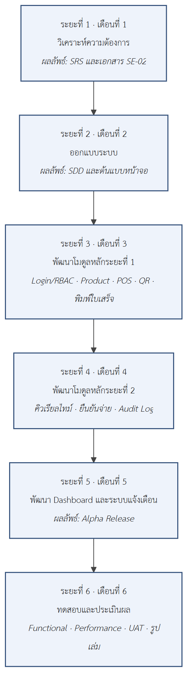

**รูปที่ 3.1** กระบวนการดำเนินงานโครงงาน

จากรูปที่ 3.1 กระบวนการดำเนินงานถูกจัดเรียงแบบต่อเนื่องโดยผลลัพธ์ของแต่ละระยะเป็นข้อมูลนำเข้าของระยะถัดไป การแบ่งการพัฒนาโมดูลหลักออกเป็นสองระยะช่วยให้ทีมงานสามารถส่งมอบระบบต้นแบบที่ใช้งานได้บางส่วนตั้งแต่เดือนที่ 3 และนำไปทดลองใช้ที่หน้าร้านเพื่อรับข้อเสนอแนะกลับมาปรับปรุงก่อนพัฒนาส่วนคลังสินค้าในเดือนที่ 4 ซึ่งช่วยลดความเสี่ยงจากการพบข้อผิดพลาดเชิงออกแบบในช่วงท้ายของโครงงาน

### 3.1.1 ระยะวิเคราะห์ความต้องการ

เป็นการสำรวจปัญหาหน้างานจริง (Pain Points) ที่ร้านวัสดุก่อสร้างอำพรคอนกรีต สัมภาษณ์พนักงานขาย พนักงานคลังสินค้า และผู้จัดการ เพื่อทำความเข้าใจกระบวนการทำงานเดิมที่อาศัยเอกสารกระดาษ จากนั้นนำข้อมูลที่ได้มากำหนดความต้องการทางธุรกิจ (BR) ความต้องการเชิงหน้าที่ (FR) และความต้องการเชิงคุณภาพ (NFR) พร้อมจัดลำดับความสำคัญของความต้องการด้วยวิธี MoSCoW และตกลงขอบเขตการทำงานร่วมกับสถานประกอบการ ผลลัพธ์ของระยะนี้คือเอกสารข้อกำหนดความต้องการของซอฟต์แวร์ (SRS) และเอกสาร SE-02

### 3.1.2 ระยะออกแบบระบบ

เป็นการแปลงความต้องการที่รวบรวมไว้ให้เป็นแบบที่พัฒนาได้จริง ประกอบด้วยการออกแบบสถาปัตยกรรมระบบด้วย C4 Model ทั้งระดับบริบท ระดับคอนเทนเนอร์ และระดับส่วนประกอบ การออกแบบกรณีการใช้งาน (Use Case) การออกแบบโครงสร้างฐานข้อมูลเชิงสัมพันธ์ (ERD) การออกแบบแผนภาพลำดับและแผนภาพกิจกรรมสำหรับกระบวนการหลัก และการออกแบบต้นแบบส่วนติดต่อผู้ใช้ทั้งสามบทบาท ผลลัพธ์ของระยะนี้คือเอกสารการออกแบบระบบและต้นแบบหน้าจอ

### 3.1.3 ระยะพัฒนาโมดูลหลักระยะที่ 1

เป็นการพัฒนาส่วนที่เกี่ยวข้องกับหน้าร้าน เริ่มจากระบบลงชื่อเข้าใช้งานและการควบคุมสิทธิ์ตามบทบาท การจัดการข้อมูลสินค้าหลักและการตั้งค่าจุดสั่งซื้อเพิ่ม ระบบสร้างคำสั่งซื้อและคำนวณยอดรวมอัตโนมัติ การสร้างรหัส QR พร้อมเพย์ตามยอดชำระ และการเชื่อมต่อเครื่องพิมพ์ใบเสร็จความร้อนผ่านโพรโทคอล ESC/POS

### 3.1.4 ระยะพัฒนาโมดูลหลักระยะที่ 2

เป็นการพัฒนาส่วนที่เกี่ยวข้องกับคลังสินค้า ได้แก่ ระบบผลักข้อมูลคำสั่งซื้อไปยังหน้าจอคิวงานแบบเรียลไทม์ หน้าจอคิวรอจ่ายสินค้าที่อัปเดตอัตโนมัติ ฟังก์ชันเลือกคำสั่งซื้อและยืนยันจ่ายสินค้าพร้อมตัดสต็อกแบบอะตอมมิก กลไกป้องกันการยืนยันจ่ายซ้ำ และระบบบันทึกประวัติการทำรายการ

### 3.1.5 ระยะพัฒนาแดชบอร์ดและระบบแจ้งเตือน

เป็นการพัฒนาส่วนสนับสนุนการตัดสินใจของผู้จัดการ ประกอบด้วยแดชบอร์ดปฏิบัติการที่รวบรวมสถิติยอดขาย ระดับสต็อก และสถานะคิวงานแบบเรียลไทม์ ระบบตรวจสอบจุดสั่งซื้อเพิ่มโดยอัตโนมัติ และระบบแจ้งเตือนภายในแอปพลิเคชันเมื่อสต็อกต่ำกว่าเกณฑ์หรือมีคิวงานค้างนานผิดปกติ ผลลัพธ์ของระยะนี้คือระบบเวอร์ชันสมบูรณ์ (Alpha Release)

### 3.1.6 ระยะทดสอบและประเมินผล

เป็นการตรวจสอบระบบตามแผนการทดสอบในหัวข้อ 3.9 ครอบคลุมการทดสอบความถูกต้องเชิงฟังก์ชัน การทดสอบประสิทธิภาพ การทดสอบความสอดคล้องของข้อมูลสต็อก และการทดสอบการยอมรับจากผู้ใช้งานจริงในสถานประกอบการ พร้อมทั้งรวบรวมผลการทดสอบและจัดทำรูปเล่มโครงงานฉบับสมบูรณ์

---

## 3.2 ภาพรวมสถาปัตยกรรมของระบบ

ระบบ SOML ออกแบบตามสถาปัตยกรรมซอฟต์แวร์แบบ 3 ชั้น (3-Tier Architecture) ตามหลักการแยกส่วนประกอบ (Separation of Concerns) ที่อธิบายไว้ในหัวข้อ 2.1.1 โดยแบ่งความรับผิดชอบออกเป็นชั้นการนำเสนอข้อมูลซึ่งพัฒนาด้วย React.js ในรูปแบบ Responsive Web Application ชั้นตรรกะทางธุรกิจซึ่งพัฒนาด้วย Node.js ร่วมกับ Express.js ทำหน้าที่ควบคุมสิทธิ์ ประมวลผลคำสั่งซื้อ ตัดสต็อก และผลักข้อมูลแบบเรียลไทม์ และชั้นข้อมูลซึ่งใช้ฐานข้อมูลเชิงสัมพันธ์ MySQL 8.0 บนกลไกจัดเก็บ InnoDB เพื่อรองรับคุณสมบัติ ACID

การอธิบายสถาปัตยกรรมในบทนี้ใช้ C4 Model ของ Simon Brown ตามที่กล่าวไว้ในหัวข้อ 2.1.2 โดยเริ่มจากระดับบริบทของระบบ (Context) ซึ่งแสดงความสัมพันธ์ระหว่างระบบกับผู้ใช้งานและระบบภายนอก ดังรายละเอียดในตารางที่ 3.1

**ตารางที่ 3.1** องค์ประกอบในแผนภาพบริบทของระบบ

| องค์ประกอบ | ประเภท | หน้าที่ |
|---|---|---|
| พนักงานขาย (Sales Staff) | Person | บันทึกคำสั่งซื้อ แสดง QR พร้อมเพย์ ยืนยันรับชำระเงิน และสั่งพิมพ์ใบเสร็จ |
| พนักงานคลังสินค้า (Warehouse Worker) | Person | ดูคิวรอจ่ายสินค้าแบบเรียลไทม์ ยืนยันจ่ายสินค้า และตัดสต็อก |
| ผู้จัดการ (Manager) | Person | ดูแดชบอร์ด จัดการข้อมูลสินค้าและผู้ใช้งาน ตรวจสอบประวัติการทำรายการ และรับการแจ้งเตือน |
| ระบบ SOML | Software System | ระบบหลักที่พัฒนาขึ้นในโครงงานนี้ เป็นเว็บแอปพลิเคชันแบบ 3 ชั้น |
| PromptPay QR Library | External System | ไลบรารีสร้างรหัส QR ตามมาตรฐาน EMVCo Merchant-Presented Mode |
| เครื่องพิมพ์ใบเสร็จความร้อน | External Hardware | อุปกรณ์ต่อพ่วงที่รับคำสั่ง ESC/POS จากระบบเพื่อพิมพ์ใบเสร็จกระดาษ |

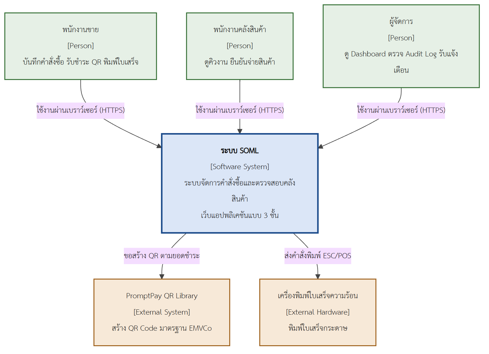

**รูปที่ 3.2** แผนภาพบริบทของระบบ (C1: System Context Diagram)

จากรูปที่ 3.2 ผู้ใช้งานทั้งสามบทบาทเข้าถึงระบบผ่านเว็บเบราว์เซอร์ด้วยโพรโทคอล HTTPS เพียงช่องทางเดียว ทำให้ไม่ต้องติดตั้งโปรแกรมเพิ่มเติมบนเครื่องผู้ใช้ ระบบเชื่อมต่อกับองค์ประกอบภายนอกเพียงสองส่วนคือไลบรารีสร้างรหัส QR พร้อมเพย์และเครื่องพิมพ์ใบเสร็จความร้อน จะเห็นได้ว่าระบบไม่มีการเชื่อมต่อกับ Payment Gateway หรือ API ของธนาคารเพื่อตรวจสอบสถานะการชำระเงินอัตโนมัติ ซึ่งสอดคล้องกับขอบเขตที่กำหนดไว้ในหัวข้อ 1.3.6 โดยพนักงานขายเป็นผู้ตรวจสอบและยืนยันการรับเงินด้วยตนเองจากการแจ้งเตือนของแอปพลิเคชันธนาคาร

---

## 3.3 การออกแบบระดับคอนเทนเนอร์

เมื่อขยายรายละเอียดจากระดับบริบทลงมาอีกหนึ่งชั้น จะเห็นองค์ประกอบที่สามารถติดตั้งและทำงานได้อย่างอิสระภายในขอบเขตของระบบ SOML ซึ่งเรียกว่าคอนเทนเนอร์ (Container) ตามนิยามของ C4 Model โดยแต่ละคอนเทนเนอร์และเทคโนโลยีที่เลือกใช้แสดงในตารางที่ 3.2

**ตารางที่ 3.2** คอนเทนเนอร์และเทคโนโลยีที่ใช้ในระบบ

| คอนเทนเนอร์ | เทคโนโลยี | หน้าที่ |
|---|---|---|
| Web Application (Frontend) | React.js | ส่วนติดต่อผู้ใช้แบบ Responsive Design ครอบคลุมหน้าจอขายหน้าร้าน หน้าจอคิวคลังสินค้า และแดชบอร์ดปฏิบัติการ |
| Backend API | Node.js + Express.js | ประมวลผลตรรกะทางธุรกิจ ควบคุมสิทธิ์ตามบทบาท ตัดสต็อกแบบอะตอมมิก และผลักข้อมูลแบบเรียลไทม์ |
| Database | MySQL 8.0 (InnoDB) | จัดเก็บข้อมูลผู้ใช้งาน สินค้า คำสั่งซื้อ การเคลื่อนไหวสต็อก การแจ้งเตือน และประวัติการทำรายการ |
| Receipt Print Service | Node.js + ESC/POS | รับคำสั่งพิมพ์จาก Backend API และส่งต่อไปยังเครื่องพิมพ์ใบเสร็จความร้อน |
| PromptPay QR Module | ไลบรารีสร้าง QR Code | สร้างรหัส QR ตามมาตรฐาน EMVCo ให้ตรงกับยอดชำระของแต่ละคำสั่งซื้อ |

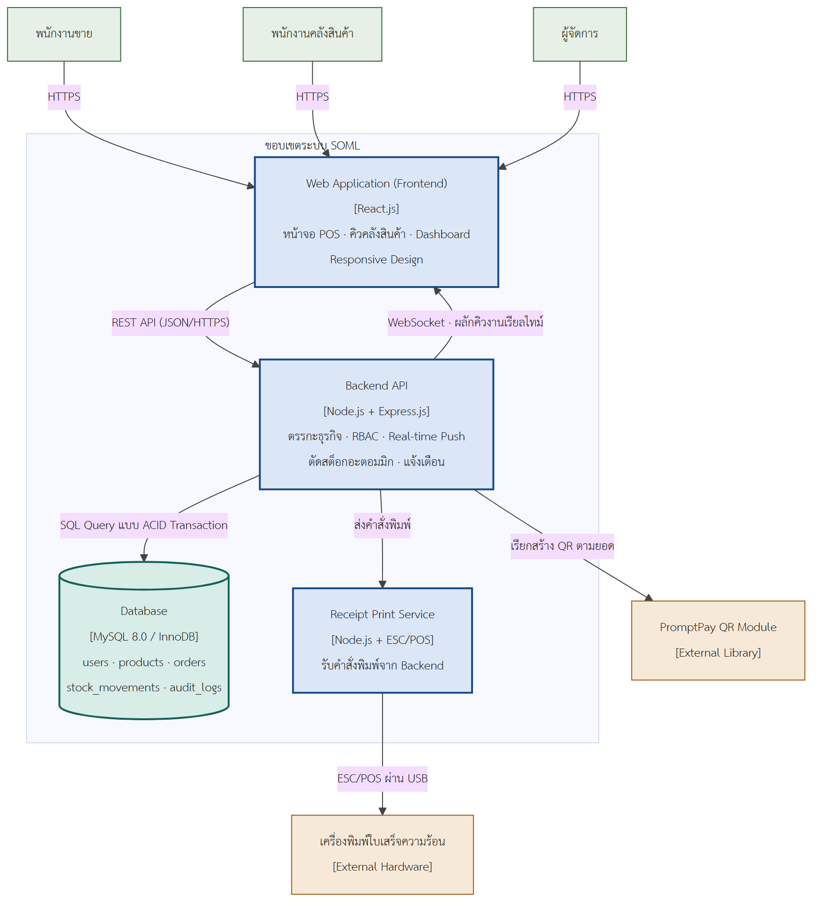

**รูปที่ 3.3** แผนภาพคอนเทนเนอร์ของระบบ (C2: Container Diagram)

จากรูปที่ 3.3 การสื่อสารระหว่างส่วนหน้าเว็บกับระบบหลังบ้านใช้สองช่องทางที่ทำงานคู่กัน ช่องทางแรกคือ REST API สำหรับคำขอที่ผู้ใช้งานเป็นฝ่ายเริ่ม เช่น การสร้างคำสั่งซื้อหรือการยืนยันจ่ายสินค้า และช่องทางที่สองคือ WebSocket สำหรับให้ระบบหลังบ้านเป็นฝ่ายผลักข้อมูลไปยังหน้าจอคิวคลังสินค้าเมื่อมีคำสั่งซื้อใหม่เข้ามา ตามแนวคิดการสื่อสารแบบขับเคลื่อนด้วยเหตุการณ์ในหัวข้อ 2.1.5 การออกแบบเช่นนี้ทำให้พนักงานคลังสินค้าไม่จำเป็นต้องกดรีเฟรชหน้าจอ และทำให้ระบบตอบสนองได้ภายในเวลาที่กำหนดไว้ใน NFR-02 คือไม่เกิน 3 วินาที

นอกจากนี้ การแยกบริการพิมพ์ใบเสร็จออกเป็นคอนเทนเนอร์ต่างหากช่วยให้ระบบหลังบ้านไม่ถูกบล็อกการทำงานขณะรอผลการพิมพ์จากอุปกรณ์ต่อพ่วง และทำให้สามารถเปลี่ยนรุ่นหรือยี่ห้อเครื่องพิมพ์ในอนาคตได้โดยแก้ไขเฉพาะบริการนี้เพียงส่วนเดียว

---

## 3.4 การออกแบบส่วนประกอบภายในระบบหลังบ้าน

ภายในคอนเทนเนอร์ Backend API ถูกแบ่งออกเป็นส่วนประกอบย่อยตามความรับผิดชอบ เพื่อให้แต่ละส่วนมีหน้าที่เดียวที่ชัดเจนและทดสอบได้อย่างอิสระ รายละเอียดของแต่ละส่วนประกอบแสดงในตารางที่ 3.3

**ตารางที่ 3.3** ส่วนประกอบภายในระบบหลังบ้าน

| ส่วนประกอบ | หน้าที่ | ความต้องการที่รองรับ |
|---|---|---|
| Auth Controller | ตรวจสอบการเข้าสู่ระบบ ออกโทเคน JWT และตรวจสอบบทบาทของผู้ใช้งานก่อนเข้าถึงทรัพยากร | FR-01 |
| Product Controller | เพิ่ม แก้ไข ลบ และค้นหาข้อมูลสินค้า รวมถึงการตั้งค่าจุดสั่งซื้อเพิ่ม | FR-02 |
| Order Controller | สร้างเลขที่คำสั่งซื้อไม่ซ้ำ คำนวณยอดรวม บันทึกคำสั่งซื้อ และเรียกใช้โมดูลสร้าง QR | FR-03 |
| Queue Manager | ผลักเหตุการณ์คำสั่งซื้อใหม่ผ่าน WebSocket ไปยังหน้าจอคิวคลังสินค้า | FR-04 |
| Dispatch Controller | รับคำขอยืนยันจ่ายสินค้าจากหน้าจอคลังสินค้า และควบคุมลำดับการทำงานของธุรกรรม | FR-05 |
| Stock Deduction Service | ดำเนินธุรกรรมตัดสต็อกแบบอะตอมมิกและตรวจสอบเงื่อนไขป้องกันการจ่ายซ้ำ | FR-06 |
| Alert Engine | ตรวจสอบระดับสต็อกเทียบจุดสั่งซื้อเพิ่มและเวลารอในคิว แล้วสร้างการแจ้งเตือน | FR-08 |
| Dashboard Aggregator | รวบรวมสถิติยอดขาย ระดับสต็อก และสถานะคิวงาน เพื่อแสดงบนแดชบอร์ด | FR-07 |
| Audit Log Service | บันทึกทุกเหตุการณ์สำคัญลงตาราง audit_logs และให้บริการค้นหาย้อนหลัง | FR-09 |
| Print Service Client | ส่งคำสั่งพิมพ์ใบเสร็จไปยัง Receipt Print Service | FR-03 |

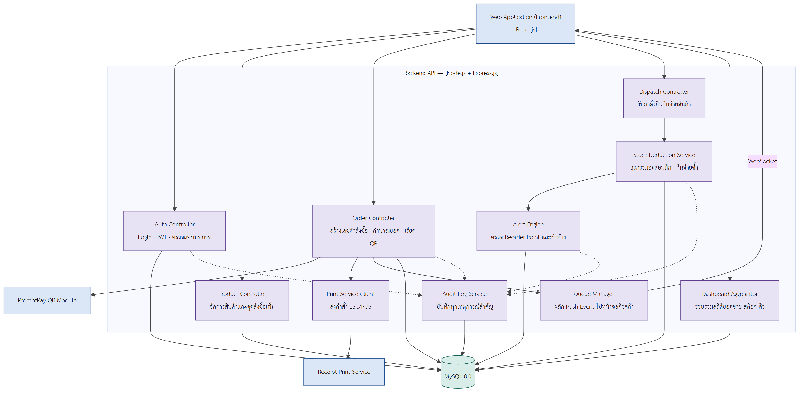

**รูปที่ 3.4** แผนภาพส่วนประกอบภายในระบบหลังบ้าน (C3: Component Diagram)

จากรูปที่ 3.4 เส้นทึบแสดงการเรียกใช้งานตามลำดับการทำงานปกติ ส่วนเส้นประแสดงการบันทึกประวัติการทำรายการซึ่งส่วนประกอบหลักทุกตัวจะเรียกใช้ Audit Log Service เมื่อดำเนินการสำเร็จ การแยก Stock Deduction Service ออกจาก Dispatch Controller เป็นการออกแบบที่จงใจ เพื่อให้ตรรกะของธุรกรรมตัดสต็อกซึ่งเป็นจุดที่อ่อนไหวที่สุดของระบบถูกรวมศูนย์ไว้ที่เดียว ทำให้สามารถเขียนชุดทดสอบเฉพาะสำหรับกรณีการเข้าถึงพร้อมกันได้โดยไม่ต้องจำลองคำขอ HTTP ทั้งเส้นทาง

---

## 3.5 การออกแบบฐานข้อมูล

### 3.5.1 แผนภาพความสัมพันธ์ระหว่างข้อมูล

ฐานข้อมูลของระบบ SOML ออกแบบเป็นฐานข้อมูลเชิงสัมพันธ์บน MySQL 8.0 ประกอบด้วย 7 ตาราง ที่ครอบคลุมความต้องการเชิงหน้าที่ทั้ง 9 ข้อ โดยใช้กลไกจัดเก็บ InnoDB เพื่อให้รองรับคุณสมบัติ ACID และการล็อกระดับแถวตามที่กำหนดไว้ใน NFR-04 ความสัมพันธ์ระหว่างตารางทั้งหมดแสดงในรูปที่ 3.5

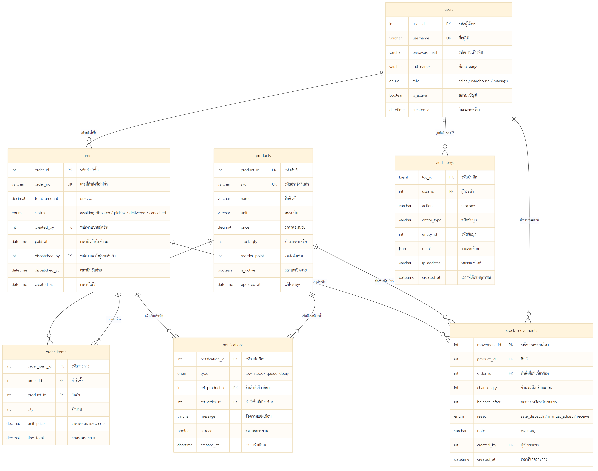

**รูปที่ 3.5** แผนภาพความสัมพันธ์ระหว่างข้อมูลของระบบ SOML (Entity Relationship Diagram)

จากรูปที่ 3.5 ตาราง `orders` เป็นศูนย์กลางของฐานข้อมูล โดยเชื่อมกับ `users` สองความสัมพันธ์ คือความสัมพันธ์กับพนักงานขายผู้สร้างคำสั่งซื้อผ่านคีย์นอก `created_by` และความสัมพันธ์กับพนักงานคลังผู้ยืนยันจ่ายสินค้าผ่านคีย์นอก `dispatched_by` ซึ่งเป็นค่าว่างได้จนกว่าจะมีการจ่ายสินค้าจริง การแยกสองความสัมพันธ์นี้ทำให้ระบบสามารถตรวจสอบย้อนหลังได้ว่าใครเป็นผู้ขายและใครเป็นผู้จ่ายสินค้าสำหรับทุกคำสั่งซื้อ

ตาราง `stock_movements` เป็นตารางที่เพิ่มเข้ามาเพื่อรองรับคุณสมบัติการตรวจสอบย้อนหลังตามที่ระบุไว้ในประโยชน์ที่คาดว่าจะได้รับข้อ 1.5.3 โดยบันทึกการเปลี่ยนแปลงของสต็อกทุกครั้งพร้อมยอดคงเหลือหลังรายการ ทำให้สามารถสร้างยอดสต็อก ณ เวลาใดก็ได้ขึ้นมาใหม่จากประวัติการเคลื่อนไหว และใช้กระทบยอดกับจำนวนสินค้าจริงในคลังได้ ซึ่งเป็นหลักฐานสนับสนุนการวัดค่า Stock Mismatch Rate ในหัวข้อ 3.9

### 3.5.2 พจนานุกรมข้อมูล

**ตารางที่ 3.4** พจนานุกรมข้อมูลของตาราง `users`

| ชื่อฟิลด์ | ชนิดข้อมูล | คีย์ | คำอธิบาย |
|---|---|:---:|---|
| user_id | INT UNSIGNED | PK | รหัสผู้ใช้งาน เพิ่มค่าอัตโนมัติ |
| username | VARCHAR(50) | UK | ชื่อผู้ใช้สำหรับเข้าสู่ระบบ ห้ามซ้ำ |
| password_hash | VARCHAR(255) | | รหัสผ่านที่ผ่านการเข้ารหัสแบบ bcrypt |
| full_name | VARCHAR(100) | | ชื่อ-นามสกุลของผู้ใช้งาน |
| role | ENUM | | บทบาท: sales / warehouse / manager |
| is_active | BOOLEAN | | สถานะการใช้งานบัญชี ค่าเริ่มต้นเป็นจริง |
| created_at | DATETIME | | วันเวลาที่สร้างบัญชี |

**ตารางที่ 3.5** พจนานุกรมข้อมูลของตาราง `products`

| ชื่อฟิลด์ | ชนิดข้อมูล | คีย์ | คำอธิบาย |
|---|---|:---:|---|
| product_id | INT UNSIGNED | PK | รหัสสินค้า เพิ่มค่าอัตโนมัติ |
| sku | VARCHAR(30) | UK | รหัสอ้างอิงสินค้าของร้าน ห้ามซ้ำ |
| name | VARCHAR(150) | | ชื่อสินค้า |
| unit | VARCHAR(20) | | หน่วยนับ เช่น ถุง เส้น ก้อน คิว |
| price | DECIMAL(10,2) | | ราคาขายต่อหน่วย หน่วยเป็นบาท |
| stock_qty | INT | | จำนวนคงเหลือในคลัง ต้องไม่ติดลบ |
| reorder_point | INT | | จุดสั่งซื้อเพิ่ม (Reorder Point) |
| is_active | BOOLEAN | | สถานะการเปิดขายของสินค้า |
| updated_at | DATETIME | | วันเวลาที่แก้ไขล่าสุด |

**ตารางที่ 3.6** พจนานุกรมข้อมูลของตาราง `orders`

| ชื่อฟิลด์ | ชนิดข้อมูล | คีย์ | คำอธิบาย |
|---|---|:---:|---|
| order_id | INT UNSIGNED | PK | รหัสคำสั่งซื้อ เพิ่มค่าอัตโนมัติ |
| order_no | VARCHAR(20) | UK | เลขที่คำสั่งซื้อไม่ซ้ำ รูปแบบ ORD-YYYYMMDD-NNNN |
| total_amount | DECIMAL(12,2) | | ยอดรวมที่ต้องชำระ |
| status | ENUM | | สถานะ: awaiting_dispatch / picking / delivered / cancelled |
| created_by | INT UNSIGNED | FK | พนักงานขายผู้สร้างคำสั่งซื้อ อ้างอิง users |
| paid_at | DATETIME | | วันเวลาที่ยืนยันรับชำระเงิน |
| dispatched_by | INT UNSIGNED | FK | พนักงานคลังผู้ยืนยันจ่ายสินค้า อ้างอิง users เป็นค่าว่างได้ |
| dispatched_at | DATETIME | | วันเวลาที่ยืนยันจ่ายสินค้า เป็นค่าว่างได้ |
| created_at | DATETIME | | วันเวลาที่บันทึกคำสั่งซื้อ |

**ตารางที่ 3.7** พจนานุกรมข้อมูลของตาราง `order_items`

| ชื่อฟิลด์ | ชนิดข้อมูล | คีย์ | คำอธิบาย |
|---|---|:---:|---|
| order_item_id | INT UNSIGNED | PK | รหัสรายการสินค้า เพิ่มค่าอัตโนมัติ |
| order_id | INT UNSIGNED | FK | คำสั่งซื้อที่รายการนี้สังกัด อ้างอิง orders |
| product_id | INT UNSIGNED | FK | สินค้าที่ถูกสั่งซื้อ อ้างอิง products |
| qty | INT | | จำนวนที่สั่งซื้อ ต้องมากกว่าศูนย์ |
| unit_price | DECIMAL(10,2) | | ราคาต่อหน่วย ณ เวลาที่ขาย |
| line_total | DECIMAL(12,2) | | ยอดรวมของรายการ |

**ตารางที่ 3.8** พจนานุกรมข้อมูลของตาราง `stock_movements`

| ชื่อฟิลด์ | ชนิดข้อมูล | คีย์ | คำอธิบาย |
|---|---|:---:|---|
| movement_id | INT UNSIGNED | PK | รหัสรายการเคลื่อนไหว เพิ่มค่าอัตโนมัติ |
| product_id | INT UNSIGNED | FK | สินค้าที่มีการเคลื่อนไหว อ้างอิง products |
| order_id | INT UNSIGNED | FK | คำสั่งซื้อที่ทำให้เกิดการตัดสต็อก เป็นค่าว่างได้ |
| change_qty | INT | | จำนวนที่เปลี่ยนแปลง ค่าลบหมายถึงตัดออกจากคลัง |
| balance_after | INT | | ยอดคงเหลือหลังการเคลื่อนไหว |
| reason | ENUM | | สาเหตุ: sale_dispatch / manual_adjust / receive |
| note | VARCHAR(255) | | หมายเหตุประกอบการปรับปรุงสต็อก |
| created_by | INT UNSIGNED | FK | ผู้ทำรายการ อ้างอิง users |
| created_at | DATETIME | | วันเวลาที่เกิดรายการ |

**ตารางที่ 3.9** พจนานุกรมข้อมูลของตาราง `notifications`

| ชื่อฟิลด์ | ชนิดข้อมูล | คีย์ | คำอธิบาย |
|---|---|:---:|---|
| notification_id | INT UNSIGNED | PK | รหัสการแจ้งเตือน เพิ่มค่าอัตโนมัติ |
| type | ENUM | | ประเภท: low_stock / queue_delay |
| ref_product_id | INT UNSIGNED | FK | สินค้าที่เกี่ยวข้อง กรณีแจ้งเตือนสต็อกต่ำ |
| ref_order_id | INT UNSIGNED | FK | คำสั่งซื้อที่เกี่ยวข้อง กรณีแจ้งเตือนคิวค้าง |
| message | VARCHAR(255) | | ข้อความแจ้งเตือนที่แสดงต่อผู้จัดการ |
| is_read | BOOLEAN | | สถานะการอ่าน ค่าเริ่มต้นเป็นเท็จ |
| created_at | DATETIME | | วันเวลาที่แจ้งเตือน |

**ตารางที่ 3.10** พจนานุกรมข้อมูลของตาราง `audit_logs`

| ชื่อฟิลด์ | ชนิดข้อมูล | คีย์ | คำอธิบาย |
|---|---|:---:|---|
| log_id | BIGINT UNSIGNED | PK | รหัสบันทึกประวัติ เพิ่มค่าอัตโนมัติ |
| user_id | INT UNSIGNED | FK | ผู้กระทำรายการ เป็นค่าว่างได้หากระบบทำเอง |
| action | VARCHAR(50) | | การกระทำ เช่น LOGIN, CREATE_ORDER, CONFIRM_DISPATCH |
| entity_type | VARCHAR(30) | | ชนิดข้อมูลที่ถูกกระทำ เช่น order, product |
| entity_id | INT UNSIGNED | | รหัสของข้อมูลที่ถูกกระทำ |
| detail | JSON | | รายละเอียดเพิ่มเติมในรูปแบบ JSON |
| ip_address | VARCHAR(45) | | หมายเลขไอพีของผู้ใช้งาน |
| created_at | DATETIME | | วันเวลาที่เกิดเหตุการณ์ |

### 3.5.3 ธุรกรรมการตัดสต็อกแบบอะตอมมิกและการป้องกันการจ่ายซ้ำ

จุดที่อ่อนไหวที่สุดของระบบคือขั้นตอนการยืนยันจ่ายสินค้า เนื่องจากอาจเกิดกรณีที่พนักงานคลังสินค้าสองคนกดยืนยันจ่ายคำสั่งซื้อเดียวกันในเวลาไล่เลี่ยกัน หรือกรณีที่ลูกค้านำใบเสร็จเดิมกลับมารับสินค้าซ้ำ ซึ่งเป็นปัญหาที่ระบุไว้ตั้งแต่หัวข้อ 1.1 ระบบจึงออกแบบให้การตัดสต็อกทำงานภายในธุรกรรมเดียวที่มีคุณสมบัติอะตอมมิก โดยใช้เงื่อนไขสถานะของคำสั่งซื้อทำหน้าที่เป็นกลไกล็อกในตัว ดังนี้

```sql
START TRANSACTION;

  UPDATE orders
     SET status = 'delivered', dispatched_by = :user_id, dispatched_at = NOW()
   WHERE order_id = :order_id AND status = 'awaiting_dispatch';
  -- ตรวจสอบจำนวนแถวที่ถูกแก้ไข ถ้าเท่ากับ 0 แสดงว่าคำสั่งซื้อถูกจ่ายไปแล้ว

  SELECT product_id, qty FROM order_items WHERE order_id = :order_id FOR UPDATE;

  UPDATE products
     SET stock_qty = stock_qty - :qty
   WHERE product_id = :product_id AND stock_qty >= :qty;
  -- ตรวจสอบจำนวนแถวที่ถูกแก้ไข ถ้าเท่ากับ 0 แสดงว่าสต็อกไม่เพียงพอ

  INSERT INTO stock_movements
    (product_id, order_id, change_qty, balance_after, reason, created_by)
  VALUES (:product_id, :order_id, -:qty, :balance_after, 'sale_dispatch', :user_id);

  INSERT INTO audit_logs (user_id, action, entity_type, entity_id, detail)
  VALUES (:user_id, 'CONFIRM_DISPATCH', 'order', :order_id, :detail_json);

COMMIT;
```

หลักการสำคัญอยู่ที่เงื่อนไข `AND status = 'awaiting_dispatch'` ในคำสั่ง `UPDATE` แรก ซึ่งทำให้การเปลี่ยนสถานะสำเร็จได้เพียงครั้งเดียวเท่านั้น หากมีคำขอที่สองเข้ามาหลังจากคำขอแรกทำสำเร็จไปแล้ว จำนวนแถวที่ถูกแก้ไขจะเป็นศูนย์ ระบบจะยกเลิกธุรกรรมทั้งหมดด้วยคำสั่ง `ROLLBACK` และแจ้งพนักงานว่าคำสั่งซื้อนี้ถูกจ่ายสินค้าไปแล้ว วิธีการนี้เรียกว่าการล็อกแบบมองโลกในแง่ดี (Optimistic Locking) ผ่านเงื่อนไขสถานะ ซึ่งมีข้อดีคือไม่ต้องถือล็อกไว้ตั้งแต่ตอนที่พนักงานเปิดดูรายการสินค้า จึงไม่กีดขวางการทำงานของพนักงานคนอื่นในระหว่างนั้น

การใช้ `SELECT ... FOR UPDATE` กับตาราง `order_items` ทำให้แถวของสินค้าที่เกี่ยวข้องถูกล็อกไว้จนกว่าธุรกรรมจะสิ้นสุด ป้องกันภาวะ Race Condition เมื่อมีคำสั่งซื้อหลายรายการที่มีสินค้าชนิดเดียวกันถูกยืนยันจ่ายพร้อมกัน ส่วนเงื่อนไข `AND stock_qty >= :qty` ในการหักสต็อกเป็นการป้องกันชั้นสุดท้ายไม่ให้ยอดคงเหลือติดลบ การออกแบบทั้งหมดนี้สอดคล้องกับสมมติฐานที่ตั้งไว้ในหัวข้อ 1.4.2 และ 1.4.3 ของบทที่ 1

เมื่อธุรกรรมสำเร็จแล้ว ระบบจะเรียก Alert Engine เพื่อตรวจสอบว่ายอดคงเหลือของสินค้าที่เพิ่งถูกตัดต่ำกว่าจุดสั่งซื้อเพิ่มหรือไม่ หากต่ำกว่าจะบันทึกการแจ้งเตือนลงตาราง `notifications` การแยกขั้นตอนนี้ออกมาทำนอกธุรกรรมหลักเป็นการจงใจ เพื่อไม่ให้ความล่าช้าของการแจ้งเตือนไปยืดเวลาการถือล็อกฐานข้อมูล

---

## 3.6 การออกแบบกรณีการใช้งาน

ระบบ SOML ประกอบด้วยกรณีการใช้งานทั้งสิ้น 11 กรณี ครอบคลุมการทำงานของผู้ใช้งานทั้งสามบทบาทและการทำงานอัตโนมัติของระบบ ดังสรุปในตารางที่ 3.11

**ตารางที่ 3.11** สรุปกรณีการใช้งานของระบบ

| รหัส | ชื่อกรณีการใช้งาน | ผู้กระทำหลัก | ความต้องการที่รองรับ |
|:---:|---|---|:---:|
| UC-01 | เข้าสู่ระบบและควบคุมสิทธิ์ตามบทบาท | ทุกบทบาท | FR-01 |
| UC-02 | จัดการข้อมูลสินค้าและจุดสั่งซื้อเพิ่ม | ผู้จัดการ | FR-02 |
| UC-03 | สร้างคำสั่งซื้อและออกใบเสร็จ | พนักงานขาย | FR-03 |
| UC-04 | สร้างเลขที่คำสั่งซื้อไม่ซ้ำอัตโนมัติ | ระบบอัตโนมัติ | FR-03 |
| UC-05 | ดูคิวรอจ่ายสินค้าแบบเรียลไทม์ | พนักงานคลังสินค้า | FR-04 |
| UC-06 | ปรับสถานะการจัดของในคิวงาน | พนักงานคลังสินค้า | FR-04 |
| UC-07 | ยืนยันจ่ายสินค้าและตัดสต็อก | พนักงานคลังสินค้า | FR-05, FR-06 |
| UC-08 | แสดงแดชบอร์ดปฏิบัติการ | ผู้จัดการ, พนักงานคลังสินค้า | FR-07 |
| UC-09 | แสดงแดชบอร์ดระดับบริหาร | ผู้จัดการ | FR-07 |
| UC-10 | ค้นหาและดูประวัติการทำรายการ | ผู้จัดการ | FR-09 |
| UC-11 | รับการแจ้งเตือนภายในแอปพลิเคชัน | ผู้จัดการ, ระบบอัตโนมัติ | FR-08 |

### 3.6.1 แผนภาพกรณีการใช้งาน

เนื่องจากกรณีการใช้งานทั้ง 11 กรณีมีจำนวนมากเกินกว่าจะแสดงในแผนภาพเดียวได้อย่างชัดเจน จึงแบ่งการนำเสนอออกเป็น 4 กลุ่มตามลักษณะงานและบทบาทของผู้ใช้งาน

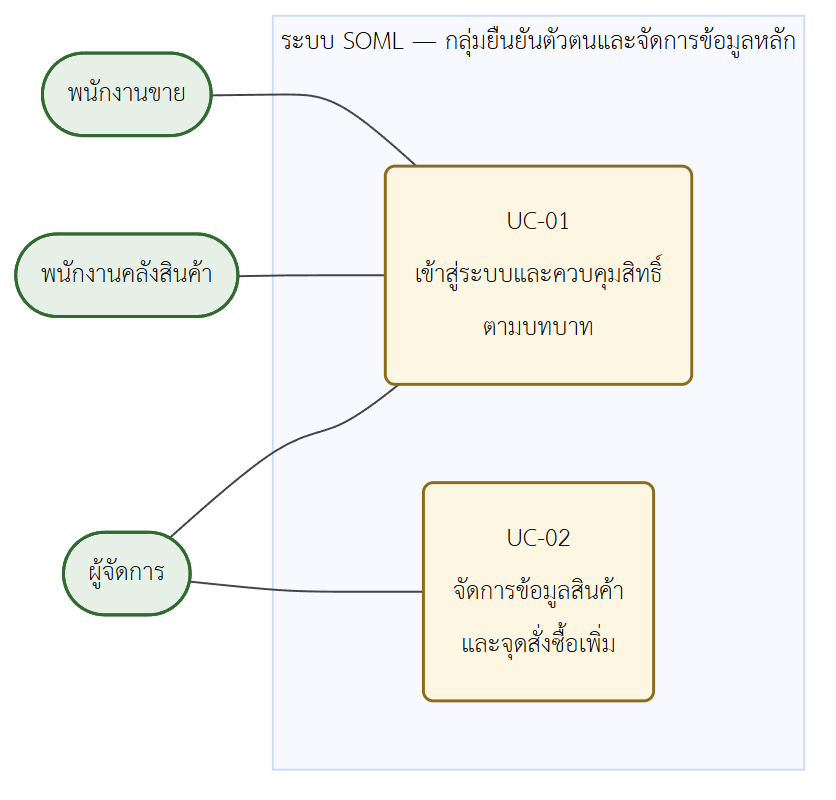

**รูปที่ 3.6** แผนภาพกรณีการใช้งานกลุ่มยืนยันตัวตนและจัดการข้อมูลหลัก

จากรูปที่ 3.6 กรณีการใช้งาน UC-01 เป็นจุดเริ่มต้นของผู้ใช้งานทุกบทบาท เนื่องจากระบบกำหนดให้ต้องผ่านการยืนยันตัวตนก่อนจึงจะเข้าถึงฟังก์ชันอื่นได้ ส่วน UC-02 จำกัดสิทธิ์ให้เฉพาะผู้จัดการเท่านั้น เนื่องจากการแก้ไขราคาและจุดสั่งซื้อเพิ่มส่งผลโดยตรงต่อยอดขายและการวางแผนสั่งซื้อสินค้า

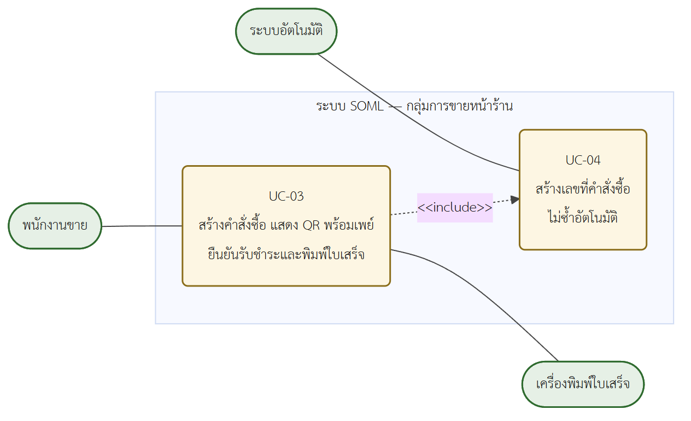

**รูปที่ 3.7** แผนภาพกรณีการใช้งานกลุ่มการขายหน้าร้าน

จากรูปที่ 3.7 กรณีการใช้งาน UC-03 มีความสัมพันธ์แบบ include กับ UC-04 หมายความว่าทุกครั้งที่พนักงานขายสร้างคำสั่งซื้อ ระบบจะต้องเรียกกระบวนการสร้างเลขที่คำสั่งซื้อไม่ซ้ำโดยอัตโนมัติเสมอ ผู้ใช้งานไม่สามารถข้ามขั้นตอนนี้หรือกำหนดเลขที่เองได้ ซึ่งเป็นการรับประกันว่าจะไม่มีคำสั่งซื้อสองรายการที่มีเลขที่ตรงกัน อันเป็นเงื่อนไขจำเป็นสำหรับการจับคู่ใบเสร็จกับคิวงานที่คลังสินค้า

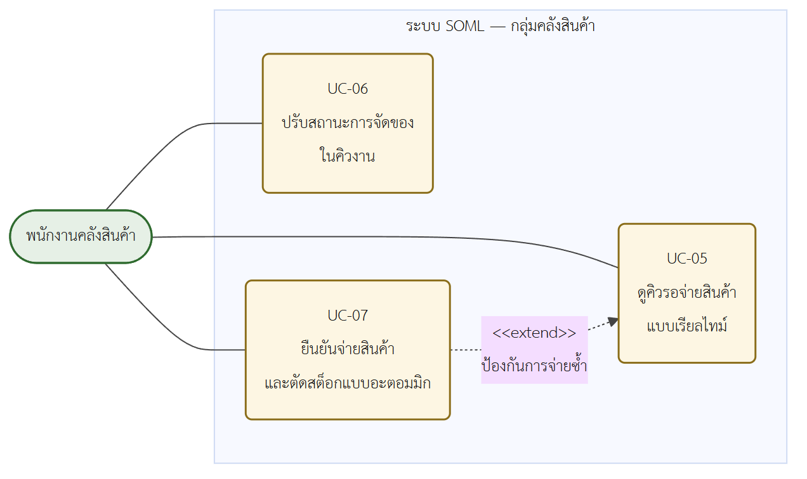

**รูปที่ 3.8** แผนภาพกรณีการใช้งานกลุ่มคลังสินค้า

จากรูปที่ 3.8 กรณีการใช้งานทั้งสามของพนักงานคลังสินค้าทำงานต่อเนื่องกันบนหน้าจอเดียว โดย UC-07 มีความสัมพันธ์แบบ extend กลับไปยัง UC-05 เนื่องจากเมื่อยืนยันจ่ายสินค้าสำเร็จ คำสั่งซื้อนั้นจะถูกลบออกจากคิวโดยอัตโนมัติและไม่ปรากฏให้เลือกได้อีก ซึ่งเป็นกลไกป้องกันการรับสินค้าซ้ำในระดับส่วนติดต่อผู้ใช้ ทำงานเสริมกับกลไกระดับฐานข้อมูลที่อธิบายไว้ในหัวข้อ 3.5.3

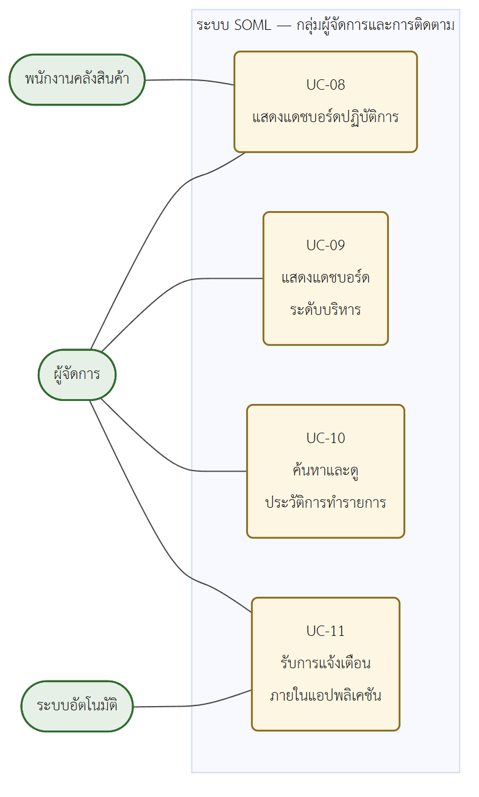

**รูปที่ 3.9** แผนภาพกรณีการใช้งานกลุ่มผู้จัดการและการติดตาม

จากรูปที่ 3.9 กรณีการใช้งาน UC-08 เป็นกรณีเดียวในกลุ่มนี้ที่พนักงานคลังสินค้าเข้าถึงได้ด้วย เนื่องจากข้อมูลจำนวนคิวคงค้างและระดับสต็อกเป็นประโยชน์ต่อการวางแผนการจัดของประจำวัน ส่วน UC-11 มีผู้กระทำสองราย คือระบบอัตโนมัติซึ่งเป็นฝ่ายสร้างการแจ้งเตือน และผู้จัดการซึ่งเป็นฝ่ายรับและอ่านการแจ้งเตือนนั้น

### 3.6.2 คำอธิบายกรณีการใช้งาน

**ตารางที่ 3.12** คำอธิบาย UC-01 เข้าสู่ระบบและควบคุมสิทธิ์ตามบทบาท

| หัวข้อ | รายละเอียด |
|---|---|
| Use Case ID | UC-01 |
| Actor(s) | พนักงานขาย, พนักงานคลังสินค้า, ผู้จัดการ |
| Description | ผู้ใช้งานเข้าสู่ระบบด้วยชื่อผู้ใช้และรหัสผ่าน ระบบตรวจสอบตัวตนแล้วกำหนดเมนูและสิทธิ์การเข้าถึงข้อมูลตามบทบาทของผู้ใช้งานรายนั้น |
| Pre-conditions | ผู้ใช้งานมีบัญชีที่ผู้จัดการสร้างไว้แล้ว และสถานะบัญชีเป็นเปิดใช้งาน |
| Post-conditions | ผู้ใช้งานเข้าสู่ระบบสำเร็จ ได้รับโทเคน JWT และเห็นเฉพาะเมนูที่ตรงกับบทบาทของตน พร้อมบันทึกเหตุการณ์ LOGIN ลงประวัติการทำรายการ |
| Main Flow | 1) ผู้ใช้งานกรอกชื่อผู้ใช้และรหัสผ่าน 2) ระบบเปรียบเทียบรหัสผ่านกับค่าที่เข้ารหัสไว้ในตาราง users 3) ระบบออกโทเคน JWT ที่ระบุบทบาทของผู้ใช้งาน 4) ระบบแสดงเมนูตามบทบาทที่ตรวจสอบได้ |
| Alternative Flows | A1: หากชื่อผู้ใช้หรือรหัสผ่านไม่ถูกต้อง ระบบแจ้งเตือนและให้กรอกใหม่ โดยไม่ระบุว่าผิดที่ส่วนใด<br>A2: หากสถานะบัญชีเป็นปิดใช้งาน ระบบปฏิเสธการเข้าใช้และแนะนำให้ติดต่อผู้จัดการ |

จากตารางที่ 3.12 จะเห็นว่าการเข้าสู่ระบบเป็นเงื่อนไขก่อนหน้าของกรณีการใช้งานอื่นทั้งหมด และการที่ระบบไม่ระบุว่าข้อผิดพลาดเกิดจากชื่อผู้ใช้หรือรหัสผ่านเป็นแนวปฏิบัติตามมาตรฐาน OWASP ASVS ที่กล่าวไว้ในหัวข้อ 2.1.6 เพื่อไม่ให้ผู้ไม่ประสงค์ดีใช้ข้อความแจ้งเตือนในการคาดเดาว่าบัญชีใดมีอยู่จริง

**ตารางที่ 3.13** คำอธิบาย UC-02 จัดการข้อมูลสินค้าและจุดสั่งซื้อเพิ่ม

| หัวข้อ | รายละเอียด |
|---|---|
| Use Case ID | UC-02 |
| Actor(s) | ผู้จัดการ |
| Description | ผู้จัดการเพิ่ม แก้ไข ค้นหา และปิดการขายข้อมูลสินค้า รวมถึงกำหนดจุดสั่งซื้อเพิ่มของสินค้าแต่ละรายการอย่างอิสระ |
| Pre-conditions | ผู้จัดการเข้าสู่ระบบสำเร็จผ่าน UC-01 แล้ว |
| Post-conditions | ข้อมูลสินค้าในตาราง products ถูกปรับปรุง และบันทึกเหตุการณ์ลงประวัติการทำรายการ |
| Main Flow | 1) ผู้จัดการเปิดหน้าจัดการข้อมูลสินค้า 2) ระบบแสดงรายการสินค้าพร้อมยอดคงเหลือและจุดสั่งซื้อเพิ่ม 3) ผู้จัดการเลือกเพิ่มสินค้าใหม่หรือแก้ไขสินค้าเดิม 4) ผู้จัดการกรอกชื่อ รหัสสินค้า หน่วยนับ ราคา และจุดสั่งซื้อเพิ่ม 5) ระบบตรวจสอบความถูกต้องแล้วบันทึกข้อมูล |
| Alternative Flows | A1: หากรหัสสินค้าซ้ำกับที่มีอยู่แล้ว ระบบแจ้งเตือนและไม่บันทึกข้อมูล<br>A2: หากสินค้ามีประวัติการขายแล้ว ระบบจะไม่อนุญาตให้ลบ แต่ให้เปลี่ยนสถานะเป็นปิดการขายแทน เพื่อรักษาความสมบูรณ์ของข้อมูลย้อนหลัง |

จากตารางที่ 3.13 ทางเลือก A2 เป็นการออกแบบที่จำเป็นต่อความถูกต้องของรายงานย้อนหลัง หากอนุญาตให้ลบสินค้าที่เคยขายไปแล้ว รายการในตาราง order_items จะสูญเสียการอ้างอิงและทำให้ไม่สามารถสรุปยอดขายในอดีตได้ครบถ้วน

**ตารางที่ 3.14** คำอธิบาย UC-03 สร้างคำสั่งซื้อและออกใบเสร็จ

| หัวข้อ | รายละเอียด |
|---|---|
| Use Case ID | UC-03 |
| Actor(s) | พนักงานขาย |
| Description | พนักงานขายบันทึกรายการสินค้าที่ลูกค้าต้องการ ระบบคำนวณยอดรวมและแสดง QR พร้อมเพย์ เมื่อพนักงานยืนยันรับชำระเงิน ระบบจะสั่งพิมพ์ใบเสร็จและผลักคำสั่งซื้อเข้าคิวคลังสินค้าทันที |
| Pre-conditions | พนักงานขายเข้าสู่ระบบสำเร็จและอยู่ที่หน้าจอขายหน้าร้าน เครื่องพิมพ์ใบเสร็จเชื่อมต่อพร้อมใช้งาน |
| Post-conditions | คำสั่งซื้อถูกบันทึกด้วยสถานะรอจ่ายสินค้า ใบเสร็จถูกพิมพ์ออกมา และคิวคลังสินค้าแสดงคำสั่งซื้อใหม่ |
| Main Flow | 1) พนักงานเลือกสินค้าและระบุจำนวน 2) ระบบคำนวณยอดรวมอัตโนมัติ 3) พนักงานกดสร้างคำสั่งซื้อ ระบบเรียก UC-04 เพื่อสร้างเลขที่คำสั่งซื้อ 4) ระบบสร้างและแสดง QR พร้อมเพย์ตามยอดชำระ 5) ลูกค้าสแกนและโอนเงินผ่านแอปพลิเคชันธนาคาร 6) พนักงานตรวจสอบการแจ้งเตือนเงินเข้าแล้วกดยืนยันรับชำระ 7) ระบบสั่งพิมพ์ใบเสร็จและผลักคำสั่งซื้อเข้าคิวคลังสินค้าแบบเรียลไทม์ |
| Alternative Flows | A1: หากลูกค้าไม่ชำระเงินภายในเวลาที่กำหนด พนักงานยกเลิกคำสั่งซื้อ สถานะเปลี่ยนเป็น cancelled<br>A2: หากเครื่องพิมพ์ใบเสร็จขัดข้อง ระบบยังคงบันทึกคำสั่งซื้อและผลักเข้าคิวตามปกติ พร้อมแจ้งเตือนให้พนักงานสั่งพิมพ์ซ้ำ |

จากตารางที่ 3.14 ทางเลือก A2 สะท้อนการออกแบบที่แยกความล้มเหลวของอุปกรณ์ต่อพ่วงออกจากความสำเร็จของธุรกรรมหลัก การที่ระบบยังผลักคำสั่งซื้อเข้าคิวได้แม้เครื่องพิมพ์ขัดข้อง ทำให้กระบวนการที่คลังสินค้าไม่หยุดชะงัก ซึ่งตรงกับวัตถุประสงค์ข้อ 1.2.2 เรื่องการลดระยะเวลารอคอยของลูกค้า

**ตารางที่ 3.15** คำอธิบาย UC-04 สร้างเลขที่คำสั่งซื้อไม่ซ้ำอัตโนมัติ

| หัวข้อ | รายละเอียด |
|---|---|
| Use Case ID | UC-04 |
| Actor(s) | ระบบอัตโนมัติ |
| Description | ระบบสร้างเลขที่คำสั่งซื้อที่ไม่ซ้ำกันโดยอัตโนมัติทุกครั้งที่มีการบันทึกคำสั่งซื้อใหม่ ในรูปแบบ ORD-YYYYMMDD-NNNN |
| Pre-conditions | มีการเรียกใช้จาก UC-03 ขณะบันทึกคำสั่งซื้อ |
| Post-conditions | คำสั่งซื้อได้รับเลขที่ที่ไม่ซ้ำกับคำสั่งซื้อใดในระบบ |
| Main Flow | 1) ระบบดึงวันที่ปัจจุบันมาประกอบเป็นส่วนแรกของเลขที่ 2) ระบบนับลำดับคำสั่งซื้อของวันนั้นแล้วเพิ่มค่าอีกหนึ่ง 3) ระบบประกอบเลขที่และบันทึกลงฟิลด์ order_no ซึ่งกำหนดข้อจำกัดแบบไม่ซ้ำไว้ที่ระดับฐานข้อมูล |
| Alternative Flows | A1: หากเกิดการชนกันของเลขที่จากการบันทึกพร้อมกัน ฐานข้อมูลจะปฏิเสธการบันทึกด้วยข้อจำกัด UNIQUE ระบบจะสร้างเลขที่ใหม่และลองบันทึกซ้ำโดยอัตโนมัติ |

จากตารางที่ 3.15 การกำหนดข้อจำกัดแบบไม่ซ้ำไว้ที่ระดับฐานข้อมูลแทนที่จะตรวจสอบเฉพาะในโปรแกรม เป็นการรับประกันความถูกต้องขั้นสุดท้าย เพราะแม้จะมีคำขอสร้างคำสั่งซื้อพร้อมกันหลายคำขอ ฐานข้อมูลจะยอมรับได้เพียงรายการเดียวเท่านั้น

**ตารางที่ 3.16** คำอธิบาย UC-05 ดูคิวรอจ่ายสินค้าแบบเรียลไทม์

| หัวข้อ | รายละเอียด |
|---|---|
| Use Case ID | UC-05 |
| Actor(s) | พนักงานคลังสินค้า |
| Description | พนักงานคลังสินค้าดูรายการคำสั่งซื้อที่รอจ่ายสินค้าบนหน้าจอ ซึ่งอัปเดตโดยอัตโนมัติทันทีที่มีคำสั่งซื้อใหม่เข้ามา โดยไม่ต้องกดรีเฟรช |
| Pre-conditions | พนักงานคลังสินค้าเข้าสู่ระบบสำเร็จ และหน้าจอเชื่อมต่อ WebSocket กับระบบหลังบ้านแล้ว |
| Post-conditions | หน้าจอแสดงคำสั่งซื้อที่มีสถานะรอจ่ายสินค้าและกำลังจัดของทั้งหมด เรียงตามเวลาที่รับชำระเงิน |
| Main Flow | 1) ระบบดึงรายการคำสั่งซื้อที่ยังไม่ส่งมอบมาแสดง 2) ระบบเปิดการเชื่อมต่อ WebSocket 3) เมื่อมีคำสั่งซื้อใหม่ ระบบหลังบ้านผลักเหตุการณ์มายังหน้าจอ 4) หน้าจอเพิ่มรายการใหม่พร้อมแสดงเวลารอของแต่ละคำสั่งซื้อ |
| Alternative Flows | A1: หากการเชื่อมต่อ WebSocket ขาดหาย ระบบพยายามเชื่อมต่อใหม่โดยอัตโนมัติและแสดงสถานะการเชื่อมต่อให้พนักงานทราบ |

จากตารางที่ 3.16 การแสดงสถานะการเชื่อมต่อบนหน้าจอเป็นรายละเอียดที่สำคัญต่อการใช้งานจริง เพราะหากการเชื่อมต่อขาดหายโดยที่พนักงานไม่ทราบ พนักงานอาจเข้าใจผิดว่าไม่มีคำสั่งซื้อเข้ามา ซึ่งจะทำให้ลูกค้าต้องรอนานโดยไม่จำเป็น

**ตารางที่ 3.17** คำอธิบาย UC-06 ปรับสถานะการจัดของในคิวงาน

| หัวข้อ | รายละเอียด |
|---|---|
| Use Case ID | UC-06 |
| Actor(s) | พนักงานคลังสินค้า |
| Description | พนักงานคลังสินค้าเปลี่ยนสถานะคำสั่งซื้อเป็นกำลังจัดของ เพื่อให้เพื่อนร่วมงานทราบว่ามีผู้รับผิดชอบรายการนั้นแล้ว |
| Pre-conditions | คำสั่งซื้อมีสถานะรอจ่ายสินค้าและปรากฏอยู่ในคิว |
| Post-conditions | สถานะคำสั่งซื้อเปลี่ยนเป็นกำลังจัดของ และหน้าจอของพนักงานคนอื่นอัปเดตตาม |
| Main Flow | 1) พนักงานเลือกคำสั่งซื้อจากคิว 2) พนักงานกดเริ่มจัดของ 3) ระบบเปลี่ยนสถานะเป็น picking และผลักการเปลี่ยนแปลงไปยังทุกหน้าจอที่เชื่อมต่ออยู่ |
| Alternative Flows | A1: หากพนักงานยกเลิกการจัดของ ระบบเปลี่ยนสถานะกลับเป็นรอจ่ายสินค้าเพื่อให้ผู้อื่นรับงานต่อได้ |

จากตารางที่ 3.17 กรณีการใช้งานนี้แก้ปัญหาการทำงานซ้ำซ้อนในคลังสินค้าที่มีพนักงานมากกว่าหนึ่งคน โดยไม่ได้ล็อกคำสั่งซื้อไว้อย่างถาวร แต่เป็นเพียงการสื่อสารสถานะระหว่างเพื่อนร่วมงาน การป้องกันการจ่ายซ้ำที่แท้จริงยังคงอาศัยกลไกระดับฐานข้อมูลใน UC-07

**ตารางที่ 3.18** คำอธิบาย UC-07 ยืนยันจ่ายสินค้าและตัดสต็อก

| หัวข้อ | รายละเอียด |
|---|---|
| Use Case ID | UC-07 |
| Actor(s) | พนักงานคลังสินค้า |
| Description | พนักงานคลังสินค้าเลือกคำสั่งซื้อจากคิว ตรวจสอบรายการสินค้า แล้วยืนยันการจ่ายสินค้า ระบบตัดสต็อกแบบอะตอมมิกและเปลี่ยนสถานะเป็นส่งมอบสำเร็จ |
| Pre-conditions | คำสั่งซื้อมีสถานะรอจ่ายสินค้าหรือกำลังจัดของ และลูกค้าถือใบเสร็จมาถึงจุดรับของแล้ว |
| Post-conditions | สถานะคำสั่งซื้อเป็นส่งมอบสำเร็จ ยอดสต็อกถูกหักลบอย่างถูกต้อง มีบันทึกใน stock_movements และ audit_logs และคำสั่งซื้อหายไปจากคิว |
| Main Flow | 1) พนักงานจับคู่คำสั่งซื้อจากเลขที่ใบเสร็จหรือลำดับคิว 2) ระบบแสดงรายการสินค้าของคำสั่งซื้อนั้น 3) พนักงานตรวจนับสินค้าให้ครบทุกรายการ 4) พนักงานกดยืนยันการจ่ายสินค้า 5) ระบบเปิดธุรกรรมและเปลี่ยนสถานะโดยมีเงื่อนไขว่าสถานะเดิมต้องเป็นรอจ่ายสินค้า 6) ระบบหักยอดสต็อกและบันทึกการเคลื่อนไหว 7) ระบบยืนยันธุรกรรมและลบคำสั่งซื้อออกจากคิว |
| Alternative Flows | A1: หากคำสั่งซื้อถูกยืนยันจ่ายไปแล้ว จำนวนแถวที่แก้ไขเป็นศูนย์ ระบบยกเลิกธุรกรรมและแจ้งว่าคำสั่งซื้อนี้ถูกจ่ายสินค้าไปแล้ว<br>A2: หากสต็อกคงเหลือไม่เพียงพอ ระบบยกเลิกธุรกรรมทั้งหมดและแจ้งเตือนให้ตรวจสอบยอดสต็อกจริง |

จากตารางที่ 3.18 ทางเลือก A1 คือกลไกหลักที่ตอบโจทย์ปัญหาการนำบิลเก่ามาใช้รับของซ้ำ ซึ่งระบุไว้เป็นความเสี่ยงตั้งแต่หัวข้อ 1.1 โดยระบบไม่จำเป็นต้องใช้อุปกรณ์สแกนบาร์โค้ดหรือ QR Code เพิ่มเติมแต่อย่างใด เพราะอาศัยการควบคุมสถานะในฐานข้อมูลตามที่อธิบายไว้ในหัวข้อ 3.5.3 ซึ่งสอดคล้องกับขอบเขตที่ไม่ครอบคลุมการใช้อุปกรณ์สแกนตามหัวข้อ 1.3.6

**ตารางที่ 3.19** คำอธิบาย UC-08 แสดงแดชบอร์ดปฏิบัติการ

| หัวข้อ | รายละเอียด |
|---|---|
| Use Case ID | UC-08 |
| Actor(s) | ผู้จัดการ, พนักงานคลังสินค้า |
| Description | ระบบรวบรวมข้อมูลยอดขาย ระดับสต็อก และสถานะคิวงานจากหลายตารางมาแสดงในหน้าจอเดียวแบบเรียลไทม์ |
| Pre-conditions | ผู้ใช้งานเข้าสู่ระบบสำเร็จและมีสิทธิ์เข้าถึงแดชบอร์ด |
| Post-conditions | หน้าจอแสดงสถิติที่เป็นปัจจุบัน และอัปเดตเมื่อมีธุรกรรมใหม่เกิดขึ้น |
| Main Flow | 1) ผู้ใช้งานเปิดหน้าแดชบอร์ด 2) ระบบเรียก Dashboard Aggregator เพื่อรวบรวมข้อมูล 3) ระบบแสดงยอดขายวันนี้ จำนวนคิวคงค้าง จำนวนที่ส่งมอบแล้ว และรายการสินค้าที่ต่ำกว่าจุดสั่งซื้อเพิ่ม |
| Alternative Flows | A1: หากยังไม่มีธุรกรรมในวันนั้น ระบบแสดงค่าเป็นศูนย์พร้อมข้อความอธิบาย แทนการแสดงหน้าจอว่างเปล่า |

จากตารางที่ 3.19 การเปิดให้พนักงานคลังสินค้าเข้าถึงแดชบอร์ดปฏิบัติการได้ด้วย เป็นการออกแบบที่ต่างจากระบบทั่วไปซึ่งมักจำกัดข้อมูลภาพรวมไว้เฉพาะผู้บริหาร เหตุผลคือข้อมูลจำนวนคิวคงค้างและระดับสต็อกช่วยให้พนักงานคลังวางแผนลำดับการจัดของในช่วงเวลาเร่งด่วนได้ดีขึ้น

**ตารางที่ 3.20** คำอธิบาย UC-09 แสดงแดชบอร์ดระดับบริหาร

| หัวข้อ | รายละเอียด |
|---|---|
| Use Case ID | UC-09 |
| Actor(s) | ผู้จัดการ |
| Description | ระบบแสดงภาพรวมเชิงบริหารที่ครอบคลุมกว่าแดชบอร์ดปฏิบัติการ พร้อมรายการแจ้งเตือนและประวัติการทำรายการล่าสุด |
| Pre-conditions | ผู้จัดการเข้าสู่ระบบสำเร็จผ่าน UC-01 แล้ว |
| Post-conditions | ผู้จัดการเห็นข้อมูลที่เพียงพอต่อการตัดสินใจสั่งซื้อสินค้าและติดตามการทำงานของพนักงาน |
| Main Flow | 1) ผู้จัดการเปิดหน้าแดชบอร์ด 2) ระบบแสดงตัวชี้วัดหลักและตารางเปรียบเทียบยอดคงเหลือกับจุดสั่งซื้อเพิ่ม 3) ระบบแสดงรายการแจ้งเตือนที่ยังไม่ได้อ่านและประวัติการทำรายการล่าสุด |
| Alternative Flows | A1: ผู้จัดการเลือกเจาะลึกจากรายการแจ้งเตือนไปยังข้อมูลสินค้าหรือคำสั่งซื้อที่เกี่ยวข้องได้โดยตรง |

จากตารางที่ 3.20 การเชื่อมโยงจากการแจ้งเตือนไปยังข้อมูลต้นทางโดยตรงในทางเลือก A1 ช่วยลดจำนวนขั้นตอนที่ผู้จัดการต้องทำ จากเดิมที่ต้องจำชื่อสินค้าแล้วไปค้นหาในหน้าอื่น เหลือเพียงการกดที่การแจ้งเตือนเพียงครั้งเดียว

**ตารางที่ 3.21** คำอธิบาย UC-10 ค้นหาและดูประวัติการทำรายการ

| หัวข้อ | รายละเอียด |
|---|---|
| Use Case ID | UC-10 |
| Actor(s) | ผู้จัดการ |
| Description | ผู้จัดการค้นหาและตรวจสอบประวัติการทำรายการย้อนหลัง โดยกรองตามช่วงวันที่ ผู้กระทำ และประเภทการกระทำ |
| Pre-conditions | ผู้จัดการเข้าสู่ระบบสำเร็จ และมีข้อมูลบันทึกอยู่ในตาราง audit_logs |
| Post-conditions | ระบบแสดงรายการประวัติที่ตรงกับเงื่อนไขการค้นหา เรียงจากใหม่ไปเก่า |
| Main Flow | 1) ผู้จัดการเปิดหน้าประวัติการทำรายการ 2) ผู้จัดการระบุช่วงวันที่ บทบาทผู้กระทำ หรือประเภทการกระทำที่ต้องการ 3) ระบบค้นหาและแสดงผลลัพธ์แบบแบ่งหน้า 4) ผู้จัดการเลือกดูรายละเอียดของแต่ละรายการได้ |
| Alternative Flows | A1: หากไม่พบรายการที่ตรงเงื่อนไข ระบบแจ้งว่าไม่พบข้อมูลพร้อมแนะนำให้ขยายช่วงวันที่ |

จากตารางที่ 3.21 การเก็บรายละเอียดของแต่ละเหตุการณ์ในรูปแบบ JSON ที่ฟิลด์ detail ทำให้ระบบสามารถบันทึกข้อมูลที่แตกต่างกันตามประเภทของเหตุการณ์ได้ในตารางเดียว โดยไม่ต้องเพิ่มคอลัมน์ใหม่ทุกครั้งที่มีเหตุการณ์ชนิดใหม่เข้ามาในระบบ

**ตารางที่ 3.22** คำอธิบาย UC-11 รับการแจ้งเตือนภายในแอปพลิเคชัน

| หัวข้อ | รายละเอียด |
|---|---|
| Use Case ID | UC-11 |
| Actor(s) | ผู้จัดการ, ระบบอัตโนมัติ |
| Description | ระบบตรวจสอบเงื่อนไขการแจ้งเตือนโดยอัตโนมัติ แล้วแสดงการแจ้งเตือนภายในแอปพลิเคชันให้ผู้จัดการทราบ |
| Pre-conditions | ผู้จัดการกำหนดจุดสั่งซื้อเพิ่มของสินค้าไว้แล้วผ่าน UC-02 |
| Post-conditions | มีการบันทึกการแจ้งเตือนลงตาราง notifications และแสดงบนหน้าจอของผู้จัดการ |
| Main Flow | 1) ระบบตรวจสอบยอดคงเหลือของสินค้าหลังการตัดสต็อกทุกครั้ง 2) หากยอดคงเหลือต่ำกว่าหรือเท่ากับจุดสั่งซื้อเพิ่ม ระบบสร้างการแจ้งเตือนประเภท low_stock 3) ระบบตรวจสอบเวลารอของคำสั่งซื้อในคิวเป็นระยะ หากเกินเกณฑ์ที่กำหนด ระบบสร้างการแจ้งเตือนประเภท queue_delay 4) ระบบแสดงการแจ้งเตือนบนหน้าจอผู้จัดการ |
| Alternative Flows | A1: หากมีการแจ้งเตือนของสินค้ารายการเดิมที่ยังไม่ได้อ่านอยู่แล้ว ระบบจะไม่สร้างการแจ้งเตือนซ้ำ เพื่อไม่ให้เกิดการแจ้งเตือนล้นเกิน |

จากตารางที่ 3.22 ทางเลือก A1 เป็นการป้องกันปัญหาความล้าจากการแจ้งเตือน (Alert Fatigue) ซึ่งเป็นสาเหตุสำคัญที่ทำให้ผู้ใช้งานเริ่มเพิกเฉยต่อการแจ้งเตือนทั้งหมด หากสินค้าที่ต่ำกว่าจุดสั่งซื้อถูกขายออกไปอีกหลายครั้งในวันเดียวกัน ระบบจะแจ้งเตือนเพียงครั้งเดียวจนกว่าผู้จัดการจะอ่านหรือเติมสต็อกแล้ว

---

## 3.7 แผนภาพลำดับ แผนภาพกิจกรรม และแผนภาพสถานะ

### 3.7.1 แผนภาพลำดับของการสร้างคำสั่งซื้อและออกใบเสร็จ

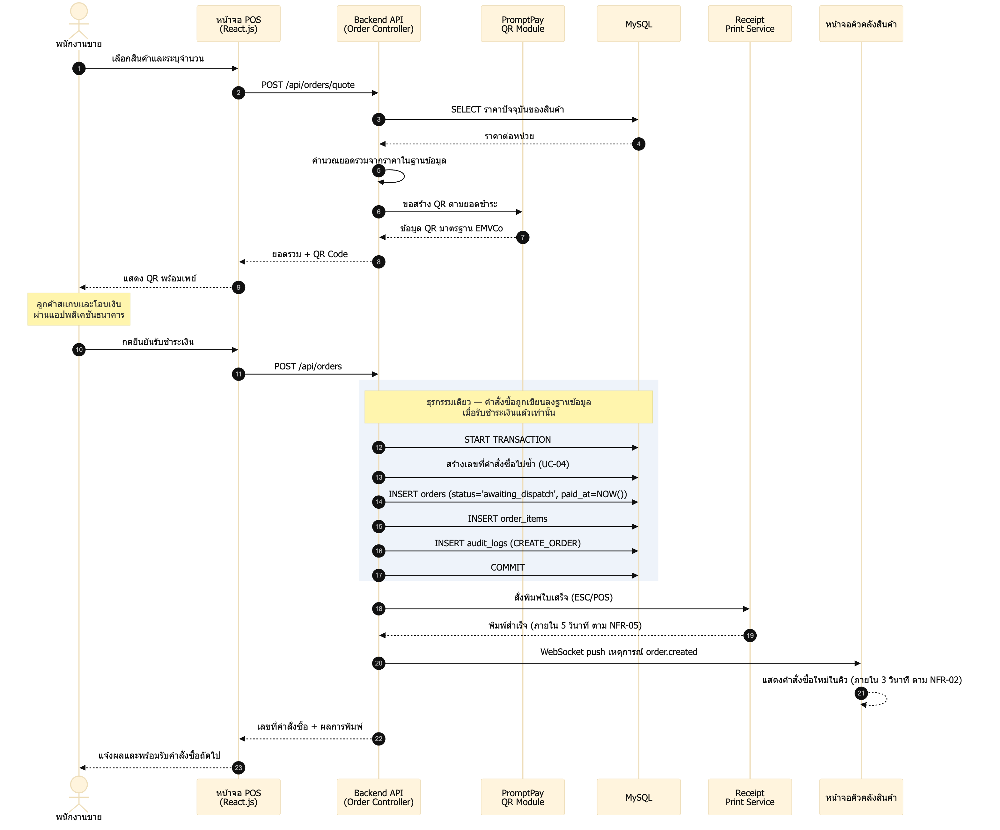

**รูปที่ 3.10** แผนภาพลำดับของการสร้างคำสั่งซื้อและออกใบเสร็จ (UC-03)

จากรูปที่ 3.10 จุดสำคัญของกระบวนการอยู่ที่ขั้นตอนที่พนักงานกดยืนยันรับชำระเงิน เนื่องจากเป็นจุดที่ระบบดำเนินการสามอย่างต่อเนื่องกัน คือเปลี่ยนสถานะคำสั่งซื้อเป็นรอจ่ายสินค้า สั่งพิมพ์ใบเสร็จ และผลักเหตุการณ์ไปยังหน้าจอคิวคลังสินค้า จะสังเกตได้ว่าลูกค้ายังไม่ได้เดินไปถึงคลังสินค้าในขณะนั้น แต่พนักงานคลังเห็นคำสั่งซื้อบนหน้าจอแล้ว ซึ่งเป็นกลไกหลักที่ทำให้เกิดการลดระยะเวลารอคอยตามวัตถุประสงค์ข้อ 1.2.2

นอกจากนี้ การเรียกใช้บริการพิมพ์ใบเสร็จและการผลักข้อมูลเข้าคิวถูกออกแบบให้ทำงานเป็นอิสระจากกัน หากขั้นตอนใดขั้นตอนหนึ่งล่าช้า อีกขั้นตอนหนึ่งจะไม่ถูกหน่วงตามไปด้วย ทำให้ระบบสามารถรักษาเกณฑ์เวลาตอบสนองไม่เกิน 3 วินาทีตาม NFR-02 ไว้ได้แม้เครื่องพิมพ์จะทำงานช้ากว่าปกติ

### 3.7.2 แผนภาพลำดับของการยืนยันจ่ายสินค้าและตัดสต็อก

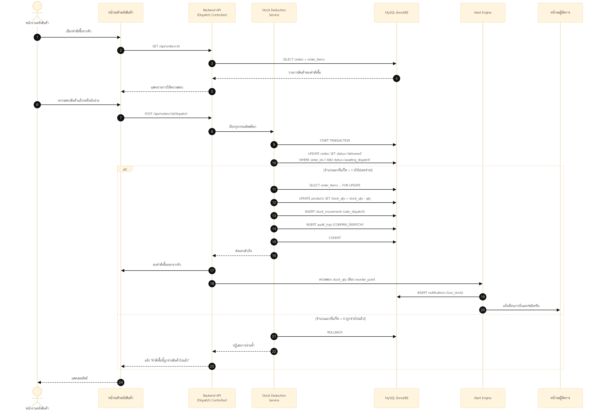

**รูปที่ 3.11** แผนภาพลำดับของการยืนยันจ่ายสินค้าและตัดสต็อกแบบอะตอมมิก (UC-07)

จากรูปที่ 3.11 กรอบ alt แสดงการแตกเส้นทางการทำงานออกเป็นสองกรณีตามผลลัพธ์ของคำสั่ง UPDATE แรก กรณีที่จำนวนแถวที่ถูกแก้ไขเท่ากับหนึ่ง หมายความว่าคำสั่งซื้อนั้นยังไม่เคยถูกจ่ายมาก่อน ระบบจะดำเนินการตัดสต็อก บันทึกการเคลื่อนไหว บันทึกประวัติ และยืนยันธุรกรรม ส่วนกรณีที่จำนวนแถวเท่ากับศูนย์ หมายความว่ามีผู้อื่นยืนยันจ่ายไปก่อนแล้ว ระบบจะยกเลิกธุรกรรมทั้งหมดและปฏิเสธการจ่ายซ้ำ

จะสังเกตได้ว่าการตรวจสอบจุดสั่งซื้อเพิ่มและการแจ้งเตือนผู้จัดการถูกวางไว้หลังคำสั่ง COMMIT ไม่ใช่ภายในธุรกรรม การออกแบบเช่นนี้ทำให้ระยะเวลาที่ฐานข้อมูลต้องถือล็อกสั้นที่สุดเท่าที่จำเป็น ซึ่งช่วยรองรับการใช้งานพร้อมกันอย่างน้อย 10 เซสชันในช่วงเวลาเร่งด่วนตามที่กำหนดไว้ใน NFR-06

### 3.7.3 แผนภาพกิจกรรมของกระบวนการขายและส่งมอบสินค้า

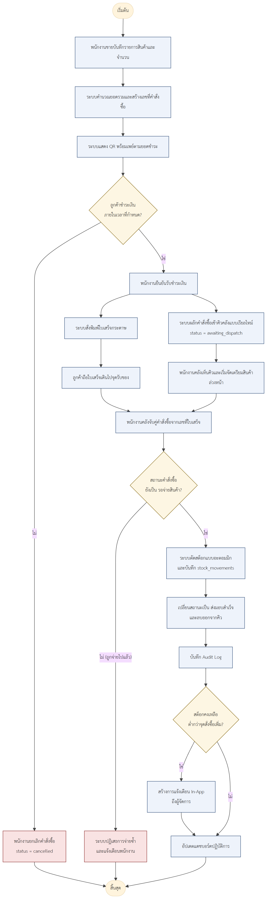

**รูปที่ 3.12** แผนภาพกิจกรรมของกระบวนการตั้งแต่รับคำสั่งซื้อจนถึงส่งมอบสินค้า

จากรูปที่ 3.12 กระบวนการเริ่มจากพนักงานขายบันทึกรายการสินค้า ผ่านจุดตัดสินใจแรกคือลูกค้าชำระเงินภายในเวลาที่กำหนดหรือไม่ หากไม่ชำระ คำสั่งซื้อจะถูกยกเลิกและกระบวนการสิ้นสุด หากชำระแล้ว กระบวนการจะแตกออกเป็นสองเส้นทางที่ทำงานคู่ขนานกัน คือเส้นทางการพิมพ์ใบเสร็จซึ่งนำไปสู่การที่ลูกค้าเดินไปยังจุดรับของ และเส้นทางการผลักคำสั่งซื้อเข้าคิวซึ่งทำให้พนักงานคลังเริ่มจัดเตรียมสินค้าได้ทันที ทั้งสองเส้นทางมาบรรจบกันที่ขั้นตอนการจับคู่คำสั่งซื้อที่จุดรับของ

จุดตัดสินใจที่สองคือการตรวจสอบว่าสถานะคำสั่งซื้อยังเป็นรอจ่ายสินค้าหรือไม่ ซึ่งเป็นจุดที่ระบบปฏิเสธการรับสินค้าซ้ำ และจุดตัดสินใจที่สามคือการตรวจสอบว่าสต็อกคงเหลือต่ำกว่าจุดสั่งซื้อเพิ่มหรือไม่ ซึ่งเป็นจุดกำเนิดของการแจ้งเตือนถึงผู้จัดการ การที่ทั้งสามจุดตัดสินใจนี้อยู่ในกระบวนการเดียวกัน แสดงให้เห็นว่าระบบตอบโจทย์ปัญหาทั้งสี่ประการที่ระบุไว้ในหัวข้อ 1.1 ภายในกระบวนการขายเพียงกระบวนการเดียว

### 3.7.4 แผนภาพสถานะของคำสั่งซื้อ

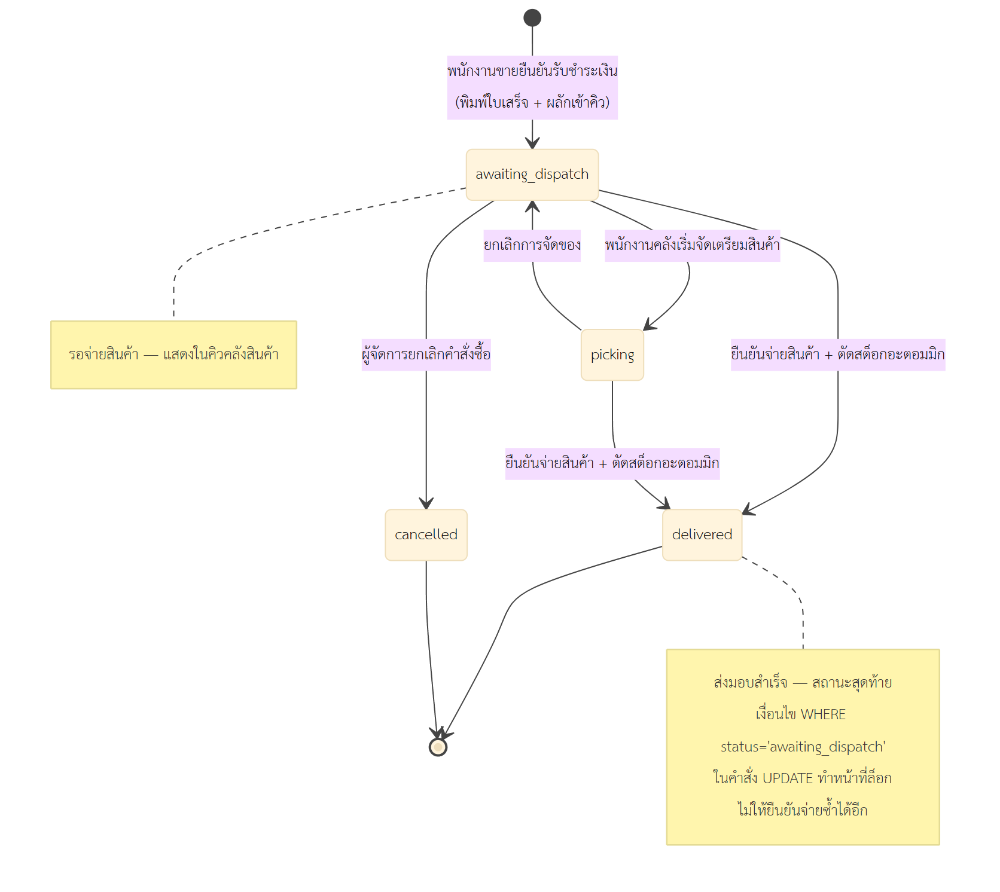

**รูปที่ 3.13** แผนภาพสถานะแสดงวงจรชีวิตของคำสั่งซื้อ

จากรูปที่ 3.13 คำสั่งซื้อเข้าสู่ระบบด้วยสถานะรอจ่ายสินค้าทันทีที่พนักงานขายยืนยันรับชำระเงิน จากนั้นอาจเปลี่ยนไปมาระหว่างสถานะรอจ่ายสินค้าและกำลังจัดของได้ตาม UC-06 ก่อนจะไปสู่สถานะปลายทางคือส่งมอบสำเร็จหรือยกเลิก จุดที่ต้องเน้นคือสถานะส่งมอบสำเร็จเป็นสถานะสุดท้ายที่ไม่มีเส้นทางย้อนกลับ เมื่อคำสั่งซื้อเข้าสู่สถานะนี้แล้วจะไม่สามารถถูกยืนยันจ่ายได้อีก ซึ่งเป็นการนำแนวคิดการจัดการสถานะข้อมูลในหัวข้อ 2.1.4 มาใช้เป็นกลไกป้องกันการรับสินค้าซ้ำโดยตรง ตรงตามสมมติฐานที่ตั้งไว้ในหัวข้อ 1.4.3.2

---

## 3.8 การออกแบบส่วนติดต่อผู้ใช้

### 3.8.1 หลักการออกแบบ

ส่วนติดต่อผู้ใช้ของระบบ SOML ออกแบบตามหลักปฏิสัมพันธ์ระหว่างมนุษย์กับคอมพิวเตอร์ที่กล่าวไว้ในหัวข้อ 2.1.9 โดยยึดหลักสามข้อ ข้อแรกคือความเรียบง่าย แต่ละหน้าจอมีงานหลักเพียงงานเดียวและวางปุ่มของงานนั้นให้เด่นที่สุด ข้อที่สองคือความชัดเจนของข้อมูล ตัวเลขที่สำคัญต่อการตัดสินใจถูกแสดงด้วยขนาดใหญ่และจัดชิดขวาเพื่อให้เปรียบเทียบกันได้ง่าย และข้อที่สามคือการยืนยันก่อนดำเนินการที่ส่งผลถาวรต่อข้อมูล

ระบบใช้สีอย่างสม่ำเสมอในความหมายเดียวกันทั่วทั้งระบบ ได้แก่ สีน้ำเงินสำหรับปุ่มดำเนินการทั่วไป สีเขียวสำหรับสถานะปกติและปุ่มยืนยันที่ทำให้ธุรกรรมสมบูรณ์ สีส้มสำหรับสถานะที่ต้องเฝ้าระวัง เช่น คำสั่งซื้อที่รอจ่ายหรือสต็อกที่ใกล้ถึงจุดสั่งซื้อเพิ่ม และสีแดงสำหรับสถานะที่ต้องดำเนินการทันที เช่น สต็อกที่ต่ำกว่าจุดสั่งซื้อแล้วหรือคำสั่งซื้อที่รอนานผิดปกติ การกำหนดความหมายของสีไว้ล่วงหน้าเช่นนี้ช่วยให้พนักงานที่ไม่คุ้นเคยกับเทคโนโลยีสามารถประเมินสถานการณ์ได้จากสีก่อนที่จะอ่านข้อความ

### 3.8.2 หน้าจอสำหรับพนักงานขาย

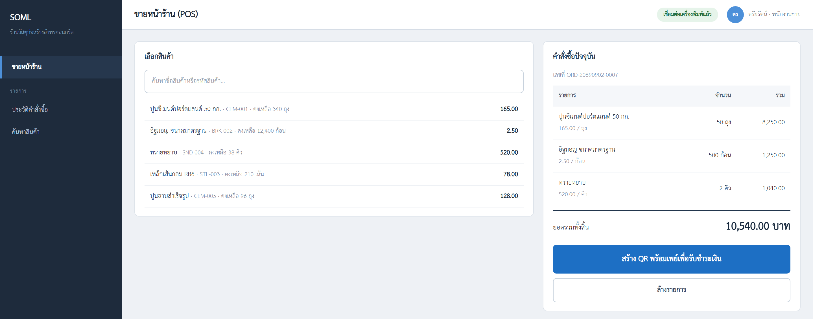

**รูปที่ 3.14** หน้าจอขายหน้าร้าน (POS)

จากรูปที่ 3.14 หน้าจอถูกแบ่งออกเป็นสองส่วนซ้ายขวา ส่วนซ้ายเป็นพื้นที่ค้นหาและเลือกสินค้า ซึ่งแสดงชื่อสินค้า รหัสสินค้า จำนวนคงเหลือ และราคาต่อหน่วยในบรรทัดเดียวกัน การแสดงจำนวนคงเหลือไว้ตั้งแต่ขั้นตอนเลือกสินค้าช่วยให้พนักงานขายทราบทันทีว่าสินค้าเพียงพอต่อคำสั่งซื้อหรือไม่ โดยไม่ต้องเดินไปตรวจสอบที่คลัง ส่วนขวาเป็นคำสั่งซื้อปัจจุบันซึ่งแสดงเลขที่คำสั่งซื้อ รายการที่เลือกแล้ว และยอดรวมทั้งสิ้นด้วยตัวเลขขนาดใหญ่เหนือปุ่มสร้าง QR พร้อมเพย์

การวางยอดรวมไว้ติดกับปุ่มดำเนินการเป็นการจงใจ เพื่อให้พนักงานมองเห็นยอดเงินขณะกดปุ่มและลดโอกาสที่จะสร้าง QR ด้วยยอดที่ผิด ซึ่งเป็นความผิดพลาดที่แก้ไขได้ยากเมื่อลูกค้าโอนเงินไปแล้ว

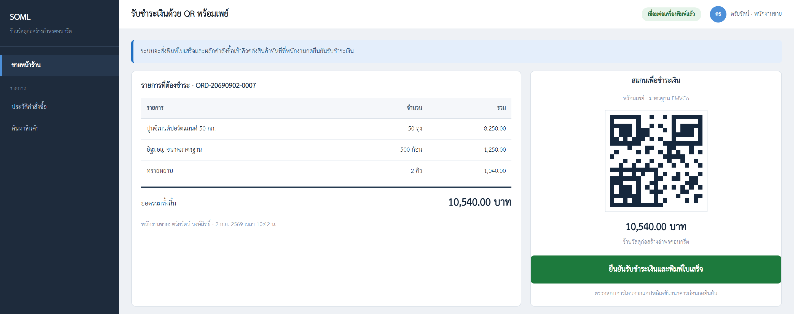

**รูปที่ 3.15** หน้าจอรับชำระเงินด้วย QR พร้อมเพย์

จากรูปที่ 3.15 หน้าจอแสดงรายการสินค้าทางซ้ายควบคู่กับรหัส QR ทางขวา เพื่อให้พนักงานสามารถทวนรายการกับลูกค้าได้ในขณะที่ลูกค้ากำลังสแกน ยอดเงินถูกแสดงซ้ำใต้รหัส QR ด้วยตัวเลขขนาดใหญ่ เนื่องจากเป็นข้อมูลที่ลูกค้าต้องตรวจสอบก่อนกดโอน ปุ่มยืนยันรับชำระเงินใช้สีเขียวและมีข้อความกำกับใต้ปุ่มเตือนให้ตรวจสอบการแจ้งเตือนจากแอปพลิเคชันธนาคารก่อนกด ซึ่งสอดคล้องกับข้อสมมติฐานในหัวข้อ 1.4 ที่ระบุว่าการยืนยันการรับชำระเงินทำโดยพนักงาน ไม่ใช่ระบบอัตโนมัติ

### 3.8.3 หน้าจอสำหรับพนักงานคลังสินค้า

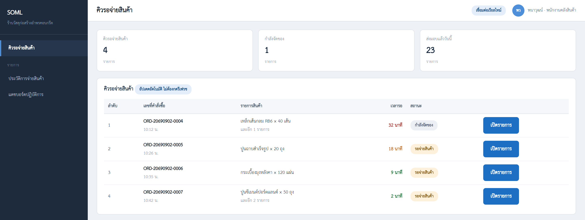

**รูปที่ 3.16** หน้าจอคิวรอจ่ายสินค้า

จากรูปที่ 3.16 คำสั่งซื้อถูกเรียงตามเวลาที่รับชำระเงินจากเก่าไปใหม่ เพื่อให้พนักงานจัดของตามลำดับก่อนหลังได้อย่างเป็นธรรม คอลัมน์เวลารอใช้สีตามระยะเวลาที่รอ โดยเปลี่ยนจากสีเขียวเป็นสีส้มและสีแดงเมื่อรอนานขึ้น ทำให้พนักงานมองเห็นได้ทันทีว่ารายการใดควรได้รับการดูแลก่อน ป้ายกำกับที่ระบุว่าหน้าจออัปเดตอัตโนมัติโดยไม่ต้องกดรีเฟรชถูกวางไว้ข้างหัวข้อ เพื่อสร้างความมั่นใจให้พนักงานว่าข้อมูลที่เห็นเป็นข้อมูลล่าสุดเสมอ

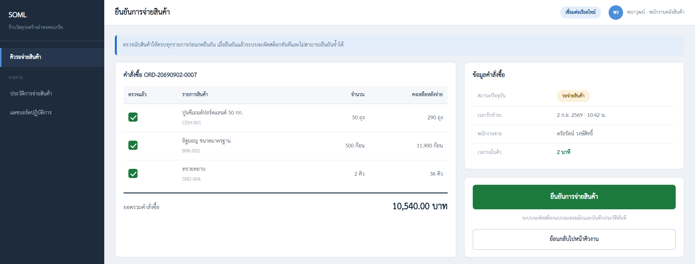

**รูปที่ 3.17** หน้าจอยืนยันการจ่ายสินค้า

จากรูปที่ 3.17 หน้าจอนี้เป็นจุดที่ระบบเรียกร้องความระมัดระวังสูงสุดจากผู้ใช้งาน จึงออกแบบให้มีช่องทำเครื่องหมายกำกับทุกรายการสินค้าเพื่อบังคับให้พนักงานตรวจนับทีละรายการก่อนกดยืนยัน คอลัมน์คงเหลือหลังจ่ายแสดงผลลัพธ์ที่จะเกิดขึ้นล่วงหน้า ทำให้พนักงานสามารถทักท้วงได้ทันทีหากตัวเลขไม่สมเหตุสมผลกับสิ่งที่เห็นในคลังจริง แถบข้อความด้านบนเตือนอย่างชัดเจนว่าเมื่อยืนยันแล้วจะไม่สามารถยืนยันซ้ำได้ ซึ่งเป็นการสื่อสารพฤติกรรมของระบบตามที่ออกแบบไว้ในหัวข้อ 3.5.3 ให้ผู้ใช้งานเข้าใจตรงกัน

### 3.8.4 หน้าจอสำหรับผู้จัดการ

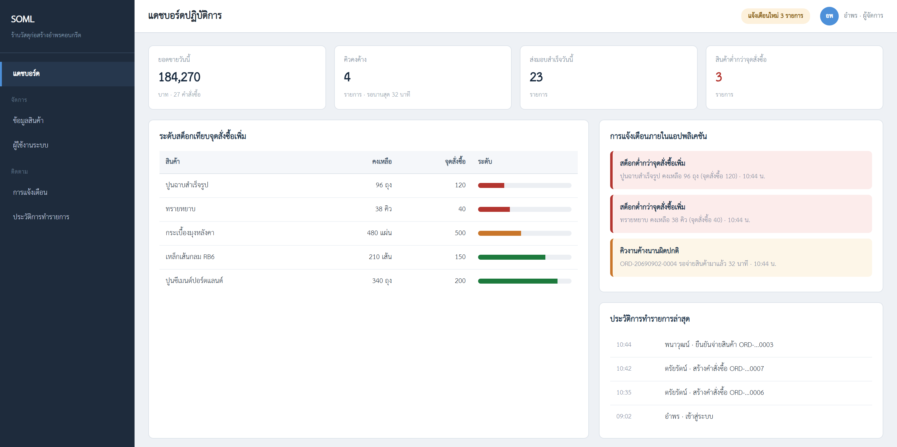

**รูปที่ 3.18** แดชบอร์ดปฏิบัติการสำหรับผู้จัดการ

จากรูปที่ 3.18 แถวบนสุดเป็นตัวชี้วัดหลักสี่ค่าที่ผู้จัดการต้องการทราบทันทีที่เปิดหน้าจอ ได้แก่ ยอดขายวันนี้ จำนวนคิวคงค้าง จำนวนที่ส่งมอบสำเร็จแล้ว และจำนวนสินค้าที่ต่ำกว่าจุดสั่งซื้อเพิ่ม โดยค่าสุดท้ายใช้สีแดงเมื่อมีค่ามากกว่าศูนย์ ส่วนกลางซ้ายเป็นตารางเปรียบเทียบยอดคงเหลือกับจุดสั่งซื้อเพิ่มพร้อมแถบแสดงระดับ ซึ่งทำให้ผู้จัดการเห็นภาพรวมของสต็อกทั้งหมดได้ในสายตาเดียวโดยไม่ต้องอ่านตัวเลขทีละรายการ

ส่วนขวาเป็นรายการแจ้งเตือนภายในแอปพลิเคชันและประวัติการทำรายการล่าสุด การวางสองส่วนนี้ไว้ในหน้าเดียวกับตัวชี้วัดหลัก ทำให้ผู้จัดการสามารถตรวจสอบทั้งสถานการณ์ปัจจุบันและเหตุการณ์ที่เพิ่งเกิดขึ้นได้โดยไม่ต้องสลับหน้าจอ ซึ่งตอบวัตถุประสงค์ข้อ 1.2.4 เรื่องการติดตามสถานะแบบเรียลไทม์เพื่อการตัดสินใจจากข้อมูลจริง

### 3.8.5 การรองรับอุปกรณ์เคลื่อนที่

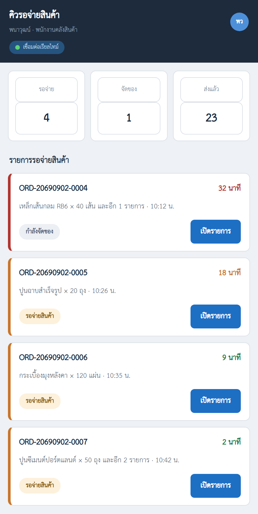

**รูปที่ 3.19** หน้าจอคิวรอจ่ายสินค้าในโหมดอุปกรณ์เคลื่อนที่

จากรูปที่ 3.19 เมื่อความกว้างหน้าจอลดลงถึงระดับสมาร์ตโฟน ระบบจะเปลี่ยนการแสดงผลจากตารางเป็นรายการแบบการ์ดซ้อนกันในแนวตั้ง เนื่องจากตารางที่มีหลายคอลัมน์ไม่สามารถอ่านได้สะดวกบนหน้าจอแคบ แต่ละการ์ดยังคงแสดงข้อมูลครบถ้วนเหมือนแถวในตาราง ได้แก่ เลขที่คำสั่งซื้อ เวลารอ รายการสินค้า สถานะ และปุ่มเปิดรายการ นอกจากนี้แถบสีทางซ้ายของการ์ดยังทำหน้าที่สื่อความเร่งด่วนแทนสีของตัวเลขเวลารอในโหมดตาราง

การออกแบบเช่นนี้ตอบความต้องการเชิงคุณภาพ NFR-03 ที่กำหนดให้หน้าจอคิวและยืนยันจ่ายรองรับการใช้งานบนแท็บเล็ตและสมาร์ตโฟนได้สะดวก ซึ่งมีความสำคัญในทางปฏิบัติ เพราะพนักงานคลังสินค้าต้องเดินไปมาระหว่างชั้นวางสินค้าและไม่สามารถอยู่หน้าคอมพิวเตอร์ตั้งโต๊ะได้ตลอดเวลา

---

## 3.9 แผนการทดสอบระบบ

เพื่อให้มั่นใจว่าระบบที่พัฒนาขึ้นทำงานได้ถูกต้อง มีเสถียรภาพ และเป็นที่ยอมรับของผู้ใช้งานจริง จึงได้วางแผนการทดสอบอย่างเป็นระบบ โดยแบ่งออกเป็น 4 ระดับตามลำดับจากส่วนย่อยไปสู่ภาพรวม ดังแสดงในตารางที่ 3.23

**ตารางที่ 3.23** ระดับการทดสอบระบบ

| ระดับการทดสอบ | วัตถุประสงค์ | ขอบเขตการทดสอบ | เครื่องมือที่ใช้ | เกณฑ์การผ่าน |
|---|---|---|---|---|
| Unit Testing | ตรวจสอบความถูกต้องของฟังก์ชันย่อย | การคำนวณยอดรวม การสร้างเลขที่คำสั่งซื้อ การเข้ารหัสรหัสผ่าน การตรวจสอบสิทธิ์ตามบทบาท | Jest | ทุกกรณีทดสอบผ่าน และครอบคลุมโค้ดไม่น้อยกว่าร้อยละ 70 |
| Integration Testing | ตรวจสอบการทำงานร่วมกันระหว่างส่วนประกอบ | เส้นทาง REST API ครบทุกจุด การทำงานร่วมกันของ Dispatch Controller กับ Stock Deduction Service การเชื่อมต่อฐานข้อมูล | Jest + Supertest | ทุกเส้นทาง API ตอบสถานะและข้อมูลถูกต้อง |
| System Testing | ตรวจสอบระบบทั้งหมดตามกรณีการใช้งาน | UC-01 ถึง UC-11 การผลักข้อมูลผ่าน WebSocket การพิมพ์ใบเสร็จ การตัดสต็อกพร้อมกัน | ทดสอบด้วยมือตามสคริปต์ทดสอบ | อัตราความสำเร็จของกรณีทดสอบไม่น้อยกว่าร้อยละ 90 |
| User Acceptance Testing | ตรวจสอบการยอมรับจากผู้ใช้งานจริง | พนักงานขาย พนักงานคลังสินค้า และผู้จัดการของร้านใช้งานจริงในสถานประกอบการ | แบบสอบถามมาตรวัดลิเคิร์ต 5 ระดับ | คะแนนความพึงพอใจเฉลี่ยไม่น้อยกว่า 4.0 |

**ตารางที่ 3.24** กรณีทดสอบตามความต้องการเชิงหน้าที่

| รหัส | ความต้องการ | กรณีทดสอบ | ผลลัพธ์ที่คาดหวัง |
|:---:|:---:|---|---|
| TC-01 | FR-01 | เข้าสู่ระบบด้วยบัญชีพนักงานขาย แล้วพยายามเข้าถึงหน้าจัดการข้อมูลสินค้า | ระบบปฏิเสธการเข้าถึงและไม่แสดงเมนูดังกล่าว |
| TC-02 | FR-02 | ผู้จัดการแก้ไขจุดสั่งซื้อเพิ่มของสินค้าหนึ่งรายการ | ค่าที่บันทึกในฐานข้อมูลตรงกับที่กรอก และมีบันทึกในประวัติการทำรายการ |
| TC-03 | FR-03 | สร้างคำสั่งซื้อ 3 รายการ ตรวจสอบยอดรวมและรหัส QR | ยอดรวมถูกต้องตามการคำนวณด้วยมือ และรหัส QR ระบุยอดตรงกัน |
| TC-04 | FR-03 | สร้างคำสั่งซื้อ 100 รายการต่อเนื่องกัน | เลขที่คำสั่งซื้อไม่ซ้ำกันทั้ง 100 รายการ |
| TC-05 | FR-04 | ยืนยันรับชำระเงินแล้วจับเวลาจนคำสั่งซื้อปรากฏบนหน้าจอคิว | ปรากฏบนหน้าจอคิวภายใน 3 วินาที ตาม NFR-02 |
| TC-06 | FR-05 | เปิดหน้าจอคลังสินค้าสองเครื่อง แล้วกดยืนยันจ่ายคำสั่งซื้อเดียวกันพร้อมกัน | เครื่องแรกสำเร็จ เครื่องที่สองได้รับข้อความว่าคำสั่งซื้อถูกจ่ายไปแล้ว และสต็อกถูกหักเพียงครั้งเดียว |
| TC-07 | FR-06 | ยืนยันจ่ายสินค้า 20 คำสั่งซื้อ แล้วนับสินค้าจริงในคลังเปรียบเทียบกับยอดในระบบ | ยอดในระบบตรงกับจำนวนจริงทุกรายการ อัตราความคลาดเคลื่อนเท่ากับศูนย์ |
| TC-08 | FR-06 | ยืนยันจ่ายคำสั่งซื้อที่มีจำนวนมากกว่าสต็อกคงเหลือ | ระบบยกเลิกธุรกรรมทั้งหมด สต็อกไม่เปลี่ยนแปลง และสถานะคำสั่งซื้อไม่เปลี่ยน |
| TC-09 | FR-07 | เปรียบเทียบยอดขายบนแดชบอร์ดกับผลรวมจากฐานข้อมูล | ตัวเลขตรงกันทุกตัวชี้วัด |
| TC-10 | FR-08 | ยืนยันจ่ายสินค้าจนยอดคงเหลือต่ำกว่าจุดสั่งซื้อเพิ่ม | ระบบสร้างการแจ้งเตือนประเภทสต็อกต่ำและแสดงบนหน้าจอผู้จัดการทันที |
| TC-11 | FR-08 | ปล่อยคำสั่งซื้อค้างในคิวเกินเกณฑ์เวลาที่กำหนด | ระบบสร้างการแจ้งเตือนประเภทคิวค้างนานผิดปกติ |
| TC-12 | FR-09 | ค้นหาประวัติการทำรายการโดยกรองตามช่วงวันที่และบทบาทผู้กระทำ | ผลลัพธ์ตรงตามเงื่อนไข และมีบันทึกครบทุกเหตุการณ์ที่ทดสอบมาก่อนหน้า |
| TC-13 | NFR-05 | จับเวลาตั้งแต่กดยืนยันรับชำระจนใบเสร็จพิมพ์เสร็จ | ไม่เกิน 5 วินาที |
| TC-14 | NFR-06 | เปิดใช้งานพร้อมกัน 10 เซสชันในช่วงเวลาเดียวกัน | ระบบทำงานได้ตามปกติ ไม่มีคำขอที่ล้มเหลว |

**ตารางที่ 3.25** เกณฑ์การประเมินผลและตัวชี้วัด

| ประเภทการทดสอบ | ตัวชี้วัด | เป้าหมาย | ที่มา |
|---|---|:---:|:---:|
| Functional Testing | อัตราความสำเร็จของกรณีทดสอบ | ไม่น้อยกว่าร้อยละ 90 | SRS §7.2 |
| Data Integrity Testing | อัตราความคลาดเคลื่อนของสต็อก | ร้อยละ 0 | SRS §7.2 |
| Performance Testing | เวลาที่ข้อมูลปรากฏบนหน้าจอคิว | ไม่เกิน 3 วินาที | NFR-02 |
| Performance Testing | เวลาพิมพ์ใบเสร็จหลังยืนยันรับชำระ | ไม่เกิน 5 วินาที | NFR-05 |
| Scalability Testing | จำนวนเซสชันที่รองรับพร้อมกัน | ไม่น้อยกว่า 10 เซสชัน | NFR-06 |
| In-App Alert Testing | ความถูกต้องของการแจ้งเตือน | ร้อยละ 100 | SRS §7.2 |
| Usability Testing (UAT) | ความพึงพอใจของผู้ใช้งาน | ไม่น้อยกว่า 4.0 จาก 5.0 | SRS §7.2 |

จากตารางที่ 3.23 ถึงตารางที่ 3.25 จะเห็นว่ากรณีทดสอบ TC-06 และ TC-07 เป็นกรณีที่มีความสำคัญที่สุดต่อการพิสูจน์ว่าโครงงานบรรลุวัตถุประสงค์ เนื่องจาก TC-06 ทดสอบกลไกป้องกันการรับสินค้าซ้ำโดยตรงตามวัตถุประสงค์ข้อ 1.2.3 ส่วน TC-07 ทดสอบความสอดคล้องระหว่างยอดสต็อกในระบบกับจำนวนสินค้าจริงในคลัง ซึ่งเป็นตัวชี้วัดที่สะท้อนการแก้ปัญหาข้อมูลคลาดเคลื่อนที่ระบุไว้ตั้งแต่หัวข้อ 1.1 ทั้งสองกรณีจึงต้องดำเนินการทดสอบซ้ำหลายรอบในสภาพแวดล้อมจริงที่ร้านวัสดุก่อสร้างอำพรคอนกรีต ก่อนสรุปผลในบทที่ 4
