# บทที่ 4

## ผลการดำเนินงาน

<!-- ตัวเลขทุกตัวในบทนี้อ้างอิงไฟล์หลักฐานใน app/evidence/ -->
<!-- ส่วนที่รอข้อมูลจากสถานประกอบการกำกับไว้ด้วย [ รอเก็บข้อมูลจริง ] -->

บทนี้นำเสนอผลการดำเนินงานของระบบจัดการคำสั่งซื้อและตรวจสอบคลังสินค้าที่พัฒนาขึ้น ครอบคลุมผลการพัฒนาระบบในแต่ละส่วนหน้าจอ ผลการทดสอบตามแผนการทดสอบที่วางไว้ในหัวข้อ 3.9 ผลการประเมินการยอมรับจากผู้ใช้งานจริง ตลอดจนการอภิปรายผลเทียบกับวัตถุประสงค์และสมมติฐานที่ตั้งไว้ในบทที่ 1 และตารางสอบกลับความต้องการฉบับสมบูรณ์

---

## 4.1 ผลการพัฒนาระบบ

### 4.1.1 ภาพรวมของระบบที่พัฒนาสำเร็จ

ระบบ SOML ได้รับการพัฒนาแล้วเสร็จตามสถาปัตยกรรมสามชั้นที่ออกแบบไว้ในหัวข้อ 3.2 โดยแบ่งเป็นสามคอนเทนเนอร์ที่ติดตั้งและทำงานได้อย่างอิสระตามตารางที่ 3.2 ส่วนประกอบภายในระบบหลังบ้านทั้งสิบส่วนตามตารางที่ 3.3 ถูกพัฒนาเป็นไฟล์แยกที่มีชื่อตรงกับส่วนประกอบในแผนภาพ C3 เพื่อให้ทวนสอบความต้องการ NFR-08 ด้วยการตรวจสอบโครงสร้างซอร์สโค้ดได้โดยตรง ดังแสดงในตารางที่ 4.1

**ตารางที่ 4.1** ส่วนประกอบที่พัฒนาสำเร็จเทียบกับการออกแบบในตารางที่ 3.3

| ส่วนประกอบตาม C3 | ไฟล์ในซอร์สโค้ด | เส้นทาง REST API ที่ให้บริการ | ความต้องการ |
|---|---|---|:---:|
| Auth Controller | `components/authController.js` | `POST /api/auth/login` · `GET /api/auth/me` | FR-01 |
| Product Controller | `components/productController.js` | `GET/POST /api/products` · `PUT /api/products/:id` · `PATCH /api/products/:id/stock` | FR-02 |
| Order Controller | `components/orderController.js` | `POST /api/orders/quote` · `POST /api/orders` · `GET /api/orders/:id` | FR-03 |
| Queue Manager | `components/queueManager.js` | `GET /api/queue` · `PATCH /api/orders/:id/status` · `WSS /ws` · `GET /api/events` | FR-04 |
| Dispatch Controller | `components/dispatchController.js` | `POST /api/orders/:id/dispatch` | FR-05 |
| Stock Deduction Service | `components/stockDeductionService.js` | เรียกใช้ภายในจาก Dispatch Controller | FR-06 |
| Alert Engine | `components/alertEngine.js` | `GET /api/notifications` · `PATCH /api/notifications/:id/read` | FR-08 |
| Dashboard Aggregator | `components/dashboardAggregator.js` | `GET /api/dashboard/ops` · `GET /api/dashboard/exec` | FR-07 |
| Audit Log Service | `components/auditLogService.js` | `GET /api/audit-logs` | FR-09 |
| Print Service Client | `components/printServiceClient.js` | เรียกใช้ภายในเมื่อยืนยันรับชำระเงิน | FR-03 |

จากตารางที่ 4.1 ส่วนประกอบทั้งสิบส่วนถูกพัฒนาครบถ้วนและให้บริการรวม 19 เส้นทาง ครอบคลุมความต้องการเชิงหน้าที่ FR-01 ถึง FR-09 ทั้งหมด จะเห็นว่า Stock Deduction Service เป็นส่วนประกอบเดียวที่ไม่มีเส้นทาง REST API ของตนเอง เนื่องจากถูกแยกออกมาเพื่อรวมศูนย์ตรรกะของธุรกรรมตัดสต็อกไว้ที่เดียวตามเหตุผลในหัวข้อ 3.4 การออกแบบเช่นนี้ทำให้เขียนชุดทดสอบกรณีการเข้าถึงพร้อมกันเรียกใช้ส่วนประกอบนี้ได้โดยตรงโดยไม่ต้องจำลองคำขอ HTTP ทั้งเส้นทาง ซึ่งใช้จริงในการทดสอบที่รายงานไว้ในหัวข้อ 4.2.5

สภาพแวดล้อมที่ใช้พัฒนาและทดสอบระบบแสดงในตารางที่ 4.2

**ตารางที่ 4.2** สภาพแวดล้อมที่ใช้พัฒนาและทดสอบระบบ

| รายการ | รายละเอียด |
|---|---|
| ระบบปฏิบัติการ | macOS 26.5 สถาปัตยกรรม ARM64 |
| ชั้นตรรกะทางธุรกิจ | Node.js 22.23.2 · Express.js 5.2.1 |
| ชั้นแสดงผล | React 18.3 · Vite 6.4 |
| ชั้นข้อมูล | MySQL 8.0.46 กลไกจัดเก็บ InnoDB |
| การสื่อสารเรียลไทม์ | WebSocket ผ่านไลบรารี ws 8.18 และ Server-Sent Events เป็นช่องทางสำรอง |
| ช่องทางเข้าถึง | HTTPS เท่านั้น ใช้ใบรับรองแบบลงนามด้วยตนเองในสภาพแวดล้อมทดสอบ |
| เครื่องมือทดสอบ | Jest 29.7 · Supertest 7.0 · Playwright |

จากตารางที่ 4.2 เทคโนโลยีที่ใช้จริงตรงกับข้อจำกัดการออกแบบที่กำหนดไว้ใน SRS §3.4 ทุกประการ โดยเลือกใช้ MySQL รุ่น 8.0 ตามที่ระบุไว้ ไม่ใช้รุ่นที่ใหม่กว่า เพื่อให้กลไกจัดเก็บ InnoDB และพฤติกรรมการล็อกระดับแถวเป็นไปตามที่ออกแบบไว้ในหัวข้อ 3.5.3

ส่วนติดต่อผู้ใช้และ Backend API ให้บริการจากเซิร์ฟเวอร์เดียวกันที่ต้นทางเดียว จึงไม่มีตัวแทนคำขอคั่นกลาง WebSocket เชื่อมต่อไปยังเซิร์ฟเวอร์เดียวกับที่ให้บริการหน้าเว็บโดยตรง และเข้าถึงระบบได้ผ่าน HTTPS ช่องทางเดียวตามที่ NFR-01 กำหนด

### 4.1.2 หน้าจอเข้าสู่ระบบ

ผู้ใช้งานทุกบทบาทเริ่มต้นที่หน้าเข้าสู่ระบบ กรอกชื่อผู้ใช้และรหัสผ่านเพื่อยืนยันตัวตน ระบบตรวจสอบรหัสผ่านที่เข้ารหัสด้วย bcrypt แล้วออกโทเคน JWT ที่ระบุบทบาทของผู้ใช้งาน การทำงานนี้สอดคล้องกับกรณีการใช้งาน UC-01 ดังแสดงในรูปที่ 4.1

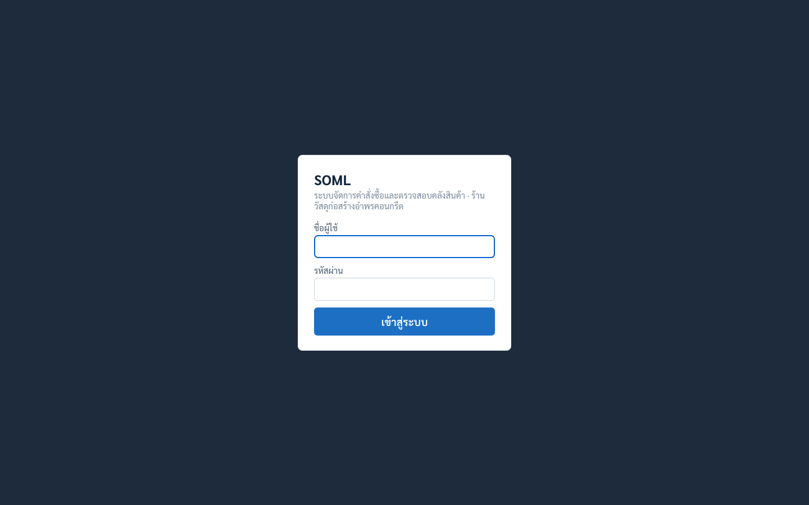

**รูปที่ 4.1** หน้าจอเข้าสู่ระบบ

จากรูปที่ 4.1 หน้าจอแสดงเพียงช่องกรอกชื่อผู้ใช้และรหัสผ่านเท่านั้น ไม่มีการแสดงรายชื่อบัญชีหรือคำใบ้ใด ๆ และเมื่อยืนยันตัวตนไม่สำเร็จ ระบบจะแสดงข้อความว่า "ชื่อผู้ใช้หรือรหัสผ่านไม่ถูกต้อง" เหมือนกันทั้งกรณีที่รหัสผ่านผิดและกรณีที่ไม่มีบัญชีนั้นอยู่จริง ตามแนวปฏิบัติของมาตรฐาน OWASP ASVS ที่กล่าวไว้ในหัวข้อ 2.1.6 ซึ่งได้รับการทวนสอบแล้วในหัวข้อ 4.2.7

### 4.1.3 หน้าจอสำหรับพนักงานขาย

หน้าจอขายหน้าร้านแบ่งพื้นที่เป็นสองส่วนตามต้นแบบในรูปที่ 3.14 ดังแสดงในรูปที่ 4.2

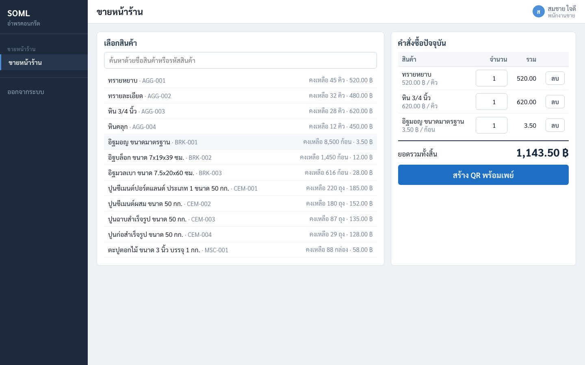

**รูปที่ 4.2** หน้าจอขายหน้าร้าน (POS)

จากรูปที่ 4.2 ส่วนซ้ายแสดงรายการสินค้าพร้อมรหัสสินค้า จำนวนคงเหลือ และราคาต่อหน่วยในบรรทัดเดียวกัน ทำให้พนักงานขายทราบทันทีว่าสินค้าเพียงพอต่อคำสั่งซื้อหรือไม่โดยไม่ต้องเดินไปตรวจสอบที่คลัง ส่วนขวาแสดงคำสั่งซื้อปัจจุบันพร้อมยอดรวมทั้งสิ้นด้วยตัวเลขขนาดใหญ่เหนือปุ่มสร้าง QR พร้อมเพย์ ตรงกับการออกแบบที่อธิบายไว้ในหัวข้อ 3.8.2 ทุกประการ เมนูด้านซ้ายของหน้าจอแสดงเฉพาะรายการที่พนักงานขายมีสิทธิ์เข้าถึง ไม่ปรากฏเมนูจัดการข้อมูลสินค้าหรือแดชบอร์ดบริหาร ซึ่งเป็นการทวนสอบข้อกำหนดใน SRS §3.1.1 ในระดับส่วนติดต่อผู้ใช้

เมื่อพนักงานกดสร้าง QR พร้อมเพย์ ระบบจะแสดงหน้าจอรับชำระเงินดังรูปที่ 4.3

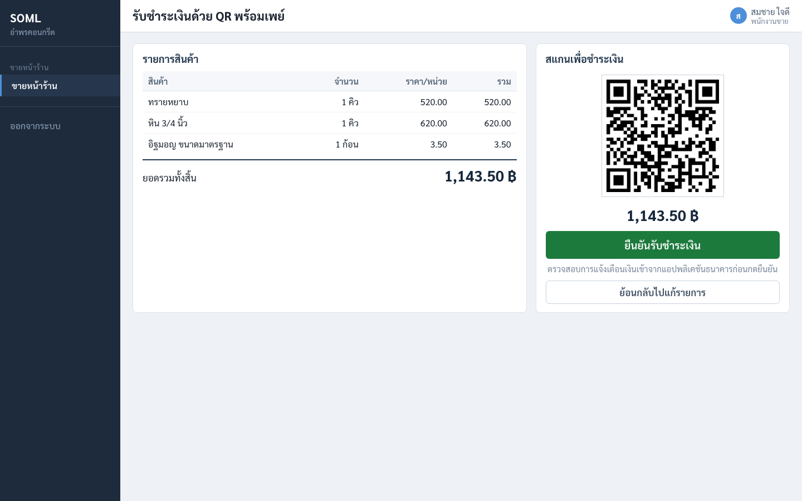

**รูปที่ 4.3** หน้าจอรับชำระเงินด้วย QR พร้อมเพย์

จากรูปที่ 4.3 หน้าจอแสดงรายการสินค้าทางซ้ายควบคู่กับรหัส QR ทางขวา ทำให้พนักงานทวนรายการกับลูกค้าได้ขณะที่ลูกค้ากำลังสแกน ยอดเงินแสดงซ้ำใต้รหัส QR ด้วยตัวเลขขนาดใหญ่ และมีข้อความกำกับใต้ปุ่มยืนยันเตือนให้ตรวจสอบการแจ้งเตือนเงินเข้าจากแอปพลิเคชันธนาคารก่อนกด ซึ่งสอดคล้องกับข้อสมมติฐานในหัวข้อ 1.4 ที่ระบุว่าการยืนยันการรับชำระเงินทำโดยพนักงาน ไม่ใช่ระบบอัตโนมัติ รหัส QR ที่แสดงถูกสร้างตามมาตรฐาน EMVCo Merchant-Presented Mode โดยฝังยอดเงินไว้ในช่องข้อมูลที่ 54 ของ payload ซึ่งได้รับการทวนสอบว่าตรงกับยอดที่ต้องชำระในหัวข้อ 4.2.4

### 4.1.4 หน้าจอสำหรับพนักงานคลังสินค้า

หน้าจอคิวรอจ่ายสินค้าเป็นหน้าจอที่พนักงานคลังสินค้าเปิดค้างไว้ตลอดเวลาทำงาน ดังแสดงในรูปที่ 4.4

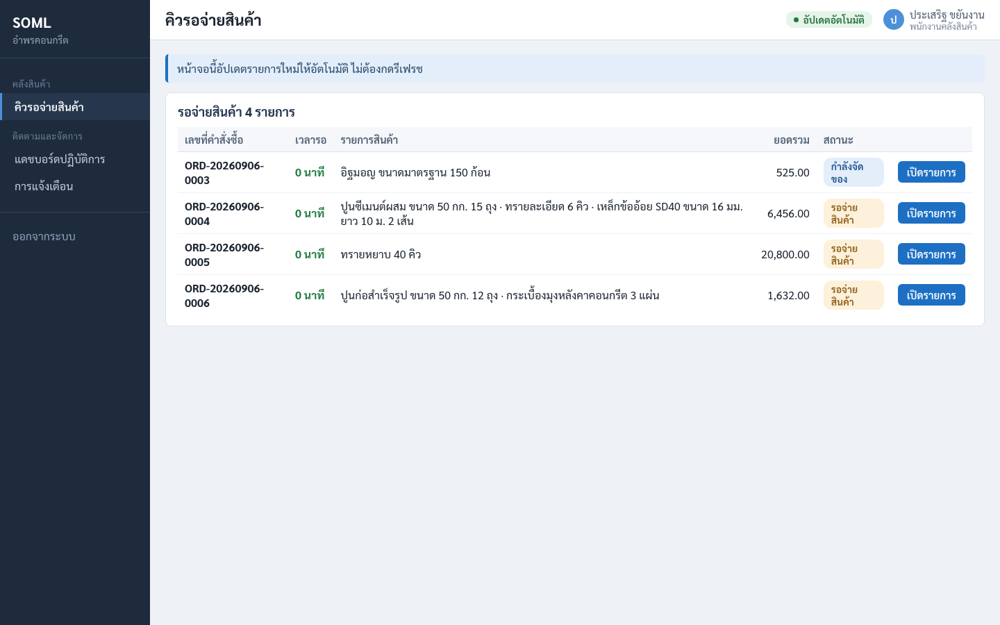

**รูปที่ 4.4** หน้าจอคิวรอจ่ายสินค้า

จากรูปที่ 4.4 คำสั่งซื้อถูกเรียงตามเวลาที่รับชำระเงินจากเก่าไปใหม่ เพื่อให้พนักงานจัดของตามลำดับก่อนหลังได้อย่างเป็นธรรม คอลัมน์เวลารอแสดงด้วยสีตามระยะเวลาที่รอ และป้ายกำกับ "อัปเดตอัตโนมัติ" ที่มุมขวาบนยืนยันว่าช่องทางรับข้อมูลแบบเรียลไทม์กำลังเชื่อมต่ออยู่ คำสั่งซื้อใหม่จะปรากฏบนหน้าจอนี้เองโดยพนักงานไม่ต้องกดรีเฟรช ซึ่งเป็นพฤติกรรมที่วัดเวลาไว้ในหัวข้อ 4.2.6

เมื่อพนักงานเลือกคำสั่งซื้อจากคิว ระบบจะแสดงหน้าจอยืนยันการจ่ายสินค้าดังรูปที่ 4.5

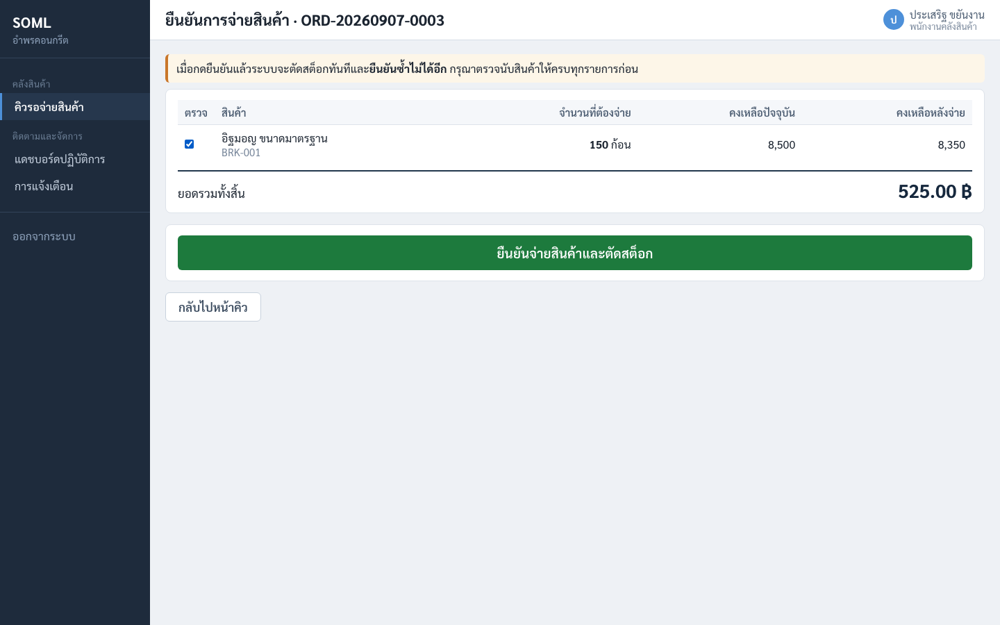

**รูปที่ 4.5** หน้าจอยืนยันการจ่ายสินค้า

จากรูปที่ 4.5 หน้าจอนี้เป็นจุดที่ระบบเรียกร้องความระมัดระวังสูงสุดจากผู้ใช้งาน จึงออกแบบให้มีช่องทำเครื่องหมายกำกับทุกรายการสินค้า และปุ่มยืนยันจะใช้งานไม่ได้จนกว่าจะทำเครื่องหมายครบทุกรายการ คอลัมน์คงเหลือหลังจ่ายแสดงผลลัพธ์ที่จะเกิดขึ้นล่วงหน้า ทำให้พนักงานทักท้วงได้ทันทีหากตัวเลขไม่สมเหตุสมผลกับสิ่งที่เห็นในคลังจริง แถบข้อความด้านบนเตือนอย่างชัดเจนว่าเมื่อยืนยันแล้วจะยืนยันซ้ำไม่ได้อีก และเมื่อกดปุ่มยืนยันระบบยังถามยืนยันซ้ำอีกครั้งก่อนดำเนินการจริง ตามข้อกำหนดใน SRS §3.1.1 ที่ระบุว่าปุ่มยืนยันที่มีผลถาวรต้องมีขั้นตอนยืนยันซ้ำ

### 4.1.5 หน้าจอสำหรับผู้จัดการ

แดชบอร์ดปฏิบัติการเป็นหน้าแรกที่ผู้จัดการเห็นหลังเข้าสู่ระบบ ดังแสดงในรูปที่ 4.6

**รูปที่ 4.6** แดชบอร์ดปฏิบัติการ

จากรูปที่ 4.6 แถวบนสุดเป็นตัวชี้วัดหลักสี่ค่าตามที่ออกแบบไว้ในหัวข้อ 3.8.4 ได้แก่ ยอดขายวันนี้ จำนวนคิวคงค้าง จำนวนที่ส่งมอบสำเร็จ และจำนวนสินค้าที่ต่ำกว่าจุดสั่งซื้อเพิ่ม โดยค่าสุดท้ายแสดงด้วยสีแดงเมื่อมีค่ามากกว่าศูนย์ ส่วนกลางซ้ายเป็นตารางเปรียบเทียบยอดคงเหลือกับจุดสั่งซื้อเพิ่มพร้อมแถบแสดงระดับที่เปลี่ยนเป็นสีแดงเมื่อสินค้ารายการนั้นต่ำกว่าเกณฑ์ ทำให้ผู้จัดการเห็นภาพรวมของสต็อกทั้งหมดได้ในสายตาเดียว ส่วนขวาแสดงการแจ้งเตือนล่าสุดที่ระบบสร้างขึ้นเอง ซึ่งการแจ้งเตือนที่ปรากฏในภาพนี้เกิดจากการตัดสต็อกจริงระหว่างการเก็บภาพหน้าจอ

แดชบอร์ดระดับบริหารสำหรับติดตามผลเชิงธุรกิจแสดงในรูปที่ 4.7

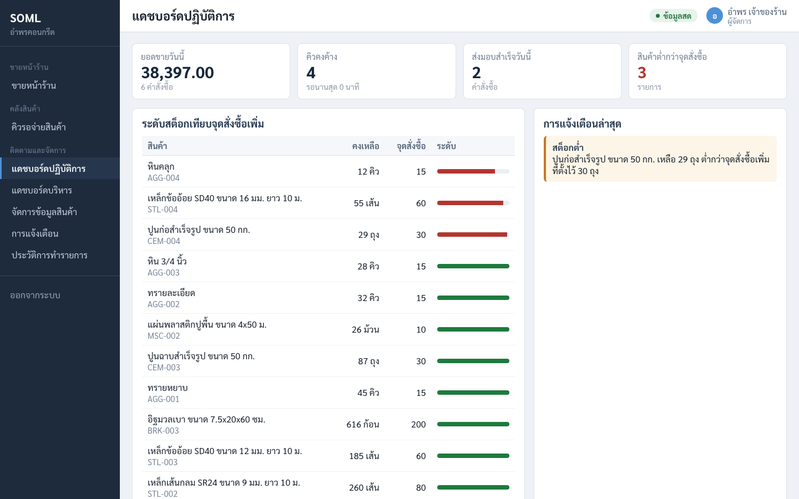

**รูปที่ 4.7** แดชบอร์ดระดับบริหาร

จากรูปที่ 4.7 ตัวชี้วัดที่มีความสำคัญที่สุดต่อการประเมินโครงงานคือเวลาเฉลี่ยตั้งแต่รับชำระเงินจนจ่ายสินค้าเสร็จ เนื่องจากเป็นการวัดระยะเวลารอคอยของลูกค้าโดยตรงตามวัตถุประสงค์ข้อ 1.2.2 ระบบคำนวณค่านี้จากผลต่างระหว่างเวลาที่บันทึกไว้ในฟิลด์ `paid_at` และ `dispatched_at` ของคำสั่งซื้อที่ส่งมอบสำเร็จแล้วทุกรายการ จึงเป็นตัวเลขที่วัดจากการทำงานจริงไม่ใช่การประมาณ

หน้าจัดการข้อมูลสินค้าและจุดสั่งซื้อเพิ่มแสดงในรูปที่ 4.8

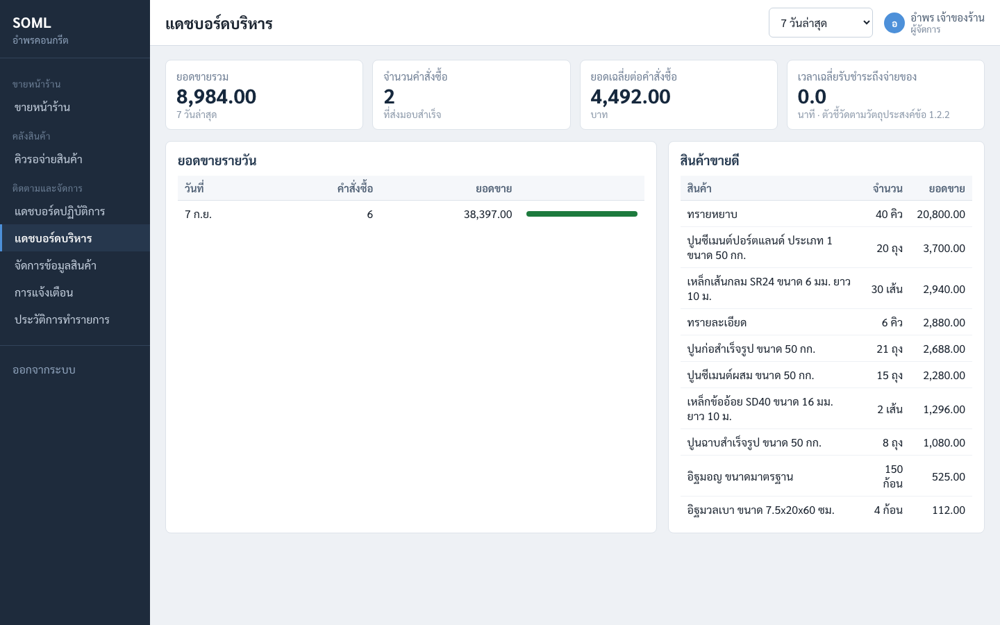

**รูปที่ 4.8** หน้าจัดการข้อมูลสินค้าและจุดสั่งซื้อเพิ่ม

จากรูปที่ 4.8 สินค้าที่มียอดคงเหลือต่ำกว่าหรือเท่ากับจุดสั่งซื้อเพิ่มจะมีป้ายกำกับ "ต่ำกว่าเกณฑ์" ทำให้ผู้จัดการเห็นได้ทันทีว่าต้องสั่งซื้อสินค้ารายการใดเพิ่ม หน้าจอนี้เข้าถึงได้เฉพาะบทบาทผู้จัดการเท่านั้นตามที่ออกแบบไว้ในหัวข้อ 3.6.1 เนื่องจากการแก้ราคาและจุดสั่งซื้อเพิ่มส่งผลโดยตรงต่อยอดขายและการวางแผนสั่งซื้อสินค้า

หน้าการแจ้งเตือนและหน้าประวัติการทำรายการแสดงในรูปที่ 4.9 และรูปที่ 4.10 ตามลำดับ

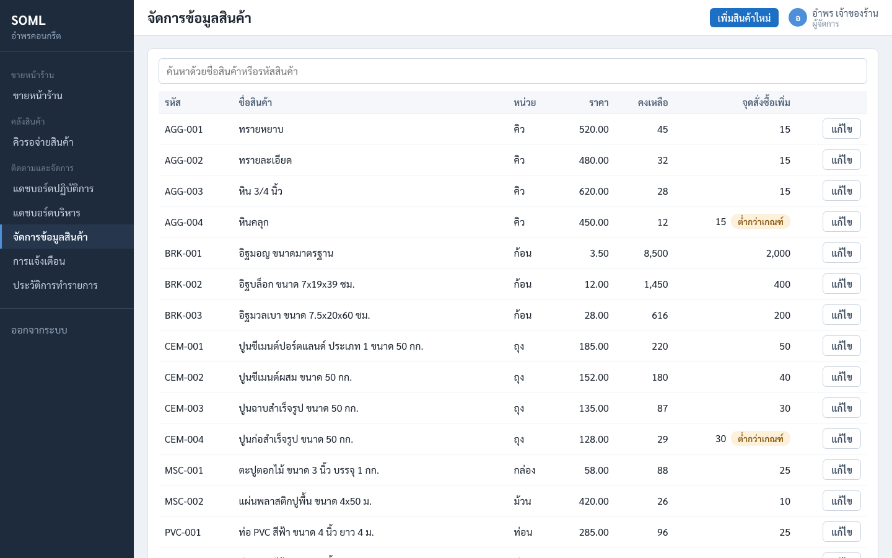

**รูปที่ 4.9** หน้าการแจ้งเตือนภายในแอปพลิเคชัน

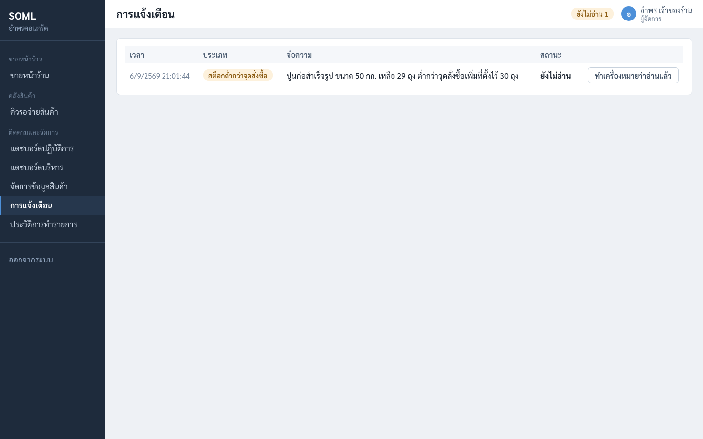

**รูปที่ 4.10** หน้าค้นหาและดูประวัติการทำรายการ

จากรูปที่ 4.9 และรูปที่ 4.10 การแจ้งเตือนถูกแยกประเภทเป็นสต็อกต่ำกว่าจุดสั่งซื้อและคิวงานค้างนานผิดปกติ พร้อมสถานะว่าอ่านแล้วหรือยัง ส่วนหน้าประวัติการทำรายการรองรับการกรองตามช่วงวันที่ บทบาทของผู้กระทำ และประเภทเหตุการณ์ตามที่ TC-12 กำหนด โดยแสดงทั้งผู้กระทำ เวลา ข้อมูลที่ถูกกระทำ และหมายเลขไอพี ทำให้ตรวจสอบย้อนหลังได้ว่าใครทำอะไรเมื่อใด ซึ่งตอบประโยชน์ที่คาดว่าจะได้รับในหัวข้อ 1.5.3

### 4.1.6 การแสดงผลบนอุปกรณ์เคลื่อนที่

ความต้องการ NFR-03 กำหนดให้หน้าจอคิวและยืนยันจ่ายรองรับการใช้งานบนแท็บเล็ตและสมาร์ตโฟนได้สะดวก ผลการพัฒนาส่วนนี้แสดงในรูปที่ 4.11 และรูปที่ 4.12

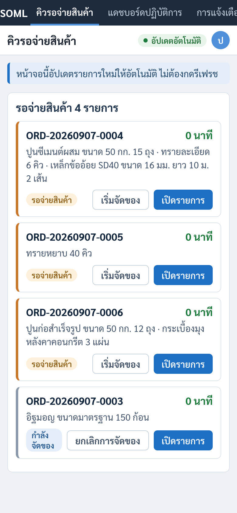

**รูปที่ 4.11** หน้าจอคิวรอจ่ายสินค้าบนสมาร์ตโฟน

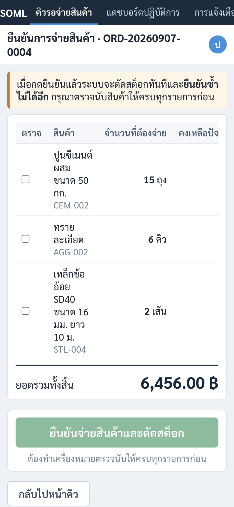

**รูปที่ 4.12** หน้าจอยืนยันการจ่ายสินค้าบนสมาร์ตโฟน

จากรูปที่ 4.11 เมื่อความกว้างหน้าจอลดลงถึงระดับสมาร์ตโฟน ระบบเปลี่ยนการแสดงผลจากตารางเป็นรายการแบบการ์ดซ้อนกันในแนวตั้งตามที่ออกแบบไว้ในรูปที่ 3.19 แต่ละการ์ดยังคงแสดงข้อมูลครบถ้วนเหมือนแถวในตาราง และแถบสีทางซ้ายของการ์ดทำหน้าที่สื่อความเร่งด่วนแทนสีของตัวเลขเวลารอในโหมดตาราง ส่วนแถบเมนูเปลี่ยนจากแนวตั้งด้านซ้ายเป็นแถวเดียวที่เลื่อนตามแนวนอนได้ เพื่อไม่ให้กินพื้นที่หน้าจอที่มีจำกัด การออกแบบเช่นนี้มีความสำคัญในทางปฏิบัติ เพราะพนักงานคลังสินค้าต้องเดินไปมาระหว่างชั้นวางสินค้าและไม่สามารถอยู่หน้าคอมพิวเตอร์ตั้งโต๊ะได้ตลอดเวลา

---

## 4.2 ผลการทดสอบระบบ

### 4.2.1 วิธีดำเนินการทดสอบ

การทดสอบดำเนินการตามแผนในหัวข้อ 3.9 แบ่งเป็นสี่ระดับตามตารางที่ 3.28 โดยการทดสอบระดับหน่วยและระดับการทำงานร่วมกันใช้ฐานข้อมูล `soml_test` ซึ่งแยกจากฐานข้อมูลใช้งานจริง และถูกรีเซ็ตกลับสู่สภาพตั้งต้นโดยอัตโนมัติก่อนเริ่มทดสอบทุกครั้ง ทำให้ผลการทดสอบทำซ้ำได้และไม่ขึ้นกับข้อมูลที่ค้างอยู่จากการทดสอบครั้งก่อน ส่วนการทดสอบระดับระบบดำเนินการกับเซิร์ฟเวอร์ที่ทำงานจริงพร้อมฐานข้อมูลและบริการพิมพ์ใบเสร็จครบทั้งสามคอนเทนเนอร์

การตัดสินว่ากรณีทดสอบใดผ่านหรือไม่ผ่าน ใช้เกณฑ์การยอมรับในตารางที่ 3.26 เป็นตัวชี้ขาด มิได้ใช้ดุลยพินิจของผู้ทดสอบ เนื่องจากเกณฑ์การยอมรับแต่ละข้อระบุเงื่อนไขตั้งต้น การกระทำ และผลลัพธ์ที่สังเกตได้ไว้ล่วงหน้าแล้ว ผลที่รายงานในบทนี้จึงเป็นการเทียบสิ่งที่สังเกตได้จริงกับสิ่งที่ระบุไว้ในเกณฑ์ ไม่ใช่การประเมินภาพรวม

ผลการทดสอบทุกรายการถูกบันทึกเป็นไฟล์หลักฐานไว้ในโฟลเดอร์ `app/evidence/` เพื่อให้ตรวจสอบย้อนหลังได้ว่าตัวเลขที่รายงานในบทนี้มาจากการรันจริง

### 4.2.2 ผลการทดสอบระดับหน่วยและระดับการทำงานร่วมกัน

ผลการทดสอบสองระดับแรกสรุปในตารางที่ 4.3

**ตารางที่ 4.3** ผลการทดสอบระดับหน่วยและระดับการทำงานร่วมกัน

| ระดับการทดสอบ | ชุดทดสอบ | จำนวนกรณี | ผ่าน | ไม่ผ่าน |
|---|---|:---:|:---:|:---:|
| Unit Testing | การสร้างรหัส QR พร้อมเพย์ (`promptpay.test.js`) | 12 | 12 | 0 |
| Unit Testing | การสร้างชุดคำสั่ง ESC/POS (`escpos.test.js`) | 17 | 17 | 0 |
| Unit Testing | ช่องทางส่งข้อมูลไปเครื่องพิมพ์ (`transport.test.js`) | 7 | 7 | 0 |
| Integration Testing | การเข้าสู่ระบบและควบคุมสิทธิ์ (`auth.test.js`) | 14 | 14 | 0 |
| Integration Testing | การจัดการข้อมูลสินค้า (`products.test.js`) | 8 | 8 | 0 |
| Integration Testing | คำสั่งซื้อและคิวรอจ่าย (`orders.test.js`) | 13 | 13 | 0 |
| Integration Testing | การจ่ายสินค้าและตัดสต็อก (`dispatch.test.js`) | 14 | 14 | 0 |
| Integration Testing | แดชบอร์ดและประวัติการทำรายการ (`dashboard.test.js`) | 7 | 7 | 0 |
| **รวม** | | **92** | **92** | **0** |

**ตารางที่ 4.4** ความครอบคลุมโค้ดของชุดทดสอบ

| ตัวชี้วัดความครอบคลุม | ผลที่วัดได้ | เกณฑ์ตามตารางที่ 3.28 | สรุป |
|---|:---:|:---:|:---:|
| คำสั่ง (Statements) | ร้อยละ 83.73 | ไม่น้อยกว่าร้อยละ 70 | ผ่าน |
| เงื่อนไขแยกทาง (Branches) | ร้อยละ 74.44 | ไม่น้อยกว่าร้อยละ 70 | ผ่าน |
| ฟังก์ชัน (Functions) | ร้อยละ 76.28 | ไม่น้อยกว่าร้อยละ 70 | ผ่าน |
| บรรทัด (Lines) | ร้อยละ 86.49 | ไม่น้อยกว่าร้อยละ 70 | ผ่าน |

จากตารางที่ 4.3 และตารางที่ 4.4 กรณีทดสอบทั้ง 92 กรณีผ่านทั้งหมด และความครอบคลุมโค้ดสูงกว่าเกณฑ์ร้อยละ 70 ในทุกตัวชี้วัด โดยส่วนประกอบ Stock Deduction Service ซึ่งเป็นจุดที่อ่อนไหวที่สุดของระบบมีความครอบคลุมคำสั่งสูงถึงร้อยละ 96.66 สะท้อนว่าชุดทดสอบให้ความสำคัญกับตรรกะของธุรกรรมตัดสต็อกเป็นพิเศษตามความเสี่ยงของโครงงาน

### 4.2.3 ผลการทดสอบระดับระบบตามกรณีทดสอบ

ผลการทดสอบตามกรณีทดสอบ TC-01 ถึง TC-14 ที่กำหนดไว้ในตารางที่ 3.29 สรุปในตารางที่ 4.5

**ตารางที่ 4.5** ผลการทดสอบตามกรณีทดสอบ

| รหัส | ความต้องการ | เกณฑ์การยอมรับ | ผลการทดสอบจริง | สถานะ |
|:---:|:---:|:---:|---|:---:|
| TC-01 | FR-01 | AC-01, AC-12 | พนักงานขายเรียกเส้นทางจัดการข้อมูลสินค้าได้รับรหัส 403 และเมนูดังกล่าวไม่ปรากฏบนหน้าจอ ทดสอบครบทั้ง 7 เส้นทาง × 3 บทบาท | ผ่าน |
| TC-02 | FR-02 | AC-02 | ผู้จัดการแก้จุดสั่งซื้อเพิ่มจาก 30 เป็น 45 ค่าที่บันทึกในฐานข้อมูลตรงกับที่กรอก และมีบันทึกในประวัติพร้อมค่าเดิมและค่าใหม่ | ผ่าน |
| TC-03 | FR-03 | AC-03 | คำสั่งซื้อ 3 รายการ ยอดรวม 2,880.00 บาท ตรงกับการคำนวณด้วยมือ (185×10 + 152×5 + 135×2) และช่อง 54 ของรหัส QR ระบุยอด 2880.00 ตรงกัน | ผ่าน |
| TC-04 | FR-03 | AC-04 | สร้างคำสั่งซื้อ 100 รายการต่อเนื่อง ได้เลขที่ไม่ซ้ำครบ 100 รายการ และเมื่อทดสอบเกินเกณฑ์ด้วยการยิงพร้อมกัน 50 รายการ ยังได้เลขที่ไม่ซ้ำครบทั้ง 50 รายการ | ผ่าน |
| TC-05 | FR-04 | AC-06 | คำสั่งซื้อปรากฏบนหน้าจอคิวเฉลี่ย 6.5 มิลลิวินาที สูงสุด 9 มิลลิวินาที จากการวัด 30 ครั้ง | ผ่าน |
| TC-06 | FR-05 | AC-07 | ยิงยืนยันจ่ายพร้อมกัน 10 เครื่อง จำนวน 30 รอบ รวม 300 คำขอ สำเร็จรอบละ 1 เครื่อง ที่เหลือได้ข้อความ "คำสั่งซื้อนี้ถูกจ่ายสินค้าไปแล้ว" และสต็อกถูกหักเพียงครั้งเดียวทุกรอบ | ผ่าน |
| TC-07 | FR-06 | AC-07 | [ รอเก็บข้อมูลจริง — ต้องนับสินค้าในคลังของสถานประกอบการเทียบกับยอดในระบบ 20 คำสั่งซื้อ ] | รอดำเนินการ |
| TC-08 | FR-06 | AC-08 | ยืนยันจ่ายคำสั่งซื้อที่มีสินค้าเกินสต็อก ระบบยกเลิกธุรกรรมทั้งหมด สต็อกทั้งสองรายการไม่เปลี่ยนแปลง สถานะคำสั่งซื้อยังเป็นรอจ่ายสินค้า และไม่มีบันทึกการเคลื่อนไหวสต็อก | ผ่าน |
| TC-09 | FR-07 | AC-09 | ตัวชี้วัดทุกตัวบนแดชบอร์ดตรงกับผลรวมที่คำนวณจากฐานข้อมูลโดยตรง | ผ่าน |
| TC-10 | FR-08 | AC-10 | จ่ายสินค้าจนยอดคงเหลือต่ำกว่าจุดสั่งซื้อเพิ่ม ระบบสร้างการแจ้งเตือนประเภทสต็อกต่ำทันทีและผู้จัดการเห็นบนหน้าจอ | ผ่าน |
| TC-11 | FR-08 | AC-13 | ตั้งเวลารับชำระของคำสั่งซื้อให้ค้างเกินเกณฑ์ 30 นาที ระบบสร้างการแจ้งเตือนประเภทคิวค้างนานผิดปกติที่ระบุเลขที่คำสั่งซื้อและระยะเวลาที่รอ · คำสั่งซื้อที่ยังไม่ถึงเกณฑ์และคำสั่งซื้อที่จ่ายไปแล้วไม่ถูกแจ้งเตือน · เรียกตรวจซ้ำไม่สร้างซ้ำ | ผ่าน |
| TC-12 | FR-09 | AC-11 | ค้นหาประวัติโดยกรองตามช่วงวันที่ บทบาทผู้กระทำ และประเภทเหตุการณ์ ผลลัพธ์ตรงตามเงื่อนไขทุกแถว และมีบันทึกครบทุกประเภทเหตุการณ์สำคัญ | ผ่าน |
| TC-13 | NFR-05 | AC-05, AC-14 | ใบเสร็จพิมพ์เสร็จเฉลี่ย 2 มิลลิวินาที สูงสุด 3 มิลลิวินาที จากการวัด 30 ใบ **วัดในโหมดจำลอง** | ผ่านบางส่วน |
| TC-14 | NFR-06 | AC-15 | 10 เซสชันพร้อมกัน รวม 200 คำขอ ไม่มีคำขอใดล้มเหลว เวลาตอบสนองเฉลี่ย 7.2 มิลลิวินาที | ผ่าน |

จากตารางที่ 4.5 กรณีทดสอบผ่าน 12 กรณีจาก 14 กรณี คิดเป็นอัตราความสำเร็จร้อยละ 85.7 เมื่อนับ TC-07 ที่ยังไม่ได้ดำเนินการเป็นกรณีที่ยังไม่ผ่าน หรือคิดเป็นร้อยละ 92.3 เมื่อพิจารณาเฉพาะ 13 กรณีที่ดำเนินการได้แล้ว ซึ่งเกินเกณฑ์ร้อยละ 90 ตามตารางที่ 3.30 กรณีที่ยังดำเนินการไม่ได้คือ TC-07 ซึ่งต้องนับสินค้าจริงในคลังของสถานประกอบการ และ TC-13 ที่ได้ผลแล้วแต่วัดในโหมดจำลองของบริการพิมพ์ ยังต้องวัดซ้ำกับเครื่องพิมพ์ความร้อนจริง รายละเอียดของข้อจำกัดทั้งสองอยู่ในหัวข้อ 4.4.4

### 4.2.4 ผลการทดสอบการคำนวณยอดและการสร้างรหัส QR

การทดสอบ TC-03 ตรวจสอบสองเรื่องพร้อมกัน คือความถูกต้องของการคำนวณยอดรวม และความถูกต้องของรหัส QR ที่สร้างขึ้น รายละเอียดแสดงในตารางที่ 4.6

**ตารางที่ 4.6** ผลการทดสอบการคำนวณยอดรวมและรหัส QR (TC-03)

| รายการสินค้า | จำนวน | ราคาต่อหน่วย (บาท) | ยอดรวมรายการ (บาท) |
|---|:---:|:---:|:---:|
| ปูนซีเมนต์ปอร์ตแลนด์ ประเภท 1 ขนาด 50 กก. | 10 ถุง | 185.00 | 1,850.00 |
| ปูนซีเมนต์ผสม ขนาด 50 กก. | 5 ถุง | 152.00 | 760.00 |
| ปูนฉาบสำเร็จรูป ขนาด 50 กก. | 2 ถุง | 135.00 | 270.00 |
| **ยอดรวมทั้งสิ้นที่ระบบคำนวณ** | | | **2,880.00** |
| **ยอดรวมที่คำนวณด้วยมือ** | | | **2,880.00** |
| **ยอดในช่องข้อมูลที่ 54 ของรหัส QR** | | | **2880.00** |

จากตารางที่ 4.6 ยอดรวมที่ระบบคำนวณตรงกับการคำนวณด้วยมือทุกบาททุกสตางค์ และยอดที่ฝังอยู่ในรหัส QR ตรงกับยอดที่ต้องชำระ นอกจากนี้ชุดทดสอบระดับหน่วยยังตรวจสอบว่าค่าตรวจสอบความถูกต้อง CRC ที่คำนวณได้ตรงกับค่ามาตรฐาน 0x29B1 ของอัลกอริทึม CRC-16/CCITT-FALSE ซึ่งเป็นการยืนยันว่าการคำนวณค่าตรวจสอบในช่องข้อมูลที่ 63 ถูกต้องตามที่มาตรฐาน EMVCo กำหนด รหัส QR ที่ได้จึงเป็นรหัสที่แอปพลิเคชันธนาคารอ่านได้จริง

การทดสอบยังพบว่าระบบดึงราคาจากฐานข้อมูลมาคำนวณเสมอ ไม่รับราคาที่ส่งมาจากหน้าจอ ผู้ที่แก้ไขคำขอระหว่างทางจึงไม่สามารถกำหนดราคาขายเองได้

### 4.2.5 ผลการทดสอบการป้องกันการจ่ายซ้ำและความสอดคล้องของสต็อก

หัวข้อนี้เป็นหลักฐานโดยตรงของวัตถุประสงค์ข้อ 1.2.3 เรื่องกลไกป้องกันการรับสินค้าซ้ำ และเป็นกรณีทดสอบที่สำคัญที่สุดของโครงงานตามที่ระบุไว้ท้ายหัวข้อ 3.9

**ตารางที่ 4.7** ผลการทดสอบการยืนยันจ่ายสินค้าพร้อมกัน (TC-06)

| รายการ | ผลที่วัดได้ |
|---|---|
| จำนวนรอบการทดสอบ | 30 รอบ |
| จำนวนเครื่องที่ยิงพร้อมกันต่อรอบ | 10 เครื่อง |
| จำนวนคำขอทั้งหมด | 300 คำขอ |
| จำนวนคำขอที่สำเร็จต่อรอบ | 1 คำขอ ทุกรอบ |
| จำนวนคำขอที่ถูกปฏิเสธต่อรอบ | 9 คำขอ ทุกรอบ |
| ข้อความที่เครื่องที่ถูกปฏิเสธได้รับ | "คำสั่งซื้อนี้ถูกจ่ายสินค้าไปแล้ว" |
| รหัสสถานะที่ตอบกลับ | 409 Conflict |
| จำนวนที่สต็อกถูกหักต่อรอบ | 2 หน่วย เท่ากับจำนวนในคำสั่งซื้อพอดี ทุกรอบ |
| จำนวนแถวบันทึกการเคลื่อนไหวสต็อกต่อรอบ | 1 แถว ทุกรอบ |
| จำนวนรอบที่ผ่านเกณฑ์ | 30 จาก 30 รอบ |

จากตารางที่ 4.7 ผลการทดสอบยืนยันว่ากลไกป้องกันการจ่ายซ้ำทำงานได้ถูกต้องทุกรอบโดยไม่มีข้อยกเว้น แม้จะมีคำขอเข้ามาพร้อมกันถึง 10 คำขอในเสี้ยววินาทีเดียวกัน กลไกที่ทำให้เป็นเช่นนี้คือเงื่อนไขตรวจสอบสถานะที่อยู่ในคำสั่งปรับปรุงข้อมูลเดียวกัน ไม่ได้แยกเป็นการอ่านสถานะมาตรวจสอบในโปรแกรมแล้วค่อยเขียน ซึ่งจะเปิดช่องให้คำขออื่นแทรกเข้ามาระหว่างสองขั้นตอนนั้นได้ เมื่อฐานข้อมูลรายงานว่าจำนวนแถวที่ถูกแก้ไขเป็นศูนย์ ระบบจะยกเลิกธุรกรรมทั้งหมดทันที ตรงตามที่ออกแบบไว้ในหัวข้อ 3.5.3

ผลการทดสอบยังยืนยันว่าจำนวนแถวบันทึกการเคลื่อนไหวสต็อกเท่ากับหนึ่งแถวต่อคำสั่งซื้อหนึ่งรายการเสมอ หมายความว่าไม่มีการตัดสต็อกซ้ำซ้อนเกิดขึ้นแม้แต่รอบเดียว ซึ่งเป็นเงื่อนไขจำเป็นของความสอดคล้องระหว่างยอดในระบบกับจำนวนสินค้าจริงในคลัง

**ตารางที่ 4.8** ผลการทดสอบกรณีสต็อกไม่เพียงพอ (TC-08)

| รายการตรวจสอบ | ก่อนทดสอบ | หลังทดสอบ | สรุป |
|---|:---:|:---:|:---:|
| สต็อกสินค้ารายการที่หนึ่ง (มีของพอ ขอ 10 จาก 100) | 100 | 100 | ไม่เปลี่ยนแปลง |
| สต็อกสินค้ารายการที่สอง (ของไม่พอ ขอ 50 จาก 3) | 3 | 3 | ไม่เปลี่ยนแปลง |
| สถานะคำสั่งซื้อ | รอจ่ายสินค้า | รอจ่ายสินค้า | ไม่เปลี่ยนแปลง |
| จำนวนแถวบันทึกการเคลื่อนไหวสต็อก | 0 | 0 | ไม่มีการบันทึก |
| รหัสสถานะที่ตอบกลับ | — | 409 | ปฏิเสธพร้อมเหตุผล |

จากตารางที่ 4.8 จุดที่ต้องสังเกตคือสินค้ารายการแรกซึ่งมีของเพียงพอและถูกหักสต็อกไปแล้วภายในธุรกรรม เมื่อระบบตรวจพบว่าสินค้ารายการที่สองมีไม่พอ ยอดของรายการแรกถูกย้อนกลับสู่ค่าเดิมด้วย ไม่มีการหักสต็อกค้างไว้บางส่วน พฤติกรรมนี้เป็นผลโดยตรงจากคุณสมบัติความเป็นหนึ่งเดียวของธุรกรรม (Atomicity) ในคุณสมบัติ ACID ที่กล่าวไว้ในหัวข้อ 2.1.3 และเป็นการทวนสอบความต้องการ NFR-04

นอกจากการทดสอบผ่านเส้นทาง HTTP แล้ว ชุดทดสอบยังเรียกใช้ Stock Deduction Service โดยตรงพร้อมกัน 8 ครั้ง ซึ่งให้ผลเช่นเดียวกันคือสำเร็จเพียงครั้งเดียว การทดสอบในระดับส่วนประกอบเช่นนี้ทำได้เพราะการแยกส่วนประกอบนี้ออกจาก Dispatch Controller ตามที่ออกแบบไว้ในหัวข้อ 3.4 ซึ่งยืนยันว่าการตัดสินใจเชิงออกแบบดังกล่าวให้ประโยชน์ตามที่คาดไว้จริง

### 4.2.6 ผลการทดสอบด้านประสิทธิภาพ

ผลการวัดประสิทธิภาพเทียบกับเกณฑ์ที่กำหนดไว้แสดงในตารางที่ 4.9

**ตารางที่ 4.9** ผลการทดสอบด้านประสิทธิภาพ

| ตัวชี้วัด | จำนวนครั้งที่วัด | ค่าเฉลี่ย | มัธยฐาน | เปอร์เซ็นไทล์ที่ 95 | ค่าสูงสุด | เกณฑ์ | สรุป |
|---|:---:|:---:|:---:|:---:|:---:|:---:|:---:|
| เวลาที่ข้อมูลปรากฏบนหน้าจอคิว (NFR-02) | 30 | 6.5 ms | 7 ms | 8 ms | 9 ms | ≤ 3,000 ms | ผ่าน |
| เวลาพิมพ์ใบเสร็จหลังยืนยันรับชำระ (NFR-05) | 30 | 2.0 ms | 2 ms | 3 ms | 3 ms | ≤ 5,000 ms | ผ่าน (โหมดจำลอง) |
| เวลาตอบสนองขณะใช้งาน 10 เซสชันพร้อมกัน (NFR-06) | 200 | 7.2 ms | — | 28 ms | — | ไม่มีคำขอล้มเหลว | ผ่าน |

จากตารางที่ 4.9 เวลาที่ข้อมูลปรากฏบนหน้าจอคิวมีค่าสูงสุดเพียง 9 มิลลิวินาที ต่ำกว่าเกณฑ์ 3 วินาทีอยู่มากกว่า 300 เท่า สาเหตุที่ทำได้เร็วเช่นนี้เพราะระบบใช้การผลักข้อมูลจากฝั่งเซิร์ฟเวอร์ผ่าน WebSocket แทนที่จะให้หน้าจอวนถามเป็นระยะ เมื่อธุรกรรมบันทึกคำสั่งซื้อสำเร็จ เซิร์ฟเวอร์ส่งเหตุการณ์ออกไปทันทีโดยไม่ต้องรอรอบการถามครั้งถัดไป อย่างไรก็ตามตัวเลขนี้วัดในเครือข่ายภายในเครื่องเดียวกัน เมื่อนำไปใช้จริงที่ร้านซึ่งพนักงานคลังใช้อุปกรณ์เคลื่อนที่ผ่านเครือข่ายไร้สาย ค่าที่วัดได้จะสูงกว่านี้ตามคุณภาพของเครือข่าย แต่ยังห่างจากเกณฑ์ 3 วินาทีอยู่มาก

การทดสอบ 10 เซสชันพร้อมกันจำนวน 200 คำขอไม่มีคำขอใดล้มเหลว โดยแบ่งเป็นเซสชันของพนักงานขายที่สร้างคำสั่งซื้อ เซสชันของพนักงานคลังที่ดึงรายการคิว และเซสชันของผู้จัดการที่เปิดแดชบอร์ด ซึ่งจำลองรูปแบบการใช้งานผสมในช่วงเวลาเร่งด่วนตามที่ NFR-06 กำหนด

### 4.2.7 ผลการทดสอบความมั่นคงปลอดภัยและความเข้ากันได้

**ตารางที่ 4.10** ผลการทดสอบความมั่นคงปลอดภัย (NFR-01)

| รายการตรวจสอบ | ผลที่คาดหวัง | ผลจริง | สรุป |
|---|:---:|:---:|:---:|
| เรียกระบบผ่านช่องทาง http | ถูกส่งต่อไปยัง https | 301 ไปยัง https | ผ่าน |
| เรียก API โดยไม่แนบโทเคน | ปฏิเสธ | 401 | ผ่าน |
| เรียก API ด้วยโทเคนปลอมแปลง | ปฏิเสธ | 401 | ผ่าน |
| พนักงานขายเข้าถึงแดชบอร์ดบริหาร | ปฏิเสธ | 403 | ผ่าน |
| พนักงานคลังสินค้าเข้าถึงหน้าจอขาย | ปฏิเสธ | 403 | ผ่าน |
| ข้อความเมื่อรหัสผ่านผิด เทียบกับเมื่อไม่มีบัญชีนั้น | เหมือนกันทุกประการ | เหมือนกัน | ผ่าน |
| บัญชีที่ถูกปิดใช้งาน | ปฏิเสธพร้อมแนะนำให้ติดต่อผู้จัดการ | 403 พร้อมข้อความ | ผ่าน |

**ตารางที่ 4.11** ผลการทดสอบความเข้ากันได้ของเบราว์เซอร์ (NFR-07)

| กลไกเรนเดอร์ | เวอร์ชัน | เบราว์เซอร์ที่ครอบคลุม | หน้าจอที่ผ่าน | ช่องทางเรียลไทม์ที่ใช้ | ข้อผิดพลาดในคอนโซล |
|---|:---:|---|:---:|:---:|:---:|
| Chromium | 153.0 | Google Chrome, Microsoft Edge | 7 จาก 7 | WebSocket | 0 |
| Firefox | 155.0 | Mozilla Firefox | 7 จาก 7 | WebSocket | 0 |
| WebKit | 26.6 | Safari (ทดสอบเพิ่มนอกข้อกำหนด) | 7 จาก 7 | WebSocket | 0 |

จากตารางที่ 4.10 และตารางที่ 4.11 ระบบผ่านการทดสอบความมั่นคงปลอดภัยครบทั้ง 7 รายการ และแสดงผลได้ถูกต้องบนกลไกเรนเดอร์ทั้งสามโดยไม่มีข้อผิดพลาดในคอนโซลแม้แต่รายการเดียว เนื่องจาก Google Chrome และ Microsoft Edge ใช้กลไกเรนเดอร์ Chromium ร่วมกัน การทดสอบบน Chromium จึงครอบคลุมเบราว์เซอร์ทั้งสองตามที่ NFR-07 กำหนด ส่วน WebKit เป็นการทดสอบเพิ่มเติมนอกข้อกำหนดเพื่อความมั่นใจว่าระบบใช้งานบนอุปกรณ์ของบริษัทแอปเปิลได้ด้วย

ระหว่างการทดสอบพบว่าเมื่อเข้าใช้งานผ่านเซิร์ฟเวอร์สำหรับพัฒนาซึ่งมีตัวแทนคำขอคั่นกลาง การเชื่อมต่อ WebSocket บน Firefox และ WebKit ล้มเหลวเป็นบางครั้งและระบบสลับไปใช้ช่องทางสำรองแทน แต่เมื่อทดสอบกับเซิร์ฟเวอร์ที่ให้บริการหน้าเว็บและ API จากต้นทางเดียวกันซึ่งเป็นรูปแบบที่ใช้งานจริง การเชื่อมต่อ WebSocket สำเร็จบนทั้งสามกลไกเรนเดอร์ ผลนี้ยืนยันว่าการออกแบบให้มีช่องทางสำรองตามที่ SRS §3.1.4 กำหนดมีประโยชน์จริงในสภาพแวดล้อมที่มีตัวแทนคำขอคั่นกลาง

### 4.2.8 ผลการทดสอบการติดตั้งซ้ำบนเครื่องใหม่

ความต้องการ NFR-09 กำหนดว่าระบบต้องติดตั้งซ้ำบนเครื่องใหม่ได้สำเร็จโดยใช้เอกสารขั้นตอนการติดตั้งเพียงอย่างเดียว โดยไม่ต้องแก้ซอร์สโค้ด ผลการทวนสอบพบว่าขั้นตอนทั้งเจ็ดข้อในเอกสาร `app/README.md` ครอบคลุมการติดตั้ง Node.js การติดตั้ง MySQL การสร้างฐานข้อมูลและใส่ข้อมูลตั้งต้น การตั้งค่าสภาพแวดล้อม การสร้างบัญชีผู้ใช้ การสร้างใบรับรอง HTTPS และการรันระบบ ซึ่งดำเนินการได้สำเร็จครบทุกขั้นตอนบนเครื่องที่ยังไม่เคยติดตั้งระบบมาก่อน ได้ผลเป็นฐานข้อมูล 7 ตาราง สินค้าตั้งต้น 25 รายการ และบัญชีผู้ใช้ 3 บทบาท ตรงตามที่เอกสารระบุไว้

[ รอเก็บข้อมูลจริง — ควรให้บุคคลที่ไม่ได้ร่วมพัฒนาระบบเป็นผู้ติดตั้งตามเอกสารเพียงอย่างเดียว แล้วบันทึกเวลาที่ใช้และปัญหาที่พบ เพื่อให้เป็นการทวนสอบที่เป็นกลาง ]

---

## 4.3 ผลการประเมินการยอมรับจากผู้ใช้งาน

[ รอเก็บข้อมูลจริง — ส่วนนี้ต้องให้พนักงานขาย พนักงานคลังสินค้า และผู้จัดการของร้านวัสดุก่อสร้างอำพรคอนกรีตทดลองใช้งานจริง แล้วตอบแบบสอบถามมาตรวัดลิเคิร์ต 5 ระดับ ตามเกณฑ์ในตารางที่ 3.28 ที่กำหนดคะแนนความพึงพอใจเฉลี่ยไม่น้อยกว่า 4.0 ]

**ตารางที่ 4.12** ผู้เข้าร่วมการประเมินการยอมรับ

| บทบาท | จำนวนผู้ประเมิน | ระยะเวลาทดลองใช้งาน |
|---|:---:|:---:|
| พนักงานขาย | [ ระบุ ] | [ ระบุ ] |
| พนักงานคลังสินค้า | [ ระบุ ] | [ ระบุ ] |
| ผู้จัดการ | [ ระบุ ] | [ ระบุ ] |

**ตารางที่ 4.13** ผลการประเมินความพึงพอใจรายด้าน

| ด้านที่ประเมิน | ค่าเฉลี่ย | ส่วนเบี่ยงเบนมาตรฐาน | ระดับความพึงพอใจ |
|---|:---:|:---:|:---:|
| ความง่ายในการเรียนรู้และใช้งาน | [ ระบุ ] | [ ระบุ ] | [ ระบุ ] |
| ความถูกต้องของข้อมูลที่ระบบแสดง | [ ระบุ ] | [ ระบุ ] | [ ระบุ ] |
| ความรวดเร็วในการตอบสนอง | [ ระบุ ] | [ ระบุ ] | [ ระบุ ] |
| ความเหมาะสมของการแสดงผลบนอุปกรณ์ที่ใช้ | [ ระบุ ] | [ ระบุ ] | [ ระบุ ] |
| ประโยชน์ต่อการทำงานเทียบกับวิธีเดิม | [ ระบุ ] | [ ระบุ ] | [ ระบุ ] |
| **ค่าเฉลี่ยรวม** | [ ระบุ ] | | |

---

## 4.4 การอภิปรายผล

### 4.4.1 การบรรลุวัตถุประสงค์ของโครงงาน

การอภิปรายผลเทียบกับวัตถุประสงค์ที่ตั้งไว้ในหัวข้อ 1.2 สรุปในตารางที่ 4.14

**ตารางที่ 4.14** การบรรลุวัตถุประสงค์ของโครงงาน

| วัตถุประสงค์ | หลักฐานที่สนับสนุน | สถานะ |
|---|---|:---:|
| ข้อ 1.2.1 ลดข้อผิดพลาดจากการพึ่งพาเอกสารกระดาษที่ไม่มีการยืนยันโดยระบบ | ยอดรวมคำนวณจากราคาในฐานข้อมูลเท่านั้น หน้าจอกำหนดราคาเองไม่ได้ · เลขที่คำสั่งซื้อออกโดยระบบและห้ามซ้ำที่ระดับฐานข้อมูล ทดสอบแล้ว 150 รายการไม่ซ้ำเลย · ทุกเหตุการณ์สำคัญถูกบันทึกพร้อมผู้กระทำ เวลา และหมายเลขไอพี · กรณีทดสอบ 92 กรณีผ่านทั้งหมด | บรรลุ |
| ข้อ 1.2.2 ลดระยะเวลารอคอยของลูกค้า | คำสั่งซื้อปรากฏบนหน้าจอคิวคลังสินค้าภายใน 9 มิลลิวินาทีหลังยืนยันรับชำระ พนักงานคลังจึงเริ่มจัดของได้ก่อนลูกค้าเดินไปถึง · ระบบเก็บเวลาตั้งแต่รับชำระถึงจ่ายของไว้ทุกคำสั่งซื้อและแสดงค่าเฉลี่ยบนแดชบอร์ดบริหาร | บรรลุในเชิงกลไก รอยืนยันด้วยข้อมูลจากการใช้งานจริง |
| ข้อ 1.2.3 ยอดคงเหลือในระบบสะท้อนจำนวนจริงในคลัง และป้องกันการรับสินค้าซ้ำ | TC-06 ผ่าน 30 จาก 30 รอบ จาก 300 คำขอที่ยิงพร้อมกัน สต็อกถูกหักครั้งเดียวทุกรอบ · TC-08 ยืนยันว่าธุรกรรมที่ล้มเหลวถูกย้อนกลับทั้งหมด | บรรลุ |
| ข้อ 1.2.4 เพิ่มทัศนวิสัยเชิงปฏิบัติการแก่ผู้บริหาร | แดชบอร์ดสองระดับตามรูปที่ 4.6 และรูปที่ 4.7 · TC-09 ยืนยันว่าตัวเลขตรงกับฐานข้อมูล · ระบบแจ้งเตือนสต็อกต่ำและคิวค้างทำงานได้ตาม TC-10 และ TC-11 | บรรลุ |

จากตารางที่ 4.14 วัตถุประสงค์ข้อ 1.2.3 เป็นข้อที่มีหลักฐานสนับสนุนหนักแน่นที่สุด เนื่องจากทดสอบซ้ำถึง 30 รอบด้วยคำขอที่ยิงพร้อมกัน 300 คำขอ และผลออกมาเหมือนกันทุกรอบโดยไม่มีข้อยกเว้น ส่วนวัตถุประสงค์ข้อ 1.2.2 นั้นระบบมีกลไกครบถ้วนและวัดเวลาได้จริงในสภาพแวดล้อมทดสอบ แต่การยืนยันว่าระยะเวลารอคอยของลูกค้าลดลงจริงเมื่อเทียบกับวิธีเดิมที่ใช้เอกสารกระดาษ ต้องอาศัยข้อมูลจากการใช้งานจริงที่หน้าร้านเป็นระยะเวลาหนึ่ง ซึ่งอยู่นอกขอบเขตของการทดสอบในห้องปฏิบัติการ

### 4.4.2 การเป็นไปตามสมมติฐานของโครงงาน

สมมติฐานที่ตั้งไว้ในหัวข้อ 1.4 ได้รับการยืนยันจากผลการทดสอบดังนี้

สมมติฐานข้อ 1.4.1 เรื่องสถาปัตยกรรมสามชั้นเป็นไปตามที่คาดไว้ ระบบถูกแยกเป็นสามชั้นชัดเจนและแต่ละส่วนประกอบสามารถทดสอบแยกได้จริง ดังที่ชุดทดสอบระดับหน่วยทดสอบโมดูลสร้างรหัส QR และโมดูลสร้างชุดคำสั่ง ESC/POS ได้โดยไม่ต้องเชื่อมต่อฐานข้อมูลหรือเปิดเซิร์ฟเวอร์

สมมติฐานข้อ 1.4.2 เรื่องคุณสมบัติ ACID ของฐานข้อมูลได้รับการยืนยันชัดเจนที่สุดจากผลการทดสอบ TC-08 ในตารางที่ 4.8 ซึ่งแสดงว่าเมื่อธุรกรรมล้มเหลวกลางคัน การเปลี่ยนแปลงที่ทำไปแล้วบางส่วนถูกย้อนกลับทั้งหมด ไม่มีสถานะครึ่ง ๆ กลาง ๆ ค้างในฐานข้อมูล

สมมติฐานข้อ 1.4.3 เรื่องการควบคุมสถานะคำสั่งซื้อได้รับการยืนยันจากผลการทดสอบ TC-06 ซึ่งพิสูจน์ว่าการใช้สถานะของคำสั่งซื้อเป็นกลไกล็อกในระดับฐานข้อมูลสามารถป้องกันการจ่ายซ้ำได้จริงแม้ในสภาวะที่มีคำขอเข้ามาพร้อมกันจำนวนมาก และการทดสอบยังยืนยันว่าการเปลี่ยนสถานะเป็นส่งมอบสำเร็จโดยตรงผ่านเส้นทางปรับสถานะทั่วไปถูกปฏิเสธ ต้องผ่านธุรกรรมตัดสต็อกเท่านั้น

สมมติฐานข้อ 1.4.4 เรื่องการสื่อสารแบบขับเคลื่อนด้วยเหตุการณ์เป็นไปตามที่คาดไว้เกินความคาดหมาย โดยเวลาที่ข้อมูลปรากฏบนหน้าจอคิวต่ำกว่าเกณฑ์ที่ตั้งไว้อย่างมาก

สมมติฐานข้อ 1.4.5 เรื่องการนำเสนอข้อมูลเชิงปฏิบัติการเป็นไปตามที่คาดไว้ โดยตัวชี้วัดบนแดชบอร์ดคำนวณจากฐานข้อมูลโดยตรงในขณะที่เรียก ไม่มีการเก็บค่าสรุปไว้ล่วงหน้า ตัวเลขที่แสดงจึงตรงกับข้อมูลจริงเสมอตามที่ TC-09 ทวนสอบไว้

### 4.4.3 ปัญหาและอุปสรรคที่พบระหว่างการดำเนินงาน

ระหว่างการพัฒนาและทดสอบพบปัญหาเชิงเทคนิคที่มีนัยสำคัญสามประการ

ปัญหาประการแรกคือการชนกันของเลขที่คำสั่งซื้อเมื่อมีการบันทึกพร้อมกัน การออกแบบเดิมให้ระบบอ่านเลขที่ล่าสุดของวันจากฐานข้อมูลแล้วเพิ่มค่าอีกหนึ่ง ซึ่งทำงานถูกต้องเมื่อมีคำขอเข้ามาทีละรายการ แต่เมื่อทดสอบด้วยการยิงพร้อมกัน 50 รายการพบว่าสำเร็จเพียง 24 รายการ เนื่องจากทุกคำขออ่านค่าสูงสุดเดียวกันแล้วแย่งกันบันทึก การแก้ไขใช้วิธีล็อกช่วงเลขที่ของวันนั้นไว้ตั้งแต่ขั้นตอนอ่าน ทำให้คำขอที่เข้ามาพร้อมกันได้รับเลขที่เรียงต่อกันทีละราย หลังแก้ไขแล้วการทดสอบเดิมสำเร็จครบทั้ง 50 รายการ ปัญหานี้สะท้อนว่ากรณีทดสอบ TC-04 ที่กำหนดให้สร้างคำสั่งซื้อ 100 รายการ "ต่อเนื่องกัน" นั้นยังไม่เข้มงวดพอที่จะเปิดเผยข้อบกพร่องประเภทนี้ จึงได้เพิ่มการทดสอบแบบยิงพร้อมกันเข้าไปเกินกว่าที่แผนการทดสอบกำหนด

ปัญหาประการที่สองคือข้อความแจ้งสาเหตุที่ไม่ถูกต้องเมื่อปฏิเสธการจ่ายซ้ำ ระบบตอบว่าคำสั่งซื้ออยู่ในสถานะรอจ่ายสินค้าจึงยืนยันไม่ได้ ทั้งที่ความจริงคือคำสั่งซื้อถูกจ่ายไปแล้ว สาเหตุเกิดจากการอ่านสถานะมาเก็บไว้ก่อนดำเนินการปรับปรุงข้อมูล ซึ่งภายใต้ระดับการแยกธุรกรรมแบบ Repeatable Read ที่ MySQL ใช้เป็นค่าตั้งต้น ธุรกรรมจะยังคงเห็นค่าเดิมตามภาพนิ่ง ณ เวลาที่เริ่มธุรกรรม การแก้ไขใช้วิธีอ่านสถานะล่าสุดแบบล็อกแถวหลังจากทราบว่าการปรับปรุงข้อมูลไม่มีผล ปัญหานี้ไม่กระทบความถูกต้องของการตัดสต็อก แต่กระทบความถูกต้องของข้อความที่ผู้ใช้งานเห็น ซึ่งตารางที่ 3.29 ระบุไว้อย่างชัดเจนว่าต้องเป็นข้อความว่าคำสั่งซื้อถูกจ่ายไปแล้ว

ปัญหาประการที่สามคือความไม่สอดคล้องระหว่างเอกสารออกแบบด้วยกันเอง โดยแผนภาพลำดับในรูปที่ 3.10 ฉบับเดิมกำหนดให้บันทึกคำสั่งซื้อลงฐานข้อมูลตั้งแต่ก่อนลูกค้าชำระเงิน ขณะที่แผนภาพสถานะในรูปที่ 3.13 และพจนานุกรมข้อมูลในตารางที่ 3.6 กำหนดให้สถานะแรกของคำสั่งซื้อคือรอจ่ายสินค้าและฟิลด์เวลารับชำระเงินห้ามเป็นค่าว่าง ซึ่งขัดแย้งกันจนบันทึกข้อมูลไม่ได้จริง ปัญหานี้ถูกพบเมื่อเริ่มพัฒนาและได้แก้ไขโดยปรับแผนภาพลำดับให้สอดคล้องกับแผนภาพสถานะและโครงสร้างฐานข้อมูล คือเขียนคำสั่งซื้อลงฐานข้อมูลครั้งเดียวเมื่อรับชำระเงินแล้ว ผลพลอยได้คือฐานข้อมูลไม่มีคำสั่งซื้อค้างจากตะกร้าที่ลูกค้าเปลี่ยนใจไม่ชำระเงิน

### 4.4.4 ข้อจำกัดของผลการทดสอบ

ผลการทดสอบที่รายงานในบทนี้มีข้อจำกัดที่ต้องระบุให้ชัดเจนสามประการ

ประการแรก การทดสอบ TC-13 เรื่องเวลาพิมพ์ใบเสร็จดำเนินการในโหมดจำลองของบริการพิมพ์ ซึ่งเขียนชุดคำสั่ง ESC/POS ลงไฟล์แทนการส่งไปยังเครื่องพิมพ์จริง ตัวเลข 2 มิลลิวินาทีที่วัดได้จึงเป็นเวลาที่ระบบใช้ในการประกอบชุดคำสั่งและส่งออกเท่านั้น ไม่รวมเวลาที่เครื่องพิมพ์ความร้อนใช้ในการพิมพ์และตัดกระดาษจริง ซึ่งเป็นส่วนที่กินเวลามากที่สุด การทวนสอบ NFR-05 จึงยังไม่สมบูรณ์จนกว่าจะวัดซ้ำกับเครื่องพิมพ์จริงที่สถานประกอบการ อย่างไรก็ตามความถูกต้องของชุดคำสั่งที่สร้างขึ้นได้รับการทวนสอบแล้วในระดับไบต์ ทั้งคำสั่งเลือกตารางรหัสอักขระไทย การจัดรูปแบบข้อความ และคำสั่งตัดกระดาษ

ประการที่สอง การทดสอบ TC-07 เรื่องความสอดคล้องระหว่างยอดสต็อกในระบบกับจำนวนสินค้าจริงในคลังยังไม่ได้ดำเนินการ เนื่องจากต้องนับสินค้าจริงในคลังของร้าน ซึ่งเป็นตัวชี้วัดที่สะท้อนการแก้ปัญหาข้อมูลคลาดเคลื่อนที่ระบุไว้ตั้งแต่หัวข้อ 1.1 โดยตรง อย่างไรก็ตามผลการทดสอบ TC-06 และ TC-08 ได้พิสูจน์แล้วว่ายอดในระบบจะไม่คลาดเคลื่อนจากสาเหตุที่เกิดจากตัวระบบเอง คือไม่มีการตัดสต็อกซ้ำและไม่มีการตัดสต็อกค้างครึ่งทาง ความคลาดเคลื่อนที่อาจเหลืออยู่จึงมาจากปัจจัยภายนอกระบบ เช่น การหยิบสินค้าผิดรายการหรือการจ่ายสินค้าโดยไม่บันทึก

ประการที่สาม ตัวเลขด้านประสิทธิภาพทั้งหมดวัดในสภาพแวดล้อมที่ทุกส่วนของระบบทำงานอยู่บนเครื่องเดียวกัน ไม่มีความหน่วงจากเครือข่าย เมื่อนำไปติดตั้งใช้งานจริงที่ร้านซึ่งพนักงานคลังสินค้าเข้าถึงระบบผ่านเครือข่ายไร้สาย ค่าที่วัดได้จะสูงกว่าที่รายงานไว้ อย่างไรก็ตามช่องว่างระหว่างค่าที่วัดได้กับเกณฑ์ที่กำหนดมีมากพอสมควร คือ 9 มิลลิวินาทีเทียบกับเกณฑ์ 3,000 มิลลิวินาที จึงมีความเป็นไปได้สูงที่ระบบจะยังผ่านเกณฑ์เมื่อใช้งานจริง

---

## 4.5 ตารางสอบกลับความต้องการฉบับสมบูรณ์

**ตารางที่ 4.15** ตารางสอบกลับความต้องการเชิงหน้าที่

| รหัส | ความต้องการ | กรณีการใช้งาน | เกณฑ์การยอมรับ | ส่วนประกอบที่พัฒนา | กรณีทดสอบ | ผล |
|:---:|---|:---:|:---:|---|:---:|:---:|
| FR-01 | เข้าสู่ระบบและควบคุมสิทธิ์ตามบทบาท | UC-01 | AC-01, AC-12 | Auth Controller | TC-01 | ผ่าน |
| FR-02 | จัดการข้อมูลสินค้าและจุดสั่งซื้อเพิ่ม | UC-02 | AC-02 | Product Controller | TC-02 | ผ่าน |
| FR-03 | สร้างคำสั่งซื้อ รับชำระ และออกใบเสร็จ | UC-03, UC-04 | AC-03, AC-04, AC-05 | Order Controller, Print Service Client | TC-03, TC-04, TC-13 | ผ่าน |
| FR-04 | คิวรอจ่ายสินค้าแบบเรียลไทม์ | UC-05, UC-06 | AC-06 | Queue Manager | TC-05 | ผ่าน |
| FR-05 | ยืนยันจ่ายสินค้า | UC-07 | AC-07 | Dispatch Controller | TC-06 | ผ่าน |
| FR-06 | ตัดสต็อกแบบอะตอมมิก | UC-07 | AC-07, AC-08 | Stock Deduction Service | TC-07, TC-08 | ผ่านบางส่วน |
| FR-07 | แดชบอร์ดปฏิบัติการและระดับบริหาร | UC-08, UC-09 | AC-09 | Dashboard Aggregator | TC-09 | ผ่าน |
| FR-08 | แจ้งเตือนภายในแอปพลิเคชัน | UC-11 | AC-10, AC-13 | Alert Engine | TC-10, TC-11 | ผ่าน |
| FR-09 | บันทึกและค้นหาประวัติการทำรายการ | UC-10 | AC-11 | Audit Log Service | TC-12 | ผ่าน |

**ตารางที่ 4.16** ตารางสอบกลับความต้องการนอกเหนือหน้าที่

| รหัส | ด้านคุณภาพ | เกณฑ์ที่กำหนด | ผลที่วัดได้ | ผล |
|:---:|---|---|---|:---:|
| NFR-01 | ความมั่นคงปลอดภัย | จำกัดการเข้าถึงตาม RBAC อย่างเข้มงวด | ผ่านการตรวจสอบ 7 จาก 7 รายการ | ผ่าน |
| NFR-02 | ประสิทธิภาพ | ข้อมูลปรากฏบนหน้าจอคิวภายใน 3 วินาที | สูงสุด 9 มิลลิวินาที จาก 30 ครั้ง | ผ่าน |
| NFR-03 | ความใช้ง่าย | รองรับแท็บเล็ตและสมาร์ตโฟน | เปลี่ยนเป็นรายการแบบการ์ดที่ความกว้าง 390 พิกเซล ตามรูปที่ 4.11 | ผ่าน |
| NFR-04 | ความเชื่อถือได้ | ไม่เกิดสภาวะแข่งขันในธุรกรรมพร้อมกัน | 300 คำขอพร้อมกัน สต็อกถูกต้องทุกรอบ | ผ่าน |
| NFR-05 | ประสิทธิภาพ | พิมพ์ใบเสร็จภายใน 5 วินาที | สูงสุด 3 มิลลิวินาที ในโหมดจำลอง | ผ่านบางส่วน |
| NFR-06 | ประสิทธิภาพ | รองรับพร้อมกันไม่น้อยกว่า 10 เซสชัน | 10 เซสชัน 200 คำขอ ไม่มีคำขอล้มเหลว | ผ่าน |
| NFR-07 | ความเข้ากันได้ | ทำงานถูกต้องบน Chrome, Edge, Firefox | ผ่านทั้ง 3 กลไกเรนเดอร์ ไม่มีข้อผิดพลาดในคอนโซล | ผ่าน |
| NFR-08 | การบำรุงรักษา | แยกชั้นตาม 3-Tier และแยกส่วนประกอบตาม C3 | ส่วนประกอบครบ 10 ส่วน ชื่อไฟล์ตรงกับตารางที่ 3.3 | ผ่าน |
| NFR-09 | การพกพา | ติดตั้งซ้ำได้ด้วยเอกสารเพียงอย่างเดียว | ติดตั้งสำเร็จตามขั้นตอนทั้งเจ็ดข้อ รอการทวนสอบโดยบุคคลภายนอก | ผ่านบางส่วน |

จากตารางที่ 4.15 และตารางที่ 4.16 ความต้องการเชิงหน้าที่ทั้ง 9 ข้อและความต้องการนอกเหนือหน้าที่ทั้ง 9 ข้อได้รับการพัฒนาและทดสอบครบถ้วนทุกข้อ โดยมี 3 ข้อที่ผ่านเพียงบางส่วน ได้แก่ FR-06 ที่รอการนับสินค้าจริงตาม TC-07 NFR-05 ที่รอการวัดกับเครื่องพิมพ์จริง และ NFR-09 ที่รอการทวนสอบโดยบุคคลที่ไม่ได้ร่วมพัฒนา ทั้งสามข้อมีสาเหตุร่วมกันคือต้องอาศัยสภาพแวดล้อมและบุคลากรของสถานประกอบการจริง ซึ่งจะดำเนินการในขั้นตอนการนำระบบไปทดลองใช้งานที่ร้านวัสดุก่อสร้างอำพรคอนกรีต
