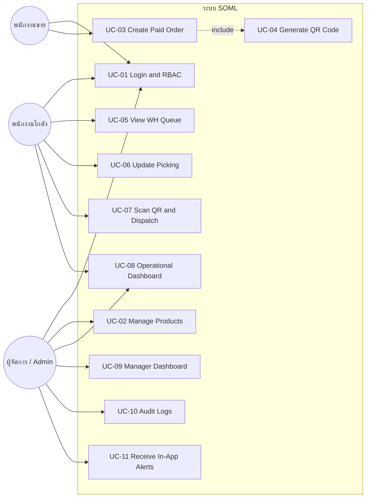
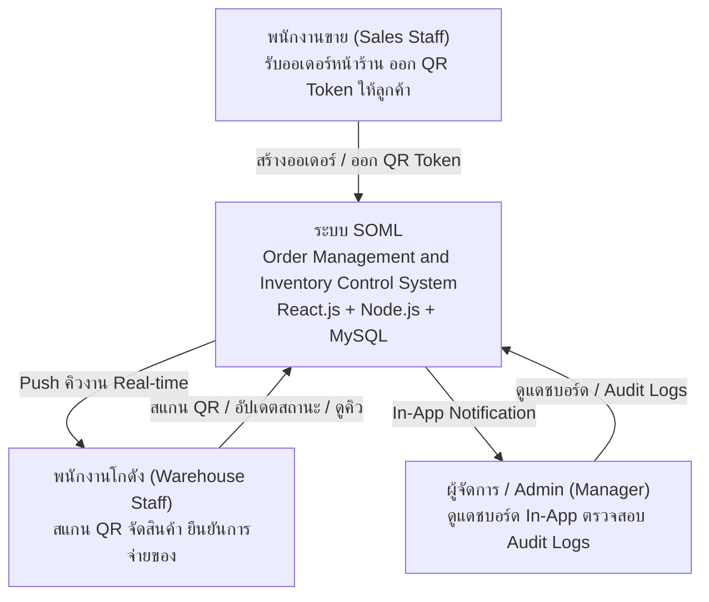
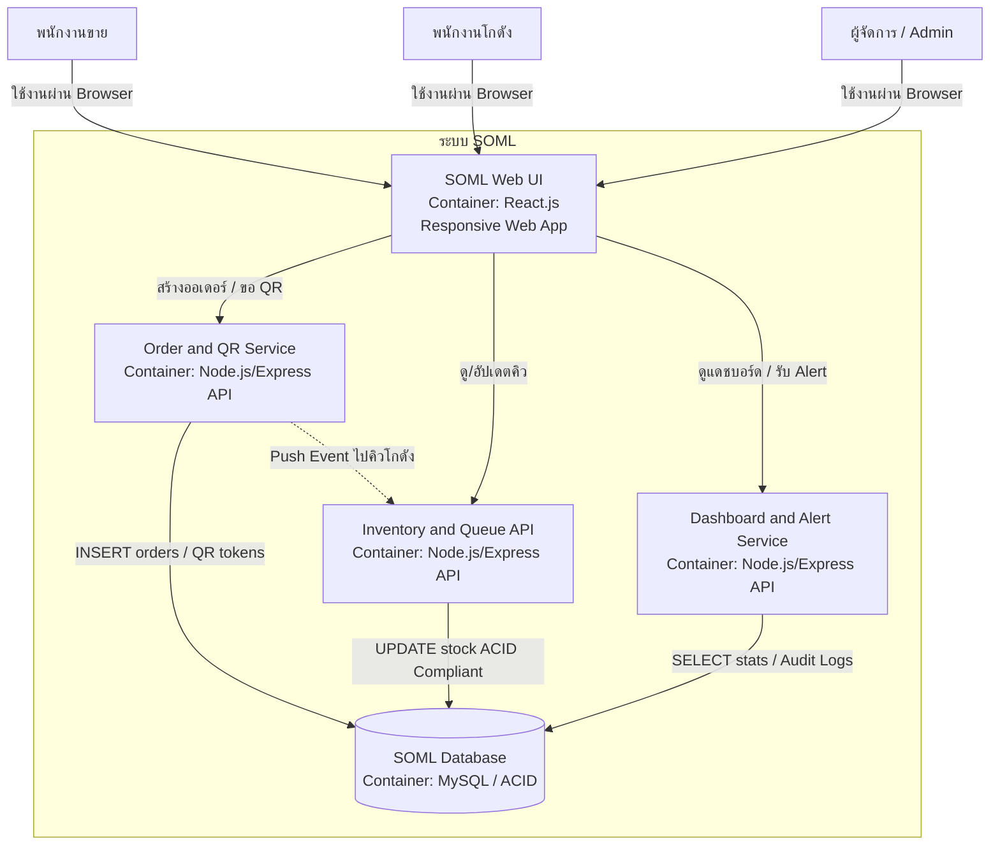
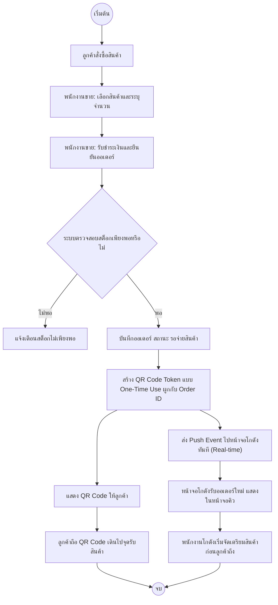
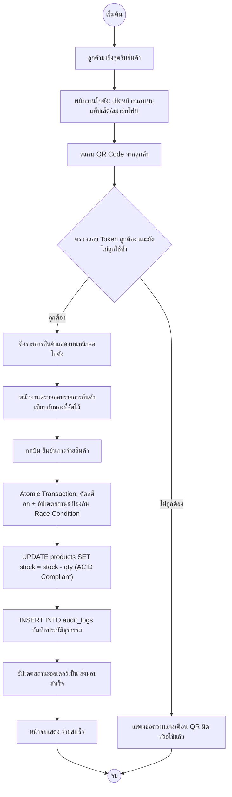
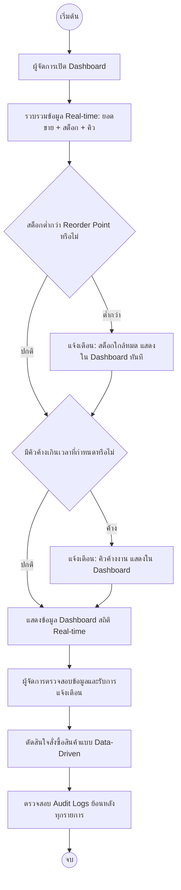
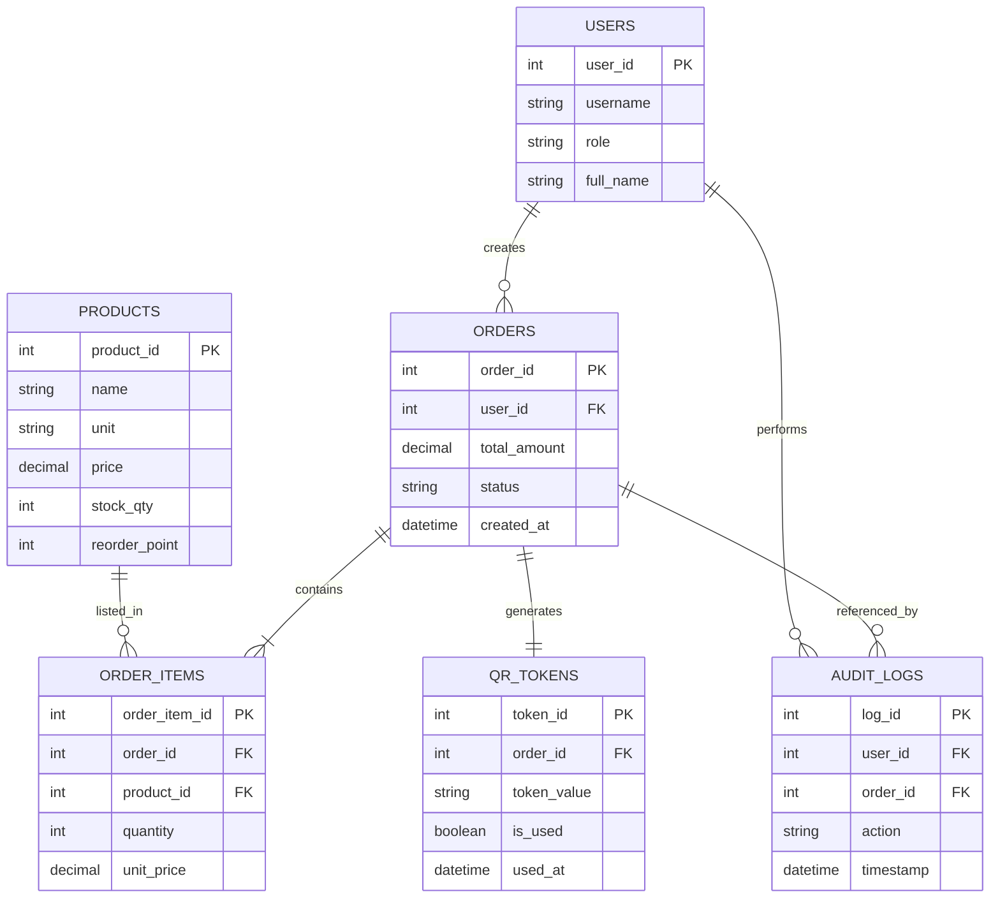

# เอกสารข้อกำหนดความต้องการซอฟต์แวร์ (Software Requirements Specification)

**ระบบจัดการคำสั่งซื้อและตรวจสอบคลังสินค้า (SOML) — กรณีศึกษา: ร้านวัสดุก่อสร้างอำพรคอนกรีต**
*Order Management and Inventory Control System: A Case Study of Amporn Concrete Building Materials Store*

---

### ข้อมูลควบคุมเอกสาร (Document Control)

| รายการ | รายละเอียด |
|---|---|
| รหัสโครงงาน | SE02 |
| หลักสูตร | วิศวกรรมซอฟต์แวร์ สาขาวิศวกรรมไฟฟ้า คณะวิศวกรรมศาสตร์ มหาวิทยาลัยเทคโนโลยีราชมงคลล้านนา |
| ปีการศึกษา | 2/2568 |
| หัวหน้าโครงงาน | นายตรัยรัตน์ วงศ์สิทธิ์ (รหัสนักศึกษา 67543210028-6) |
| ผู้ร่วมโครงงาน | นายพนาวุฒน์ อภิปสันติ (รหัสนักศึกษา 67543210040-1) |
| อาจารย์ที่ปรึกษา | อาจารย์ธนิต เกตุแก้ว |
| เอกสารต้นทาง | แบบเสนอหัวข้อโครงงานวิศวกรรม (แบบฟอร์ม SE02) ลงวันที่ 20 มีนาคม 2569 |
| เวอร์ชันเอกสารนี้ | 1.0 |
| วันที่จัดทำ | 2 กรกฎาคม 2569 |

**ประวัติการแก้ไข (Revision History)**

| เวอร์ชัน | วันที่ | รายละเอียดการเปลี่ยนแปลง | จัดทำโดย |
|---|---|---|---|
| 1.0 | 2 ก.ค. 2569 | จัดทำฉบับแรก โดยแปลงเนื้อหาจากแบบฟอร์ม SE02 (บทคัดย่อ, BR, FR, NFR, Use Case, สถาปัตยกรรมระบบ) ให้อยู่ในรูปแบบ SRS ตามแนวทาง IEEE 830 | คณะผู้จัดทำ |

---

## สารบัญ

1. บทนำ (Introduction)
2. รายละเอียดโดยรวมของระบบ (Overall Description)
3. ความต้องการทางธุรกิจ (Business Requirements)
4. ความต้องการเชิงฟังก์ชัน (Functional Requirements)
5. ความต้องการที่ไม่ใช่เชิงฟังก์ชัน (Non-Functional Requirements)
6. ความต้องการด้านส่วนติดต่อภายนอก (External Interface Requirements)
7. แบบจำลองกรณีการใช้งาน (Use Case Model)
8. ภาพรวมสถาปัตยกรรมระบบ (System Architecture Overview)
9. แบบจำลองกระบวนการทำงาน (Process Flow / Activity Diagrams)
10. แบบจำลองข้อมูลเบื้องต้น (Preliminary Data Model)
11. การสอบย้อนกลับของความต้องการ (Requirements Traceability)
12. เกณฑ์การตรวจสอบและยอมรับ (Verification and Acceptance Criteria)
13. เอกสารอ้างอิง (References)

ภาคผนวก ก: อภิธานศัพท์ (Glossary)

---

## 1. บทนำ (Introduction)

### 1.1 วัตถุประสงค์ของเอกสาร (Purpose)

เอกสารฉบับนี้จัดทำขึ้นเพื่อกำหนดขอบเขตและรายละเอียดความต้องการของ **ระบบจัดการคำสั่งซื้อและตรวจสอบคลังสินค้า (Order Management and Inventory Control System)** หรือเรียกโดยย่อว่า **SOML** ซึ่งพัฒนาขึ้นสำหรับร้านวัสดุก่อสร้างอำพรคอนกรีต โดยมีวัตถุประสงค์เพื่อใช้เป็นข้อตกลงร่วมกันระหว่างคณะผู้จัดทำโครงงาน อาจารย์ที่ปรึกษา และสถานประกอบการ ในการกำหนดขอบเขตฟังก์ชันการทำงาน คุณภาพของระบบ และเงื่อนไขต่าง ๆ ก่อนเข้าสู่ขั้นตอนการออกแบบระบบ (System Design) และการพัฒนา (Implementation) ต่อไป

เอกสารนี้เรียบเรียงและขยายความจากเอกสาร **แบบเสนอหัวข้อโครงงานวิศวกรรม (แบบฟอร์ม SE02)** ให้อยู่ในรูปแบบเอกสารข้อกำหนดความต้องการซอฟต์แวร์ (SRS) ตามแนวทางมาตรฐาน IEEE 830 โดยยังคงรักษารหัสอ้างอิงเดิม (BR-xx, FR-xx, NFR-xx, UC-xx) ไว้ทั้งหมด เพื่อให้สามารถสอบย้อนกลับ (Traceability) ระหว่างสองเอกสารได้

### 1.2 ที่มาและปัญหาของระบบเดิม (Background)

ร้านวัสดุก่อสร้างขนาดกลางและขนาดเล็กโดยทั่วไป รวมถึงร้านวัสดุก่อสร้างอำพรคอนกรีต ยังคงพึ่งพากระบวนการทางเอกสารกายภาพในการบันทึกการขายและจัดการสต็อกสินค้า พนักงานขายบันทึกรายการด้วยใบเสร็จกระดาษ ขณะที่จุดชำระเงินหน้าร้านและจุดจ่ายสินค้าที่โกดังไม่มีช่องทางสื่อสารกันแบบเรียลไทม์ ลูกค้าต้องถือใบเสร็จเดินไปที่โกดังด้วยตนเอง ทำให้เกิดปัญหาคอขวด (Bottleneck) ความล่าช้าในการรอคอย ความผิดพลาดจากการอ่านเอกสารด้วยสายตา ยอดสต็อกที่คลาดเคลื่อนจากความเป็นจริง และการขาดทัศนวิสัยในการบริหารจัดการ (Lack of Visibility) ที่ทำให้ผู้บริหารต้องตัดสินใจสั่งซื้อสินค้าด้วยประสบการณ์และสัญชาตญาณแทนข้อมูลจริง

ระบบ SOML จึงถูกออกแบบขึ้นเพื่อเชื่อมโยงกระบวนการหน้าร้านและคลังสินค้าเข้าด้วยกัน ผ่านเทคโนโลยี QR Code แบบโทเค็นดิจิทัลใช้ครั้งเดียว การแสดงคิวงานแบบเรียลไทม์ การตัดสต็อก ณ จุดจ่ายสินค้าด้วยธุรกรรมเชิงอะตอมมิก และแดชบอร์ดปฏิบัติการพร้อมระบบแจ้งเตือนภายในแอปพลิเคชัน

### 1.3 ขอบเขตของผลิตภัณฑ์ (Product Scope)

SOML เป็นเว็บแอปพลิเคชัน (Web Application) แบบ Responsive Design ที่รองรับผู้ใช้งาน 3 บทบาทหลัก ได้แก่ พนักงานขาย พนักงานคลังสินค้า และผู้จัดการ/Admin ครอบคลุมการทำงานตั้งแต่การสร้างคำสั่งซื้อและออก QR Code การจัดการคิวงานคลังสินค้าแบบเรียลไทม์ การตัดสต็อกอัตโนมัติ ไปจนถึงแดชบอร์ดปฏิบัติการและระบบแจ้งเตือนภายในแอปพลิเคชัน รายละเอียดขอบเขตทั้งหมดแสดงในหัวข้อที่ 2.6 และความต้องการทางธุรกิจในหัวข้อที่ 3

### 1.4 คำนิยาม คำย่อ และตัวย่อ (Definitions, Acronyms, and Abbreviations)

ดูภาคผนวก ก: อภิธานศัพท์ ท้ายเอกสาร

### 1.5 เอกสารอ้างอิง (References)

ดูหัวข้อที่ 13: เอกสารอ้างอิง

### 1.6 โครงสร้างของเอกสาร (Document Overview)

เอกสารฉบับนี้เริ่มจากภาพรวมของระบบและกลุ่มผู้ใช้งาน (หัวข้อ 2) ตามด้วยความต้องการทางธุรกิจ ความต้องการเชิงฟังก์ชัน และความต้องการที่ไม่ใช่เชิงฟังก์ชัน (หัวข้อ 3–5) ความต้องการด้านส่วนติดต่อภายนอก (หัวข้อ 6) แบบจำลองกรณีการใช้งานและสถาปัตยกรรมระบบ (หัวข้อ 7–9) แบบจำลองข้อมูล (หัวข้อ 10) ตารางการสอบย้อนกลับ (หัวข้อ 11) และเกณฑ์การตรวจสอบยอมรับระบบ (หัวข้อ 12)

---

## 2. รายละเอียดโดยรวมของระบบ (Overall Description)

### 2.1 มุมมองของผลิตภัณฑ์ (Product Perspective)

SOML เป็นระบบที่พัฒนาขึ้นใหม่ทั้งหมด (Green-field Development) เพื่อทดแทนกระบวนการทำงานแบบกระดาษที่ใช้อยู่เดิม โดยไม่มีการเชื่อมต่อกับระบบ ERP ภายนอกหรือระบบของซัพพลายเออร์ ระบบถูกออกแบบภายใต้สถาปัตยกรรมแบบ 3 ชั้น (3-Tier Architecture) ประกอบด้วย

- **Presentation Layer:** เว็บแอปพลิเคชัน Responsive พัฒนาด้วย React.js
- **Application/Business Logic Layer:** ประมวลผลตรรกะธุรกิจ ควบคุมสิทธิ์ (RBAC) และจัดการเหตุการณ์แบบเรียลไทม์ (Event-Driven) พัฒนาด้วย Node.js และ Express.js
- **Data Layer:** ฐานข้อมูลเชิงสัมพันธ์ MySQL ควบคุมด้วยหลักการ ACID

ระบบเชื่อมโยงการทำงานระหว่าง 2 พื้นที่ทางกายภาพภายในร้านเดียวกัน คือ จุดขายหน้าร้าน (Storefront/POS) และจุดจ่ายสินค้าในคลัง (Warehouse/Loading Zone) ให้สื่อสารกันแบบเรียลไทม์ผ่านกลไก Push Event แทนการเดินเอกสาร

### 2.2 ฟังก์ชันหลักของผลิตภัณฑ์ (Summary of Product Functions)

| กลุ่มฟังก์ชัน | คำอธิบายโดยสรุป |
|---|---|
| การยืนยันตัวตนและควบคุมสิทธิ์ | เข้าสู่ระบบและจำกัดสิทธิ์การใช้งานตามบทบาท (RBAC) |
| ระบบขายหน้าร้าน (POS) | จัดการข้อมูลสินค้า สร้างคำสั่งซื้อที่ชำระเงินแล้ว และออก QR Code แบบใช้ครั้งเดียว |
| การจัดการคลังสินค้าแบบเรียลไทม์ | แสดงคิวรอจ่ายสินค้า สแกน QR ยืนยัน และตัดสต็อกอัตโนมัติแบบอะตอมมิก |
| การติดตามและแจ้งเตือน | แดชบอร์ดปฏิบัติการ บันทึกประวัติการทำรายการ (Audit Log) และแจ้งเตือนภายในแอปเมื่อสต็อกต่ำหรือคิวค้าง |

รายละเอียดฟังก์ชันทั้งหมดแสดงในหัวข้อที่ 4 (Functional Requirements) และหัวข้อที่ 7 (Use Case Model)

### 2.3 กลุ่มผู้ใช้งานและคุณลักษณะ (User Classes and Characteristics)

| กลุ่มผู้ใช้งาน | บทบาท | ลักษณะการใช้งาน |
|---|---|---|
| พนักงานขาย (Sales Staff) | บันทึกคำสั่งซื้อ รับชำระเงิน ออก QR Code | ใช้งานหน้าจอ POS ที่หน้าร้านตลอดเวลาทำการ ความถี่การใช้งานสูงมาก ต้องการหน้าจอที่ใช้งานง่ายและรวดเร็ว |
| พนักงานคลังสินค้า (Warehouse Staff) | ดูคิวงาน จัดเตรียมสินค้า สแกน QR ยืนยันการจ่ายของ | ใช้งานผ่านแท็บเล็ตหรือสมาร์ทโฟนที่จุดจ่ายสินค้า ต้องใช้งานได้สะดวกแม้ในสภาวะแสงจริงกลางแจ้ง |
| ผู้จัดการ/Admin (Manager) | จัดการข้อมูลสินค้า ติดตามแดชบอร์ด ตรวจสอบ Audit Log รับการแจ้งเตือน | ใช้งานเพื่อกำกับดูแลภาพรวม ความถี่การใช้งานต่ำกว่ากลุ่มอื่นแต่ต้องการข้อมูลครบถ้วนถูกต้องสำหรับการตัดสินใจ |

ทุกกลุ่มผู้ใช้งานสันนิษฐานว่ามีความรู้พื้นฐานด้านการใช้งานสมาร์ทโฟนหรือแท็บเล็ตในระดับที่ใช้งานแอปพลิเคชันทั่วไปได้ โดยไม่จำเป็นต้องมีพื้นฐานด้านเทคนิคคอมพิวเตอร์

### 2.4 ข้อจำกัดในการออกแบบและพัฒนา (Design and Implementation Constraints)

1. เทคโนโลยีหลักถูกกำหนดไว้แล้วคือ React.js (Frontend), Node.js ร่วมกับ Express.js (Backend) และ MySQL (ฐานข้อมูล)
2. สถาปัตยกรรมต้องเป็นแบบ 3-Tier พร้อมแยกส่วนความรับผิดชอบ (Separation of Concerns) อย่างชัดเจน
3. การควบคุมความมั่นคงปลอดภัยต้องอ้างอิงตามกรอบมาตรฐาน OWASP ASVS
4. ระบบแจ้งเตือนต้องทำงานภายในแอปพลิเคชัน (In-App Notification) เท่านั้น ห้ามพึ่งพาบริการภายนอก เช่น LINE Notify หรือ E-mail ในเวอร์ชันปัจจุบัน
5. ห้ามเชื่อมต่อกับระบบชำระเงินออนไลน์ (Payment Gateway) หรือเครื่องรูดบัตร (EDC) ภายนอก
6. ระยะเวลาดำเนินโครงงานจำกัดอยู่ที่ 1 ภาคการศึกษา (ประมาณ 6 เดือน) ซึ่งเป็นปัจจัยสำคัญที่กำหนดขอบเขตของเวอร์ชันปัจจุบัน (ดูหัวข้อที่ 2.6)

### 2.5 ข้อสมมติฐานและความเกี่ยวเนื่อง (Assumptions and Dependencies)

- สมมติว่าหน้าร้านและคลังสินค้ามีสัญญาณเครือข่ายอินเทอร์เน็ต/Wi-Fi ที่เสถียรเพียงพอสำหรับการสื่อสารแบบเรียลไทม์ระหว่างสองพื้นที่
- สมมติว่าจุดจ่ายสินค้าในคลังมีอุปกรณ์แท็บเล็ตหรือสมาร์ทโฟนที่มีกล้องสำหรับสแกน QR Code
- โครงงานนี้พึ่งพาความร่วมมือจากสถานประกอบการจริง (ร้านวัสดุก่อสร้างอำพรคอนกรีต ซึ่งเป็นธุรกิจครอบครัวของคณะผู้จัดทำ) ในการให้ข้อมูลกระบวนการทำงานจริง พื้นที่ทดลองติดตั้งระบบ และบุคลากรเข้าร่วมทดสอบการยอมรับของผู้ใช้ (UAT)
- สมมติว่าขอบเขตกระบวนการธุรกิจของร้าน (เช่น ประเภทสินค้า วิธีการชำระเงินหน้าร้าน) จะไม่เปลี่ยนแปลงอย่างมีนัยสำคัญระหว่างการพัฒนาโครงงาน

### 2.6 ขอบเขตที่ไม่ครอบคลุมในเวอร์ชันนี้ (Out of Scope)

1. ระบบบัญชีเต็มรูปแบบ การออกใบกำกับภาษี หรือการจัดการด้านการเงินเชิงลึก
2. การชำระเงินออนไลน์ (Payment Gateway) หรือการเชื่อมต่อกับเครื่องรูดบัตร (EDC) ภายนอก
3. แอปพลิเคชันรูปแบบ Mobile Native (iOS/Android)
4. การเชื่อมต่อกับระบบ ERP องค์กรขนาดใหญ่หรือระบบของซัพพลายเออร์ภายนอกแบบอัตโนมัติ
5. การแจ้งเตือนผ่านบริการภายนอก เช่น LINE Notify หรือ Email (สามารถเพิ่มเติมได้ในเวอร์ชันถัดไป)
6. โมดูล AI-Assisted และการเชื่อมต่อ AI API (กำหนดเป็น Future Work)

---

## 3. ความต้องการทางธุรกิจ (Business Requirements)

| BR-ID | รายละเอียดความต้องการทางธุรกิจ | เหตุผล / คุณค่าทางธุรกิจ (Business Value) |
|---|---|---|
| BR-01 | เปลี่ยนผ่านสู่สลิปดิจิทัล (Digital Tokenization) | ลดการใช้กระดาษ ป้องกันใบเสร็จสูญหาย และลดการสวมรอยรับสินค้า |
| BR-02 | ควบคุมคลังสินค้าแบบเรียลไทม์ (Real-time Inventory) | ขจัดปัญหาสต็อกคลาดเคลื่อน ทำให้ตัวเลขในระบบตรงกับหน้างานจริง 100% |
| BR-03 | ลดระยะเวลารอคอย (Lead Time Reduction) | สื่อสารข้อมูลคิวงานจากหน้าร้านสู่โกดังทันที เพื่อให้เตรียมสินค้าได้รวดเร็วขึ้น |
| BR-04 | เพิ่มทัศนวิสัยเชิงปฏิบัติการ (Operational Visibility) | ผู้บริหารมี Dashboard สำหรับติดตามสถานะยอดขายและคิวงานได้ตลอดเวลา |
| BR-05 | ระบบแจ้งเตือนเชิงรุกใน Dashboard (In-App Proactive Alerts) | ลดความเสี่ยงในการสูญเสียรายได้ โดยระบบจะแจ้งเตือนทันทีเมื่อสินค้าใกล้หมด |

---

## 4. ความต้องการเชิงฟังก์ชัน (Functional Requirements)

| FR-ID | รายละเอียดฟังก์ชันการทำงาน | ความสำคัญ |
|---|---|---|
| FR-01 | ระบบต้องมีระบบ Authentication และควบคุมสิทธิ์ตามบทบาท (RBAC) | High |
| FR-02 | ระบบต้องรองรับการจัดการข้อมูลสินค้า (Product Master) และจุดสั่งซื้อเพิ่ม (Reorder Point) | High |
| FR-03 | ระบบต้องสามารถสร้างคำสั่งซื้อ คำนวณยอดเงิน และสร้างสลิป QR Code แบบใช้ครั้งเดียว | High |
| FR-04 | ระบบต้องแสดงหน้าจอคิวรอจ่ายสินค้า (Warehouse Queue) แบบอัปเดตเรียลไทม์ | High |
| FR-05 | ระบบต้องรองรับการใช้กล้องสแกน QR Code เพื่อยืนยันคำสั่งซื้อ ณ จุดจ่ายสินค้า | High |
| FR-06 | ระบบต้องทำการตัดยอดสต็อกในฐานข้อมูลแบบอะตอมมิก (Atomic) ทันทีที่ยืนยันการจ่ายของ | High |
| FR-07 | ระบบต้องแสดง Operational Dashboard รวบรวมสถิติยอดขาย สต็อก และคิวแบบเรียลไทม์ | High |
| FR-08 | ระบบต้องแสดงการแจ้งเตือน (In-App Notification) ใน Dashboard เมื่อสต็อกต่ำกว่า Reorder Point หรือคิวค้างผิดปกติ | High |
| FR-09 | ระบบต้องเก็บบันทึกประวัติการทำรายการทั้งหมด (Audit Logs) และเรียกดูย้อนหลังได้ | Medium |

---

## 5. ความต้องการที่ไม่ใช่เชิงฟังก์ชัน (Non-Functional Requirements)

| NFR-ID | หมวดหมู่ | รายละเอียดความต้องการทางเทคนิค |
|---|---|---|
| NFR-01 | Security | ข้อมูลและเมนูการใช้งานต้องถูกจำกัดการเข้าถึงอย่างเข้มงวดตามบทบาทของผู้ใช้ |
| NFR-02 | Performance | ข้อมูลคำสั่งซื้อใหม่ต้องแสดงผลบนหน้าจอคิวที่คลังสินค้าภายในเวลาไม่เกิน 3 วินาที |
| NFR-03 | Usability | หน้าจอส่วนสแกนจ่ายสินค้าต้องรองรับการใช้งานบนแท็บเล็ต/สมาร์ทโฟนได้สะดวก |
| NFR-04 | Reliability | ฐานข้อมูลต้องทนทานต่อการทำธุรกรรมพร้อมกันโดยไม่เกิดภาวะ Race Condition |

> **หมายเหตุ:** ความต้องการด้านความมั่นคงปลอดภัย (NFR-01) อ้างอิงกรอบมาตรฐาน **OWASP ASVS (Application Security Verification Standard)** ครอบคลุมการพิสูจน์ตัวตน การควบคุมสิทธิ์ตามบทบาท และการป้องกันการปลอมแปลง/ใช้ซ้ำของ QR Code Token

---

## 6. ความต้องการด้านส่วนติดต่อภายนอก (External Interface Requirements)

### 6.1 ส่วนติดต่อผู้ใช้งาน (User Interfaces)

- เว็บแอปพลิเคชันแบบ Responsive Design พัฒนาด้วย React.js รองรับการแสดงผลทั้งบนคอมพิวเตอร์และอุปกรณ์เคลื่อนที่
- แบ่งเป็น 3 มุมมองหลักตามบทบาทผู้ใช้งาน ได้แก่ หน้าจอ POS (พนักงานขาย) หน้าจอคิวคลังสินค้า/สแกน (พนักงานโกดัง) และหน้าจอ Dashboard (ผู้จัดการ)
- หน้าจอส่วนสแกนจ่ายสินค้าต้องออกแบบให้ใช้งานสะดวกบนแท็บเล็ต/สมาร์ทโฟน (อ้างอิง NFR-03)

### 6.2 ส่วนติดต่อฮาร์ดแวร์ (Hardware Interfaces)

- กล้องของอุปกรณ์แท็บเล็ตหรือสมาร์ทโฟน สำหรับสแกน QR Code ที่จุดจ่ายสินค้า
- จอแสดงผลมาตรฐานที่จุดขายหน้าร้านและจุด Dashboard
- (ทางเลือกเสริม) เครื่องพิมพ์สำหรับพิมพ์สลิป QR Code ให้ลูกค้าในกรณีที่ไม่สะดวกสแกนเก็บในโทรศัพท์

### 6.3 ส่วนติดต่อซอฟต์แวร์ (Software Interfaces)

- ระบบจัดการฐานข้อมูล MySQL 8.0
- เว็บเบราว์เซอร์มาตรฐานที่รองรับเว็บ Responsive (เช่น Chrome, Edge, Safari)
- สภาพแวดล้อมการทำงาน Node.js ร่วมกับเฟรมเวิร์ก Express.js ฝั่งเซิร์ฟเวอร์

### 6.4 ส่วนติดต่อการสื่อสาร (Communication Interfaces)

- การสื่อสารระหว่างไคลเอนต์และเซิร์ฟเวอร์ผ่านโพรโทคอล HTTPS
- กลไกผลักข้อมูลแบบเรียลไทม์ (Event-Driven Push) สำหรับอัปเดตหน้าจอคิวคลังสินค้าโดยไม่ต้องรีเฟรชหน้าจอ (Polling) เช่น ผ่านเทคโนโลยี WebSocket หรือ Server-Sent Events ซึ่งจะกำหนดรายละเอียดที่ชัดเจนในเอกสารออกแบบระบบ (SDD)

---

## 7. แบบจำลองกรณีการใช้งาน (Use Case Model)

### 7.1 แผนภาพกรณีการใช้งาน (Use Case Diagram)

*หมายเหตุ: โมดูล AI-Assisted ถูกจัดเป็น Future Work และไม่อยู่ในขอบเขตของแผนภาพกรณีการใช้งานเวอร์ชันนี้ (ดูหัวข้อที่ 2.6)*

### 7.2 ตารางสรุปกรณีการใช้งาน (Use Case Summary)

| UC-ID | ชื่อกรณีการใช้งาน | ผู้ใช้งานหลัก (Actor) | คำอธิบายโดยย่อ |
|---|---|---|---|
| UC-01 | Login & RBAC | ทุกบทบาท | ตรวจสอบสิทธิ์เข้าสู่ระบบและกำหนดขอบเขตการเข้าถึงตามบทบาท |
| UC-02 | Manage Products | Manager | จัดการข้อมูลวัสดุก่อสร้าง (เพิ่ม/ลบ/แก้ไข) รวมถึงราคาและข้อมูลสต็อก |
| UC-03 | Create Paid Order | Sales Staff | บันทึกรายการสั่งซื้อ คำนวณยอดชำระ และออกคำสั่งสร้าง QR Code ให้ลูกค้า |
| UC-04 | Generate QR Code | System (Auto) | สร้าง Token QR Code แบบ Dynamic (ใช้ครั้งเดียว) ที่ผูกกับ Order ID |
| UC-05 | View WH Queue | Warehouse | ติดตามสถานะคิวคำสั่งซื้อที่เข้ามาแบบ Real-time เพื่อจัดลำดับการเตรียมสินค้า |
| UC-06 | Update Picking | Warehouse | บันทึกสถานะระหว่างการหยิบสินค้า เพื่อแจ้งให้ฝ่ายอื่นทราบ |
| UC-07 | Scan QR & Dispatch | Warehouse | สแกน QR Code จากลูกค้าเพื่อยืนยันความถูกต้อง พร้อมตัดยอดสต็อกแบบ Atomic ทันที |
| UC-08 | Operational Dashboard | Manager, Warehouse | แสดงสถานะสต็อกปัจจุบัน ยอดขายประจำวัน และสถานะคิวในรูปแบบกราฟ/ตัวเลข |
| UC-09 | Manager Dashboard | Manager | หน้าจอสรุปภาพรวมระดับบริหาร พร้อมฟังก์ชันติดตามสถานะความผิดปกติของระบบ |
| UC-10 | Audit Logs | Manager | ตรวจสอบประวัติการใช้งานย้อนหลังของพนักงานทุกคน |
| UC-11 | Receive In-App Alerts | Manager | ระบบแจ้งเตือนอัตโนมัติเมื่อสต็อกต่ำกว่า Reorder Point หรือพบความล่าช้าในคิวงาน |

### 7.3 รายละเอียดกรณีการใช้งาน (Use Case Specifications)

#### UC-01: Login & RBAC

| รายการ | รายละเอียด |
|---|---|
| ผู้ใช้งานหลัก | ทุกบทบาท (Sales / Warehouse / Manager) |
| เงื่อนไขก่อนหน้า | ผู้ใช้งานมีบัญชีที่ลงทะเบียนในระบบแล้ว |
| กระบวนการหลัก | 1. ผู้ใช้งานกรอกชื่อผู้ใช้และรหัสผ่านที่หน้าเข้าสู่ระบบ 2. ระบบตรวจสอบความถูกต้องของข้อมูลกับฐานข้อมูล 3. ระบบตรวจสอบบทบาท (Role) ของผู้ใช้งาน 4. ระบบนำผู้ใช้งานเข้าสู่หน้าจอหลักตามสิทธิ์ของบทบาทนั้น |
| ทางเลือก (Alternative Flow) | หากข้อมูลไม่ถูกต้อง ระบบแสดงข้อความแจ้งเตือนและไม่อนุญาตให้เข้าสู่ระบบ |
| เงื่อนไขผลลัพธ์ | ผู้ใช้งานเข้าสู่ระบบสำเร็จและเห็นเฉพาะเมนู/ข้อมูลตามสิทธิ์บทบาทของตน |

#### UC-02: Manage Products

| รายการ | รายละเอียด |
|---|---|
| ผู้ใช้งานหลัก | Manager |
| เงื่อนไขก่อนหน้า | ผู้จัดการเข้าสู่ระบบสำเร็จด้วยสิทธิ์ Manager |
| กระบวนการหลัก | 1. เปิดหน้าจัดการข้อมูลสินค้า (Product Master) 2. เพิ่ม/แก้ไข/ลบรายการวัสดุก่อสร้าง พร้อมกำหนดราคาและจำนวนสต็อกเริ่มต้น 3. กำหนดค่าจุดสั่งซื้อเพิ่ม (Reorder Point) ของแต่ละสินค้า 4. ระบบบันทึกข้อมูลลงฐานข้อมูล |
| เงื่อนไขผลลัพธ์ | ข้อมูลสินค้าคงคลังในระบบเป็นปัจจุบันและพร้อมใช้งานสำหรับการขาย |

#### UC-03: Create Paid Order & Generate QR (สร้างคำสั่งซื้อและออก QR)

| รายการ | รายละเอียด |
|---|---|
| ผู้ใช้งานหลัก | พนักงานขาย (Sales Staff) |
| เงื่อนไขก่อนหน้า | พนักงานขายเข้าสู่ระบบสำเร็จและอยู่ในหน้าจอระบบขายหน้าร้าน (POS/Order Creation) |
| กระบวนการหลัก | 1. พนักงานขายเลือกรายการวัสดุก่อสร้างและระบุจำนวนที่ลูกค้าต้องการสั่งซื้อ 2. ระบบคำนวณราคาสุทธิ พนักงานขายรับชำระเงินและกดยืนยันคำสั่งซื้อ 3. ระบบสร้าง QR Code ซึ่งทำหน้าที่เป็นโทเค็นดิจิทัล (Digital Token) แบบใช้ครั้งเดียว พร้อมแสดงผลบนหน้าจอเพื่อให้ลูกค้าสแกนเก็บไว้หรือพิมพ์เป็นสลิป 4. ระบบส่งข้อมูลคำสั่งซื้อใหม่ (Push Event) ไปยังหน้าจอคิวรอจ่ายที่คลังสินค้าทันทีแบบเรียลไทม์ |
| เงื่อนไขผลลัพธ์ | ข้อมูลคำสั่งซื้อถูกบันทึกในสถานะ "รอจ่ายสินค้า" และระบบที่คลังสินค้าได้รับการอัปเดตคิวงานใหม่ทันที |
| ความสัมพันธ์ | Include UC-04 (Generate QR Code) |

#### UC-04: Generate QR Code

| รายการ | รายละเอียด |
|---|---|
| ผู้ใช้งานหลัก | System (Auto) — ทำงานเป็นส่วนหนึ่งของ UC-03 |
| เงื่อนไขก่อนหน้า | คำสั่งซื้อได้รับการยืนยันการชำระเงินแล้ว |
| กระบวนการหลัก | 1. ระบบสร้างค่า Token เฉพาะที่ผูกกับ Order ID 2. เข้ารหัส Token เป็น QR Code แบบใช้ครั้งเดียว (One-Time Use) 3. ส่งค่า QR Code กลับไปแสดงที่หน้าจอ POS |
| เงื่อนไขผลลัพธ์ | มี QR Code พร้อมใช้งานสำหรับยืนยันสิทธิ์รับสินค้า และป้องกันการนำ QR/บิลเก่ามาใช้ซ้ำ |

#### UC-05: View WH Queue

| รายการ | รายละเอียด |
|---|---|
| ผู้ใช้งานหลัก | พนักงานคลังสินค้า (Warehouse) |
| เงื่อนไขก่อนหน้า | พนักงานโกดังเข้าสู่ระบบสำเร็จ |
| กระบวนการหลัก | 1. เปิดหน้าจอคิวรอจ่ายสินค้า 2. ระบบแสดงรายการออเดอร์ที่รอดำเนินการเรียงตามลำดับเวลา พร้อมอัปเดตแบบ Real-time เมื่อมีออเดอร์ใหม่เข้ามา 3. พนักงานเลือกออเดอร์เพื่อเริ่มจัดเตรียมสินค้า |
| เงื่อนไขผลลัพธ์ | พนักงานโกดังทราบรายการที่ต้องจัดเตรียมและลำดับความสำคัญโดยไม่ต้องรอลูกค้าเดินมาถึง |

#### UC-06: Update Picking

| รายการ | รายละเอียด |
|---|---|
| ผู้ใช้งานหลัก | พนักงานคลังสินค้า (Warehouse) |
| เงื่อนไขก่อนหน้า | มีออเดอร์อยู่ในคิวที่กำลังดำเนินการ |
| กระบวนการหลัก | 1. เลือกออเดอร์ที่กำลังจัดเตรียม 2. ปรับสถานะเป็น "กำลังจัดของ" 3. เมื่อจัดของครบถ้วน ปรับสถานะเป็น "จัดของเสร็จสิ้น รอลูกค้ามารับ" 4. ระบบอัปเดตสถานะให้ผู้ใช้งานที่เกี่ยวข้องเห็นแบบ Real-time |
| เงื่อนไขผลลัพธ์ | สถานะคิวงานสะท้อนความคืบหน้าที่แท้จริง และถูกบันทึกลง Audit Log |

#### UC-07: Scan QR & Dispatch with Atomic Deduction (สแกนจ่ายและตัดยอด)

| รายการ | รายละเอียด |
|---|---|
| ผู้ใช้งานหลัก | พนักงานคลังสินค้า (Warehouse Worker) |
| เงื่อนไขก่อนหน้า | มีคำสั่งซื้อในระบบสถานะ "รอจ่ายสินค้า" และลูกค้านำ QR Code มาแสดงที่จุดรับของ |
| กระบวนการหลัก | 1. พนักงานคลังสินค้าเปิดเมนูเครื่องสแกน (Scanner) บนแท็บเล็ตหรือสมาร์ทโฟน 2. ใช้กล้องสแกน QR Code จากโทรศัพท์มือถือหรือสลิปของลูกค้า 3. ระบบตรวจสอบความถูกต้องของ QR Code (ตรวจสอบสิทธิ์และป้องกันการใช้ซ้ำ) และดึงรายการสินค้ามาแสดงบนหน้าจอ 4. พนักงานตรวจสอบรายการวัสดุเทียบกับสินค้าที่เตรียมไว้ และกดปุ่ม "ยืนยันการจ่ายสินค้า" 5. ระบบทำธุรกรรมตัดยอดสินค้าคงเหลือในฐานข้อมูลแบบอะตอมมิก (Atomic Transaction) เพื่อรับประกันความถูกต้องของสต็อกและป้องกัน Race Condition |
| เงื่อนไขผลลัพธ์ | สถานะคำสั่งซื้อเปลี่ยนเป็น "ส่งมอบสำเร็จ" ยอดสต็อกถูกหักลบอย่างแม่นยำ และประวัติถูกบันทึกลง Audit Logs |

#### UC-08: Operational Dashboard

| รายการ | รายละเอียด |
|---|---|
| ผู้ใช้งานหลัก | Manager, Warehouse |
| เงื่อนไขก่อนหน้า | ผู้ใช้งานเข้าสู่ระบบสำเร็จ |
| กระบวนการหลัก | 1. เปิดหน้า Dashboard 2. ระบบรวบรวมข้อมูลยอดขาย สต็อกคงเหลือ และสถานะคิวงานแบบ Real-time 3. ระบบแสดงผลในรูปแบบกราฟ/ตัวเลขสรุป |
| เงื่อนไขผลลัพธ์ | ผู้ใช้งานเห็นภาพรวมสถานการณ์ปัจจุบันของร้าน |

#### UC-09: Manager Dashboard

| รายการ | รายละเอียด |
|---|---|
| ผู้ใช้งานหลัก | Manager |
| เงื่อนไขก่อนหน้า | ผู้จัดการเข้าสู่ระบบสำเร็จ |
| กระบวนการหลัก | 1. เปิดหน้าจอสรุปภาพรวมระดับบริหาร 2. ระบบแสดงสถิติเชิงลึกและสถานะความผิดปกติของระบบ (เช่น สต็อกต่ำ คิวค้าง) 3. ผู้จัดการใช้ข้อมูลประกอบการตัดสินใจสั่งซื้อสินค้า |
| เงื่อนไขผลลัพธ์ | ผู้จัดการมีข้อมูลเพียงพอสำหรับการตัดสินใจเชิงบริหารแบบ Data-Driven |

#### UC-10: Audit Logs

| รายการ | รายละเอียด |
|---|---|
| ผู้ใช้งานหลัก | Manager |
| เงื่อนไขก่อนหน้า | ผู้จัดการเข้าสู่ระบบสำเร็จด้วยสิทธิ์ Manager |
| กระบวนการหลัก | 1. เปิดหน้าประวัติการทำรายการ (Audit Logs) 2. ระบบแสดงรายการธุรกรรมทั้งหมดพร้อมผู้กระทำและเวลา 3. ผู้จัดการค้นหา/กรองข้อมูลตามช่วงเวลาหรือผู้ใช้งาน |
| เงื่อนไขผลลัพธ์ | ผู้จัดการสามารถตรวจสอบย้อนหลังความถูกต้องของธุรกรรมได้ครบถ้วน |

#### UC-11: Receive In-App Alerts

| รายการ | รายละเอียด |
|---|---|
| ผู้ใช้งานหลัก | Manager |
| เงื่อนไขก่อนหน้า | ระบบตรวจพบเงื่อนไขผิดปกติ (สต็อกต่ำกว่า Reorder Point หรือคิวค้างนานผิดปกติ) |
| กระบวนการหลัก | 1. ระบบตรวจสอบเงื่อนไขอย่างต่อเนื่อง 2. เมื่อพบเงื่อนไขผิดปกติ ระบบสร้างการแจ้งเตือนและแสดงผลใน Dashboard ทันที (In-App Notification) 3. ผู้จัดการเห็นการแจ้งเตือนและสามารถกดดูรายละเอียดที่เกี่ยวข้อง |
| เงื่อนไขผลลัพธ์ | ผู้จัดการรับทราบสถานการณ์ผิดปกติโดยไม่ต้องเฝ้าหน้าจอตลอดเวลา |

---

## 8. ภาพรวมสถาปัตยกรรมระบบ (System Architecture Overview)

> ระบบอ้างอิงแนวทาง **C4 Model** ของ Simon Brown ในการสื่อสารสถาปัตยกรรมซอฟต์แวร์แบบเป็นลำดับชั้น เอกสารฉบับนี้ครอบคลุมถึงระดับ Context (C1) และ Container (C2) ส่วนระดับ Component และ Code (C3/C4) จะกำหนดรายละเอียดในเอกสารออกแบบระบบ (System Design Document - SDD) ต่อไป

### 8.1 แผนภาพบริบทของระบบ (C1: Context Diagram)

### 8.2 แผนภาพคอนเทนเนอร์ (C2: Container Diagram)

### 8.3 เทคโนโลยีที่ใช้ในการพัฒนา (Technology Stack)

| ชั้น (Layer) | เทคโนโลยี | บทบาท |
|---|---|---|
| Frontend Layer | React.js | พัฒนาส่วนติดต่อผู้ใช้แบบ Responsive Web Application รองรับการทำงานข้ามอุปกรณ์ |
| Backend Layer | Node.js + Express.js | ประมวลผลตรรกะธุรกิจ ควบคุมสิทธิ์ (RBAC) และจัดการการสื่อสารข้อมูลแบบเรียลไทม์ |
| Data Layer | MySQL | ฐานข้อมูลเชิงสัมพันธ์ ควบคุมการตัดสต็อกด้วยหลักการ ACID เพื่อรับประกันความสมบูรณ์ของข้อมูล |

**หมายเหตุ:** การเชื่อมต่อ AI API เป็น Future Work ที่อาจพัฒนาเพิ่มเติมในเวอร์ชันถัดไป ไม่อยู่ในขอบเขตของระบบปัจจุบัน

---

## 9. แบบจำลองกระบวนการทำงาน (Process Flow / Activity Diagrams)

### 9.1 กระบวนการสร้างคำสั่งซื้อและออก QR Code (UC-03 / UC-04)

กระบวนการที่ 1: พนักงานขายรับออเดอร์และออก QR Code (UC-03, UC-04) เมื่อลูกค้าสั่งซื้อ พนักงานขายเลือกสินค้าและรับชำระเงินผ่านหน้าจอ POS ระบบตรวจสต็อกอัตโนมัติ บันทึกออเดอร์ สร้าง QR Code Token แบบ One-Time Use และส่ง Push Event ไปยังหน้าจอโกดังทันที พนักงานโกดังจึงเริ่มจัดสินค้าได้ก่อนลูกค้าเดินมาถึง

### 9.2 กระบวนการสแกน QR และตัดสต็อก (UC-05 / UC-06 / UC-07)

กระบวนการที่ 2: พนักงานโกดังสแกน QR และตัดสต็อก (UC-05, UC-06, UC-07) เมื่อลูกค้ามาถึงจุดรับสินค้า พนักงานโกดังสแกน QR Code ผ่านแท็บเล็ต ระบบตรวจสอบ Token ว่าถูกต้องและยังไม่ถูกใช้งาน แสดงรายการสินค้า พนักงานยืนยัน ระบบทำ Atomic Transaction ตัดสต็อกใน MySQL ทันที และบันทึก Audit Log ทุกรายการ

### 9.3 กระบวนการติดตาม Dashboard และแจ้งเตือน (UC-08 / UC-09 / UC-11)

กระบวนการที่ 3: ผู้จัดการติดตาม Dashboard และรับแจ้งเตือน (UC-08, UC-09, UC-11) ระบบรวบรวมข้อมูลยอดขาย สต็อก และคิวงานแบบ Real-time หากสต็อกต่ำกว่า Reorder Point หรือมีคิวค้างผิดปกติ ระบบแสดงการแจ้งเตือนใน Dashboard ทันที ผู้จัดการตัดสินใจสั่งซื้อได้จากข้อมูลจริง และตรวจสอบ Audit Logs ย้อนหลังได้ทุกรายการ

---

## 10. แบบจำลองข้อมูลเบื้องต้น (Preliminary Conceptual Data Model)

แบบจำลองข้อมูลด้านล่างนี้สรุปจากเอนทิตีที่ปรากฏในแผนภาพคอนเทนเนอร์ (C2) ได้แก่ Orders, Stock/Products, Users, Audit Logs, QR Tokens และ Reorder Points เพื่อใช้เป็นจุดเริ่มต้นสำหรับการออกแบบฐานข้อมูล (ERD) โดยละเอียดในขั้นตอนเอกสารออกแบบระบบ (SDD) ต่อไป **ยังไม่ถือเป็นโครงสร้างฐานข้อมูลฉบับสมบูรณ์**

---

## 11. การสอบย้อนกลับของความต้องการ (Requirements Traceability)

### 11.1 ตารางความเชื่อมโยง BR - FR/NFR (BR to FR/NFR Mapping)

| BR-ID | FR ที่เกี่ยวข้อง | NFR ที่เกี่ยวข้อง | ขอบเขตการทำงาน (Module) |
|---|---|---|---|
| BR-01 | FR-03 | NFR-01 | โมดูลคำสั่งซื้อและออกโทเค็น (Order & Token) |
| BR-02 | FR-05, FR-06 | NFR-03, NFR-04\* | โมดูลสแกนจ่ายและตัดสต็อก (Scan & Deduct) |
| BR-03 | FR-04 | NFR-02 | โมดูลคิวงานเรียลไทม์ (Real-time Queue) |
| BR-04 | FR-07, FR-09 | NFR-01 | โมดูลแดชบอร์ดปฏิบัติการ (Operational Dashboard) |
| BR-05 | FR-08 | NFR-02 | โมดูลแจ้งเตือน (In-App Alert System) |

\* เอกสารต้นฉบับ (SE02) ระบุจุดนี้เป็น NFR-05 ซึ่งไม่มีนิยามอยู่ในตาราง NFR (มีเพียง NFR-01 ถึง NFR-04) ผู้จัดทำจึงปรับแก้เป็น **NFR-04 (Reliability)** ซึ่งมีเนื้อหาเรื่อง Race Condition ตรงกับบริบทของ BR-02 มากที่สุด ควรตรวจสอบยืนยันความถูกต้องกับคณะผู้จัดทำโครงงานอีกครั้ง

### 11.2 ตารางความเชื่อมโยงระหว่าง Use Case และ Functional Requirements

| UC-ID | ชื่อกรณีการใช้งาน | FR ที่เกี่ยวข้อง | คำอธิบายความเชื่อมโยง |
|---|---|---|---|
| UC-01 | Login & RBAC | FR-01 | ใช้สำหรับการพิสูจน์ตัวตนและคัดกรองสิทธิ์เข้าใช้งานตามตำแหน่ง |
| UC-02 | Manage Products | FR-01, FR-02 | จัดการข้อมูลสินค้าและตั้งค่าจุดสั่งซื้อเพิ่มโดยผู้มีสิทธิ์ |
| UC-03 | Create Paid Order | FR-01, FR-03 | บันทึกการขายและคำนวณเงินเพื่อสร้างสลิป QR Code สำหรับชำระเงิน |
| UC-04 | Generate QR Code | FR-03 | กระบวนการอัตโนมัติในการสร้าง Token QR แบบใช้ครั้งเดียว |
| UC-05 | View WH Queue | FR-01, FR-04 | แสดงรายการลำดับคิวงานในคลังสินค้าแบบ Real-time |
| UC-06 | Update Picking | FR-04, FR-09 | เปลี่ยนสถานะการเตรียมของในคิว และบันทึกประวัติลง Audit Log |
| UC-07 | Scan QR & Dispatch | FR-01, FR-05, FR-06, FR-09 | สแกนยืนยัน (FR-05) พร้อมตัดสต็อกแบบ Atomic (FR-06) และลงบันทึกประวัติ |
| UC-08 | Operational Dashboard | FR-01, FR-07 | แสดงสถิติยอดขายและสถานะสต็อกในรูปแบบหน้าจอสรุปผล |
| UC-09 | Manager Dashboard | FR-01, FR-07, FR-08 | แสดงหน้าจอระดับบริหาร พร้อมระบบแจ้งเตือนเมื่อพบความผิดปกติ |
| UC-10 | Audit Logs | FR-01, FR-09 | เรียกดูประวัติการทำรายการย้อนหลังทั้งหมดเพื่อการตรวจสอบ |
| UC-11 | Receive In-App Alerts | FR-08 | ระบบผลักการแจ้งเตือนไปยัง Dashboard เมื่อสต็อกต่ำหรือคิวค้าง |

### 11.3 เปรียบเทียบกระบวนการทำงานเดิมและระบบใหม่ (AS-IS vs TO-BE)

| หัวข้อเปรียบเทียบ | กระบวนการเดิม (AS-IS) | กระบวนการใหม่ (TO-BE: SOML) | คุณค่าที่เพิ่มขึ้น |
|---|---|---|---|
| ระบบขายและสต็อก | จดบันทึกด้วยกระดาษ ตรวจสอบย้อนหลังยาก | ระบบ POS และ Product Master แบบดิจิทัลรวมศูนย์ | ข้อมูลเป็นระเบียบ โปร่งใส ตรวจสอบได้ 100% |
| การส่งผ่านข้อมูล | ลูกค้าถือบิลกระดาษไปที่โกดังเอง เสี่ยงบิลหาย/ช้า | ข้อมูลออเดอร์ส่งเข้าหน้าจอโกดังทันที (Real-time Push) | ลดคอขวด โกดังเริ่มจัดของได้ทันทีโดยไม่ต้องรอเปเปอร์ |
| การยืนยันสิทธิ์ | ใช้สายตาตรวจสอบใบเสร็จ เสี่ยงบิลเก่าถูกนำมาใช้ซ้ำ | สแกน QR Code (One-time use) ตรวจสอบผ่านระบบ | ป้องกันการทุจริตและการรับของซ้ำได้อย่างแม่นยำ |
| การหักสต็อก | สรุปยอดและนับสต็อกด้วยมือช่วงเย็นหรือสิ้นวัน | ตัดสต็อกทันทีหลังสแกนจ่าย (Atomic Transaction) | ทราบยอดสต็อกจริงแบบ Real-time ป้องกันสินค้าขาดมือ |
| การติดตามงาน | เดินตรวจหน้างานหรือรอรายงานสรุปตอนสิ้นวัน | Operational Dashboard พร้อมระบบแจ้งเตือน In-App | บริหารจัดการได้ทุกที่ทุกเวลา แก้ไขปัญหาได้ทันท่วงที |
| การตัดสินใจสั่งซื้อ | ใช้สัญชาตญาณหรือประสบการณ์ในการคาดเดา | Dashboard แสดงสถิติ Reorder Point แบบ Data-Driven | ลดงบประมาณจมในสต็อก และเพิ่มความแม่นยำในการสั่งของ |

---

## 12. เกณฑ์การตรวจสอบและยอมรับ (Verification and Acceptance Criteria)

| ประเภทการทดสอบ | เกณฑ์การประเมิน | ตัวชี้วัด (KPI) | ผลลัพธ์ที่คาดหวัง | เชื่อมโยงกับ |
|---|---|---|---|---|
| Functional Testing | ทดสอบความถูกต้องตาม FR และ Use Case ทั้งหมด | Test Case Success Rate | ผ่านกรณีทดสอบหลักไม่น้อยกว่า 90% | FR-01 – FR-09 |
| Data Integrity Testing | ตรวจสอบความสอดคล้องระหว่างการตัดสต็อกกับสินค้าที่จ่ายออกจริง | Stock Mismatch Rate | ไม่พบความคลาดเคลื่อน (Error 0%) ภายใต้สภาวะควบคุม | FR-06, NFR-04, BR-02 |
| Performance Testing | วัดความเร็วในการส่งข้อมูลคำสั่งซื้อจากหน้าร้านไปแสดงผลที่คิวคลัง | Response Time | ข้อมูลอัปเดตถึงผู้ใช้งานภายใน 3 วินาที | FR-04, NFR-02, BR-03 |
| Usability Testing | ประเมินระดับความพึงพอใจของพนักงาน/ผู้ใช้งาน | Likert Scale (1–5) | ได้คะแนนเฉลี่ยไม่ต่ำกว่า 4.0 | NFR-03 |
| In-App Alert Testing | ทดสอบการแสดงการแจ้งเตือนเมื่อสต็อกต่ำกว่า Reorder Point | Alert Trigger Accuracy | การแจ้งเตือนแสดงผลถูกต้อง 100% ภายในเวลาที่กำหนด | FR-08, BR-05 |

สภาพแวดล้อมการทดสอบครอบคลุม 3 พื้นที่จริง ได้แก่ (1) พื้นที่หน้าร้าน สำหรับทดสอบ Sales UI ในการสร้างคำสั่งซื้อ รับชำระเงิน และออกสลิป QR Code (2) พื้นที่คลังสินค้าและจุดจ่ายของ สำหรับทดสอบ Warehouse UI คิวงานเรียลไทม์ และกล้องสแกนในสภาวะแสงจริง และ (3) พื้นที่สำนักงาน สำหรับทดสอบ Operational Dashboard, Audit Logs และระบบแจ้งเตือน In-App โดยได้รับความร่วมมือจากร้านวัสดุก่อสร้างอำพรคอนกรีตเป็นพื้นที่ทดสอบนวัตกรรม (Sandbox) และแหล่งผู้ใช้งานจริงสำหรับการทดสอบการยอมรับของผู้ใช้ (UAT)

---

## 13. เอกสารอ้างอิง (References)

[1] Sommerville, I. (2015). *Software Engineering* (10th ed.). Pearson.
[2] Pressman, R. S., & Maxim, B. R. (2014). *Software Engineering: A Practitioner's Approach* (8th ed.). McGraw-Hill Education.
[3] Brown, S. (2020). *The C4 model for visualising software architecture.* [Online].
[4] Microsoft Azure Architecture Center. (2024). *N-tier architecture style guidance.* [Online].
[5] OWASP Foundation. (2024). *OWASP Application Security Verification Standard (ASVS).* [Online].
[6] Meta Open Source. (2024). *React Documentation: The library for web and native user interfaces.* [Online].
[7] OpenJS Foundation. (2024). *Node.js Documentation.* [Online].
[8] Express.js. (2024). *Express - Node.js web application framework.* [Online].
[9] Oracle Corporation. (2024). *MySQL 8.0 Reference Manual.* [Online].
[10] คณะผู้จัดทำ. (2569). *แบบเสนอหัวข้อโครงงานวิศวกรรม (SE02): ระบบจัดการคำสั่งซื้อและตรวจสอบคลังสินค้า กรณีศึกษา ร้านวัสดุก่อสร้างอำพรคอนกรีต.* มหาวิทยาลัยเทคโนโลยีราชมงคลล้านนา เชียงใหม่.

---

## ภาคผนวก ก: อภิธานศัพท์ (Glossary)

| คำศัพท์ / ตัวย่อ | คำอธิบาย |
|---|---|
| SOML | ชื่อระบบ (Order Management and Inventory Control System) |
| SRS | Software Requirements Specification — เอกสารข้อกำหนดความต้องการซอฟต์แวร์ |
| SDD | System Design Document — เอกสารการออกแบบระบบ |
| BR | Business Requirement — ความต้องการทางธุรกิจ |
| FR | Functional Requirement — ความต้องการเชิงฟังก์ชัน |
| NFR | Non-Functional Requirement — ความต้องการที่ไม่ใช่เชิงฟังก์ชัน |
| UC | Use Case — กรณีการใช้งาน |
| RBAC | Role-Based Access Control — การควบคุมสิทธิ์ตามบทบาท |
| ACID | Atomicity, Consistency, Isolation, Durability — คุณสมบัติของธุรกรรมฐานข้อมูล |
| QR Code | Quick Response Code — รหัสคิวอาร์ ใช้เป็นโทเค็นดิจิทัลในระบบนี้ |
| POS | Point of Sale — จุดขายหน้าร้าน |
| UAT | User Acceptance Test — การทดสอบการยอมรับของผู้ใช้ |
| OWASP ASVS | OWASP Application Security Verification Standard — มาตรฐานตรวจสอบความมั่นคงปลอดภัยของแอปพลิเคชัน |
| C4 Model | แนวทางการสื่อสารสถาปัตยกรรมซอฟต์แวร์ 4 ระดับ (Context, Container, Component, Code) โดย Simon Brown |
| WH | Warehouse — คลังสินค้า |
| KPI | Key Performance Indicator — ตัวชี้วัดความสำเร็จ |
| Reorder Point | จุดสั่งซื้อเพิ่ม — ระดับสต็อกที่เมื่อต่ำกว่านี้ระบบจะแจ้งเตือนให้สั่งซื้อเพิ่ม |

---

*เอกสารฉบับนี้เป็นเอกสารทำงาน (Living Document) และอาจได้รับการปรับปรุงเพิ่มเติมในขั้นตอนการออกแบบระบบ (SDD) หรือเมื่อมีการเปลี่ยนแปลงขอบเขตของโครงงานในภายหลัง*
